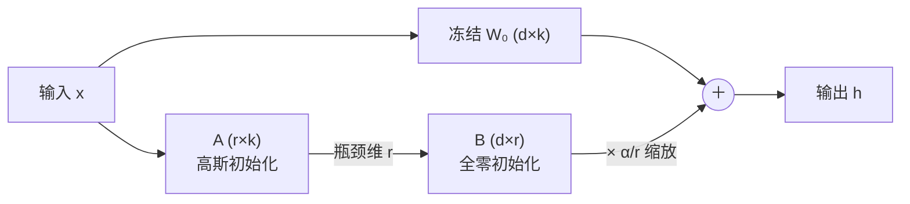

# LoRA（Microsoft）：冻结权重、只训一对低秩矩阵的参数高效微调

**📄 [LoRA: Low-Rank Adaptation of Large Language Models](https://arxiv.org/abs/2106.09685)**

2021-06 · Microsoft · [代码](https://github.com/microsoft/LoRA)

**一句话**：冻结预训练权重 $W_0$，给每个线性层并联一对低秩矩阵 $\Delta W = BA$，只训练这对瘦长矩阵——可训练参数砍掉几个数量级，训练完还能把增量合并回原权重，做到**推理零额外延迟**。它后来几乎成了大模型微调的事实默认方案。

::: details 📖 论文原文 Abstract（英文）
An important paradigm of natural language processing consists of large-scale pre-training on general domain data and adaptation to particular tasks or domains. As we pre-train larger models, full fine-tuning, which retrains all model parameters, becomes less feasible. Using GPT-3 175B as an example – deploying independent instances of fine-tuned models, each with 175B parameters, is prohibitively expensive. We propose **Lo**w-**R**ank **A**daptation, or LoRA, which freezes the pre-trained model weights and injects trainable rank decomposition matrices into each layer of the Transformer architecture, greatly reducing the number of trainable parameters for downstream tasks. Compared to GPT-3 175B fine-tuned with Adam, LoRA can reduce the number of trainable parameters by 10,000 times and the GPU memory requirement by 3 times. LoRA performs on-par or better than fine-tuning in model quality on RoBERTa, DeBERTa, GPT-2, and GPT-3, despite having fewer trainable parameters, a higher training throughput, and, unlike adapters, *no additional inference latency*. We also provide an empirical investigation into rank-deficiency in language model adaptation, which sheds light on the efficacy of LoRA. We release a package that facilitates the integration of LoRA with PyTorch models and provide our implementations and model checkpoints for RoBERTa, DeBERTa, and GPT-2 at https://github.com/microsoft/LoRA.
:::

**相关**：[LoRA 家族总览](/lora/) · [全量微调](/sft/full-finetuning) · [QLoRA](/lora/qlora) · [DoRA](/lora/dora) · [rsLoRA](/lora/rslora) · [LoRA+](/lora/lora-plus) · [记号表](/guide/notation)


> 图源：Hu et al., *LoRA: Low-Rank Adaptation of Large Language Models*（arXiv:2106.09685）Figure 1——LoRA 的低秩重参数化示意，只训练旁路的 $A$、$B$（用于学习注解，版权归原作者）。

## 动机与创新点：全量微调太贵，而权重更新本身有低「内在秩」

全量微调（full fine-tuning）的根本问题是**"每个任务都要复制一份全量参数"**。论文开门见山用 GPT-3 175B 举例："deploying independent instances of fine-tuned models, each with 175B parameters, is prohibitively expensive."——175B 模型每适配一个下游任务，就要存一套 175B 的权重。更糟的是训练阶段：用 Adam 微调时，一阶、二阶动量各占一份与权重等大的显存，再加梯度，单任务训练动辄要 3 倍于权重的显存。

既有的参数高效方案各有硬伤，论文在 Section 3「Aren't Existing Solutions Good Enough?」逐一点名：

- **Adapter 串联瓶颈 MLP → 增加推理延迟**。"adapter layers have to be processed sequentially"——适配层在 Transformer block 之间串行插入，即使瓶颈维度很小、FLOPs 不多，在小 batch、短序列、需要模型并行的在线推理场景里也会带来可观的额外延迟（论文 Table 1 实测，GPT-2 medium 单步前向，batch=1、序列 128 时 Adapter 让延迟涨了 **20%~30%**）。
- **Prefix/Prompt tuning 难优化、且挤占上下文**。"reserving a part of the sequence length for adaptation necessarily reduces the sequence length available to process a downstream task"——把可学习向量拼到序列前，既占掉宝贵的上下文长度，性能还随可训练参数**非单调**变化、难调。

LoRA 的核心假设来自 Aghajanyan et al. (2020) 关于**内在维度（intrinsic dimension）**的发现——预训练模型即便被随机投影到一个很小的子空间里也能高效学习。论文据此推断：

> we hypothesize the updates to the weights also have a low "intrinsic rank" during adaptation.

也就是说，**适配下游任务所需的权重改动 $\Delta W$ 本身落在一个低维子空间里**。既然 $\Delta W$ 大概率是低秩的，就不必把它当作 $d\times k$ 个自由参数去学，而是分解成两个瘦长矩阵的乘积只学那一点点参数。

> 举例：把一个 4096×4096 的满秩 $\Delta W$（1677 万个参数）约束成 $r=8$ 的 $B(4096\times8)\cdot A(8\times4096)$，可训练参数只剩 6.5 万——压缩约 256 倍，而论文的实验表明在 GPT-3 上这点容量已足够逼近甚至超过全量微调。

**关键创新**：

- **低秩重参数化**：把权重更新约束为 $\Delta W = BA$（$r\ll\min(d,k)$），只训练 $A、B$，冻结 $W_0$。可训练参数从 $d\times k$ 降到 $r\times(d+k)$。
- **推理零延迟**：训练完直接算 $W = W_0 + BA$ 合并回权重，得到一个普通 dense 矩阵，"introducing no inference latency compared to a fully fine-tuned model, by construction"——这是相对 Adapter 的决定性优势。
- **是全量微调的一种泛化**：把 LoRA 加到所有权重矩阵、并令 $r$ 取满秩，"we roughly recover the expressiveness of full fine-tuning"；随 $r$ 增大，LoRA 连续地逼近全量微调。
- **可热插拔**：共享一份冻结底座，按任务切换的只是几 MB 的 $(A,B)$ 适配器而非整套权重，部署/多任务成本骤降。
- **正交于其他方法**："LoRA is orthogonal to many prior methods and can be combined with many of them, such as prefix-tuning."
- **顺带解释了"为什么低秩够用"**：论文用子空间相似度与放大因子两组实验，实证 $\Delta W$ 确实低秩、且放大的是 $W$ 里"被预训练压制、但下游任务需要"的方向（见方法末节）。

本页对应的家族演进——QLoRA（量化底座省显存）、DoRA（解耦幅度/方向更贴近全量微调）、rsLoRA（$\alpha/\sqrt r$ 缩放稳住高秩）、LoRA+（给 $B$ 更大学习率）——都见 [LoRA 家族总览](/lora/)。

## 方法：低秩旁路 + 缩放因子 + 选择性注入注意力权重

### 低秩重参数化与前向传播

对任意一个做矩阵乘法的线性层 $h = W_0 x$，LoRA 不直接更新 $W_0$，而是把更新约束成低秩分解 $W_0 + \Delta W = W_0 + BA$，前向变为论文式 (3)：

$$
h = W_0 x + \Delta W x = W_0 x + B A x
$$

其中 $W_0 \in \mathbb{R}^{d \times k}$ **冻结、不接收梯度**，$B \in \mathbb{R}^{d \times r}$、$A \in \mathbb{R}^{r \times k}$ 是**仅有的可训练参数**，秩 $r \ll \min(d, k)$。论文强调两路"用同一个输入 $x$，输出按坐标相加"（"both $W_0$ and $\Delta W=BA$ are multiplied with the same input, and their respective output vectors are summed coordinate-wise"）——所以旁路是纯线性叠加，没有引入任何非线性或串行深度。



**初始化是稳定起步的关键。** $A$ 用随机高斯（$\mathcal{N}(0,\sigma^2)$）初始化、$B$ 用**全零**初始化，于是训练开始的一瞬间 $\Delta W = BA = 0$——"so $\Delta W = BA$ is zero at the beginning of training."模型行为与原始预训练模型完全一致，把 LoRA 视作对预训练点的一次"无伤起步"扰动，避免随机增量一上来就破坏已学到的能力。

> 举例：若 $B$ 也随机初始化，第 0 步就给每层注入一个非零的随机 $\Delta W$，等于在微调还没开始时先把预训练权重"踹歪"一下；零初始化 $B$ 则保证第 0 步的损失恰好等于底座模型的损失，从此平滑爬升。

### 缩放因子 $\alpha/r$：换秩不必重调超参

LoRA 把旁路输出再乘一个缩放因子 $\frac{\alpha}{r}$，即实际前向是 $h = W_0 x + \frac{\alpha}{r}BAx$。论文解释 $\alpha$ 是一个相对 $r$ 解耦的常数：

> When optimizing with Adam, tuning $\alpha$ is roughly the same as tuning the learning rate if we scale the initialization appropriately. As a result, we simply set $\alpha$ to the first $r$ we try and do not tune it. This scaling helps to reduce the need to retune hyperparameters when we vary $r$.

直观上 $\alpha/r$ 近似于给 LoRA 分支单独设了一个学习率倍率：固定 $\alpha$ 改变 $r$ 时缩放因子反向变化，使不同秩之间无需重新搜超参；增大 $\alpha$ 等价于让 $\Delta W$"走得更远"。

> 注：原论文用 $\alpha/r$ 线性缩放；后续 [rsLoRA](/lora/rslora) 指出高秩下应改用 $\alpha/\sqrt{r}$ 才能让梯度尺度稳定，这是对原始缩放的一个修正。

### 部署合并：训练完就是一个普通 dense 模型

训练结束后显式算出并写回权重：

$$
W = W_0 + \frac{\alpha}{r} B A
$$

由于 $W_0$ 与 $BA$ 同为 $d\times k$，合并后就是一个标准 dense 矩阵，推理时与原模型的结构、速度完全一致——这正是 LoRA 相对 Adapter 的杀手锏。要切换到另一个任务时，"we can recover $W_0$ by subtracting $BA$ and then adding a different $B'A'$, a quick operation with very little memory overhead."多任务场景也可干脆不合并，保留多个 $(B,A)$ 适配器按请求热切换——切换成本只是几 MB 的矩阵而非整套权重。

唯一的边界：论文也坦言，若把多个不同任务的 $A、B$ 塞进同一个 batch 一起前向就不那么直接；这种场景可以选择不合并、动态为每条样本挑选 LoRA 模块（代价是放弃零延迟）。

### 注入哪些权重：只挑注意力的投影矩阵

Transformer self-attention 里有四个权重矩阵 $W_q, W_k, W_v, W_o$，MLP 里还有两个。论文出于"简单 + 参数高效"，**只把 LoRA 加到注意力的权重上，冻结 MLP**：

> We limit our study to **only adapting the attention weights** for downstream tasks and freeze the MLP modules (so they are not trained in downstream tasks) both for simplicity and parameter-efficiency.

在固定 18M 可训练参数（GPT-3 175B、96 层）的预算下，论文 Table 5 比较了把预算分给不同注意力矩阵的效果：

| 适配的权重 | $W_q$ | $W_k$ | $W_v$ | $W_o$ | $W_q,W_k$ | $W_q,W_v$ | $W_q,W_k,W_v,W_o$ |
| --- | --- | --- | --- | --- | --- | --- | --- |
| 秩 $r$ | 8 | 8 | 8 | 8 | 4 | 4 | 2 |
| WikiSQL (%) | 70.4 | 70.0 | 73.0 | 73.2 | 71.4 | **73.7** | **73.7** |
| MultiNLI (%) | 91.0 | 90.8 | 91.0 | 91.3 | 91.3 | **91.3** | **91.7** |

结论："adapting both $W_q$ and $W_v$ gives the best performance overall."——同样的参数预算，**同时适配 $W_q$ 和 $W_v$（哪怕每个只给 $r=4$）也好过把全部预算砸到单一矩阵上的大 $r$**。这也是后世"q/v 投影"成为 LoRA 默认目标模块的来源。

### 为什么这么小的秩就够：低秩的实证证据

论文 Section 7 用三组实验回答"$\Delta W$ 是不是真的低秩、低秩为什么有效"，这部分是 LoRA 区别于纯工程 trick 的洞见所在。

**(1) 极小的秩已具竞争力。** Table 6 在 GPT-3 上扫 $r\in\{1,2,4,8,64\}$，发现适配 $\{W_q,W_v\}$ 时 **$r=1$ 就已经很能打**（WikiSQL 73.4、MultiNLI 91.3），继续加大 $r$ 收益甚微。"a rank as small as one suffices for adapting both $W_q$ and $W_v$ ... while training $W_q$ alone needs a larger $r$."

**(2) 大秩并不覆盖更有意义的子空间。** 论文对 $r=8$ 与 $r=64$ 学到的适配矩阵做 SVD，用基于 Grassmann 距离的归一化子空间相似度衡量两者右奇异向量子空间的重叠：

$$
\phi(A_{r=8}, A_{r=64}, i, j) = \frac{\|U_{A_{r=8}}^{i\top} U_{A_{r=64}}^{j}\|_F^2}{\min(i, j)} \in [0, 1]
$$


> 图源：Hu et al., *LoRA: Low-Rank Adaptation of Large Language Models*（arXiv:2106.09685）Figure 3——$A_{r=8}$ 与 $A_{r=64}$ 列向量的子空间相似度（右两幅放大左下三角）；顶部奇异方向在两者间高度重叠，印证"$r=1$ 也能用得不错"（用于学习注解，版权归原作者）。

观察是："Directions corresponding to the top singular vector overlap significantly between $A_{r=8}$ and $A_{r=64}$, while others do not."顶部奇异方向最有用，其余方向"potentially contain mostly random noises accumulated during training"——所以适配矩阵确实可以有很低的秩。

**(3) $\Delta W$ 放大的是 $W$ 里被"压制"的方向。** Table 7 把 $W_q$ 投影到 $\Delta W_q$ 的子空间，比较 Frobenius 范数：$\Delta W$ 与 $W$ 的相关性远高于随机矩阵，但 $\Delta W$ **并不是简单重复 $W$ 的主奇异方向**，而是放大那些"在 $W$ 里存在、却没被强调"的特征，且放大倍数很大（$r=4$ 时约 $21.5\approx 6.91/0.32$）。论文据此推测：

> the low-rank adaptation matrix potentially *amplifies the important features for specific downstream tasks that were learned but not emphasized in the general pre-training model*.

这给"低秩为何有效"提供了一个机制性解释：下游适配不是从头学新特征，而是把预训练已经学到、但被通用目标压低的少数关键方向**放大**出来。

### 实现与调参要点

一个最小可用的 LoRA 线性层实现（与上面公式一一对应）：

```python
import torch
import torch.nn as nn

class LoRALinear(nn.Module):
    def __init__(self, base: nn.Linear, r=8, alpha=16, dropout=0.0):
        super().__init__()
        self.base = base                      # 冻结的 W0
        for p in self.base.parameters():
            p.requires_grad = False
        d_out, d_in = base.weight.shape
        self.A = nn.Parameter(torch.randn(r, d_in) * (1 / r ** 0.5))  # 高斯
        self.B = nn.Parameter(torch.zeros(d_out, r))                  # 零初始化
        self.scaling = alpha / r
        self.dropout = nn.Dropout(dropout)

    def forward(self, x):
        return self.base(x) + self.scaling * (self.dropout(x) @ self.A.T) @ self.B.T

    @torch.no_grad()
    def merge(self):                          # 部署时合并回基座
        self.base.weight += self.scaling * (self.B @ self.A)
```

落地时的经验：

- **注入哪些模块**：最小集是注意力的 $q,v$ 投影（论文主推配置）；要逼近全量微调，把 $k,o$ 乃至 MLP 的所有 Linear 都加上，覆盖越全、效果上限越高、参数也越多。
- **秩 $r$**：从 8 起步，效果不够再翻到 16/32/64。收益随 $r$ 递减——任务越接近预训练分布，越小的 $r$ 就够；要灌入大量新知识（如换语言、换领域）时小秩会成为瓶颈。论文自己也提示："we do not expect a small $r$ to work for every task or dataset."
- **$\alpha$**：经验默认 $\alpha = 2r$。调大相当于放大旁路步长，过大易不稳；高秩可换 [rsLoRA](/lora/rslora) 的 $\alpha/\sqrt{r}$。
- **学习率**：通常比全量微调大一个数量级，$1\text{e-}4 \sim 5\text{e-}4$ 常见，因为只更新极少量参数、梯度信号需要更大步长。可进一步参考 [LoRA+](/lora/lora-plus) 给 $B$ 设更大 lr。
- **dropout 加在输入侧**：作用于 $x$ 进入 LoRA 分支之前，不影响主干；小数据集（几千条以内）配 0.05~0.1 防过拟合并适当减小 $r$。
- **别盲目给 LayerNorm / embedding / lm_head 加 LoRA**：embedding 维度大、收益有限，需要时单独处理。

## 实验结果：参数砍 1万倍，质量打平甚至超过全量微调

### 推理延迟：Adapter 的硬伤、LoRA 的零开销

论文 Table 1 在 GPT-2 medium 上实测单次前向延迟（毫秒，100 次平均）。Adapter 在小 batch、短序列下的相对延迟开销很显眼，而 LoRA 合并后与全量微调**完全同速**：

| 配置（batch / 序列 / 可训练参数） | 32 / 512 / 0.5M | 16 / 256 / 11M | 1 / 128 / 11M |
| --- | --- | --- | --- |
| Fine-Tune / LoRA | 1449.4 | 338.0 | 19.8 |
| Adapter$^{\text{L}}$ | 1482.0 (+2.2%) | 354.8 (+5.0%) | 23.9 (**+20.7%**) |
| Adapter$^{\text{H}}$ | 1492.2 (+3.0%) | 366.3 (+8.4%) | 25.8 (**+30.3%**) |

### NLU：RoBERTa / DeBERTa on GLUE（以原文为准）

LoRA 用百分之一量级的可训练参数，在 GLUE 上打平甚至超过全量微调（FT）：

| 模型 & 方法 | 可训练参数 | GLUE Avg. |
| --- | --- | --- |
| RoBERTa-base (FT) | 125M | 86.4 |
| **RoBERTa-base (LoRA)** | **0.3M** | **87.2** |
| RoBERTa-large (FT) | 355M | 88.9 |
| **RoBERTa-large (LoRA)** | **0.8M** | **89.0** |
| DeBERTa-XXL (FT) | 1500M | 91.1 |
| **DeBERTa-XXL (LoRA)** | **4.7M** | **91.3** |

DeBERTa-XXL 一行最具说服力：用 **4.7M** 可训练参数（约为全量 1500M 的 0.3%）拿到 91.3，超过全量微调的 91.1。

### NLG：GPT-3 175B（以原文为准）

最关键的压力测试在 GPT-3 175B（Table 4）。全量微调要训 **175,255.8M** 参数，LoRA 只训 **4.7M**（约 1/37000），三个数据集全面打平或反超：

| 模型 & 方法 | 可训练参数 | WikiSQL Acc. | MNLI-m Acc. | SAMSum R1/R2/RL |
| --- | --- | --- | --- | --- |
| GPT-3 (FT) | 175,255.8M | **73.8** | 89.5 | 52.0 / 28.0 / 44.5 |
| GPT-3 (PreEmbed) | 3.2M | 63.1 | 88.6 | 48.3 / 24.2 / 40.5 |
| GPT-3 (PreLayer) | 20.2M | 70.1 | 89.5 | 50.8 / 27.3 / 43.5 |
| GPT-3 (Adapter$^{\text{H}}$) | 40.1M | 73.2 | **91.5** | 53.2 / 29.0 / 45.1 |
| **GPT-3 (LoRA)** | **4.7M** | 73.4 | **91.7** | **53.8 / 29.8 / 45.9** |
| **GPT-3 (LoRA)** | 37.7M | **74.0** | 91.6 | 53.4 / 29.2 / 45.1 |

配套的资源账（Section 4.2）：在 GPT-3 175B 上，VRAM 从 1.2TB 降到 **350GB**；$r=4$、只适配 $q/v$ 时单任务 checkpoint 从 350GB 缩到 **35MB（约 1万倍）**；训练吞吐相比全量微调还快约 **25%**（无需为绝大多数参数算梯度）。论文 Figure 2 还显示 LoRA 随可训练参数增长**单调、稳定地变好**，而 Prefix 类方法在参数过多时性能反而掉头向下：


> 图源：Hu et al., *LoRA: Low-Rank Adaptation of Large Language Models*（arXiv:2106.09685）Figure 2——GPT-3 175B 各适配方法在 WikiSQL / MultiNLI-matched 上验证精度 vs 可训练参数；LoRA 展现更好的可扩展性（用于学习注解，版权归原作者）。

> 看榜须知：这些数字的口径、随机种子、超参与基线复现各异（论文已注明 WikiSQL 波动约 ±0.5%、MNLI-m 约 ±0.1%），跨方法直接比绝对值意义有限，当作"同等参数预算下 PEFT 能力的量级参照"即可。

## 在 PEFT / LoRA 谱系里的位置

LoRA 处在「参数高效微调（PEFT）」与「全量微调」之间，是两者的连续插值——把 $r$ 拉满即逼近全量微调，把 $r$ 压到 1 仍可用。横向对比：

| 维度 | 全量微调 | Adapter | Prefix/Prompt tuning | **LoRA** |
| --- | --- | --- | --- | --- |
| 可训练参数 | 100% | ~0.5%–1% | 极少 | **~0.1%–1%** |
| 优化器状态显存 | 巨大（动量随参数量） | 小 | 极小 | **极小（只覆盖 $B,A$）** |
| checkpoint 体积 | 整套权重（GB 级） | adapter（MB 级） | 向量（KB–MB） | **adapter（MB 级）** |
| 推理延迟 | 基准 | **串行瓶颈 → +20%~30%** | 占用上下文长度 | **合并后零额外延迟** |
| 任务切换 | 换整套权重 | 换 adapter | 换前缀 | **换 adapter，热插拔** |
| 优化难度 | — | 中 | **难、非单调** | 易 |
| 新知识容纳量 | 高 | 受瓶颈维限制 | 受前缀长度限制 | 受秩 $r$ 限制 |

- **vs 全量微调**：LoRA 是其低秩约束版，论文证明随 $r$ 增大可连续逼近全量微调的表达力；显存/存储/切换成本则低几个数量级。想更贴近全量微调的方向感见 [DoRA](/lora/dora)（把权重解耦成幅度+方向分别更新）。
- **vs Adapter**：同为"加旁路小模块"，但 Adapter 串联、引入推理延迟；LoRA 并联且可合并，零延迟——这是 LoRA 在生产部署上胜出的核心理由。
- **vs Prefix/Prompt tuning**：后者改的是输入侧（占上下文、难优化、非单调）；LoRA 改的是权重侧，且与 prefix-tuning 正交可叠加。
- **LoRA 家族的后续演进**：[QLoRA](/lora/qlora)（底座 4-bit 量化、进一步压显存）、[DoRA](/lora/dora)（幅度/方向解耦）、[rsLoRA](/lora/rslora)（$\alpha/\sqrt r$ 缩放稳住高秩）、[LoRA+](/lora/lora-plus)（给 $B$ 更大学习率）等都在补 LoRA 的不同短板——总览与选型见 [LoRA 家族总览](/lora/)。
