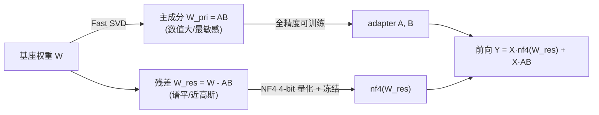

# PiSSA（北大）：用主奇异成分初始化 LoRA，微调权重里最重要的方向

**📄 [PiSSA: Principal Singular Values and Singular Vectors Adaptation of Large Language Models](https://arxiv.org/abs/2404.02948)**

2024-04 · Peking University（北大智能学院 / 通用人工智能国家重点实验室）· NeurIPS 2024 · [代码](https://github.com/GraphPKU/PiSSA)

**一句话**：和 [LoRA](/lora/lora) 同架构，但不再把 adapter 初始化成"零增量"——而是对基座权重 $W$ 做 SVD，把**主奇异成分**拆给可训练的 $A$、$B$、把次要成分冻结成残差。于是从第一步起就在微调"权重里最重要的方向"，收敛更快、效果更好，且天然更耐量化。

::: details 📖 论文原文 Abstract（英文）
To parameter-efficiently fine-tune (PEFT) large language models (LLMs), the low-rank adaptation (LoRA) method approximates the model changes $\Delta W \in \mathbb{R}^{m\times n}$ through the product of two matrices $A \in \mathbb{R}^{m\times r}$ and $B \in \mathbb{R}^{r\times n}$, where $r \ll \min(m,n)$, $A$ is initialized with Gaussian noise, and $B$ with zeros. LoRA **freezes the original model $W$** and **updates the "Noise & Zero" adapter**, which may lead to slow convergence. To overcome this limitation, we introduce **Pri**ncipal **S**ingular values and **S**ingular vectors **A**daptation (PiSSA). PiSSA shares the same architecture as LoRA, but initializes the adaptor matrices $A$ and $B$ with the principal components of the original matrix $W$, and put the remaining components into a residual matrix $W^{res} \in \mathbb{R}^{m\times n}$ which is frozen during fine-tuning. Compared to LoRA, PiSSA **updates the principal components** while **freezing the "residual" parts**, allowing faster convergence and enhanced performance. Comparative experiments of PiSSA and LoRA across 11 different models, ranging from 184M to 70B, encompassing 5 NLG and 8 NLU tasks, reveal that PiSSA consistently outperforms LoRA under identical experimental setups. On the GSM8K benchmark, Gemma-7B fine-tuned with PiSSA achieves an accuracy of 77.7%, surpassing LoRA's 74.53% by 3.25%. Due to the same architecture, PiSSA is also compatible with quantization to further reduce the memory requirement of fine-tuning. Compared to QLoRA, QPiSSA (PiSSA with 4-bit quantization) exhibits smaller quantization errors in the initial stages. Fine-tuning LLaMA-3-70B on GSM8K, QPiSSA attains an accuracy of 86.05%, exceeding the performance of QLoRA at 81.73%. Leveraging a fast SVD technique, PiSSA can be initialized in only a few seconds, presenting a negligible cost for transitioning from LoRA to PiSSA.
:::

**相关**：[LoRA](/lora/lora) · [DoRA](/lora/dora) · [LoRA+](/lora/lora-plus) · [QLoRA](/lora/qlora)

![全量微调、LoRA、PiSSA 三者对比：橙色为可训练、蓝色为冻结。(a) 全量微调更新整块 $W$；(b) LoRA 冻结 $W$、训练 $A\sim\mathcal N(0,\sigma^2)$ 与 $B=0$ 的"噪声+零"adapter；(c) PiSSA 冻结去掉主成分后的残差矩阵 $W^{res}$，训练由主奇异成分初始化的 $A=U_{[:,:r]}S^{1/2}_{[:r,:r]}$、$B=S^{1/2}_{[:r,:r]}V^\top_{[:,:r]}$](/papers/pissa/arch.png)

> 图源：Meng et al., *PiSSA: Principal Singular Values and Singular Vectors Adaptation of Large Language Models*（arXiv:2404.02948）Figure 1——全量微调 / LoRA / PiSSA 三者架构对比（用于学习注解，版权归原作者）。

## 动机与创新点：LoRA 在拟合 $\Delta W$，PiSSA 直接拟合 $W$ 的主成分

[LoRA](/lora/lora) 默认 $A$ 取高斯、$B$ 取零，保证训练起点 $\Delta W = BA = 0$。这个设计安全（注入 adapter 不破坏基座的初始输出），但论文指出它把 adapter 训成了一个 **"Noise & Zero"**（噪声 + 零）的组合，代价有二：

- **起步慢**。论文从梯度角度分析：因为初始 $AB=0$ 不改变输出 $Y$，"the magnitude and direction of gradient are primarily determined by the values of $A$ and $B$"，而 $A$ 是噪声、$B$ 是零——于是早期 $B$ 的梯度方向几乎是**随机的**、$A$ 的梯度近乎为零且"small and uninformative for a long time, leading to slow convergence"。直观上，最初的若干步里增量全靠 $B$ 从零慢慢长出来，"LoRA often wastes much time around the initial point"。
- **方向盲目**。LoRA 的初始增量与 $W$ 的结构完全无关——它在一个随机的低秩子空间里盲目摸索，还可能"lead to suboptimal local minima"。

PiSSA 换了个根本视角——**"diverges from LoRA … by focusing not on approximating $\Delta W$, but $W$."** 既然 $W$ 本身已经把信息按重要性编码在奇异谱里，那**最值得微调的方向，就是 $W$ 的主奇异方向**（"the directions in which the matrix $W$ has the most significant stretching or impact"）。把这部分主成分拿出来作为可训练的低秩部分初始化、把次要成分原封不动冻结，训练一开始就站在"高信息量、与基座对齐"的子空间里——这样能 **"fit the training data faster and better"**，且 PiSSA 的 loss / 梯度范数曲线"often demonstrate a similar trend to those of full parameter fine-tuning"，相当于全量微调的一个"去噪版本"。

> 举例：把 $W$ 想成一束被压缩过的方向，奇异值越大的方向对模型行为影响越大。LoRA 蒙着眼在一个随机角落里开始挖；PiSSA 直接把这束方向里最强的前 $r$ 条交给优化器去调，剩下又多又弱的尾巴（long-tail）锁住不动。


> 图源：Meng et al., *PiSSA: …*（arXiv:2404.02948）Figure 2——左：玩具实验里 PiSSA 收敛更快更好；右：QPiSSA 比 LoftQ 更能降低量化误差（用于学习注解，版权归原作者）。

**关键创新**：

- **主奇异成分初始化**：首个把 SVD 用在**原始权重 $W$**（而非 $\Delta W$）上、用主奇异值/向量初始化 adapter、把残差冻结的方法。"PiSSA is the first to apply SVD to the original model … while keeping the residual components frozen."
- **更优的优化方向**：理论上近似了**全量微调的优化方向**——"approximates the optimization direction of full-parameter fine-tuning by adapting a model's principal components"，因此收敛更快、最终质量更高。
- **与量化天然契合（QPiSSA）**：把数值大的主成分留在全精度 adapter 里、只量化奇异谱更平的残差，量化误差比 QLoRA 约低 20%。
- **秒级初始化、零迁移成本**：靠 Fast SVD 只求前 $r$ 个成分，"PiSSA can be initialized in only a few seconds"，从 LoRA 切到 PiSSA 几乎无额外成本。

## 方法：对 $W$ 做 SVD，主成分给 adapter、残差冻结

### SVD 分解与 $A$、$B$、残差的构造

对每个目标权重（self-attention 与 MLP 层）$W \in \mathbb{R}^{m\times n}$ 做经济型 SVD：

$$
W = U S V^\top
$$

其中 $U \in \mathbb{R}^{m\times\min(m,n)}$、$V \in \mathbb{R}^{n\times\min(m,n)}$ 为正交奇异向量，$S = \mathrm{diag}(s)$ 是按降序排列的奇异值。论文的关键假设是：前 $r$ 个奇异值 $s_{[:r]}$ **"significantly larger than the remaining singular values"** $s_{[r:]}$，称 $r$ 为 $W$ 的内在秩。据此把 $S, U, V$ 切成两块——主成分 $\{U_{[:,:r]}, S_{[:r,:r]}, V_{[:,:r]}\}$ 与残差 $\{U_{[:,r:]}, S_{[r:,r:]}, V_{[:,r:]}\}$（切片记号同 PyTorch）。

可训练的 $A$、$B$ 按"**奇异值开方均分到两侧**"构造（公式 2、3），使其乘积恰好等于主成分部分 $W^{pri}$：

$$
A = U_{[:,:r]}\, S_{[:r,:r]}^{1/2} \in \mathbb{R}^{m\times r}, \qquad
B = S_{[:r,:r]}^{1/2}\, V_{[:,:r]}^\top \in \mathbb{R}^{r\times n}
$$

于是 $AB = U_{[:,:r]} S_{[:r,:r]} V_{[:,:r]}^\top = W^{pri}$，正是 $W$ 的秩-$r$ 主成分近似。残差矩阵则是被减掉主成分后的剩余、训练中**冻结**（公式 4）：

$$
W^{res} = U_{[:,r:]}\, S_{[r:,r:]}\, V_{[:,r:]}^\top \in \mathbb{R}^{m\times n}
$$

前向计算与 LoRA **同形**（公式 5），但冻结的是残差而非完整 $W$，且初始 $AB \ne 0$：

$$
Y = XW = X(W^{res} + W^{pri}) = X(W^{res} + AB)
$$

注意这一步保证了"the integration of $AB$ with the residual matrix also preserves the full capability of the pre-trained model in the beginning of fine-tuning"——初始合起来恰好还原 $W$，不破坏基座。

> 举例：设 $r=2$，$W$ 的前两个奇异值 $\{100, 80\}$ 很大、其余都 $<5$。PiSSA 把这两条大方向（连同它们的奇异向量）拆进 $A,B$ 交给优化器，剩下一大堆小奇异值组成 $W^{res}$ 锁住。LoRA 则是把 $W$ 整块锁住，另起一个从零长出来的 $\Delta W$。

### 为什么这样初始化收敛更快——梯度视角

PiSSA 与 LoRA 共享同一套梯度公式 $\frac{\partial L}{\partial A} = X^\top\!\left(\frac{\partial L}{\partial Y}\right)B^\top$、$\frac{\partial L}{\partial B} = A^\top X^\top\!\left(\frac{\partial L}{\partial Y}\right)$，差别全在初值。论文 Table 1 把两者并排：LoRA 的 $A$ 梯度 $\to \underline{0}$、$B$ 梯度 $\to$ Random Direction（噪声方向）；PiSSA 因为 $s_{[:r]} \gg s_{[r:]}$，"the trainable adapter $W^{pri}=AB$ contains the most essential directions of $W$"，两个梯度都指向 **Principal（主方向）**。结论是：

> In the ideal case, training $AB$ mirrors the process of fine-tuning the entire model despite using fewer parameters.

也就是说，只调主成分这件事在理想情况下"近似全量微调"，这正是 PiSSA 比 LoRA 又快又好、且曲线像全量微调的根因。

### 快速初始化与残差合并陷阱

**快速初始化。** 对大模型每层都做完整 SVD 代价不小，PiSSA 用 **Fast SVD**（随机化 SVD）只求前 $r$ 个奇异成分，"finish initialization in several seconds … which is a negligible cost"，从 LoRA 迁过来几乎免费。

**关键工程细节——残差不是 $W_0$。** 训练结束把 adapter 合并回去时，正确权重是 $W = W^{res} + A'B'$（$A'B'$ 是训练后的值），而**不是** $W_0 + A'B'$。如果框架里冻结存的仍是完整 $W_0$，必须额外减去初始主成分 $A_0B_0$，否则会把主成分算两遍、模型行为异常。这是复现 PiSSA 最常见的坑。HuggingFace `peft` 已原生支持：`LoraConfig(init_lora_weights="pissa")`，并提供把 PiSSA 残差转回标准 LoRA 格式的转换工具，方便复用 LoRA 的部署链路。

```python
import torch

def pissa_init(W0, r):
    # 经济型 SVD；大模型实际用随机化/Fast SVD 只取前 r 个主成分
    U, S, Vh = torch.linalg.svd(W0.float(), full_matrices=False)  # SVD 须在 fp32 下做
    Ur, Sr, Vhr = U[:, :r], S[:r], Vh[:r, :]

    sqrt_S = torch.diag(Sr.sqrt())
    A = Ur @ sqrt_S            # m x r ，主奇异成分均分到两侧
    B = sqrt_S @ Vhr           # r x n

    W_res = W0 - A @ B         # 冻结残差（= 次要奇异成分之和），替换原权重存储
    return A, B, W_res

# 前向：注意冻结的是 W_res，不是 W0
# h = x @ W_res.T + (x @ A.T) @ B.T
# 合并上线：W = W_res + A' @ B'  ——绝不是 W0 + A'B'
```

### QPiSSA：只量化残差，量化误差比 QLoRA 更小

PiSSA 与 LoRA 同架构，所以也能像 [QLoRA](/lora/qlora) 那样把基座量化到 4-bit 以省显存。差别在量化**谁**：QLoRA 量化整个 $W$，其量化误差就等于直接量化基座的误差（公式 6）：

$$
\text{Quantization Error of QLoRA} = \lVert W - (\mathrm{nf4}(W) + AB)\rVert_* = \lVert W - \mathrm{nf4}(W)\rVert_*
$$

其中 $\lVert\cdot\rVert_*$ 是核范数（奇异值之和）。QPiSSA **不量化基座、只量化残差** $W^{res}$（公式 8）：

$$
\text{Quantization Error of QPiSSA} = \lVert W^{res} - \mathrm{nf4}(W^{res})\rVert_*
$$

为什么这样误差更小？因为残差去掉了几个最大的奇异值，"$W^{res}$ has a **narrower distribution** than that of $W$"——奇异谱更平、数值动态范围更小，且其数值分布（论文实测 $W$ 的 std≈0.0135、$W^{res}$ 的 std≈0.0034）更贴近 NF4 所假设的高斯分布，"more suitable for applying NF4 than $W$"。把数值大、对量化误差最敏感的主成分留在**全精度** adapter 里，只对"温和"的残差做 4-bit，量化损失自然更低。论文 Table 4 报告 QPiSSA 把量化误差较直接量化基座降低约 **20%**，且对低秩矩阵（如 70B 的 Key 投影层降 49%）更显著，明显优于 LoftQ。

> 举例：把整块 $W$ 量化好比把一段动态范围很大的音频粗暴压成 4-bit，大信号处失真严重；QPiSSA 先把几个"最响的主成分"单独抽出来用全精度保住，剩下平缓的残差再压 4-bit，整体失真小得多。



## 实验结果：跨 11 个模型、5 NLG + 8 NLU 全面优于 LoRA（以原文为准）

实验在 A800 上、Alpaca 实现策略下完成；NLG 任务在 MetaMathQA / CodeFeedback / WizardLM-Evol-Instruct 各取 100K 子集、训 1 epoch，结果三次取均值。关键口径：`lora_alpha = lora_r`、`lora_dropout=0`、adapter 注入所有线性层。

### NLG：数学 / 代码 / 对话（Table 2，节选）

| 模型 | 策略 | GSM8K | MATH | HumanEval | MBPP | MT-Bench |
| --- | --- | --- | --- | --- | --- | --- |
| LLaMA 2-7B | Full FT | 49.13 | 7.29 | 21.20 | 35.59 | **4.91** |
| | LoRA(gaussian) | 42.85 | 5.50 | 18.35 | 35.50 | 4.59 |
| | **PiSSA** | **53.22** | **7.47** | **21.92** | **37.24** | 4.88 |
| Mistral-7B | Full FT | 69.91 | 18.64 | 45.31 | 51.46 | 4.95 |
| | LoRA(gaussian) | 69.50 | 20.08 | 43.78 | 58.46 | 4.90 |
| | **PiSSA** | **73.31** | **23.12** | **46.88** | **62.55** | **5.34** |
| Gemma-7B | Full FT | 72.09 | 22.71 | 47.02 | 55.67 | 5.40 |
| | LoRA(gaussian) | 75.11 | 30.41 | 53.70 | 65.58 | 4.98 |
| | **PiSSA** | **77.78** | **31.33** | **54.31** | **66.17** | **5.64** |

PiSSA 在多数格里同时**超过 LoRA 与全量微调**——例如 Gemma-7B 的 GSM8K：PiSSA 77.78 vs LoRA 74.53（abstract 口径），+3.25 个点；Mistral-7B 的 MBPP 62.55 vs LoRA 58.46。


> 图源：Meng et al., *PiSSA: …*（arXiv:2404.02948）Figure 4——loss / 梯度范数 / GSM8K 准确率随训练步数的变化（蓝=LoRA，橙=PiSSA，红=全量微调）（用于学习注解，版权归原作者）。

作者由此推断："PiSSA is a denoised version of full fine-tuning"——全量微调更大的梯度范数并没换来更低的 loss，说明其中一部分梯度花在了对降 loss 无益的噪声方向上，而 PiSSA 只调主成分恰好滤掉了这些噪声。

### NLU：GLUE 上的 DeBERTa-v3-base（Table 3，节选）

| 方法 | 参数量 | MNLI | SST2 | MRPC | CoLA | QNLI | QQP | RTE | STSB | 平均 |
| --- | --- | --- | --- | --- | --- | --- | --- | --- | --- | --- |
| Full FT | 184M | 89.90 | 95.63 | 89.46 | 69.19 | 94.03 | **92.40** | 83.75 | 91.60 | 88.25 |
| LoRA$^G$ | 1.33M | 90.65 | 94.95 | 89.95 | 69.82 | 93.87 | 91.99 | 85.20 | 91.60 | 88.50 |
| DoRA | 1.27M | 90.29 | 95.79 | 90.93 | 70.85 | 94.10 | 92.07 | 86.04 | 91.79 | 88.98 |
| **PiSSA** | 1.33M | 90.37 | **96.22** | 91.50 | **73.12** | 94.43 | 92.33 | **88.69** | **92.00** | **89.83** |

PiSSA 在 8 个 NLU 任务里 **7 个胜过 LoRA$^G$**，平均 +1.21%；唯一落后的 MNLI 上，PiSSA 最终 epoch 的训练 loss（0.17）反而低于 LoRA（0.24），说明拟合能力更强、差距来自该任务的过拟合-泛化权衡而非欠拟合。

### 量化与跨规模

- **量化误差降低比例（Table 4）**：直接量化基座（QLoRA）的误差降低为 0；LoftQ 在 LLaMA 2-7B 上约 14.6%、3-8B 约 18.1%；**PiSSA 分别 19.4% / 22.9%**。LLaMA-3-70B 上 PiSSA(r128) 达 20.3%，远高于 LoftQ(r64) 的 4.2%。
- **QPiSSA 下游效果**：微调 LLaMA-3-70B on GSM8K，QPiSSA **86.05%** > QLoRA 81.73%，甚至超过全精度 LoRA。
- **跨规模跨类型（Figure 6）**：在 184M~70B、含 DeepSeek-MoE-16B / Mixtral-8x7B 等 MoE 在内的多种模型上，(Q)PiSSA 一致优于 (Q)LoRA。
- **rank 扫描（Figure 7）**：$r$ 从 1 到 128，PiSSA 在同等可训练参数下始终优于 LoRA，且随 $r$ 增大逐步逼近并**超过全量微调**。

> 看榜须知：以上数字来自论文统一口径（同实现、同超参、三次均值），跨方法可比；但与其它论文的绝对值因数据子集、训练步数、超参不同而不宜直接横比，当作"同设定下 PiSSA vs LoRA 的相对增益"来读。

## 在 LoRA 变体谱系里的位置

PiSSA 解决的是 LoRA 的**初始化**子问题，与其它 LoRA 变体大多正交、可组合。横向对照：

| 维度 | [LoRA](/lora/lora) | PiSSA |
| --- | --- | --- |
| $A$/$B$ 初始化 | $A$ 高斯、$B$ 零 | $W$ 的主奇异成分（$A=U_{[:,:r]}S^{1/2}$，$B=S^{1/2}V^\top_{[:,:r]}$） |
| 冻结部分 | 完整 $W$ | 残差 $W^{res}=W-AB$ |
| 初始增量 $AB$ | $=0$ | $=W$ 的秩-$r$ 主成分 |
| 拟合对象 | $\Delta W$ | $W$ 本身的主方向（近似全量微调方向） |
| 初期收敛 | 慢（从零、随机方向启动） | 快（直接调主成分） |
| 初始化成本 | 零 | 一次 Fast SVD，秒级 |
| 量化结合 | QLoRA（量化整块 $W$，不降误差） | QPiSSA（只量化残差，误差较 QLoRA 低 ~20%） |
| 合并回基座 | $W + AB$ | $W^{res} + A'B'$（**不是** $W_0+A'B'$） |

- **vs [DoRA](/lora/dora) / [LoRA+](/lora/lora-plus)**：三者解决不同子问题——DoRA 解耦幅值/方向、LoRA+ 给 $A$/$B$ 设不同学习率、PiSSA 换初始化；论文 NLU 表里 PiSSA 平均分（89.83）也高于 DoRA（88.98）。必要时可叠加（如 PiSSA 初始化 + LoRA+ 学习率）。
- **vs AdaLoRA / DeltaLoRA / LoSparse 等"学 $\Delta W$ 低秩近似"的变体**：论文明确区分——"Unlike LoRA and its successors, which focus on learning low-rank approximations of weight updates, our PiSSA directly tunes the essential low-rank parts of the model while keeping the noisier, high-rank, and nonessential parts frozen." PiSSA 拟合的是 $W$、不是 $\Delta W$。
- **vs LoftQ / QLoRA**：QLoRA 量化整块基座、不降量化误差；LoftQ 用迭代分解去拟合量化误差矩阵。QPiSSA 因残差谱更平、更近高斯，直接量化残差即可比 LoftQ 更低误差，且收敛速度也更快（LoftQ 能降误差但收敛不快于 LoRA/QLoRA，二者优势可能正交）。
- **rank 选择经验**：PiSSA 的优势主要体现在中小 rank 下"初始化质量"带来的差距；rank 极大时主成分覆盖趋于完整，与 LoRA 的差距收窄，但论文显示足够大 rank 时 PiSSA 会反超全量微调。若只追求"换初始化即用"的低成本改进，PiSSA 性价比很高。
