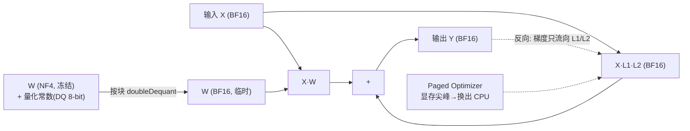

# QLoRA（华盛顿大学）：4-bit NF4 量化基座上的低秩微调，单卡微调 65B

**📄 [QLoRA: Efficient Finetuning of Quantized LLMs](https://arxiv.org/abs/2305.14314)**

2023-05 · University of Washington · [代码](https://github.com/artidoro/qlora)

**一句话**：把冻结的基座权重量化成 4-bit（NF4）存储、前向时按块反量化回 bf16 参与计算，LoRA 适配器仍走 bf16 训练——让单张 48GB GPU 也能微调 65B 大模型，而效果与 16-bit 全量/LoRA 微调持平。

::: details 📖 论文原文 Abstract（英文）
We present **QLORA**, an efficient finetuning approach that reduces memory usage enough to finetune a 65B parameter model on a single 48GB GPU while preserving full 16-bit finetuning task performance. QLORA backpropagates gradients through a frozen, 4-bit quantized pretrained language model into Low Rank Adapters (LoRA). Our best model family, which we name **Guanaco**, outperforms all previous openly released models on the Vicuna benchmark, reaching 99.3% of the performance level of ChatGPT while only requiring 24 hours of finetuning on a single GPU. QLORA introduces a number of innovations to save memory without sacrificing performance: (a) **4-bit NormalFloat (NF4)**, a new data type that is information theoretically optimal for normally distributed weights (b) **Double Quantization** to reduce the average memory footprint by quantizing the quantization constants, and (c) **Paged Optimizers** to manage memory spikes. We use QLORA to finetune more than 1,000 models, providing a detailed analysis of instruction following and chatbot performance across 8 instruction datasets, multiple model types (LLaMA, T5), and model scales that would be infeasible to run with regular finetuning (e.g. 33B and 65B parameter models). Our results show that QLORA finetuning on a small high-quality dataset leads to state-of-the-art results, even when using smaller models than the previous SoTA. We provide a detailed analysis of chatbot performance based on both human and GPT-4 evaluations showing that GPT-4 evaluations are a cheap and reasonable alternative to human evaluation. Furthermore, we find that current chatbot benchmarks are not trustworthy to accurately evaluate the performance levels of chatbots. A lemon-picked analysis demonstrates where **Guanaco** fails compared to ChatGPT. We release all of our models and code, including CUDA kernels for 4-bit training.
:::

**相关**：[LoRA](/lora/lora) · [rsLoRA](/lora/rslora) · [LoRA+](/lora/lora-plus) · [DoRA](/lora/dora) · [量化](/inference/quantization)


> 图源：Dettmers et al., *QLoRA: Efficient Finetuning of Quantized LLMs*（arXiv:2305.14314）Figure 1——不同微调方法的显存结构，QLoRA 把基座量化到 4-bit 并用 paged optimizer 处理显存尖峰（用于学习注解，版权归原作者）。

## 动机与创新点：基座是冻结的，没必要用 bf16 存

LoRA 已经把优化器状态和梯度的显存压到极小，但还有一座大山没动：**基座权重本身**。论文开篇就点明门槛——`regular 16-bit finetuning of a LLaMA 65B parameter model requires more than 780 GB of GPU memory`；即便只算静态存储，bf16 存一份 65B 模型也要约 130GB，光放进显存就超出单卡容量，可训练参数再少也无济于事。而此前的量化技术`only work for inference and break down during training`——只能服务推理、一训练就崩。

QLoRA 的洞察是：基座是冻结的，它**只参与前向、不需要梯度**（`only the gradient with respect to the error for the adapters weights are needed, and not for 4-bit weights`），因此完全没必要用 bf16 高精度存储。把它压成 4-bit，存储占用直接降到约四分之一；真正用到某个权重张量时再按块反量化回 bf16 参与矩阵乘。**量化在这里只服务于「存储」，不改变计算精度**——梯度仍然只流向高精度的 LoRA 分支。论文由此`demonstrate for the first time that it is possible to finetune a quantized 4-bit model without any performance degradation`，把 65B 模型的微调门槛从 >780GB 砸到 <48GB 单卡。

**关键创新**：

- **4-bit NormalFloat（NF4）**：面向「零均值正态分布」的信息论最优 4-bit 数据类型，量化分位点按标准正态分位数设计，比 INT4 / FP4 在相同比特数下误差更低。
- **Double Quantization（双重量化）**：对量化常数本身再做一次 8-bit 量化，把每参数约 0.5 bit 的常数开销压到约 0.13 bit，几乎免费再省一截显存。
- **Paged Optimizer（分页优化器）**：借 NVIDIA 统一内存，在梯度检查点引发显存尖峰时把优化器状态自动换出到 CPU，避免 OOM，让 33B/65B 能稳定地在单卡跑完。
- **LoRA 必须铺满所有线性层**：作者发现只加 Q/V 投影无法复现全量微调，`LoRA on all linear transformer block layers are required to match full finetuning performance`——这是补回量化损失的关键。
- **Guanaco 模型族**：用 QLoRA 在 OASST1 上微调出的聊天模型，65B 版在 Vicuna 基准上达 ChatGPT 的 99.3%，单卡 24 小时训成（指标见下文「实验结果」）。

## 方法：一种存储 4-bit、一种计算 16-bit 的双数据类型

QLoRA 的总框架可以一句话概括：`QLORA has one low-precision storage data type, in our case usually 4-bit, and one computation data type that is usually BFloat16`。每当用到一个 QLoRA 权重张量，就把它反量化回 BFloat16、用 16-bit 做矩阵乘；梯度只对 16-bit 的 LoRA 参数计算。

前置是**分块量化（block-wise k-bit quantization）**：为防止离群值（outlier）把整张量的量化区间撑坏、导致大量 bin 空置，把张量切成小块各自独立量化。以 FP32→Int8 为例：

$$\mathbf{X}^{\text{Int8}} = \text{round}\left(\frac{127}{\text{absmax}(\mathbf{X}^{\text{FP32}})}\mathbf{X}^{\text{FP32}}\right) = \text{round}(c^{\text{FP32}}\cdot \mathbf{X}^{\text{FP32}})$$

其中 $c$ 是该块的**量化常数 / 缩放（quantization constant）**，反量化即 $\text{dequant}(c^{\text{FP32}}, \mathbf{X}^{\text{Int8}}) = \mathbf{X}^{\text{Int8}}/c^{\text{FP32}}$。每块一个 $c$，离群值只污染自己所在的块。

### NF4：面向正态分布权重的信息论最优 4-bit

普通均匀量化（INT4）把 $[-1,1]$ 等分成 16 档，但神经网络权重经验上`usually have a zero-centered normal distribution`——绝大多数权重挤在 0 附近、尾部很稀。等分会把大量量化级浪费在几乎没有权重的尾部。NF4 改用**分位数量化（Quantile Quantization）**，让每个量化 bin 里落入的权重数量大致相等——`an information-theoretically optimal data type that ensures each quantization bin has an equal number of values assigned from the input tensor`。

分位数量化本来很贵（要估经验 CDF），但作者抓住一个前提：既然权重服从固定形状的正态分布、只差一个缩放常数，就可以**离线**对标准正态 $N(0,1)$ 估一次分位点，之后所有权重张量复用。$2^k$ 个数据类型取值 $q_i$ 为：

$$q_i = \frac{1}{2}\left(Q_X\left(\frac{i}{2^k+1}\right) + Q_X\left(\frac{i+1}{2^k+1}\right)\right)$$

$Q_X(\cdot)$ 是标准正态的分位函数。还有一处工程细节：对称量化没有精确的 0，而 padding 等零值必须无误差表示，于是作者把负半轴用 $2^{k-1}$ 个分位、正半轴用 $2^{k-1}+1$ 个分位分别估计再合并、去掉重复的一个 0，得到一个**非对称、含精确 0、各 bin 期望计数相等**的数据类型，命名 **k-bit NormalFloat (NFk)**。用时把权重张量按 absmax 归一化进 $[-1,1]$ 再映到这 16 个 NF4 码点。

> 举例：一层权重里 95% 集中在 $[-0.1, 0.1]$。INT4 在这段只给得起 1–2 个量化级，尾部那些几乎用不到的级却白占编码；NF4 则把 16 个码点按正态分位铺开，密集区分得细、稀疏尾部分得粗，同样 4 bit 下还原误差显著更小。

### Double Quantization：连量化常数也量化

分块越小、抗离群值越好，但每块都要存一个 FP32 常数，块小了这笔开销就不容忽视——`using 32-bit constants and a blocksize of 64 for W, quantization constants add 32/64 = 0.5 bits per parameter on average`。双重量化（DQ）就是**把第一层量化常数 $c_2^{\text{FP32}}$ 当成新的输入张量，再做一次 8-bit 量化**，得到第二层常数 $c_1^{\text{FP32}}$ 和量化后的 $c_2^{\text{FP8}}$。第二层用 blocksize 256 的 8-bit Float，作者实测此处 8-bit 量化`no performance degradation`；且因 $c_2$ 全为正，先减均值再做对称量化。算一笔账：

$$\frac{32}{64}=0.5 \text{ bit/param} \;\Rightarrow\; \frac{8}{64}+\frac{32}{64\cdot 256}=0.127 \text{ bit/param}$$

平均每参数省下 **0.373 bit**，对 65B 模型约合省 3GB，几乎免费。

> 举例：65B 模型按 64 一块切，会产生约 10 亿个 FP32 常数。直接存就是 10 亿 × 32 bit；DQ 把它们再按 256 一块压成 8-bit + 极少的二级常数，这堆「常数的存储」直接缩水约 4 倍。

### Paged Optimizer：用统一内存扛住显存尖峰

`Paged Optimizers use the NVIDIA unified memory feature which does automatic page-to-page transfers between the CPU and GPU`。训练中真正的杀手往往不是平均显存，而是**偶发尖峰**——长序列 batch 下梯度检查点会瞬间顶到显存上限。分页优化器把优化器状态分配在统一内存上，GPU 一 OOM 就自动把这些分页换出到 CPU RAM、需要更新时再换回，像操作系统的内存分页一样。`While paged optimizers are critical to do 33B/65B QLORA tuning on a single 24/48GB GPU`——它是让大模型单卡微调不因尖峰崩溃的关键；作者还实测 65B、batch size 16 下分页优化器与常规优化器`provide the same training speed`，平时几乎无额外开销。

### QLoRA 完整定义：前向反量化、反向只更新适配器

把三者拼起来，单个线性层的 QLoRA 前向写成（$\mathbf{W}^{\text{NF4}}$ 是 4-bit 冻结基座，$\mathbf{L}_1,\mathbf{L}_2$ 是 BF16 的 LoRA 矩阵）：

$$\mathbf{Y}^{\text{BF16}} = \mathbf{X}^{\text{BF16}}\,\text{doubleDequant}(c_1^{\text{FP32}}, c_2^{\text{k-bit}}, \mathbf{W}^{\text{NF4}}) + \mathbf{X}^{\text{BF16}}\mathbf{L}_1^{\text{BF16}}\mathbf{L}_2^{\text{BF16}}$$

其中双重反量化是两层嵌套——先把二级常数还原出一级常数，再用它把权重还原回 BF16：

$$\text{doubleDequant}(c_1^{\text{FP32}}, c_2^{\text{k-bit}}, \mathbf{W}^{\text{k-bit}}) = \text{dequant}(\text{dequant}(c_1^{\text{FP32}}, c_2^{\text{k-bit}}), \mathbf{W}^{\text{4bit}}) = \mathbf{W}^{\text{BF16}}$$

反向只需要 $\partial E/\partial \mathbf{L}_i$，不需要 $\partial E/\partial \mathbf{W}$。但注意：计算 $\partial E/\partial \mathbf{L}_i$ 链式法则里要用到 $\partial \mathbf{X}/\partial \mathbf{W}$，所以仍要把 $\mathbf{W}^{\text{NF4}}$ 反量化成 BF16 来算这一步导数——**基座参与前向与中间梯度计算，但自身从不被更新**。一句话总结：`We dequantize the storage data type to the computation data type to perform the forward and backward pass, but we only compute weight gradients for the LoRA parameters which use 16-bit BrainFloat`。



### LoRA 必须铺满所有线性层（关键经验发现）

QLoRA 论文一个被反复引用的结论：标准 LoRA 只把适配器加到注意力的 Q/V 上`are not able to replicate full finetuning performance`；真正关键的超参不是秩 $r$，而是**适配器加在多少层上**——`the most critical LoRA hyperparameter is how many LoRA adapters are used in total and that LoRA on all linear transformer block layers are required to match full finetuning performance`，而 $r$ 这种维度`do not affect performance`。直觉上，基座被压到 4-bit 已经损失了精度，必须靠覆盖面更广的适配器把这部分自由度补回来。


> 图源：Dettmers et al., *QLoRA: Efficient Finetuning of Quantized LLMs*（arXiv:2305.14314）Figure 2——LoRA 必须铺到所有 transformer 线性层才能匹配 16-bit 全量微调（用于学习注解，版权归原作者）。

### 实现要点：bitsandbytes + PEFT 落地

把上面四个机制（NF4 / 双重量化 / 反量化计算 / 分页优化器）落到代码，对应 `BitsAndBytesConfig` 的四个开关与 `paged_adamw_8bit` 优化器：

```python
from transformers import AutoModelForCausalLM, BitsAndBytesConfig
from peft import LoraConfig, get_peft_model, prepare_model_for_kbit_training

bnb_config = BitsAndBytesConfig(
    load_in_4bit=True,
    bnb_4bit_quant_type="nf4",            # NF4 数据类型
    bnb_4bit_use_double_quant=True,       # 双重量化
    bnb_4bit_compute_dtype="bfloat16",    # 反量化后的计算精度
)
model = AutoModelForCausalLM.from_pretrained(
    "your/base-model", quantization_config=bnb_config, device_map="auto")
model = prepare_model_for_kbit_training(model)  # 开梯度检查点、稳定 LN

lora = LoraConfig(r=16, lora_alpha=32, lora_dropout=0.05,
                  target_modules="all-linear", task_type="CAUSAL_LM")
model = get_peft_model(model, lora)
# 优化器用 paged_adamw_8bit 配合分页显存
```

- **compute_dtype 用 bf16**：反量化后参与矩阵乘的精度，bf16 是稳妥选择。
- **target_modules 尽量全覆盖**：对应上文「LoRA 必须铺满所有线性层」的发现，`all-linear`（含 MLP）对恢复效果很关键，弥补基座低精度的损失。
- **配合梯度检查点 + 分页优化器**：`prepare_model_for_kbit_training` 会开启梯度检查点，再配 `paged_adamw_8bit` 扛住显存尖峰。
- **合并需谨慎**：把 LoRA 合回 4-bit 基座要先反量化，得到的合并权重带量化误差；若追求无损部署，可在 bf16 基座上重新加载同一份 adapter 再合并。

### 调参与实践经验

- **最适用场景**：显存极度受限、想在单卡上微调大模型。显存宽裕时优先用 bf16 基座的标准 [LoRA](/lora/lora)，训练快得多。
- **速度代价**：每次前向都要按块反量化，吞吐通常明显低于同配置的 bf16 LoRA；这是用算力换显存的本质权衡。
- **秩可略大**：因为基座精度更低，适当增大 $r$（如 16~64）并扩大目标模块有助于补回效果。
- **常见坑**：4-bit 下数值更敏感，遇到 loss 不降先检查 `compute_dtype`、是否漏开梯度检查点、目标模块是否覆盖 MLP。

## 实验结果：NF4 追平 16-bit，Guanaco 逼近 ChatGPT

### NF4 vs FP4/Int4：量化数据类型对比

作者沿用 Dettmers & Zettlemoyer 的设置，在 OPT/BLOOM/Pythia/LLaMA（125M–65B）上比较不同 4-bit 类型的零样本精度与困惑度。结论是 NF4`improves performance significantly over FP4 and Int4`，且双重量化`reduces the memory footprint without degrading performance`。


> 图源：Dettmers et al., *QLoRA: Efficient Finetuning of Quantized LLMs*（arXiv:2305.14314）Figure 3——NF4 的逐比特精度明显优于 FP4，DQ 仅微小增益但便于把 33B/65B 塞进 24/48GB GPU（用于学习注解，版权归原作者）。

| Pile Common Crawl 困惑度（越低越好，125M–13B 均值） | Mean PPL |
| --- | --- |
| Int4 | 34.34 |
| Float4 (E2M1) | 31.07 |
| Float4 (E3M0) | 29.48 |
| **NFloat4 + DQ** | **27.41** |

5-shot MMLU（LLaMA 7B–65B，Alpaca/FLAN v2 微调）的均值上，**NFloat4 + DQ 53.1 ≈ BFloat16 53.0**，而普通 Float4 为 52.2——印证`NF4 with double quantization fully recovers the 16-bit LoRA MMLU performance`，且`QLORA with FP4 lags behind the 16-bit brain float LoRA baseline by about 1 percentage point`。在 GLUE（RoBERTa-large）与 Super-NaturalInstructions（T5）上，16-bit / 8-bit / 4-bit 适配器微调结果彼此持平，说明`the performance lost due to the imprecise quantization can be fully recovered through adapter finetuning after quantization`。

### Guanaco：QLoRA 微调出的开源聊天 SOTA

用 NF4 QLoRA 在 OASST1 上微调 LLaMA 得到 **Guanaco** 族。Vicuna 基准（GPT-4 评分，相对 ChatGPT 的百分比）与 GPT-4 锦标赛 Elo：

| 模型 | 规模 / 精度 | 显存 | Vicuna（%ChatGPT） | Elo（GPT-4，越高越好） |
| --- | --- | --- | --- | --- |
| GPT-4 | — | — | 114.5% | 1348 |
| **Guanaco 65B** | 4-bit | 41 GB | **99.3%** | 1022 |
| **Guanaco 33B** | 4-bit | 21 GB | 97.8% | 992 |
| Vicuna 13B | 16-bit | 26 GB | 94.9% | 974 |
| ChatGPT | — | — | 100%（基准） | 966 |
| Guanaco 13B | 4-bit | 10 GB | 90.4% | 916 |
| Bard | — | — | 94.8% | 902 |
| Guanaco 7B | 4-bit | 6 GB | 87.0% | 879 |

- **效率**：65B 模型微调显存从 `>780 GB` 降到 `<48 GB`；Guanaco 65B 单卡 24 小时训成、达 ChatGPT 的 99.3%；33B 版`can be trained on 24 GB consumer GPUs in less than 12 hours`。
- **小模型也能打**：Guanaco 7B 仅 5GB 显存`easily fits on modern phones`，却比 26GB 的 Alpaca 13B 在 Vicuna 上高出近 20 个百分点。
- **数据质量 > 数据量**：作者发现`a 9k sample dataset (OASST1) outperformed a 450k sample dataset (FLAN v2)`，且`strong MMLU benchmark performance does not imply strong Vicuna chatbot benchmark performance and vice versa`——基准之间存在部分正交性。

### 看榜须知

这些分数口径、评测协议、时点各异：Vicuna 百分比依赖 GPT-4 打分（有顺序偏置，需多序均值），Elo 来自人评 + GPT-4 锦标赛且置信区间较宽，作者本人也强调`current chatbot benchmarks are not trustworthy to accurately evaluate the performance levels of chatbots`。**跨系统直接比绝对值意义有限**，当作"同期 4-bit 微调能逼近 16-bit 与商用聊天模型"的量级参照即可。

## 在 LoRA 谱系里的位置

QLoRA 改的是 LoRA 的**「基座存储精度」**这一维度，与改缩放、改学习率、改方向的变体彼此正交，可叠加：

| 维度 | LoRA（bf16 基座） | QLoRA（NF4 基座） |
| --- | --- | --- |
| 基座存储 | 2 bytes/param | ~0.5 bytes/param（+双重量化更省 ~0.37 bit） |
| 单卡可微调规模 | 受限于 bf16 基座 | 同卡可大 ~4 倍（65B→单张 48GB） |
| 训练速度 | 快 | 慢（每次前向多一道按块反量化） |
| 梯度精度 | bf16 | bf16（梯度只走 LoRA 分支） |
| 效果 | 基线 | 论文称与 16-bit 全量/LoRA 持平 |
| 部署合并 | 直接合并 | 需反量化后合并，存在量化误差 |

- **vs [LoRA](/lora/lora)**：QLoRA 完全继承 LoRA 的低秩适配器，只是把冻结基座从 bf16 换成 NF4。显存宽裕时优先用 bf16 基座的标准 LoRA——训练快得多；显存极度受限、要单卡上大模型时才上 QLoRA。
- **vs [rsLoRA](/lora/rslora) / [LoRA+](/lora/lora-plus)**：那两者改的是适配器的**缩放系数**与**A/B 学习率比**，QLoRA 改的是**基座精度**，三者正交，可同时启用。
- **vs [DoRA](/lora/dora)**：DoRA 把更新拆成幅度 + 方向；社区已有 **QDoRA**（DoRA 的量化版）把二者合流，思路与 QLoRA 一脉相承。
- **与 [量化](/inference/quantization) 的关系**：QLoRA 把量化从"推理部署技术"首次成功用进"训练时的基座存储"，并给出 NF4 这一面向权重分布的专用数据类型，是连接 PEFT 与量化两条线的关键工作。
