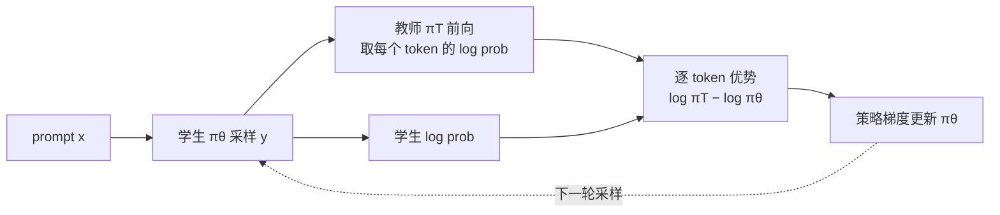
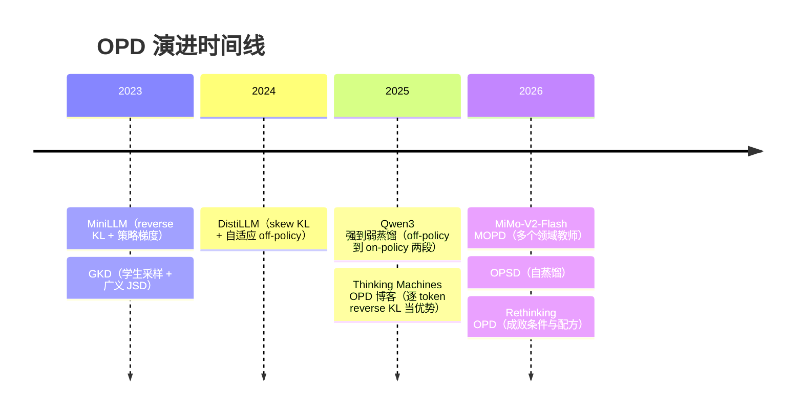

# OPD（On-Policy Distillation，在线蒸馏）总览

> **一句话**：让学生模型自己采样，教师在学生写出的每个 token 上给出对数概率，把逐 token 的 reverse KL 当作稠密奖励来训练。它同时拿到 RL 的 on-policy（学的是自己真会犯的错）和蒸馏的稠密监督（每个 token 都有信号）。
>
> 关键节点：MiniLLM / GKD（2023，arXiv:2306.08543 / 2306.13649）→ Qwen3 强到弱蒸馏（2025-05，arXiv:2505.09388）→ Thinking Machines《On-Policy Distillation》博客（2025-10）→ MiMo-V2-Flash 多教师 OPD（2026-01，arXiv:2601.02780）/ OPSD 自蒸馏（2026-01，arXiv:2601.18734）
>
> 前置阅读：[后训练总览](/post-training/)、[黑盒蒸馏](/distillation/black-box)、[白盒蒸馏](/distillation/white-box)、[GRPO](/rlhf/grpo)

## 为什么要 on-policy

把后训练方法按「在谁的序列上学」和「监督有多密」两个轴摆开，OPD 补上的正好是右下角那一格。这个划分沿用 Thinking Machines 博客的讲法：

| | 稀疏监督（整条轨迹一个分） | 稠密监督（每个 token 都有信号） |
| --- | --- | --- |
| **off-policy**（在固定数据上学） | — | [SFT](/sft/)、[黑盒蒸馏](/distillation/black-box) |
| **on-policy**（在自己的采样上学） | [RL](/rlhf/)（RLHF / [RLVR](/reasoning/rlvr)） | **OPD** |

左右两边各有一个缺口：

- **off-policy 蒸馏的问题是分布失配。** 学生只在教师写好的前缀上练习，推理时却走在自己生成的前缀上。一旦偏出教师会走的路径，学生就进入了从没见过的状态，误差会越滚越大。这就是模仿学习里的 exposure bias / compounding error。
- **RL 的问题是信号太稀疏。** 一道数学题最后判为错，学生只知道「答案 21 是错的」，却不知道错在哪一步。Thinking Machines 的博客把它概括成：RL 每个 episode 只传递 $O(1)$ 比特信息，蒸馏每个 episode 能传递 $O(N)$ 比特（$N$ 是 token 数）。

OPD 的做法是：序列由学生自己采样，保证训练分布和推理分布一致；教师对其中每个 token 打分，保证监督足够密。

## 方法：把逐 token reverse KL 当作优势

给定 prompt $x$，学生采样 $y \sim \pi_\theta(\cdot \mid x)$，教师 $\pi_{\text{T}}$ 对这条序列做**一次前向**，拿到每个位置上学生所选 token 的对数概率。第 $t$ 个 token 的优势定义为

$$
A_t = \log \pi_{\text{T}}(y_t \mid x, y_{<t}) - \log \pi_\theta(y_t \mid x, y_{<t})
$$

它正好是逐 token reverse KL $\mathrm{KL}(\pi_\theta \,\|\, \pi_{\text{T}})$ 的单样本估计取负。直观地说，学生选了一个教师觉得不太可能的 token，$A_t$ 为负，这个 token 就被压低；选得和教师一致，$A_t$ 接近 0 或为正。

两个细节决定了它和普通 RL 的区别：

- **折扣因子为 0。** 每个 token 只看自己这一项，不把后续 token 的 KL 累加进来，所以不需要 critic，也不存在长程 credit assignment 的问题。
- **reverse KL 是 mode-seeking。** 学生只需要学好教师的主要模式，不必覆盖教师分布的长尾。容量小的学生因此不会被逼着去模仿自己驾驭不了的低概率区域，原理见 [白盒蒸馏](/distillation/white-box) 里 MiniLLM 的那张图。

拿到 $A_t$ 之后，直接套进 PPO / GRPO 的策略梯度更新即可。换句话说，OPD 就是**把 RL 流程里的奖励模型或 verifier 换成教师的一次前向**：



```python
# OPD 核心（采样 token 的 reverse KL + PPO 式裁剪）
y = student.generate(x)                              # 学生 on-policy 采样
old_logp = student.logprobs(x, y).detach()           # 采样时策略的 log prob
with torch.no_grad():
    t_logp = teacher.logprobs(x, y)                  # 教师只做一次前向，[B, L]
adv = t_logp - old_logp                              # 逐 token 优势，折扣因子为 0

s_logp = student.logprobs(x, y)                      # 当前参数下的 log prob
ratio = torch.exp(s_logp - old_logp)
pg = torch.min(ratio * adv, ratio.clamp(1 - eps, 1 + eps) * adv)
loss = -(pg * response_mask).sum() / response_mask.sum()
```

### 两种实现形态

| 形态 | 教师要提供什么 | 怎么优化 | 代表 |
| --- | --- | --- | --- |
| 采样 token 的 reverse KL + 策略梯度 | 学生所选 token 的 log prob | 策略梯度，可直接复用 PPO / GRPO 代码 | Thinking Machines 博客；verl 的 `use_policy_gradient=true` |
| 分布级散度直接反传 | 全词表或 top-k logits | 散度对 $\theta$ 直接可微，不需要策略梯度 | [GKD](/distillation/white-box)；Qwen3（让学生 logits 对齐教师以最小化 KL）；verl 的 `forward_kl_topk` |

第一种对教师的要求最低，推理服务只要能返回采样 token 的 log prob 就行。第二种每个位置能拿到更多信息，但要传 logits；推理服务通常只返回 top-k，所以实际用的是 top-k 截断后的分布。

## 在后训练中的位置

| 方法 | 序列从哪来 | 监督粒度 | 需要教师 | 需要可验证奖励 | 词表约束 |
| --- | --- | --- | --- | --- | --- |
| [黑盒蒸馏](/distillation/black-box) | 教师采样 | 序列级（在教师文本上做 SFT） | 只要输出文本 | 否 | 无 |
| [白盒 off-policy 蒸馏](/distillation/white-box) | 固定数据集 | token 级分布 | 要 logits | 否 | 须一致 |
| **OPD** | 学生采样 | token 级 | 要对学生的 token 打分 | 否 | 须一致 |
| [RLVR](/reasoning/rlvr) | 学生采样 | 整条轨迹一个分 | 否 | 是 | 无 |

两点值得记住：

1. **OPD 不需要可验证奖励。** 只要有教师，就能用在写作、对话、指令遵循这类判不了对错的任务上，这是它比 RLVR 适用面宽的地方。
2. **OPD 的上限是教师。** RL 能让模型超过示范数据，OPD 最多追平教师，所以它适合「已经有一个强模型，想把能力搬到小模型或别的模型上」的场景，而不是去探索新能力。

## 演进时间线



2023–2024 年的工作（MiniLLM、GKD、DistiLLM）把 on-policy 和 reverse KL 的思路立了起来，但主要在较小模型和较短的生成任务上验证，细节见 [白盒蒸馏](/distillation/white-box)。2025 年起，Qwen3 在推理模型上报告 OPD 大幅省算力，Thinking Machines 的博客又把它讲成「把 RL 的奖励换成教师打分」，OPD 由此成为工业界后训练里的独立一环。

## 工业配方

### Qwen3：强到弱蒸馏

Qwen3（arXiv:2505.09388）的旗舰模型走完整的多阶段 RL，小模型（0.6B / 1.7B / 4B / 8B / 14B dense 和 30B-A3B MoE）改用两段蒸馏，教师是 Qwen3-32B 或 Qwen3-235B-A22B：

1. **off-policy 蒸馏**：把教师在 `/think` 和 `/no_think` 两种模式下的输出混在一起，让学生做 SFT，先学会基本的推理和模式切换。
2. **on-policy 蒸馏**：学生自己采样，对齐教师 logits 以最小化 KL。

报告在 Qwen3-8B 上做了对照，两条路线从同一个 off-policy 检查点出发：

| 指标 | RL | On-policy 蒸馏 |
| --- | --- | --- |
| AIME'24（pass@64） | 67.6（90.0） | 74.4（93.3） |
| AIME'25（pass@64） | 55.5（83.3） | 65.5（86.7） |
| GPU 小时 | 17,920 | 1,800 |

OPD 的分数更高，算力大约只有 RL 的 1/10，pass@64 也同样更高。

### Thinking Machines：OPD 博客

Thinking Machines Lab 的 Kevin Lu 等人在 2025 年 10 月发表了《On-Policy Distillation》，是目前把这件事讲得最清楚的材料。几组实验：

- **数学推理**：学生 Qwen3-8B-Base，教师 Qwen3-32B。先用 40 万条 prompt 做 off-policy SFT，AIME'24 到 60%；再做约 150 步 OPD，到 70% 左右。如果换成继续加大 SFT 数据，按趋势外推要约 200 万条 prompt 才能到 70%。博客估算 OPD 的成本约为这条路线的 1/9（SFT 数据已经现成的情况下），把造数据的成本也算进去约为 1/30。
- **个性化与持续学习**：把 Qwen3-8B 在内部文档上继续训练以注入知识，IF-eval 从 85% 掉到 79%；再用 OPD 把指令遵循能力找回来，IF-eval 回到 83%，同时内部知识问答保持在 41%。这说明 OPD 可以用来修复微调带来的遗忘。
- **和 RL 比效率**：在自蒸馏设置下，OPD 达到教师水平所需的梯度步数比 RL 少约 7–10 倍，博客折算的总算力效率为 50–100 倍。

### MiMo-V2-Flash：多教师 OPD（MOPD）

小米 MiMo-V2-Flash 技术报告（arXiv:2601.02780）在后训练中提出 MOPD：先针对每个领域分别做 RL，得到一组领域专家教师，再让同一个学生在自己的采样上同时向这些教师蒸馏，教师提供稠密的 token 级奖励。

它解决的是**能力整合**问题：多个领域的 RL 混在一起训容易互相干扰，分阶段训又会遗忘前面的能力。后续的 MOPD 论文（arXiv:2606.30406）在 Qwen3-30B-A3B 上报告，MOPD 优于混合 RL（Mix-RL）、分阶段 RL（Cascade RL）、off-policy 微调和参数合并几种基线，基本继承了每个领域教师的能力。

### OPSD：没有外部教师的自蒸馏

OPSD（*Self-Distilled Reasoner*，arXiv:2601.18734）把教师和学生合成**同一个模型**：教师视角下模型能看到经过验证的参考推理过程，学生视角下只能看到题目，在学生自己的采样上最小化两者之间的逐 token 散度。这样不需要额外的大模型，只需要带参考解的数据。作者报告它的 token 效率高于 RL，效果优于 off-policy 蒸馏。

## OPD 什么时候管用、什么时候失败

*Rethinking On-Policy Distillation of LLMs*（arXiv:2604.13016）专门分析了 OPD 的成败条件，结论对选教师和调参很有用：

- **强教师不等于好教师。** 教师和学生的思维模式差异太大时，蒸馏信号会变弱，和教师的榜单分数无关。论文里一个分数更低、但和学生初始 token 重合度更高的教师，蒸馏效果反而更好。
- **教师要带来学生没见过的东西。** 和学生出自同一训练管线的教师提升有限，经过额外后训练的教师效果明显更好。
- **成功的训练有固定特征。** 学生和教师的 token 重合率从约 72% 稳步升到约 91%，重合的 token 占两者约 97–99% 的概率质量，熵差逐渐缩小。失败的训练从一开始重合率就不涨，熵差也一直不收敛。这几个量可以直接当训练监控指标。
- **只用采样到的那一个 token 就够了。** 采样 token 的 reverse KL 和 top-k（k 取 4 / 16 / 64）效果相当；只取教师 argmax 的 top-1 反而不稳定。
- **回答长度有甜区。** 3K–7K token 效果最好，到 10K、15K 会退化。不稳定从回答末尾开始出现高熵，再逐步向前蔓延。

论文给出的配方有两条：

1. **先做 off-policy 冷启动**：用教师生成的数据（论文用了 20 万条）先对学生做 SFT，缩小思维模式差距，再开始 OPD。Qwen3 的两段式做法也是这个思路。
2. **选和教师后训练数据相近的 prompt**：效果更好，但容易导致熵坍缩，需要混入一部分其他来源的 prompt。

## 实现要点

- **基础设施几乎全部复用 RL**：rollout 引擎、策略梯度更新、PPO 裁剪都不用改，只是把奖励模型或 verifier 换成教师前向服务。显存里要放学生策略和教师，不需要 critic，也不需要奖励模型，见 [训练循环机制](/rlhf/training-loop)。
- **词表必须一致**：教师要对学生的 token 打分，两者的 tokenizer 必须相同，实践中基本都在同一家族的模型之间蒸馏。
- **框架支持**：verl 用 `distillation.enabled` 开启，`distillation_loss.loss_mode` 选择散度（`k1` / `k3` / `low_var_kl` 等 reverse KL 估计，或 `forward_kl_topk`），`use_policy_gradient` 切换上文的两种形态；`use_task_rewards` 为 true 时，总损失为 `policy_loss + distillation_loss_coef × distill_loss`，也就是把 OPD 叠加在任务奖励之上。TRL 的 `GKDTrainer` 实现的是 GKD 那种分布级形态。
- **先 SFT 冷启动**：直接从 base 或思维模式差异很大的检查点起步，OPD 很容易不收敛。
- **监控 token 重合率和熵差**，不要只看 KL 损失。

## 参考文献

- Gu, Dong, Wei, Huang, 2023. *MiniLLM: Knowledge Distillation of Large Language Models.* arXiv:2306.08543（ICLR 2024）
- Agarwal et al., 2023. *On-Policy Distillation of Language Models: Learning from Self-Generated Mistakes.* arXiv:2306.13649（ICLR 2024，GKD）
- Ko, Kim, Chen, Yun, 2024. *DistiLLM: Towards Streamlined Distillation for Large Language Models.* arXiv:2402.03898（ICML 2024）
- Qwen Team, 2025. *Qwen3 Technical Report.* arXiv:2505.09388
- Lu et al. (Thinking Machines Lab), 2025-10-27. *On-Policy Distillation.* https://thinkingmachines.ai/blog/on-policy-distillation/
- Xiaomi LLM-Core Team, 2026. *MiMo-V2-Flash Technical Report.* arXiv:2601.02780
- Zhao et al., 2026. *Self-Distilled Reasoner: On-Policy Self-Distillation for Large Language Models.* arXiv:2601.18734
- Li et al., 2026. *Rethinking On-Policy Distillation of Large Language Models: Phenomenology, Mechanism, and Recipe.* arXiv:2604.13016
- Ma et al., 2026. *MOPD: Multi-Teacher On-Policy Distillation for Capability Integration in LLM Post-Training.* arXiv:2606.30406
- verl 文档：On-Policy Distillation (OPD). https://verl.readthedocs.io/en/latest/algo/opd.html
