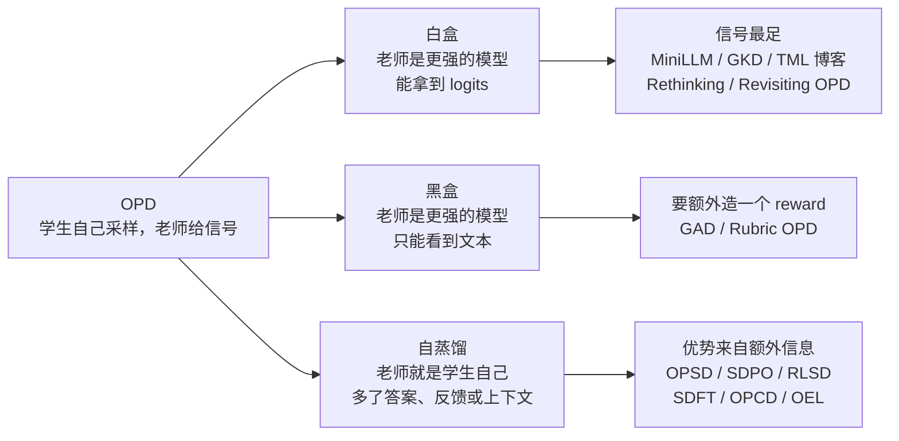
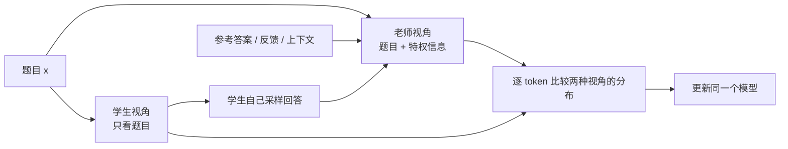
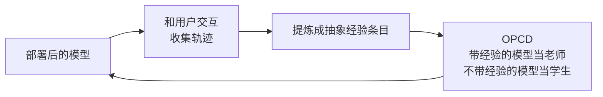

# OPD（白盒蒸馏/黑盒蒸馏/自蒸馏）

> **一句话**：OPD（On-Policy Distillation）让学生在**自己采样的回答**上接受老师逐 token 的反馈，兼得 RL 的 on-policy 和蒸馏的稠密信号。按「老师比学生强在哪、能给出什么信号」分成三类：白盒（更强的模型，给 logits）、黑盒（更强的模型，只给文本）、自蒸馏（同一个模型，多拿到了答案、反馈或上下文）。
>
> 前置阅读：[后训练总览](/post-training/)、[黑盒蒸馏系列](/distillation/)（在老师文本上做 SFT 的传统蒸馏）、[白盒蒸馏](/distillation/white-box)（MiniLLM / GKD / DistiLLM 的散度设计）、[GRPO](/rlhf/grpo)
>
> 本页嘉宾原话均出自青稞社区《OPD 专题｜青稞 AMA 第 3 期》（2026-05-30 直播）逐字稿，发言人身份以直播介绍为准。

## 前言

DeepSeek-V4 的技术报告里有一句很直接的话：后训练沿用 V3.2 的流程，只做了一处关键替换——

> the mixed Reinforcement Learning (RL) stage was entirely replaced by On-Policy Distillation (OPD).

先分领域训出一批专家，再用 OPD 把「more than ten teacher models」合进同一个学生。混合 RL 这一步，被 OPD 整个换掉了。

可大家嘴里的「蒸馏」其实不是一回事。有人指拿 R1 的输出做 SFT，有人指 Thinking Machines Lab 博客里那套 OPD，还有人指模型自己教自己。三种说法用的信号、适用的场景、踩的坑都不一样。

本页按「**老师比学生强在哪、能给出什么信号**」来分：

- **白盒**：老师是更强的模型，能拿到它的 logits；
- **黑盒**：老师是更强的模型，但只能看到它写出的文本；
- **自蒸馏**：老师就是学生自己，强在多拿到了参考答案、环境反馈或上下文。

这恰好也是一条时间线：白盒的奠基工作出现在 2023 年，黑盒 OPD 在 2025 年底有了能跑通的方案，自蒸馏在 2026 年上半年扎堆涌现。

全文结构：01 看大厂怎么用，02 讲清概念，03–05 分别讲三类方法，06 摆出圆桌上没吵出结论的三个问题。

**OPD，一篇就够了！**

## 01. 大厂的 OPD：它已经是后训练的标配

先回答「为什么现在要关注 OPD」。下面三个工业案例说明，它已经是后训练流程里的固定一环，不是学术玩具。

### DeepSeek-V4：十余个领域专家当老师，用 OPD 合并成一个模型

DeepSeek-V4（arXiv:2606.19348）的后训练分两步：

1. **专家训练**：每个领域的专家先做领域 SFT，再用 [GRPO](/rlhf/grpo) 做 RL。推理强度不同的模式（包括 Think Max）也各训一套专家。
2. **多教师 OPD**：学生在自己的轨迹上，按权重同时向多个专家做 reverse KL：

$$
\mathcal{L}_{\text{OPD}}(\theta)=\sum_{i=1}^{N} w_i\cdot D_{\mathrm{KL}}\big(\pi_\theta\,\|\,\pi_{E_i}\big)
$$

报告说学生会「selectively learns from the specialized expert relevant to the current task context」，数学题对齐数学专家，编程题对齐代码专家，并称这样「practically circumventing the performance degradation often encountered in traditional weight-merging or mixed RL techniques」。

更值得注意的是工程部分。报告明确没有用业界常见的「只在采样 token 上估计 KL」：

> Although this approach is resource-efficient, it leads to high variance in gradient estimation and often causes training instability. Therefore, we adopt full-vocabulary logit distillation in our OPD.

为了让全词表 OPD 能在十余个万亿参数级教师上跑起来，DeepSeek 做了几件事：教师权重放在集中式分布式存储里按需加载；不存全词表 logits（词表超过 10 万），只缓存教师最后一层 hidden states，训练时再过对应的 prediction head 现场重建 logits；按教师编号排序样本，保证每个 mini-batch 里每个教师 head 只加载一次；最后用 TileLang 写的专用 kernel 计算精确 KL。全词表还是 Top-K 的争论，见第 06 章。

### 小米 MiMo-V2-Flash：MOPD 多教师合版，带动工业界跟进

MiMo-V2-Flash 技术报告（arXiv:2601.02780）提出 **MOPD**（Multi-Teacher On-Policy Distillation）：先在智能体（搜索、代码、通用工具调用）和非智能体（数学、通用推理、安全）等领域**各自独立做 RL**，得到一组领域教师；再让学生在自己的采样上，同时接受教师给的 token 级 reverse KL 信号和可验证的结果奖励，最终优势是两者的组合。

为什么不直接把所有领域的数据混在一起做 RL（mix RL），或者一个领域接一个领域地串行 RL？清华 THUNLP 的何秉翔从团队协作的角度解释：

> 那 pipeline 的 RL 有可能就会面临到这种串行瓶颈的问题，就前一个任务训练有问题，导致后面一个任务出了问题、出了 bug。……如果说做合版这种事的话，那不同的 domain 大家就各自刷各自的 RL expert，然后我们每个 domain 就只负责把自己的这一亩三分地给弄好。

微软亚研院的 Tianzhu Ye 则从训练动力学解释：

> 其实更多是利用它收敛快，然后训得少，这样 forgetting 更少，这样一个性质，对，我理解。

MOPD 公开之后跟进的团队不少。中科院信工所的杨晨旭在圆桌上说：

> 这个报告就是开源出来之后，其实对于很多大厂的机构团队来说，他们就会用这样一个更好的方式去做合版。

何秉翔也提到，他们在 MiniCPM5 上用多教师 OPD，在 code、math 和指令遵循三四个领域上「能够做到 teacher 100% 的效果」。后续的 MOPD 论文（arXiv:2606.30406）在 Qwen3-30B-A3B 上报告，这种做法优于 mix RL、串行 RL、off-policy 微调和参数合并。

### Qwen3：大模型蒸小模型，SFT 之后接 OPD

OPD 在业界用得比 Thinking Machines Lab 的博客早。Qwen3 技术报告（arXiv:2505.09388，2025-05）里，旗舰模型走完整的多阶段 RL，而 0.6B 到 14B 的 dense 模型和 30B-A3B 的小模型，用的是「强到弱蒸馏」：

1. **off-policy 蒸馏**：把教师（Qwen3-32B 或 Qwen3-235B-A22B）在 `/think` 和 `/no_think` 两种模式下的输出混在一起，让学生做 SFT；
2. **on-policy 蒸馏**：学生自己采样，对齐教师 logits，最小化 KL。

报告在 Qwen3-8B 上，从同一个 off-policy 检查点出发做了对照：

| 指标 | RL | On-policy 蒸馏 |
| --- | --- | --- |
| AIME'24（pass@64） | 67.6（90.0） | 74.4（93.3） |
| AIME'25（pass@64） | 55.5（83.3） | 65.5（86.7） |
| GPU 小时 | 17,920 | 1,800 |

分数更高，算力约为 RL 的 1/10。这里用的是教师 logits，何秉翔在圆桌上点出了这背后的前提：

> 那开源的模型那就意味着咱们可能是能够拿到 logits，就不一定说纯做黑盒的这种蒸馏。

那 OPD 到底是什么？

## 02. 什么是 OPD

### 问题来了～SFT 蒸馏、RL、OPD 差在哪

先把三种训练方式摆在一起：

| 方式 | 谁来写回答 | 监督信号 | 问题 |
| --- | --- | --- | --- |
| SFT 蒸馏 | 老师写好答案，学生照着学 | 每个 token 都有，但是 off-policy | exposure bias：学生只在老师的前缀上练过，推理时一旦走偏就进入没见过的状态 |
| RL（如 RLVR） | 学生自己答题 | 整条回答一个 0/1 结果奖励 | 信号稀疏，只知道答错了，不知道错在哪一步 |
| **OPD** | 学生自己答题 | 老师给学生写出的每个 token 打分 | 兼有 on-policy 和稠密信号 |

打个比方：SFT 蒸馏是抄范文，RL 是交卷后只看总分，OPD 是学生自己写作业、老师逐字批改。

Thinking Machines Lab 的博客把 OPD 讲成「带稠密奖励的 RL」：学生采样后，教师对每个 token 给出对数概率，第 $t$ 个 token 的优势取

$$
A_t=\log\pi_{\text{T}}(y_t\mid x,y_{<t})-\log\pi_\theta(y_t\mid x,y_{<t})
$$

再套进策略梯度更新。这个讲法很好懂，也把 OPD 和当时正热的 RL 讨论接上了。但它只是一种理解方式。Tianzhu Ye 在圆桌上泼了冷水：

> 他就比较聪明地去讲到这个从一个 dense reward 角度去思考 OPD，然后去把它跟 RL 的这些事情连接起来。

在他看来，OPD 和 RL 的优化目标本质不同：

> 但实际上仔细去看的话，OPD 其实更像是一种去模仿一个分布嘛。

这个分歧会在第 06 章再展开。

### forward KL 和 reverse KL：一个铺开，一个聚焦

蒸馏就是让学生分布 $\pi_\theta$ 去逼近老师分布 $\pi_{\text{T}}$，关键是用哪个方向的 KL：

- **forward KL** $D_{\mathrm{KL}}(\pi_{\text{T}}\,\|\,\pi_\theta)$ 是 **mode-covering**：老师有概率的地方，学生都得覆盖到，长尾也会被拉起来。容量小的学生装不下老师的所有模式，只能把概率摊薄。
- **reverse KL** $D_{\mathrm{KL}}(\pi_\theta\,\|\,\pi_{\text{T}})$ 是 **mode-seeking**：学生只需要在自己有概率的地方和老师一致，会盯住老师的高概率区域，主动放弃覆盖不了的长尾。

> 图源：Gu, Dong, Wei, Huang, *MiniLLM: Knowledge Distillation of Large Language Models*（arXiv:2306.08543）——forward KL 与 reverse KL 拟合双峰分布的对比（用于学习注解，版权归原作者）。直观解释可参考 Tim Vieira 的博客 [KL-divergence as an objective function](https://timvieira.github.io/blog/kl-divergence-as-an-objective-function/)。

OPD 选 reverse KL，除了 mode-seeking 适合小学生，还有一个更直接的原因：

$$
D_{\mathrm{KL}}(\pi_\theta\,\|\,\pi_{\text{T}})=\mathbb{E}_{y\sim\pi_\theta}\big[\log\pi_\theta(y)-\log\pi_{\text{T}}(y)\big]
$$

期望是在**学生分布**上取的，样本天然就该从学生采样。这正是 on-policy 的来源。

同一个 reverse KL，在每个位置上可以有三种估计方式，第 06 章会用到：

- **采样 token**：只看学生实际选的那个 token，算 $\log\pi_\theta-\log\pi_{\text{T}}$。最省，方差最大。
- **Top-K**：在老师（或学生）的前 K 个 token 上算 KL。
- **全词表**：在整个词表上精确计算这一步的 KL。最准，也最费资源。

### 本页的分类：按「老师的优势从哪来」分成白盒、黑盒、自蒸馏

```mermaid
flowchart LR
    OPD[OPD<br/>学生自己采样，老师给信号] --> WB[白盒<br/>老师是更强的模型<br/>能拿到 logits]
    OPD --> BB[黑盒<br/>老师是更强的模型<br/>只能看到文本]
    OPD --> SD[自蒸馏<br/>老师就是学生自己<br/>多了答案、反馈或上下文]
    WB --> WB2[信号最足<br/>MiniLLM / GKD / TML 博客<br/>Rethinking / Revisiting OPD]
    BB --> BB2[要额外造一个 reward<br/>GAD / Rubric OPD]
    SD --> SD2[优势来自额外信息<br/>OPSD / SDPO / RLSD<br/>SDFT / OPCD / OEL]
```

| 类别 | 老师强在哪 | 能给什么信号 | 代表工作 | 时间 |
| --- | --- | --- | --- | --- |
| 白盒 | 更强的模型 | logits，信号最足 | MiniLLM、GKD、TML 博客、Rethinking OPD、Revisiting OPD | 2023 年奠基，2025 年底走红 |
| 黑盒 | 更强的模型 | 只有文本，需要另造 reward | GAD、Rubric OPD | 2025 年底起 |
| 自蒸馏 | 多拿到的信息 | 同一个模型在额外上下文下的 logits | OPSD、SDPO、RLSD、SDFT、OPCD、OEL | 2026 年上半年扎堆 |

这就是本页的地图。

注意：本页的「黑盒蒸馏」专指**黑盒 OPD**，即学生仍然自己采样，只是老师给不出 logits。只拿老师文本做 SFT 的传统黑盒蒸馏，见 [黑盒蒸馏系列](/distillation/)。

## 03. 白盒蒸馏：拿得到老师的 logits

按时间讲四个工作：奠基、走红，再到两篇讲「为什么会失败」的分析。

### MiniLLM：把 KD 换成 reverse KL，比 Google GKD 早 9 天

**解决什么问题。** 传统知识蒸馏在固定数据上最小化 forward KL，放到生成任务上有两个毛病：mode-covering 让小学生去模仿自己驾驭不了的长尾；训练时走老师的前缀、推理时走自己的前缀，分布对不上。

**机制。** MiniLLM（清华 CoAI / 微软亚研院，arXiv:2306.08543，2023-06-14 挂出）把目标换成 reverse KL，期望在学生分布上取，于是用 policy gradient 在学生的采样上优化，相当于把 $\log\pi_{\text{T}}$ 当奖励做 RL。九天后，Google DeepMind 的 GKD（arXiv:2306.13649，2023-06-23 挂出）走了另一条路：同样让学生采样，但把散度直接写进损失、对每个位置的分布求导，不走策略梯度，并支持 forward KL、reverse KL、JSD 等多种散度。

这两种写法后来被称为 PG-style 和 GKD-style（青稞社区有一篇[中文对比](https://qingkeai.online/blog/PG-Style-OPD-GKD-Style-OPD)）：

| 写法 | 损失 | 特点 |
| --- | --- | --- |
| PG-style | $-\sum_t \mathrm{sg}(A_t)\log\pi_\theta(y_t\mid s_t)$，$A_t$ 取 reverse KL 的负值 | 复用 RL 代码，继承 REINFORCE 的方差 |
| GKD-style | $\sum_t D\big(\pi_{\text{T}}(\cdot\mid s_t),\,\pi_\theta(\cdot\mid s_t)\big)$ | 分布级损失直接反传，方差更低 |

MiniLLM 一作顾煜贤在观众问答里讲了两者的关系：

> 然后你仔细地去推一下，就会发现这个 GKD，它那个东西就是期望上就等价于走 reward。

他补充说，这个等价只对 reverse KL 成立；forward KL 和 JSD 没有这样的等价性。

**故事。** 顾煜贤回忆，OPD 的想法最早来自 2022 年冬天：ChatGPT 刚出来，大家对 RL 很好奇，mentor 问他能不能拿 RL 来做蒸馏，后来才慢慢演化成 reverse KL 的形式。但当时这个方向没什么人买账：

> 因为那个时候在大家的认知里面，RL 是一件非常贵的事情。对，那个时候大家都喜欢做 DPO，不喜欢做 RL 啊。

**怎么看。** MiniLLM 和 GKD 在 2023 年就把 OPD 的两个核心要素（学生采样、reverse KL）立住了，但当时主要在较小的模型和较短的生成任务上验证。散度设计的更多细节见 [白盒蒸馏](/distillation/white-box)。

### Thinking Machines Lab 的博客：把 OPD 讲成 dense reward 的 RL

**解决什么问题。** 2023 年的方法为什么到 2025 年底才火？Thinking Machines Lab 在 2025-10-27 发表的博客 [On-Policy Distillation](https://thinkingmachines.ai/blog/on-policy-distillation/) 是转折点。顾煜贤的总结是：

> 我觉得这个东西火起来主要就是两个原因：一个是时代的背景啊，后训练也火了啊；另一个的话就是 Thinking Machines Lab 搞了一波这个操作。

何秉翔补了另外两层背景：一是开源模型已经接近闭源，能拿到 logits；二是 RLVR 做到 2025 年中碰到了瓶颈，[Limit of RLVR](https://arxiv.org/abs/2504.13837) 这类工作开始质疑 RL 究竟有没有拓宽基座模型的能力边界，大家开始回头找稠密奖励。杨晨旭则提到了基础设施：verl 等 RL 框架成熟之后，自己搭 on-policy 训练的门槛低了很多。

**机制。** 博客的做法就是上一章的公式：学生采样，教师对每个 token 做一次前向拿到对数概率，优势取逐 token 的负 reverse KL，折扣因子设为 0，然后套进 RL 的策略梯度更新。它把 RL 流程里的奖励模型换成了教师的一次前向。

**关键数字**（以博客原文为准）：

- 学生 Qwen3-8B-Base、教师 Qwen3-32B：先用 40 万条 prompt 做 off-policy SFT，AIME'24 到 60%；再做约 150 步 OPD，到 70% 左右。若继续加大 SFT 数据，按趋势外推约需 200 万条 prompt 才能到 70%。博客估算 OPD 的成本约为这条路线的 1/9（SFT 数据已现成时），算上造数据约为 1/30。
- 博客引用 Qwen3 的数字：OPD 以约 1/10 的 GPU 小时超过 RL。
- 用 OPD 修复微调带来的遗忘：Qwen3-8B 在内部文档上继续训练后，IF-eval 从 85% 掉到 79%，OPD 之后回到 83%，内部知识问答保持在 41%。
- 信息量的类比：RL 每个 episode 只传递 $O(1)$ 比特，蒸馏每个 episode 能传递 $O(N)$ 比特（$N$ 为 token 数）。

**冷水。** 这篇博客把 OPD 讲成 RL，是一个好懂也好传播的框架，但 Tianzhu Ye 的提醒值得记住：OPD 本质上是在模仿一个分布，它的上限、泛化和 RL 都不一样。

### THUNLP 的 Rethinking OPD：师生 thinking pattern 不兼容，更强的老师反而带不动

**解决什么问题。** 这篇工作（清华 THUNLP 等，arXiv:2604.13016）的出发点，按作者何秉翔在圆桌上的说法：

> 我们一开始初衷就是想尝试先复现一下 Thinking Machines Lab 他们那个 blog 带来的效果。

复现本身成功了，但换一个老师就不行了：

- 学生 R1-Distill-1.5B、老师 JustRL-1.5B（他们自己从同一个模型 RL 出来的）：OPD 很快恢复了老师 80% 以上的性能差距。
- 同一个学生、换成更强的同族老师 R1-Distill-7B：OPD 一直停滞。

何秉翔的描述是：

> 那这个比较强的 teacher，它似乎并没有让学生学到多少的能力，就基本上 OPD 的这个过程一直是停滞的状态。

他们又换了一组同尺寸差距的 pair（Skywork 在 R1-Distill-7B 上 RL 出的模型，对比 R1-Distill-14B 老师），现象一样。

**机制与指标。** 论文把 OPD 的成功归结为两个条件：

1. **thinking pattern 兼容**：师生的推理模式不能差太远。更强的老师不一定是更好的老师。
2. **老师要有学生没有的能力**：和学生出自同一训练管线、只是尺寸更大的老师，能教的东西有限。

论文用 token 重合率刻画这一点：成功的 OPD 里，学生和老师的 top token 重合率从约 72% 升到约 91%，重合的这一小撮 token 占了 97%–99% 的概率质量，师生熵差逐步收窄；失败的 OPD 从一开始就重合率停滞、熵差不收敛。另外几个发现：

- 只用采样 token 的 reverse KL，和 Top-K（K 取 4、16、64）效果相当；只取老师 argmax 的 Top-1 反而不稳。
- 回答长度 3K–7K 效果最好，到 10K、15K 会退化，高熵从回答末尾开始向前蔓延。

**配方。** 先用老师生成的数据（论文用了 20 万条）做 off-policy 冷启动 SFT，缩小思维模式差距；选和老师后训练数据相近的 prompt，但要混入一部分其他 prompt，防止熵坍缩。

**怎么看。** 这篇工作最有用的地方是给了一个训练前就能看的指标：先测师生的 token 重合率，再决定选哪个老师，比直接看榜单分数靠谱。

### 自动化所的 Revisiting OPD：三种失效模式和对应的修法

**解决什么问题。** 如果说 Rethinking OPD 讲的是「什么条件下能成」，那中科院自动化所的 Revisiting OPD（arXiv:2603.25562）讲的是「工程上怎么不崩」。论文指出，标准实现把分布匹配简化成采样 token 上的对数比，「can make the learning signal fragile on long rollouts」。

**三种失效模式和修法：**

| 失效模式 | 修法 |
| --- | --- |
| 只用采样 token 时，token 级监督在序列间不平衡 | 在老师的 Top-K 支撑集上做截断的 reverse KL（teacher top-K local support matching） |
| 学生写出的前缀偏离老师分布后，老师的指导不可靠 | 学生 rollout 用 top-p 采样 |
| tokenizer 和 special token 不匹配，影响训练稳定 | special token mask |

论文报告这套修法比标准的采样 token OPD 提升 19.8%。一作傅宇千在圆桌上说：

> 其实我们的做法比较 trivial，就我们直接把它 mask 掉了。

他还补充了一个经验：在 agentic 这类长程任务、或学生很容易和老师产生分布偏移的场景，训练不稳会被放大，这时把 Top-K 的 K 拉高很有帮助，但拉到一定程度后收益有限。

两篇对照着看：Rethinking OPD 讲条件，Revisiting OPD 讲工程。

## 04. 黑盒蒸馏：只拿得到老师的回答

最强的模型大多闭源，拿不到 logits，只能看到回答。这时学生照样可以自己采样，但老师没法直接给每个 token 打分，需要额外造一个奖励。

### 微软亚研的 GAD：训一个判别器当 reward，只用文本也能做 on-policy

**机制。** GAD（Generative Adversarial Distillation，微软亚研院，arXiv:2511.10643）把学生当生成器 $G$，另训一个判别器 $D$ 区分学生和老师的回答，两者做极小极大博弈：

$$
\max_{G}\min_{D}\ \mathcal{V}(G,D)=\mathbb{E}_{(x,y_t)\sim\mathcal{T}}\big[-\log\sigma\big(D(y_t)-D(G(x))\big)\big]
$$

判别器用 Bradley-Terry 损失学着给老师的回答打更高分，它从生成器参数初始化、加一个预测头；生成器则最大化判别器给自己打的分 $D(G(x))$。论文把判别器解释为一个跟着学生一起进化的 on-policy 奖励模型：

> our discriminator can be interpreted as an on-policy reward model that evolves jointly with the student policy.

和 RLHF 里训完就冻住、容易被 hack 的奖励模型不同，GAD 的判别器一直在跟着学生更新。

> 图源：Ye et al., *Black-Box On-Policy Distillation of Large Language Models*（arXiv:2511.10643）Figure 2——GAD 的训练流程（用于学习注解，版权归原作者）。

**关键数字**（以原文 Table 2 为准，GPT-4o 打分）：教师 GPT-5-Chat 在 LMSYS-Chat 测试集上 51.7。Qwen2.5-14B-Instruct 蒸馏前 50.0、SeqKD 后 50.6、GAD 后 52.1，与教师相当；Qwen2.5-3B-Instruct 用 GAD 后 48.9，接近 Qwen2.5-7B-Instruct 用 SeqKD 的 49.2。在 Dolly、SelfInst、Vicuna 这些分布外测试上，SeqKD 提升很小甚至为负，GAD 仍然稳定提升。

**冷水，来自作者本人。** Tianzhu Ye 是 GAD 一作，他在圆桌上讲了两个问题。第一是回答长度震荡：

> 因为 discriminator 去分辨 student 和 teacher 的 response，它可能比较容易去做的，就是按照这个 response 的长度去分辨。

学生回答变长，判别器就把它往短了拉；变短了又往长了拉。第二是奖励仍然是序列级的，想按 token 训判别器、给逐 token 奖励「就很容易训崩」。他的结论是，这类黑盒 OPD「并不是一个最后的解」。

### Rubric OPD：让老师总结评分标准，再给学生打分

Rubric OPD（ROPD，arXiv:2605.07396）换了一种造奖励的方式：不训判别器，而是让老师对比自己和学生的回答，归纳出针对这道题的评分标准（rubric），再用这些标准给学生的采样打分，做 on-policy 优化。

> ROPD induces prompt-specific rubrics from teacher-student contrasts, and then utilizes these rubrics to score the student rollouts for on-policy optimization.

论文称它在多数场景下优于基于 logits 的 OPD，样本效率最高提升 10 倍（以原文为准）。rubric 本身的构造和可靠性问题，见 [Rubric 化评测与训练](/eval/rubrics)。

Rethinking OPD 一作黎亚轩在圆桌上介绍这篇时，给了一个判断：这条路很容易发展成 RL 里奖励模型的样子。他对黑盒 OPD 的理解是：

> 就是相当于你这个 teacher 有什么法子去衡量你这个 teacher 和 student 之间的这个分布的差距吧。

### 冷水：跨词表蒸馏基本不 work，同词表只差尺寸都可能失败

黑盒之外还有一个相关难题：师生不是同一个模型家族时，词表对不齐，连白盒 OPD 都做不了。Tianzhu Ye 提到 Hugging Face 的 GOLD 试过跨词表：

> 但实际上那个就是试完之后发现不是很 work，对，其实它这个不同词表这个 overlap 确实太小了。

黎亚轩还担心，不同家族的思维模式差距本来就大，跨词表蒸的效果可能还不如直接 SFT。

回到第 03 章：R1-Distill-7B 和 R1-Distill-1.5B 是同一个家族、同一个词表，只差尺寸，OPD 照样停滞。何秉翔的判断是：

> 现在可能大家一个主流的方法，特别像那些闭源模型，可能有时候我们连他们的词表也不知道是什么，这个时候最简单的可能就是像黑盒的，就去做 SFT 去做蒸馏啊。

**怎么看。** 黑盒 OPD 目前还没有公认的最终解。GAD 和 Rubric OPD 本质上都是把黑盒老师改造成一个奖励模型，杨晨旭把黑盒和跨词表都归为「比较难啃的骨头」：难做，但做成了影响会很大。实践中面对闭源老师，最稳妥的仍然是 [黑盒 SFT 蒸馏](/distillation/black-box)。

## 05. 自蒸馏：老师就是带着答案的自己

不找外部老师，让同一个模型在看到参考答案、环境反馈或上下文之后，当自己的老师。这是 2026 年上半年最热闹的方向。下面按「基础 → 发现问题 → 修问题 → 走向持续学习」的顺序讲。

### OPSD / SDPO：给模型看参考答案或反馈，让它当自己的老师

**机制。** 两篇工作几乎同时挂出：

- **OPSD**（*Self-Distilled Reasoner*，UCLA，arXiv:2601.18734）：同一个模型两种视角。老师视角能看到经过验证的参考推理过程，学生视角只看到题目；在学生自己的采样上最小化两者之间的逐 token 散度。
- **SDPO**（*Reinforcement Learning via Self-Distillation*，ETH Zurich，arXiv:2601.20802）：老师视角看到的是反馈，比如运行报错、裁判评语，模型据此给出修正后的下一个 token 预测，再蒸回自己。它把 RLVR 里只有一个标量的结果奖励，变成了稠密的 token 级信号。

```mermaid
flowchart LR
    X[题目 x] --> S[学生视角<br/>只看题目]
    X --> T[老师视角<br/>题目 + 特权信息]
    R[参考答案 / 反馈 / 上下文] --> T
    S --> Y[学生自己采样回答]
    Y --> T
    T --> KL[逐 token 比较两种视角的分布]
    S --> KL
    KL --> U[更新同一个模型]
```

**疑问：模型自己蒸自己，KL 不是 0 吗？** 不是。老师视角多了特权信息，两个分布本来就不一样。即便是完全相同的模型当老师，圆桌上也有嘉宾解释过：

> 你只是期望上等于零，但是你实际采样出来是不一样的。

**伏笔。** 老师的优势来自学生推理时根本拿不到的信息。学生会不会学着去复述这些信息？

### 信工所的 RLSD：方向交给 RLVR，幅度交给自蒸馏，解决特权信息泄露

**问题。** 中科院信工所和京东的 RLSD（*Self-Distilled RLVR*，arXiv:2604.03128）证实了上面的担心：在 Qwen3-VL-8B-Instruct 上做 OPSD，验证集表现很快冲到峰值然后下滑，模型在推理时开始明确引用「参考答案」，而它此时根本看不到参考答案。一作杨晨旭在圆桌上说，他们试过 SDPO 附录里 mask 前几个 token 的办法，也改过 top-k：

> 至少在这个多模态的一个推理场景下，他无论如何都会去泄露。

论文给出的解释是：在分布匹配这一类目标里，老师在特权信息下的评估 $P_T(y_t\mid r)$ 会进入梯度方向，所以不管蒸馏目标怎么压缩，泄露在结构上都避免不了。

**解法：把加法改成乘法。** RLSD 不再让老师当生成目标，而是只让它决定每个 token 的更新幅度，方向完全交给环境奖励：

1. 特权信息增益：$\Delta_t=\mathrm{sg}\big(\log P_T(y_t)-\log P_S(y_t)\big)$，衡量看到特权信息后，模型对这个 token 的信念变化了多少；
2. 按优势符号决定方向的权重：$w_t=\exp\big(\mathrm{sign}(A)\cdot\Delta_t\big)=\big(P_T(y_t)/P_S(y_t)\big)^{\mathrm{sign}(A)}$；
3. 裁剪后的 token 级优势：$\hat{A}_t=A\cdot\mathrm{clip}(w_t,\,1-\epsilon_w,\,1+\epsilon_w)$，其中 $A$ 是 GRPO 的组内相对优势。

回答正确（$A>0$）时，特权信息支持的 token 分到更多正向功劳；回答错误（$A<0$）时比值取倒数，特权信息不支持的 token 背更多锅。权重恒为正，所以永远不会翻转环境奖励给出的方向。论文称 $P_T/P_S$ 是 evidence ratio，它和 GRPO 里的重要性比值结构相同：一个控制更新步长，一个控制功劳在 token 间怎么分配。

> 图源：Yang et al., *Self-Distilled RLVR*（arXiv:2604.03128）Figure 4——RLSD 方法总览（用于学习注解，版权归原作者）。

杨晨旭解释了为什么不直接把 OPD 信号加到 RL 上：两种信号梯度量级不一样，超参不好调，而

> 比较好的就是把这个加法的问题改到乘法上去了，就只用这个 evidence ratio 去缩放这个 advantage。

**关键数字**（以原文为准）：RLSD 可以直接替换标准 GRPO 里的统一优势，不需要额外损失或模型，只多一次前向。在五个多模态推理基准上取得最高平均准确率，比基座模型高 4.69%；训练 200 步的 RLSD 已经超过训练 400 步的 GRPO。

### MIT 的 SDFT：自蒸馏学新任务，忘得更少

SDFT（*Self-Distillation Enables Continual Learning*，MIT 等，arXiv:2601.19897）从持续学习的角度看自蒸馏：把「看过示范的模型」当老师，学生在自己的采样上向它学习。和标准 SFT 相比，这是 on-policy 的，论文称它新任务准确率更高，灾难性遗忘明显更少，能在多个任务上连续积累技能而不退化。

为什么 OPD 类方法忘得少？圆桌上的一种解释是，它学得快、训得少，正好卡在一个合适的位置：

> 就是可能还没来得及把那些旧的都忘了，又能学到新的，这样。

这也引出了下一节：能不能把部署后的经验持续训进模型？

### 微软亚研的 OPCD → OEL：把上下文蒸进参数，通向持续学习

**OPCD**（*On-Policy Context Distillation*，微软亚研院，arXiv:2602.12275）：学生不带上下文，带上下文的同一个模型当老师，学生在自己的轨迹上最小化和老师之间的 reverse KL，把上下文里的知识内化进参数。论文做了两类上下文：从历史解题轨迹里提炼出的经验知识，以及优化过的系统提示词；在数学推理、文本游戏和领域任务上都优于基线，还能更好地保留分布外能力，也支持大模型的经验蒸给小模型。

一作 Tianzhu Ye 分享的关键经验是：上下文要先提炼成抽象的经验条目，老师的分布才靠得住。

> 然后我自己的一些实践体验，就是把这个 context 变成更 high level，或者说更抽象的一些这种 item，会更好一些。

他的解释是：模型训练时学过怎么按高层指导去做事，却没怎么见过前面堆着一大段学生原始解题过程的输入，这种上下文激发出的老师分布是歪的。直接把原始轨迹塞进上下文，老师反而容易去复述或 hack 这些内容。

**OEL**（*Online Experiential Learning*，微软亚研院，arXiv:2603.16856）把 OPCD 放进一个循环：从部署后的用户交互轨迹里提炼可迁移的经验，用 OPCD 训进模型，更好的模型再产生更好的轨迹，如此迭代。整个过程不需要访问环境。论文在文本游戏上验证，迭代后任务准确率和 token 效率都持续提升，同时保留分布外能力；提炼后的经验明显优于原始轨迹，而经验来源和被训练的策略保持 on-policy 对齐也很关键。

```mermaid
flowchart LR
    D[部署后的模型] --> T[和用户交互<br/>收集轨迹]
    T --> E[提炼成抽象经验条目]
    E --> C[OPCD<br/>带经验的模型当老师<br/>不带经验的模型当学生]
    C --> D
```

顾煜贤自称持续学习里的「训进参数派」，他认为这正是 OPCD 的价值：

> 但是 OPCD 它可以通过 context，然后把这种模糊的信号，通过一个 model 也变成一个 dense 的、稠密的信号。

RLVR 需要一个数值奖励，而很多真实反馈是文字形式的，没法直接变成 0/1。OPCD 让这类模糊信号也能进入训练。

## 06. 圆桌上没吵出结论的三个问题

论文通常只讲自己好。这一章把一线研究者在同一场圆桌上给出的相反结论原样摆出来。

### 全词表还是 Top-K：推导说全词表好，实验说 Top-128 就够

**正方：全词表。** 顾煜贤从推导出发：全词表 reverse KL 的期望严格等于 TML 博客的采样 token 公式，方差严格更小，所以用全词表「应该是一个不亏的事情」。他自己的实验结果是：

> 全词表还是要比这个单点要好不少，就是不论是收敛的速度还是最后的性能

他还提到一个额外好处：采样 token 只给一个 token 传梯度，全词表让每个 token 在 LM head 上的向量都参与计算。Tianzhu Ye 同意全词表方差更小、不该更差，并指出 Top-K 在前向和梯度上都是有偏的，训久了容易崩。DeepSeek-V4 的报告站在这一边，理由就是采样 token 估计方差大、训练不稳。

**反方：Top-K 甚至采样 token 就够。** 何秉翔在数学和代码上做了 ablation，K 最大取到 128：

> 我们在数学上似乎是发现，sampled token可能已经能够达到像Top-128类似的一些效果

他的解释是：概率靠后的 token 天然 advantage 很弱，实验里比头部 token 弱一到两个数量级，本来就不主导优化；而且让老师去监督词表尾部的 token，老师自己也未必确定，可能引入噪声。黎亚轩补充了 Rethinking OPD 的消融结果（Top-K 没带来提升），并猜测 DeepSeek 用全词表主要是为了稳定：K 调小会不稳，agentic 这类长程任务更严重，而他们的基础设施足够好。

**怎么看。** 两边的证据其实不矛盾，差别在场景：

- **资源受限、任务较短**（十几 K 以内的数学、代码）：采样 token 或小 K 的 Top-K 性价比最高，Rethinking OPD 和何秉翔的实验都支持这一点。
- **长程 agentic 任务、多教师合版、需要长期稳定训练**：方差和偏差的影响会累积，全词表或较大的 K 更稳。傅宇千提到把 K 拉高在不稳定场景很有帮助，DeepSeek-V4 为此专门做了缓存 hidden states 的工程。

做研究时，Tianzhu Ye 还建议可以试 JSD：它有界，在 forward 和 reverse 之间折中，训练相对稳定。

### 学生能超过老师吗：固定老师训到底，收敛解就是老师

**理论上限。** Tianzhu Ye 说得很直接：

> 比如说你的teacher也是一直固定的，那肯定最后收敛解就是跟teacher变得完全一样。

**但圆桌上也列出了几种能超过的情况：**

- **多教师互补**：傅宇千认为，多个老师之间可能互补，类似多任务 RL 里观察到的领域泛化。何秉翔也提到，多教师 OPD 在一些领域上有「一点点超过 teacher」的现象。
- **奖励外推**：ExOPD（arXiv:2602.12125）把奖励缩放系数设成大于 1，论文称学生能超出老师的能力边界，在合并多个领域专家时甚至超过各领域老师；用老师 RL 前的模型当参考，奖励信号更准。
- **RL 与 OPD 串行交替**：杨晨旭说：「把这个RL和OPD去串行，然后这样串联着来回地穿插，其实它的一个性能是可以超过一直RL的。」他猜 RL 会把熵压得很低，OPD 能把熵拉回来一些，让模型有更多可探索的空间。
- **自己蒸自己也能涨点**：顾煜贤说：

> 我之前试过拿模型自己蒸自己，就是说拿模型A，然后拿它自己当teacher，然后再去蒸模型A，对，这样也能涨点

他的解释是，这个模型 A 刚做完 SFT、没做过任何 on-policy 训练，on-policy 这件事本身就会带来提升。

**反方。** 何秉翔认为，这些都是特定设置下的现象。在比较广的设置里，不管是 SFT 还是 OPD，学生连接近老师都很难；目前能接近 100% 恢复的，主要是拿学生自己 RL 之后的模型当老师这类情况。

**怎么看。** 纯粹的单教师 OPD，上限就是老师。所谓「超过老师」，要么是老师不止一个、能力互补；要么是奖励被人为外推；要么是 on-policy 本身带来的收益，或者额外引入了 RL 的真实奖励、自蒸馏的额外信息。换句话说，超过老师的那部分增益，来自老师之外的东西。

### OPD 和 RL 到底差在哪：一个模仿分布，一个学环境

**傅宇千：RL 泛化比 OPD 强。** 他在实验里观察到这一点，并归因于信号来源：

> 但是教师它其实并不是这个 task 的 dynamics 的完美的一个表征。

OPD 在拟合老师，老师只是任务的一个投射；RL 的奖励来自标准答案，学的是环境本身的规律，而不同环境的规律之间有共性。

**顾煜贤：老师是稠密但不完美的奖励，会被钻空子。**

> 就是我的观察是，teacher 它虽然是一个稠密的 reward，但它并不是一个完美的 reward。

他在小模型上发现，学生会学着生成重复内容，因为老师给重复段落的概率往往很高。傅宇千和何秉翔都在自己的实验里看到了一模一样的现象，尤其是拿 base 模型当学生的时候。

**何秉翔：OPD 只在模仿 thinking pattern。** 他们有一组实验，强模型当老师、弱模型当学生，结果学生越学越差。他的理解是，OPD 并不关心最终答对没有，只是模仿老师的思维模式：模仿到有用的模式就变好，模仿到无用的模式就被 hack。

**Tianzhu Ye：把 OPD 讲成 RL 只是帮助理解。** 这呼应了第 02 章：OPD 的训练目标是模仿分布，和 RL 最大化环境回报本质不同。

这就是 OPD 的底色：它擅长把一个已经存在的分布搬到另一个模型上，而不是去环境里找到新东西。

## 结语：搬运已有能力，还是拓宽能力边界

回到开头：DeepSeek-V4 用 OPD 换掉了混合 RL，把十余个领域专家合成一个模型。合版、大模型蒸小模型、修复微调带来的遗忘，这些都是 OPD 已经证明自己的地方。

但也要泼一次冷水。何秉翔的总结很准：

> 那还是落脚在这个已有知识的传播上，而不是落脚到未来未知边界的一个拓宽上。

拓宽能力边界，目前还得靠 RL 这种直接从环境拿奖励的方法。

希望在自蒸馏和上下文蒸馏那一侧。当老师不再是一个固定的更强模型，而是「带着新经验的自己」，OPD 就有了从部署后的交互里持续学习的可能：新的经验不断进入上下文，再不断被蒸进参数。

持续学习会不会从这里长出来？谁也说不好。

## 参考资料

**工业报告**
- DeepSeek：《DeepSeek-V4: Towards Highly Efficient Million-Token Context Intelligence》，[arXiv:2606.19348](https://arxiv.org/abs/2606.19348)
- 小米：《MiMo-V2-Flash Technical Report》（2026-01-06），[arXiv:2601.02780](https://arxiv.org/abs/2601.02780)
- 阿里 Qwen：《Qwen3 Technical Report》（2025-05-14），[arXiv:2505.09388](https://arxiv.org/abs/2505.09388)
- 《MOPD: Multi-Teacher On-Policy Distillation for Capability Integration in LLM Post-Training》，[arXiv:2606.30406](https://arxiv.org/abs/2606.30406)

**白盒**
- 清华 CoAI / 微软亚洲研究院：《MiniLLM: Knowledge Distillation of Large Language Models》（2023-06-14），[arXiv:2306.08543](https://arxiv.org/abs/2306.08543)
- Google DeepMind：《On-Policy Distillation of Language Models: Learning from Self-Generated Mistakes》（2023-06-23），[arXiv:2306.13649](https://arxiv.org/abs/2306.13649)
- Thinking Machines Lab：《On-Policy Distillation》（2025-10-27），[博客](https://thinkingmachines.ai/blog/on-policy-distillation/)
- 清华 THUNLP 等：《Rethinking On-Policy Distillation of Large Language Models: Phenomenology, Mechanism, and Recipe》（2026-04-14），[arXiv:2604.13016](https://arxiv.org/abs/2604.13016)
- 中科院自动化所：《Revisiting On-Policy Distillation: Empirical Failure Modes and Simple Fixes》（2026-03-26），[arXiv:2603.25562](https://arxiv.org/abs/2603.25562)
- 青稞社区：《PG-Style OPD 与 GKD-Style OPD》，[博客](https://qingkeai.online/blog/PG-Style-OPD-GKD-Style-OPD)

**黑盒**
- 微软亚洲研究院：《Black-Box On-Policy Distillation of Large Language Models》（2025-11-13），[arXiv:2511.10643](https://arxiv.org/abs/2511.10643)
- 《Rubric-based On-policy Distillation》（2026-05-08），[arXiv:2605.07396](https://arxiv.org/abs/2605.07396)

**自蒸馏**
- UCLA：《Self-Distilled Reasoner: On-Policy Self-Distillation for Large Language Models》（2026-01-26），[arXiv:2601.18734](https://arxiv.org/abs/2601.18734)
- ETH Zurich：《Reinforcement Learning via Self-Distillation》（2026-01-28），[arXiv:2601.20802](https://arxiv.org/abs/2601.20802)
- 中科院信工所 / 京东：《Self-Distilled RLVR》（2026-04-03），[arXiv:2604.03128](https://arxiv.org/abs/2604.03128)
- MIT 等：《Self-Distillation Enables Continual Learning》（2026-01-27），[arXiv:2601.19897](https://arxiv.org/abs/2601.19897)
- 微软亚洲研究院：《On-Policy Context Distillation for Language Models》（2026-02-12），[arXiv:2602.12275](https://arxiv.org/abs/2602.12275)
- 微软亚洲研究院：《Online Experiential Learning for Language Models》（2026-03-17），[arXiv:2603.16856](https://arxiv.org/abs/2603.16856)

**其他**
- 《Learning beyond Teacher: Generalized On-Policy Distillation with Reward Extrapolation》（2026-02-12），[arXiv:2602.12125](https://arxiv.org/abs/2602.12125)
- 清华等：《Does Reinforcement Learning Really Incentivize Reasoning Capacity in LLMs Beyond the Base Model?》（2025-04-18），[arXiv:2504.13837](https://arxiv.org/abs/2504.13837)
- 青稞社区：《OPD 专题｜青稞 AMA 第 3 期》（2026-05-30），[B 站回放](https://www.bilibili.com/video/BV1qKVd6XEA3/)
