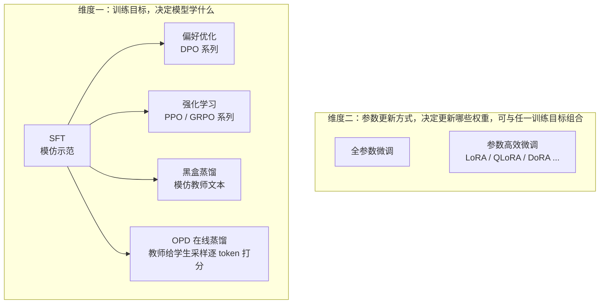
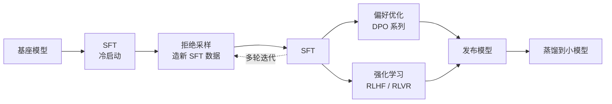

# 后训练（Post-training）总览

> **一句话**：后训练是把预训练得到的「续写器」加工成可用模型的全部步骤。SFT、DPO、PPO/GRPO、黑盒蒸馏、OPD 回答的是**让模型学什么**，LoRA 回答的是**更新哪些参数**——这是两个正交的维度，不是并列的几个阶段。
>
> 前置阅读：[符号约定](/guide/notation)、[基础模型总览](/base-models/)

预训练在海量文本上做 next-token 预测，模型由此获得知识和语言能力，但它不会"停下来回答问题"，也不知道哪种回答更好。后训练负责剩下的事：指令遵循、对话格式、偏好对齐、推理与工具使用、安全边界，以及把能力压缩到更小的模型里。本站的 [SFT](/sft/)、[LoRA](/lora/)、[DPO](/dpo/)、[PPO / GRPO](/rlhf/)、[黑盒蒸馏](/distillation/)、[OPD](/opd/) 六个系列都属于这里，本页负责把它们放到同一张图上。

## 两个正交维度

**维度一：训练目标。** 几类方法的区别在于数据长什么样、监督信号从哪里来：

| 类别 | 数据形式 | 信号来源 | 是否在线采样 | 本站章节 |
| --- | --- | --- | --- | --- |
| SFT | $(x, y)$ 示范对 | 人工或强模型写好的答案 | 否 | [SFT 监督微调](/sft/) |
| 偏好优化 | $(x, y_w, y_l)$ 偏好对，或单条 + 好/坏标签 | 人类或 AI 标注的相对偏好 | 否（离线） | [DPO 系列](/dpo/) |
| 强化学习 | 只需 prompt $x$ | [奖励模型](/rlhf/reward-model)打分，或规则判对错（[RLVR](/reasoning/rlvr)） | 是 | [PPO / GRPO 系列](/rlhf/) |
| 黑盒蒸馏 | 教师生成的 $(x, y)$ | 教师模型的输出文本 | 否 | [黑盒蒸馏系列](/distillation/) |
| OPD 在线蒸馏 | 只需 prompt $x$ | 教师对学生采样的逐 token 对数概率 | 是 | [OPD 系列](/opd/) |

**维度二：参数更新方式。** 全参数微调更新全部权重；[LoRA](/lora/lora) 及其变体冻结基座，只训练低秩增量，显存和 checkpoint 体积都小一个数量级。它不改变训练目标，所以可以和上表任意一行组合：LoRA-SFT、LoRA-DPO、LoRA-GRPO 都是常见配置，主流训练框架（TRL、OpenRLHF、LLaMA-Factory 等）也都支持把 PEFT 接到这些 trainer 上。选型时先按手里的数据和目标决定"学什么"，再按显存预算决定"全参还是 LoRA"。

## 统一视角：它们都在给 $\log\pi_\theta$ 的梯度加权

四类方法看起来差别很大，但 SFT、拒绝采样、DPO、PPO、GRPO 的参数梯度都能写成同一个形式。DeepSeekMath（arXiv:2402.03300）在讨论部分给出了这个统一框架：

$$
\nabla_\theta \mathcal{J} = \mathbb{E}_{(x, y) \sim \mathcal{D}} \left[ \frac{1}{|y|} \sum_{t=1}^{|y|} \mathrm{GC}(x, y, t) \, \nabla_\theta \log \pi_\theta(y_t \mid x, y_{<t}) \right]
$$

其中 $\mathcal{D}$ 是**数据从哪来**，$\mathrm{GC}$（gradient coefficient，梯度系数）是**每个 token 被推高还是压低、推多少**。各方法只是这两个零件不同：

| 方法 | 数据来源 $\mathcal{D}$ | 梯度系数 $\mathrm{GC}$ | 页面 |
| --- | --- | --- | --- |
| SFT | 固定的示范数据 | 恒为 $1$ | [全量微调](/sft/full-finetuning) |
| 拒绝采样微调（RFT） | SFT 模型自己采样，离线过滤 | 答案正确为 $1$，否则 $0$ | [数据构造](/sft/data-construction) |
| DPO | 离线偏好对 $(y_w, y_l)$ | $y_w$ 为正、$y_l$ 为负，大小 $\beta\,\sigma(\hat r_l - \hat r_w)$，其中 $\hat r = \beta\log\frac{\pi_\theta}{\pi_{\text{ref}}}$ | [DPO](/dpo/dpo) |
| PPO | 当前策略在线采样 | token 级 GAE 优势 $A_t$（带裁剪） | [PPO](/rlhf/ppo) |
| GRPO | 当前策略对同一 prompt 在线采样一组 | 组内标准化优势 $\hat A_i$，外加 KL 项 | [GRPO](/rlhf/grpo) |
| OPD（采样 token 形态） | 当前策略在线采样 | 逐 token $\log\pi_{\text{T}}(y_t) - \log\pi_\theta(y_t)$，即单样本 reverse KL 取负 | [OPD 总览](/opd/) |
| 白盒蒸馏 | 学生或教师生成的序列 | 不只作用于采样到的 token：词表上每个位置 $v$ 的系数是教师概率 $p_T(v)$ | [白盒蒸馏](/distillation/white-box) |

从这张表能读出后训练真正的三个旋钮：

1. **数据是离线的还是 on-policy 的**：SFT、DPO 用固定数据集；PPO、GRPO 用当前策略刚采出来的样本。on-policy 让模型在自己会犯的错上学习，代价是要搭采样基础设施，见 [训练循环机制](/rlhf/training-loop)。
2. **系数是否依赖回答质量**：SFT 对所有 token 一视同仁；RFT 用 0/1 过滤；DPO 和 RL 会压低差回答，这也是它们能超出示范数据上限的原因。
3. **质量信号从哪来**：没有信号（SFT）、人类偏好（DPO，或 RM + PPO）、规则可验证（RLVR）、教师模型（黑盒蒸馏、OPD）。OPD 正好是「on-policy 数据 + 教师给的稠密信号」这个组合。

## 典型流水线

实际的后训练很少是"SFT 一次、DPO 一次"的直线，更常见的是多轮迭代：

几个公开配方可以对照着看：

- **InstructGPT**（arXiv:2203.02155）：SFT → 训练奖励模型 → PPO，经典的 RLHF 三阶段。
- **Llama 3**（arXiv:2407.21783）：多轮迭代「奖励模型 → 拒绝采样 → SFT → DPO」，没有使用 PPO。
- **Tülu 3**（arXiv:2411.15124）：SFT → DPO → RLVR，开源了完整数据和训练代码。
- **Qwen3**（arXiv:2505.09388）：旗舰模型走完整的多阶段 RL，小模型改用「off-policy → on-policy」两段蒸馏；8B 上 OPD 用约 1/10 的 GPU 小时超过了 RL，见 [OPD 总览](/opd/)。
- **DeepSeek-R1**（arXiv:2501.12948）：冷启动 SFT → 推理向 RL（GRPO + 规则奖励）→ 拒绝采样产出约 80 万条数据再 SFT → 全场景 RL → 蒸馏出 Qwen/Llama 小模型。

## 按手里的资源选方法

| 你手里有 | 首选 | 说明 |
| --- | --- | --- |
| 只有示范数据 | [SFT](/sft/) | 所有后训练的起点 |
| 成对偏好数据，不想搭 RL | [DPO](/dpo/dpo)，显存紧可选 [SimPO](/dpo/simpo) / [ORPO](/dpo/orpo) | 离线、稳定、便宜 |
| 只有点赞 / 点踩 | [KTO](/dpo/kto) | 不需要成对数据 |
| 答案能被程序判对错（数学、代码、单测） | [GRPO](/rlhf/grpo) 系列 + [RLVR](/reasoning/rlvr) | 推理模型的主流做法 |
| 偏好主观，想在线探索 | [Reward Model](/rlhf/reward-model) + [PPO](/rlhf/ppo) | 效果上限高，工程门槛也高 |
| 更强的教师，只能拿到输出文本 | [黑盒蒸馏](/distillation/black-box) | 复用 SFT 设施，小模型获得强能力的最短路径 |
| 更强的教师，同词表且能跑前向 | [OPD](/opd/)（通常先做一轮黑盒蒸馏冷启动） | on-policy + 稠密监督，算力远低于 RL |
| 多轮工具调用 / 环境交互任务 | [Tool Use 训练](/agent/tool-use) → [Agentic RL](/agent/agentic-rl/) | 奖励来自任务是否完成 |
| 显存不够 | 以上任一方法 + [LoRA](/lora/lora) / [QLoRA](/lora/qlora) | 维度二，和目标选择无关 |

## 本分组的章节

| 章节 | 回答的核心问题 |
| --- | --- |
| [SFT 监督微调](/sft/) | 怎么让基座学会听指令、按格式回答 |
| [LoRA 系列](/lora/) | 怎么用更少显存和参数完成下面任何一种训练 |
| [DPO 系列](/dpo/) | 怎么不训 RM、不跑在线 RL 就对齐偏好 |
| [PPO / GRPO 系列](/rlhf/) | 怎么用奖励信号把能力继续往上推 |
| [黑盒蒸馏系列](/distillation/) | 怎么用教师生成的数据把能力转移到小模型 |
| [OPD 系列](/opd/) | 怎么让教师在学生自己的采样上逐 token 打分来蒸馏 |

以下内容也和后训练密切相关，但因为覆盖范围更广，放在各自的章节里：

- [推理模型](/reasoning/)：[RLVR](/reasoning/rlvr) 和 [PRM/ORM](/reasoning/reward-models) 是后训练，同章的 test-time scaling 与搜索则发生在推理时。
- [Agent](/agent/)：[Tool Use 训练](/agent/tool-use) 与 [Agentic RL](/agent/agentic-rl/) 是面向多轮交互的后训练。
- [Rubric 化评测与训练](/eval/rubrics)：把 rubric 当作 RL 奖励的做法。
- [训练系统 / 分布式](/training-systems/)：预训练和后训练共用的并行与显存优化。

## 参考文献

- Ouyang et al., 2022. *Training Language Models to Follow Instructions with Human Feedback.* arXiv:2203.02155（InstructGPT）
- Shao et al., 2024. *DeepSeekMath: Pushing the Limits of Mathematical Reasoning in Open Language Models.* arXiv:2402.03300（GRPO 与统一梯度视角）
- Llama Team, 2024. *The Llama 3 Herd of Models.* arXiv:2407.21783
- Lambert et al., 2024. *Tülu 3: Pushing Frontiers in Open Language Model Post-Training.* arXiv:2411.15124
- DeepSeek-AI, 2025. *DeepSeek-R1: Incentivizing Reasoning Capability in LLMs via Reinforcement Learning.* arXiv:2501.12948
