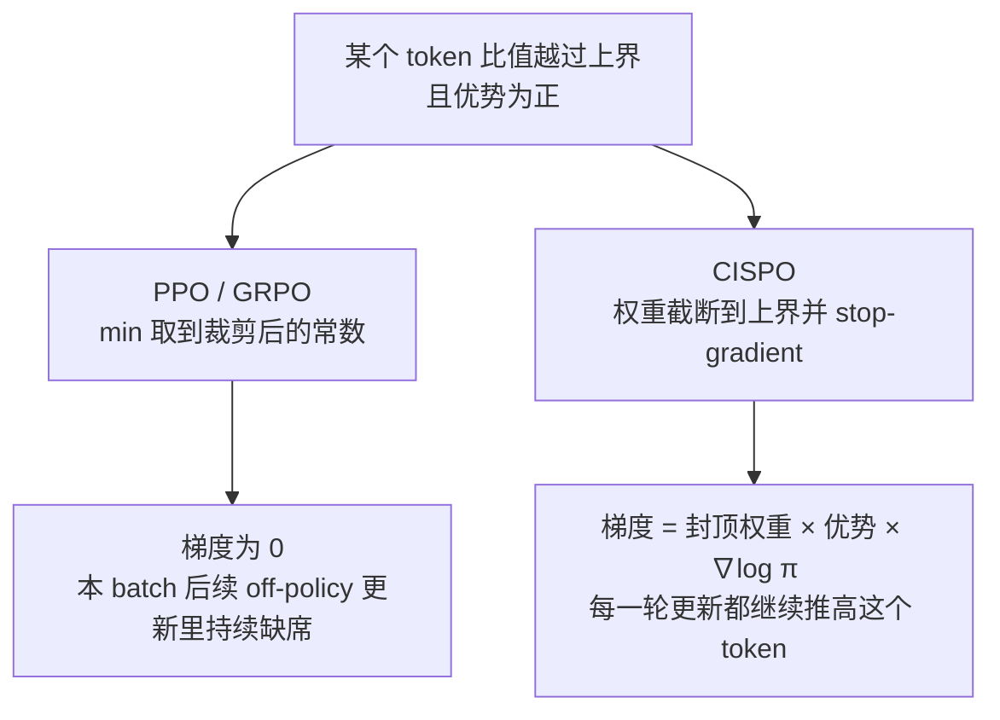

# CISPO（MiniMax）：裁剪重要性采样权重、保留全部 token 梯度的 RL 算法

**📄 [MiniMax-M1: Scaling Test-Time Compute Efficiently with Lightning Attention](https://arxiv.org/abs/2506.13585)**

2025-06 · MiniMax · [代码](https://github.com/MiniMax-AI/MiniMax-M1)

**一句话**：PPO / [GRPO](/rlhf/grpo) 的裁剪会把比值越界的 token 直接踢出梯度，而被踢掉的往往是 "Wait"、"Recheck" 这类低概率的反思分叉词；CISPO 改为**裁剪重要性采样权重本身、并对其 stop-gradient**，让每个 token 始终贡献梯度，只是权重被封顶。它是 MiniMax-M1 的 RL 训练算法。

::: details 📖 论文原文 Abstract（英文）
We introduce MiniMax-M1, the world's first open-weight, large-scale hybrid-attention reasoning model. MiniMax-M1 is powered by a hybrid Mixture-of-Experts (MoE) architecture combined with a lightning attention mechanism. The model is developed based on our previous MiniMax-Text-01 model, which contains a total of 456 billion parameters with 45.9 billion parameters activated per token. The M1 model natively supports a context length of 1 million tokens, 8x the context size of DeepSeek R1. Furthermore, the lightning attention mechanism in MiniMax-M1 enables efficient scaling of test-time compute – For example, compared to DeepSeek R1, M1 consumes 25% of the FLOPs at a generation length of 100K tokens. These properties make M1 particularly suitable for complex tasks that require processing long inputs and thinking extensively. MiniMax-M1 is trained using large-scale reinforcement learning (RL) on diverse problems ranging from traditional mathematical reasoning to sandbox-based, real-world software engineering environments. In addition to the inherent efficiency advantage of lightning attention for RL training, we propose **CISPO**, a novel RL algorithm to further enhance RL efficiency. **CISPO clips importance sampling weights rather than token updates**, outperforming other competitive RL variants. Combining hybrid-attention and CISPO enables MiniMax-M1's full RL training on 512 H800 GPUs to complete in only three weeks, with a rental cost of just \$534,700. We release two versions of MiniMax-M1 models with 40K and 80K thinking budgets respectively, where the 40K model represents an intermediate phase of the 80K training. Experiments on standard benchmarks show that our models are comparable or superior to strong open-weight models such as the original DeepSeek-R1 and Qwen3-235B, with particular strengths in complex software engineering, tool utilization, and long-context tasks. Through efficient scaling of test-time compute, MiniMax-M1 serves as a strong foundation for next-generation language model agents to reason and tackle real-world challenges. We publicly release MiniMax-M1 at https://github.com/MiniMax-AI/MiniMax-M1.
:::

**相关**：[RLHF / 强化学习总览](/rlhf/) · [PPO](/rlhf/ppo) · [GRPO](/rlhf/grpo) · [DAPO](/rlhf/dapo) · [GSPO](/rlhf/gspo) · [REINFORCE++](/rlhf/reinforce-plus-plus) · [MiniMax](/base-models/minimax)


> 图源：MiniMax, *MiniMax-M1: Scaling Test-Time Compute Efficiently with Lightning Attention*（arXiv:2506.13585）Figure 2——基于 Qwen2.5-32B-base 的 GRPO / DAPO / CISPO 受控对比，CISPO 用 50% 的训练步数达到 DAPO 的效果（用于学习注解，版权归原作者）。

## 动机与创新点：PPO/GRPO 的裁剪会把"反思分叉 token"踢出梯度

MiniMax 在混合注意力架构上做 zero-RL（不经 SFT 直接 RL）时发现，GRPO 很难让模型涌现长思维链。经过一系列消融，他们把问题定位到 PPO/GRPO 损失里的**裁剪操作**：

> we found that tokens associated with reflective behaviors (e.g., `However`, `Recheck`, `Wait`, `Aha`), which often serve as "forks" in reasoning paths, were typically rare and assigned low probabilities by our base model. During policy updates, these tokens were likely to exhibit high $r_{i,t}$ values. As a result, these tokens were clipped out after the first on-policy update, preventing them from contributing to subsequent off-policy gradient updates.

这段话的因果链是：

1. **反思词在基座模型里概率很低**。"Wait"、"Recheck" 这类词是推理路径上的分叉点，但基座模型很少说。
2. **低概率 token 的比值最容易冲出上界**。旧概率是分母，分母很小，新策略只要稍微提高一点概率，$r_{i,t}$ 就会远大于 $1+\epsilon$。
3. **越界之后梯度直接归零**。一个生成 batch 会拿来做多轮梯度更新；第一轮更新后这些 token 就越界了，后面几轮 off-policy 更新里它们不再贡献任何梯度。
4. **偏偏这些 token 最重要**。论文引用的工作指出，这些低概率 token 对稳定熵、支撑 RL 扩展都很关键。

[DAPO](/rlhf/dapo) 也注意到了类似问题，办法是把裁剪上界单独调高（clip-higher）。但 MiniMax 发现这招在他们的设置下效果有限：

> Although DAPO attempts to mitigate this issue by increasing the upper clipping bound, we found this approach to be less effective in our setup, which involved 16 rounds of off-policy updates per generation batch.

每个生成 batch 要做 16 轮 off-policy 更新时，上界放宽一点也挡不住比值越积越大，被裁掉的 token 在后面十几轮里依然拿不到梯度。

**关键创新**：

- **裁权重，不裁更新**：不再用 `min(r·A, clip(r)·A)` 让越界 token 的梯度归零，而是把重要性采样权重截断后当作常数系数，梯度始终经过 $\log\pi_\theta$ 流回每个 token。
- **只设上界**：实验里把下界设成很大的值，相当于不设下界，只调上界 $\epsilon^{IS}_{high}$。
- **沿用组内相对优势和 token 级损失**：优势用 GRPO 的组内标准化，损失按整组 token 总数归一化（同 DAPO），同样使用 DAPO 的动态采样和超长惩罚，不加 KL 项。
- **统一形式**：再乘上一个 token 级 mask，就能用同一个式子表示 PPO 式的信赖域裁剪和 CISPO，方便把"哪些 token 在什么条件下丢梯度"当作超参数来调。

## 方法：从 REINFORCE 出发，裁剪权重而不是裁剪更新

### 回顾：PPO/GRPO 的裁剪到底裁掉了什么

PPO 的目标（论文式 1）是

$$
\mathcal{J}_{\text{PPO}}(\theta)=\mathbb{E}_{q\sim\mathcal{D},\,o_i\sim\pi_{\theta_{\text{old}}}(\cdot\mid q)}\left[\frac{1}{|o_i|}\sum_{t=1}^{|o_i|}\min\Big(r_{i,t}(\theta)\hat{A}_{i,t},\ \mathrm{clip}\big(r_{i,t}(\theta),1-\epsilon,1+\epsilon\big)\hat{A}_{i,t}\Big)-\beta D_{KL}(\pi_\theta\|\pi_{\text{ref}})\right]
$$

其中 $r_{i,t}(\theta)=\dfrac{\pi_\theta(o_{i,t}\mid q,o_{i,<t})}{\pi_{\theta_{\text{old}}}(o_{i,t}\mid q,o_{i,<t})}$ 是重要性采样权重。GRPO 去掉 value model，用组内标准化的奖励 $\hat{A}_{i,t}=\dfrac{R_i-\mathrm{mean}(\{R_j\}_{j=1}^G)}{\mathrm{std}(\{R_j\}_{j=1}^G)}$ 作为优势。

关键在 `min` 这一步。以 $\hat{A}>0$ 为例：当 $r_{i,t}>1+\epsilon$ 时，`min` 取到的是 $\mathrm{clip}(r)\hat{A}=(1+\epsilon)\hat{A}$，这是一个**与 $\theta$ 无关的常数**，对它求导为 0。所以 PPO 的裁剪不是"把这个 token 的更新幅度压小"，而是**让这个 token 完全不参与这一步梯度**。

> 举例（数字为示意）："Wait" 在旧策略下的概率是 0.02，第一轮更新后升到 0.05，比值 $r=2.5$。设 $\epsilon=0.2$、优势 $\hat{A}>0$，`min` 取到常数 $1.2\hat{A}$，梯度为 0。在同一个 batch 剩下的十几轮更新里，只要比值还在上界之外，"Wait" 就一直拿不到梯度——而这正是模型最需要多学的词。

### CISPO 目标函数

CISPO 从带分布校正的 REINFORCE 出发（论文式 3）：

$$
\mathcal{J}_{\text{REINFORCE}}(\theta)=\mathbb{E}_{(q,a)\sim\mathcal{D},\,o_i\sim\pi_{\theta_{\text{old}}}(\cdot\mid q)}\left[\frac{1}{|o_i|}\sum_{t=1}^{|o_i|}\mathrm{sg}\big(r_{i,t}(\theta)\big)\hat{A}_{i,t}\log\pi_\theta(o_{i,t}\mid q,o_{i,<t})\right]
$$

$\mathrm{sg}(\cdot)$ 是 stop-gradient。这里重要性权重只是乘在 $\log\pi_\theta$ 前面的系数，梯度只经过 $\log\pi_\theta$。

> Rather than clipping the token updates as in PPO/GRPO, we instead clip the importance sampling weight in Eq. 3 to stabilize training. We term our approach CISPO (**C**lipped **IS**-weight **P**olicy **O**ptimization).

再换上 GRPO 的组内相对优势和 token 级损失，得到 CISPO 的目标（论文式 4、式 5）：

$$
\mathcal{J}_{\text{CISPO}}(\theta)=\mathbb{E}_{(q,a)\sim\mathcal{D},\,\{o_i\}_{i=1}^G\sim\pi_{\theta_{\text{old}}}(\cdot\mid q)}\left[\frac{1}{\sum_{i=1}^G|o_i|}\sum_{i=1}^G\sum_{t=1}^{|o_i|}\mathrm{sg}\big(\hat{r}_{i,t}(\theta)\big)\hat{A}_{i,t}\log\pi_\theta(o_{i,t}\mid q,o_{i,<t})\right]
$$

$$
\hat{r}_{i,t}(\theta)=\mathrm{clip}\Big(r_{i,t}(\theta),\ 1-\epsilon^{IS}_{low},\ 1+\epsilon^{IS}_{high}\Big)
$$

它和 PPO 的区别可以直接从梯度看出来。对单个 token：

| | 比值在界内 | 比值越过上界（$\hat{A}>0$） |
| --- | --- | --- |
| PPO / GRPO | $r\,\hat{A}\,\nabla\log\pi_\theta$ | $0$（token 被踢出本步梯度） |
| CISPO | $r\,\hat{A}\,\nabla\log\pi_\theta$ | $(1+\epsilon^{IS}_{high})\,\hat{A}\,\nabla\log\pi_\theta$（权重封顶，梯度照常） |

（PPO 界内的梯度能写成 $r\hat{A}\nabla\log\pi_\theta$，是因为 $\nabla r=r\nabla\log\pi_\theta$。）界内两者完全相同，差别只在越界的 token：PPO 让它退出，CISPO 让它继续贡献梯度，但系数不再随比值增大。



几个设置细节：

- **不设下界**："we did not impose a lower bound on the IS weight by setting $\epsilon^{IS}_{low}$ to a large value; instead, we only tuned $\epsilon^{IS}_{high}$"。论文没有披露 $\epsilon^{IS}_{high}$ 的具体取值。
- **梯度有偏，但保住了所有 token**：论文承认截断权重会让梯度略有偏差，"this approach preserves gradient contributions from all tokens, especially in long responses"，并称它有助于降低方差、稳定训练。
- **不裁权重就退化成普通策略梯度**："without weight clipping, $\mathcal{J}_{\text{CISPO}}$ reduces to the standard policy gradient objective"。
- **其余沿用 DAPO**：动态采样、超长惩罚都来自 [DAPO](/rlhf/dapo)；和近期一批工作一样不加 KL 惩罚。

### 统一形式：用 token mask 把 PPO 信赖域也装进来

论文进一步给 CISPO 的目标乘上一个 token 级 mask $M_{i,t}$（式 6）：

$$
\mathcal{J}_{\text{unify}}(\theta)=\mathbb{E}\left[\frac{1}{\sum_{i=1}^G|o_i|}\sum_{i=1}^G\sum_{t=1}^{|o_i|}\mathrm{sg}\big(\hat{r}_{i,t}(\theta)\big)\hat{A}_{i,t}\log\pi_\theta(o_{i,t}\mid q,o_{i,<t})\,M_{i,t}\right]
$$

$$
M_{i,t}=\begin{cases}0 & \text{if } \hat{A}_{i,t}>0 \text{ and } r_{i,t}(\theta)>1+\epsilon_{\text{high}},\\ 0 & \text{if } \hat{A}_{i,t}<0 \text{ and } r_{i,t}(\theta)<1-\epsilon_{\text{low}},\\ 1 & \text{otherwise.}\end{cases}
$$

这个 $M_{i,t}$ 正是 PPO 信赖域隐含的 mask："The mask $M_{i,t}$ is equivalent to the mask implicitly defined in the PPO trust region"。于是：

- $M$ 恒为 1：就是 CISPO，所有 token 都贡献梯度；
- $M$ 按式 7 取值：越界 token 的梯度被丢掉，行为回到 PPO 式裁剪；
- 介于两者之间：可以设计别的条件，决定哪些 token 在什么时候丢梯度。

这一步的价值在于把"要不要丢 token"从算法差异变成了一个可调的开关，PPO、GRPO、DAPO 的裁剪都能看成这个框架里 $M$ 和 $\epsilon$ 的不同取法。

### 实现要点

```python
# CISPO 核心：裁剪 IS 权重并 stop-gradient，梯度只走 log π
logp     = policy.logprobs(responses)                 # [B, T]
ratio    = torch.exp(logp - old_logp)                 # 逐 token 重要性采样权重
w        = ratio.clamp(max=1 + eps_high_is).detach()  # 只封上界；detach 即 sg(·)
adv      = group_normalize(rewards)[:, None]          # 同 GRPO：组内标准化，整条序列共享
loss     = -(w * adv * logp * resp_mask).sum() / resp_mask.sum()  # 按整组 token 总数归一化

# 对照：PPO / GRPO 的裁剪（越界 token 梯度为 0）
# pg = torch.min(ratio * adv, ratio.clamp(1 - eps, 1 + eps) * adv)
```

- **`detach` 是关键**：权重必须当常数，否则就又变回了对 $r$ 求导的 PPO 形式。
- **归一化用整组 token 总数**：式 4 的分母是 $\sum_i|o_i|$，长回答里的每个 token 和短回答里的 token 权重相同，这与 DAPO 的 token-level loss 一致。
- **监控**：不再看 PPO 的"被裁 token 比例"，而是看被封顶的 token 比例，以及策略熵是否保持在合理范围。论文强调 CISPO 的设计目标之一是"inherently maintaining entropy within a reasonable range to ensure stable exploration"。
- **多轮 off-policy 更新越多，差别越大**：每个生成 batch 做的梯度步数越多，PPO 式裁剪丢掉的 token 越多，CISPO 的相对优势按理也越明显。这是根据论文动机做的推断，论文只报告了 16 轮这一种设置。

## 实验结果：Qwen2.5-32B 上训练效率约为 DAPO 的 2 倍

### 受控对比设置

为了排除 MiniMax 自家架构的影响，论文在公开模型上做了对照：用 **Qwen2.5-32B-base** 做 zero-RL，训练数据是 DAPO 论文的数学推理数据集，分别跑 GRPO、DAPO 和 CISPO，在 **AIME 2024** 上报告 avg@32。

### Benchmark 表现（以原文为准）

结果见开头的 Figure 2：

| 对比 | 结论 |
| --- | --- |
| 同样训练步数 | CISPO 显著高于 DAPO 和 GRPO |
| 达到 DAPO 最终水平所需步数 | CISPO 约为 DAPO 的 50%，即图中标注的 2x speedup |
| GRPO | 在这个设置下 avg@32 停在 20 出头，明显落后 |

> it matches DAPO's performance with only 50% of the training steps.

> 看榜须知：这是单一底座（Qwen2.5-32B-base）、单一数据集、单一基准（AIME 2024）上的受控对比，论文没有给出多组随机种子或其他任务上的结果；"2 倍"指在该设置下达到同等 AIME 分数所需的训练步数，不等于墙钟时间或任意任务上的加速比。

### 在 MiniMax-M1 全量 RL 中的表现

CISPO 是 MiniMax-M1 整个 RL 阶段使用的算法。训练采用课程式混合：先只用规则可验证的推理任务（数学、逻辑、竞赛编程、软件工程），再逐步混入需要奖励模型打分的通用任务。结合混合注意力的低生成成本，M1 的完整 RL 在 **512 张 H800 上用三周完成，租用成本约 53.47 万美元**。


> 图源：MiniMax, *MiniMax-M1: Scaling Test-Time Compute Efficiently with Lightning Attention*（arXiv:2506.13585）Figure 4——MiniMax-M1 的准确率与生成长度随 RL 训练步数的变化（用于学习注解，版权归原作者）。

论文观察到准确率和回答长度在训练中同步增长：AIME 和 LiveCodeBench 上的平均回答长度超过 20,000 token，AIME 2024 准确率从 68% 升到 80%。

### 配套的 RL 稳定性修复

M1 的 RL 能跑通，还依赖几项与 CISPO 无关、但同样值得借鉴的工程修复：

- **训练/推理精度不一致**：同一个 token 在训练引擎和推理引擎里算出的概率明显对不上，导致奖励不涨。逐层排查后发现问题出在 LM head 的大幅值激活上，把 LM head 改成 FP32 后，两边概率的相关系数从约 0.9x 提升到 0.99x（见下图）。这类问题在较小的 dense softmax 注意力模型上没有出现。
- **AdamW 超参敏感**：M1 训练中梯度幅度横跨 1e-18 到 1e-5，大部分小于 1e-14，相邻步梯度相关性很弱。用 VeRL 的默认配置（betas = (0.9, 0.999)、eps = 1e-8）会不收敛，最终改为 $\beta_1=0.9$、$\beta_2=0.95$、eps = 1e-15。
- **重复检测提前截断**：复杂 prompt 会诱发病态的超长重复输出。模型进入重复循环后每个 token 的概率都会飙高，于是规定：连续 3,000 个 token 的概率都高于 0.99 就停止生成。这既防止了训练不稳，也提高了生成吞吐。


> 图源：MiniMax, *MiniMax-M1: Scaling Test-Time Compute Efficiently with Lightning Attention*（arXiv:2506.13585）Figure 3——训练模式与推理模式 token 概率的相关性，左为修复前、右为 LM head 改用 FP32 精度后（用于学习注解，版权归原作者）。

## 在 PPO / GRPO 谱系里的位置

| 维度 | [PPO](/rlhf/ppo) / [GRPO](/rlhf/grpo) | [DAPO](/rlhf/dapo) | [GSPO](/rlhf/gspo) | CISPO |
| --- | --- | --- | --- | --- |
| 重要性比值单元 | token | token | 序列（长度归一化） | token |
| 裁剪作用在 | token 更新（越界即梯度归零） | 同左，但上界单独放宽（clip-higher） | 整条序列（越界整条丢弃） | **IS 权重本身**（封顶后当常数） |
| 越界 token 是否还有梯度 | 否 | 否（只是更少越界） | 否（整条序列一起丢） | **是** |
| 损失归一化 | 序列内平均 | 整组 token 总数 | 序列级 | 整组 token 总数 |
| 代表使用方 | InstructGPT / DeepSeek-R1 | 大规模长思维链 RL | Qwen3 | MiniMax-M1 |

- **vs [GRPO](/rlhf/grpo)**：CISPO 保留了 GRPO 的组内相对优势，只改了一件事：越界 token 不再被丢弃。GRPO 的问题不是裁剪太紧或太松，而是"越界即退出"这个机制本身会系统性地排除低概率关键词。
- **vs [DAPO](/rlhf/dapo)**：CISPO 几乎是在 DAPO 的基础上改的，动态采样、超长惩罚、token-level loss 都照搬。唯一的区别在裁剪：DAPO 把上界调高，让更少 token 越界；CISPO 直接取消"越界即丢梯度"。在每批 16 轮 off-policy 更新的设置下，后者更有效。
- **vs [GSPO](/rlhf/gspo)**：两者都在处理 token 级比值带来的问题，但方向相反。GSPO 认为 token 级比值噪声太大，干脆升到序列级，一条序列要么整体保留要么整体丢弃；CISPO 保留 token 粒度，只保证每个 token 都不被丢弃。GSPO 更侧重稳定性（尤其是 MoE），CISPO 更侧重样本利用率和低概率 token 的学习。
- **vs [REINFORCE++](/rlhf/reinforce-plus-plus) 和 IMPALA 的 V-trace**：CISPO 从 REINFORCE 出发，本质上是"截断重要性权重的 off-policy REINFORCE"，思路上和 V-trace 截断重要性权重来控制方差一脉相承。区别是 CISPO 用组内相对优势，并把截断和 PPO 的信赖域 mask 放进了同一个框架。
- **边界与代价**：去掉"越界即丢弃"也就去掉了 PPO 信赖域对单步更新幅度的硬约束，稳定性改由权重上界和熵来兜底，梯度也因截断而略有偏差。论文只在 Qwen2.5-32B 数学 zero-RL 和 M1 自身训练上验证过，在更短回答、更少 off-policy 轮数或非推理任务上的收益还缺少公开证据；需要 PPO 式约束时，可以通过统一形式里的 mask 把它加回来。
