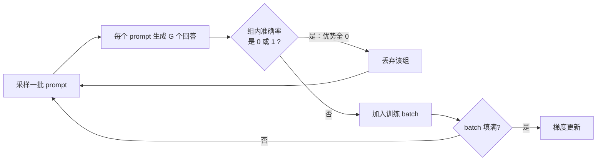

# DAPO（ByteDance Seed & 清华 AIR）：把 GRPO 做对的四处外科手术，开源复现 R1 级推理 RL

**📄 [DAPO: An Open-Source LLM Reinforcement Learning System at Scale](https://arxiv.org/abs/2503.14476)**

2025-03 · ByteDance Seed & 清华大学 AIR & 港大 · [代码](https://github.com/volcengine/verl)

**一句话**：对 [GRPO](/rlhf/grpo) 做四处外科手术——抬高裁剪上界、过滤零梯度样本组、token 级损失归一化、超长样本奖励塑形——并把算法、训练代码与数据集一并开源，成为社区第一个能稳定复现并超越 R1 级别长链推理 RL 的"全开源系统论文"。

::: details 📖 论文原文 Abstract（英文）
Inference scaling empowers LLMs with unprecedented reasoning ability, with reinforcement learning as the core technique to elicit complex reasoning. However, key technical details of state-of-the-art reasoning LLMs are concealed (such as in OpenAI o1 blog and DeepSeek R1 technical report), thus the community still struggles to reproduce their RL training results. We propose the **D**ecoupled Clip and **D**ynamic s**A**mpling **P**olicy **O**ptimization (**DAPO**) algorithm, and fully open-source a state-of-the-art large-scale RL system that achieves 50 points on AIME 2024 using Qwen2.5-32B base model. Unlike previous works that withhold training details, we introduce four key techniques of our algorithm that make large-scale LLM RL a success. In addition, we open-source our training code, which is built on the **verl** framework, along with a carefully curated and processed dataset. These components of our open-source system enhance reproducibility and support future research in large-scale LLM RL.
:::

**相关**：[RLHF 总览](/rlhf/) · [PPO](/rlhf/ppo) · [GRPO](/rlhf/grpo) · [GSPO](/rlhf/gspo) · [REINFORCE++](/rlhf/reinforce-plus-plus) · [训练循环机制](/rlhf/training-loop) · [Agentic RL](/agent/agentic-rl/)


> 图源：Yu et al., *DAPO: An Open-Source LLM Reinforcement Learning System at Scale*（arXiv:2503.14476）Figure 1——DAPO 以 50% 训练步数超越前 SoTA（用于学习注解，版权归原作者）。

## 动机与创新点：R1 能复现，但"朴素 GRPO"复现不出来

DeepSeek-R1 证明了大规模 RL 能让 base 模型涌现 self-verification、iterative refinement 这类长链推理行为，但论文的原话是——驱动这场变革的"the actual algorithm and key recipe for scalable RL training remains a myth, hidden from technical reports of existing reasoning models"。社区拿着公开的朴素 [GRPO](/rlhf/grpo) 去复现，普遍碰壁。DAPO 团队在 [Qwen2.5-32B](/base-models/qwen) base 模型上实测：直接跑 GRPO，AIME 2024 只有约 **30 分**，远低于 DeepSeek 用 R1 配方拿到的 47 分。作者把卡点拆成三类系统性病灶，正是论文要逐一开刀的对象：

1. **熵坍缩（entropy collapse）**：策略熵随训练快速下降、采样趋同、探索停止。根因之一是 PPO/GRPO 对称裁剪的上界 $1+\epsilon$ 对低概率 token 抑制过强——论文给的例子：$\epsilon=0.2$ 时，$\pi_{\theta_{\text{old}}}=0.01$ 的 token 概率最多升到 0.012，而 $\pi_{\theta_{\text{old}}}=0.9$ 的能升到 1.08。"富者愈富"，承担探索功能的低概率 token 永远长不起来。
2. **有效梯度消失**：训练推进后，越来越多 prompt 的 $G$ 个采样全对或全错，组内优势全为 0、零梯度，每个 batch 里真正贡献梯度的样本数持续缩水，梯度噪声变大、采样效率下降。
3. **长度相关的病理**：GRPO 的 sample-level loss 先在样本内部对 token 取平均，长回复里单个 token 的权重被稀释，超长低质样本（重复、乱码）惩罚不足；同时超长被截断的样本被一刀切判负，把"推理合理只是没写完"也罚了，引入奖励噪声。

DAPO 的主张不是发明新范式，而是把 GRPO"做对"：四项技术各治一个病灶，叠加后用 Qwen2.5-32B 在 AIME 2024 达到 **50 分**，超过 DeepSeek-R1-Zero-Qwen-32B 的 47 分，且训练步数减少约 50%。它真正的另一半价值在"系统全开源"——基于 [verl](https://github.com/volcengine/verl) 的训练代码、连同 DAPO-Math-17K 数据集（17K 道数学题，答案统一转成整数便于规则判分）一并放出，让"工业级、大规模、可复现"不再是黑箱。

**关键创新**：

- **Clip-Higher（解耦裁剪）**：把对称裁剪区间 $[1-\epsilon,\,1+\epsilon]$ 解耦成 $[1-\epsilon_{\text{low}},\,1+\epsilon_{\text{high}}]$，只抬高上界、给低概率探索 token 松绑，直接治熵坍缩。
- **Dynamic Sampling（动态采样）**：过采样并过滤掉组内准确率为 0 或 1 的 prompt，持续补满到 batch 全是"有梯度"的样本，稳住有效梯度数。
- **Token-Level Policy Gradient Loss**：把归一化从"按样本"改成"按总 token 数"，让长回复里的优质/劣质模式都被足额奖惩，抑制长 CoT 训练中熵与长度的不健康增长。
- **Overlong Reward Shaping**：对超长截断样本做 mask + 软长度惩罚，把"没写完"从奖励噪声里摘出去。
- **去 KL + 规则奖励 + 全系统开源**：长 CoT 训练本就要远离初始分布，故删掉 KL 项；用可验证的规则判分替代 [Reward Model](/rlhf/reward-model) 从源头防 reward hacking；算法/代码/数据集全开源。

## 方法：在 GRPO 骨架上改三处、去一项，再加奖励塑形

DAPO 的目标函数在 GRPO 骨架上改三处（解耦裁剪、动态采样约束、token 级归一化），并**去掉 KL 项**：

$$
\mathcal{J}_{\text{DAPO}}(\theta) = \mathbb{E}_{(q,a)\sim\mathcal{D},\ \{o_i\}_{i=1}^{G}\sim\pi_{\theta_{\text{old}}}(\cdot|q)} \left[ \frac{1}{\sum_{i=1}^{G}|o_i|} \sum_{i=1}^{G}\sum_{t=1}^{|o_i|} \min\Big( r_{i,t}(\theta)\hat{A}_{i,t},\ \mathrm{clip}\big(r_{i,t}(\theta),\ 1-\epsilon_{\text{low}},\ 1+\epsilon_{\text{high}}\big)\hat{A}_{i,t} \Big) \right]
$$

$$
\text{s.t.}\quad 0 < \big|\{\, o_i \mid \texttt{is\_equivalent}(a, o_i) \,\}\big| < G
$$

其中重要性比 $r_{i,t}(\theta) = \frac{\pi_\theta(o_{i,t}\mid q, o_{i,<t})}{\pi_{\theta_{\text{old}}}(o_{i,t}\mid q, o_{i,<t})}$，优势沿用 GRPO 的组内标准化 $\hat{A}_{i,t} = \frac{R_i - \mathrm{mean}(\{R_j\}_{j=1}^G)}{\mathrm{std}(\{R_j\}_{j=1}^G)}$（序列级广播到每个 token）。对照 [GRPO](/rlhf/grpo) 原式 $\mathcal{J}_{\text{GRPO}}$，差异恰好是下面四把刀。

### Clip-Higher（解耦裁剪）：给低概率探索 token 松绑

熵坍缩的机理，论文讲得很具体——PPO-Clip 的上界本是用来"约束 trust region、增强 RL 稳定性"的，但它对高低概率 token 不公平：

> "the upper clip can restrict the exploration of the policy, where making an 'exploitation' token ... more probable is much easier yet the probability of an unlikely 'exploration' token is too tightly bounded to be uplifted."

也就是说，已经高概率（如 0.9）的 exploitation token，上界 $\pi_{\theta_{\text{old}}}(1+\epsilon)$ 给的抬升空间绰绰有余；而低概率（如 0.01）的 exploration token，被同一个 $\epsilon$ 死死按住，"非平凡地提升其概率反而困难得多"。作者还实测到 up-clipped token 的平均概率本身就 $<0.2$（Figure 3a），印证上界确实在掐探索。解法是把上下界解耦、**只抬上界**：

$$
\mathrm{clip}\big(r_{i,t}(\theta),\ 1-\epsilon_{\text{low}},\ 1+\epsilon_{\text{high}}\big),\qquad \epsilon_{\text{low}}=0.2,\ \epsilon_{\text{high}}=0.28
$$

下界 $\epsilon_{\text{low}}$ 保持不动——论文明说"increasing it will suppress the probability of these tokens to 0, resulting in the collapse of the sampling space"，把某些 token 概率过猛压向 0 会塌掉采样空间。

> 举例：一个 $\pi_{\theta_{\text{old}}}=0.01$ 的探索 token，对称裁剪下封顶 0.012；把上界从 0.2 抬到 0.28 后，单步能升到约 0.0128，看似细微，但在成千上万步里累积，足以让"另辟蹊径"的 token 真正长出来。

效果见 Figure 2：开了 Clip-Higher 后，生成熵稳定维持在 0.4 上下（而非塌到 0），AIME 准确率随之更高、更稳。


> 图源：Yu et al., *DAPO: An Open-Source LLM Reinforcement Learning System at Scale*（arXiv:2503.14476）Figure 2——Clip-Higher 前后 AIME 准确率与 actor 熵对比（用于学习注解，版权归原作者）。

实践上 $\epsilon_{\text{high}}$ 别贪：0.28 是论文值，继续抬高会放大 off-policy 噪声、熵不降反爆。监控指标首选策略熵——健康曲线是缓慢下降或平台，不是断崖、也不是飙升。

### Dynamic Sampling（动态采样）：把零梯度的组从 batch 里挤出去

这对应目标函数里的约束 $0 < |\{o_i \mid \texttt{is\_equivalent}(a, o_i)\}| < G$。问题源头：GRPO 的优势是组内标准化的，若某 prompt 的 $G$ 个采样**全对**（或全错），组内奖励相同、$\hat{A}_{i,t}\equiv 0$，"A zero advantage results in zero policy gradients"。论文观察到随训练推进，"accuracy=1 的样本比例持续上升"（Figure 3b），于是每个 batch 真正有效的 prompt 越来越少，"larger variance in gradient and dampens the gradient signals"。

解法是 **over-sample and filter**：过采样后丢弃准确率为 0 或 1 的组，持续补采，直到 batch 被"准确率既非 0 也非 1"的样本填满。采样成本变成动态的，但论文指出总收敛时间并未显著变差——因为有效梯度变密、所需训练步数反而更少（见后文 Figure 6 与消融）。



### Token-Level Policy Gradient Loss：把权重还给每个 token

GRPO 在 **sample-level** 算 loss——"first averaging the losses by token within each sample and then aggregating the losses across samples"，即 $\frac{1}{G}\sum_i \frac{1}{|o_i|}\sum_t(\cdot)$，每个**样本**等权。在长 CoT 场景这会出两类毛病：长回复里的 token 被先做了一次内部平均，对总 loss 的贡献被稀释，于是 (1) 高质量长样本里的 reasoning 模式学不充分；(2) 低质量长样本里的 gibberish / 重复罚不够。后果是熵与回复长度一起不健康地往上飙。

DAPO 改成 **token-level** 归一化 $\frac{1}{\sum_i |o_i|}\sum_i\sum_t(\cdot)$，每个**token**等权：

> "longer sequences can have more influence on the overall gradient update ... if a particular generation pattern can lead to an increase or decrease in reward, it will be equally prompted or suppressed, regardless of the length of the response in which it appears."

> 举例：一段 4000 token 的回复里混进一串重复废话，sample-level 下这串废话被平摊到极小权重、几乎罚不到；token-level 下它按真实 token 数计入梯度，足额被压制。反之，长回复里一段精彩的关键推理，也能按其 token 数拿到足额奖励。

Figure 4 显示：用 token-level loss 后，生成熵与平均回复长度都增长得更平缓、更健康，而非像 sample-level 那样在 4000 步后熵冲到 3.0+、长度冲到 4000+。


> 图源：Yu et al., *DAPO: An Open-Source LLM Reinforcement Learning System at Scale*（arXiv:2503.14476）Figure 4——token-level vs sample-level loss 下的熵与回复长度（用于学习注解，版权归原作者）。

分布式实现里要当心：token-level 的归一化分母是**全组（或全 batch）总 token 数**，要跨 GPU 求和后再除，否则各卡权重不一致。

### Overlong Reward Shaping：别为"没写完"乱罚

RL 训练给生成设了最大长度，超长就截断。论文发现"improper reward shaping for truncated samples can introduce reward noise"——默认把截断样本直接判负，会把"a sound reasoning process ... penalized solely due to its excessive length"，反而让模型对自己推理过程的有效性产生困惑。两个互补策略：

- **Overlong Filtering**：对**仅因超长被截断**的样本直接 mask 掉 loss，不让"没写完"污染奖励信号。论文消融显示这一步就能显著稳住训练（Figure 5：关闭它，约 3500 步后熵会突然爆炸）。
- **Soft Overlong Punishment**：在正确性奖励之外，叠加一个分段的、长度感知的软惩罚——

$$
R_{\text{length}}(y)=
\begin{cases}
0, & |y| \le L_{\max}-L_{\text{cache}} \\[4pt]
\dfrac{(L_{\max}-L_{\text{cache}})-|y|}{L_{\text{cache}}}, & L_{\max}-L_{\text{cache}} < |y| \le L_{\max} \\[8pt]
-1, & |y| > L_{\max}
\end{cases}
$$

在最后 $L_{\text{cache}}$ 个 token 的缓冲区内，惩罚从 0 线性滑到 $-1$（实验取 $L_{\max}=16384$、$L_{\text{cache}}=4096$，最大生成长度 20480）。

> 举例：缓冲区起点是 12288 token，到 16384 之间越写越长、扣分从 0 平滑滑到 $-1$；真超过 16384 才吃满 $-1$。这样"刚踩线"的回复被温和提醒、而不是被一刀切判死。


> 图源：Yu et al., *DAPO: An Open-Source LLM Reinforcement Learning System at Scale*（arXiv:2503.14476）Figure 5——overlong 奖励塑形前后 AIME 准确率与 actor 熵（用于学习注解，版权归原作者）。

注意两者作用位置不同：**长度惩罚作用在 reward 上**（参与组内标准化之前），**截断 mask 作用在 loss 上**，实现时别搞混。

### 两个去繁就简的决策：去掉 KL、改用规则奖励

- **去掉 KL 正则**：KL 惩罚原是 RLHF 里"对齐但别偏离初始模型太远"的护栏；但训练长 CoT 推理模型时，"the model distribution can diverge significantly from the initial model, thus this restriction is not necessary"。去掉它既省一份 $\pi_{\text{ref}}$ 前向，也不再人为拽住策略不让它探索。
- **规则奖励（rule-based reward）**：直接用可验证任务的最终正确性当 outcome reward，$R(\hat{y},y)=1$ 若 $\hat{y}$ 与标准答案等价、否则 $-1$。不引入 [Reward Model](/rlhf/reward-model)，"from the source"规避 reward hacking。这也是 DAPO-Math-17K 把答案统一转成整数的原因——让规则解析近乎无噪。

### 实现骨架（基于 verl）

```python
# DAPO 单步训练骨架（对应 Algorithm 1 的逻辑）
batch = []
while len(batch) < target_size:                    # Dynamic Sampling
    for q, answer in sample_prompts():
        os_ = policy.generate(q, n=G)
        acc = [is_equivalent(answer, o) for o in os_]   # 规则奖励：对/错
        if 0 < sum(acc) < G:                       # 过滤零梯度组
            r = [a + soft_len_penalty(o) for a, o in zip(acc, os_)]
            batch.append((q, os_, r))

adv  = group_normalize(rewards)                    # (R - mean) / std，组内
mask = not_truncated(os_)                          # Overlong Filtering
loss = -(min(rho * adv,
             clip(rho, 1 - eps_low, 1 + eps_high) * adv)
         * mask).sum() / mask.sum()                # token-level 归一化（全 batch 总 token）
```

## 实验结果：Qwen2.5-32B base 从 30 分堆到 50 分

### 训练设置（以原文为准）

底座 Qwen2.5-32B base，框架 verl，baseline 为朴素 GRPO。优化器 AdamW，恒定学习率 $1\times10^{-6}$、前 20 个 rollout step 线性 warmup；rollout 时 prompt batch 512、每 prompt 采 16 个回答，训练 mini-batch 512（即每个 rollout step 做 16 次梯度更新）。Clip-Higher 取 $\epsilon_{\text{low}}=0.2,\ \epsilon_{\text{high}}=0.28$；Overlong 取 $L_{\max}=16384$、$L_{\text{cache}}=4096$、最大生成 20480。评测在 AIME 2024 上重复 32 次取 **avg@32**（温度 1.0、top-p 0.7）以稳住方差。

### 消融：四项技术逐项叠加（Table 1）

论文从朴素 GRPO 出发，按顺序叠加四项技术，AIME 2024 avg@32 一路从 30 抬到 50：

| 配置 | AIME 2024 avg@32 |
| --- | --- |
| DeepSeek-R1-Zero-Qwen-32B（参照） | 47 |
| Naive GRPO（朴素实现） | 30 |
| + Overlong Filtering | 36 |
| + Clip-Higher | 38 |
| + Soft Overlong Punishment | 41 |
| + Token-Level Loss | 42 |
| + Dynamic Sampling（即完整 **DAPO**） | **50** |

- 每项都有正贡献，没有"靠某一招通吃"；其中 Overlong Filtering 与 Clip-Higher 起步增益最直观，Dynamic Sampling 把最后 8 分补齐、越过 R1 的 47 分。
- Dynamic Sampling 虽然要多采数据，但论文实测**总收敛时间不增反降**（Figure 6），因为有效梯度更密、所需步数更少。
- Token-Level Loss 单看分数增益小（41→42），但作者强调它的价值在**训练稳定性**与让长度增长更健康，而非直接刷分。
- 训练动态（回复长度、reward、熵、平均概率）是关键监控量：作者特意指出，最终训练集 reward 常与验证集准确率相关性不高（过拟合训练集），所以要拿"长度 + 验证准确率"联合判断实验是否在恶化。

> 看榜须知：这些是单一底座（Qwen2.5-32B base）、单一任务（数学/AIME）、特定 test-time 设置（avg@32、温度 1.0）下的数字，口径与其它工作不一定可比；跨系统直接比绝对值意义有限，当作"同一配方逐项消融的相对增益"来读最稳妥。

## 在推理 RL 谱系里的位置

DAPO 不是另起炉灶的新范式，而是把 [GRPO](/rlhf/grpo) 在长 CoT 大规模场景下"做对"的工程化集大成，逐项与 baseline 对照如下：

| 维度 | GRPO | DAPO |
| --- | --- | --- |
| 裁剪区间 | 对称 $1\pm\epsilon$（0.2） | 解耦：$\epsilon_{\text{low}}=0.2$、$\epsilon_{\text{high}}=0.28$ |
| 采样组的使用 | 全部入 batch（全对/全错组贡献零梯度） | 过滤准确率 0/1 的组、过采样补满 |
| loss 归一化 | sample-level（样本内先平均） | token-level（按总 token 数归一） |
| KL 项 | 有（$\beta\,\mathbb{D}_{\text{KL}}$） | 无 |
| 截断样本 | 一刀切判负 | mask loss + 软长度惩罚 |
| AIME 2024（Qwen2.5-32B） | 约 30 分（朴素实现） | 50 分，且步数比 R1 方案少约 50% |

- **vs [GSPO](/rlhf/gspo)**：DAPO 仍在 **token 级**做重要性比与裁剪，靠 Clip-Higher 缓解探索受抑；GSPO 则认为长序列下 token 级重要性比方差过大，干脆把比值与裁剪上移到**序列级**。两者诊断同一痛点（off-policy 比值在长 CoT 下不稳），开的是不同方向的刀，可对照阅读。
- **vs [REINFORCE++](/rlhf/reinforce-plus-plus) / [RLOO](/rlhf/rloo)**：都在"去 critic、用组/批基线估优势"这条线上，与 DAPO 的组内标准化优势同源；DAPO 的 Clip-Higher、动态过滤、token 级归一化大多与具体优势估计正交，可叠加到这些框架上。
- **作为默认工具箱**：Clip-Higher、动态过滤零梯度组、token 级归一化、超长奖励塑形如今已是推理 RL（含 [Agentic RL](/agent/agentic-rl/)）训练的常备组件，常被后续工作直接复用或微调。配 [训练循环机制](/rlhf/training-loop) 一节看"采样→打分→过滤→更新"的整体回路更清楚。
- **去 KL 的前提**：DAPO 敢去 KL，是因为有**规则可验证奖励**兜底防 hacking。若你的奖励来自 [Reward Model](/rlhf/reward-model)，去 KL 前要三思——参考 [RLHF 总览](/rlhf/) 的优化目标权衡。
