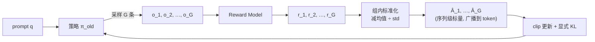
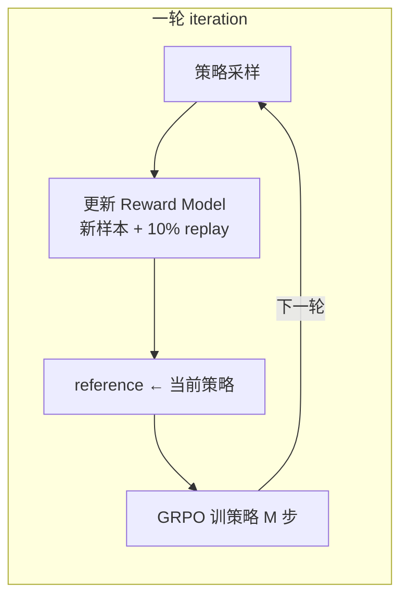

# GRPO（DeepSeek）：去掉 critic，用组内相对优势把推理 RL 砍到三模型

**📄 [DeepSeekMath: Pushing the Limits of Mathematical Reasoning in Open Language Models](https://arxiv.org/abs/2402.03300)**

2024-04 · DeepSeek-AI · 清华 · 北大 · [代码](https://github.com/deepseek-ai/DeepSeek-Math)

**一句话**：把 PPO 里那个和策略同规模的 value（critic）模型整个删掉——对同一道题采样一组回答，用**组内 reward 的标准化值**直接当优势估计；省一个模型、省一半显存，后来被 DeepSeek-R1 发扬成推理 RL 的事实标准算法。

::: details 📖 论文原文 Abstract（英文）
Mathematical reasoning poses a significant challenge for language models due to its complex and structured nature. In this paper, we introduce DeepSeekMath 7B, which continues pre-training DeepSeek-Coder-Base-v1.5 7B with 120B math-related tokens sourced from Common Crawl, together with natural language and code data. DeepSeekMath 7B has achieved an impressive score of 51.7% on the competition-level MATH benchmark without relying on external toolkits and voting techniques, approaching the performance level of Gemini-Ultra and GPT-4. Self-consistency over 64 samples from DeepSeekMath 7B achieves 60.9% on MATH. The mathematical reasoning capability of DeepSeekMath is attributed to two key factors: First, we harness the significant potential of publicly available web data through a meticulously engineered data selection pipeline. Second, we introduce **Group Relative Policy Optimization (GRPO)**, a variant of Proximal Policy Optimization (PPO), that enhances mathematical reasoning abilities while concurrently optimizing the memory usage of PPO.
:::

**相关**：[PPO](/rlhf/ppo) · [RLHF 总览](/rlhf/) · [Reward Model](/rlhf/reward-model) · [DAPO](/rlhf/dapo) · [GSPO](/rlhf/gspo) · [REINFORCE++](/rlhf/reinforce-plus-plus) · [RLOO](/rlhf/rloo)


> 图源：Shao et al., *DeepSeekMath: Pushing the Limits of Mathematical Reasoning in Open Language Models*（arXiv:2402.03300）Figure 1——开源模型 MATH Top1 准确率随时间的演进（用于学习注解，版权归原作者）。

## 动机与创新点：critic 太贵，把它换成"组内相对"的免费 baseline

[PPO](/rlhf/ppo) 的最大负担是 critic（value 模型）：它和策略**同规模**，既占显存又难训。论文把这点说得很直白——

> "As the value function employed in PPO is typically another model of comparable size as the policy model, it brings a substantial memory and computational burden."

更关键的是任务结构本身：在 LLM 的 RLHF 里，奖励通常**只在序列末端给一个标量**（"usually only the last token is assigned a reward score by the reward model"），却要 critic 去逐 token 估出准确的 value——这是个高方差、回报稀疏的难题，估出来的优势往往很粗糙。

GRPO 的洞察是：critic 存在的唯一目的，是给优势估计提供一个 baseline（"这个回答相对平均水平好多少"）。既然如此，**为什么不直接对同一个 prompt 多采样几条回答，用这组回答 reward 的均值当 baseline？** 同组样本面对完全相同的 prompt，天然可比，组均值就是一个**无需学习、无偏**的基线。论文还指出，这种"组内相对"的打分方式恰好和奖励模型的训练口径对齐——RM 本就是在"同一问题下成对输出的比较"上训练的（"reward models are typically trained on datasets of comparisons between outputs on the same question"），用相对值做优势比用绝对值更自洽。这样 value 模型可以彻底删掉，同时驻留的模型从 4 个降到 3 个。

**关键创新**：

- **组内相对优势替代 critic**：对每个 prompt 采样一组 $G$ 条回答，用组内 reward 的标准化值当优势，**删掉 value 模型**——这是 GRPO 名字里 "Group Relative" 的由来，也是省显存的核心。
- **KL 改为显式 loss 正则**：不再像 PPO 那样把 KL 惩罚塞进 per-token reward，而是直接把 $\mathbb{D}_{\text{KL}}[\pi_\theta\|\pi_{\text{ref}}]$ 加到损失里，"avoiding complicating the calculation of $\hat{A}_{i,t}$"，并配一个低方差、恒非负的 **k3 无偏 KL 估计器**。
- **Outcome / Process 两种监督**：既支持只在末端给奖励的结果监督，也支持给每个推理步打分的过程监督——后者把分步奖励的"未来累加"赋给对应 token。
- **Iterative GRPO**：让奖励模型随策略一起迭代（replay 机制 + 10% 历史数据），缓解 RM 在训练后期跟不上策略分布的问题。
- **统一范式视角**：论文顺手把 SFT / RFT / DPO / PPO / GRPO 收进**同一个梯度公式**，只差"数据源 / 奖励函数 / 梯度系数"三个组件——为后续算法迭代提供了一张坐标系（见谱系节）。

## 方法：组采样 → 组内标准化优势 → clip 更新 + 显式 KL

### 从 PPO 的负担说起：value 模型 = 同规模的拖累

PPO 在每个 token 上用奖励模型 $r_\varphi$ 和一个学习到的 value 函数 $V_\psi$ 算优势，并为防止 reward over-optimization，标准做法是把 reference 模型的**per-token KL 惩罚**塞进奖励里（Ouyang et al., 2022）：

$$r_t = r_\varphi(q, o_{\le t}) - \beta\,\log\frac{\pi_\theta(o_t|q,o_{<t})}{\pi_{\text{ref}}(o_t|q,o_{<t})}$$

于是 PPO 训练时要**同时驻留 4 个模型**：策略、reference、reward、value。GRPO 把其中最贵的 value 模型直接拿掉，用组内采样的奖励均值充当 baseline：


> 图源：Shao et al., *DeepSeekMath*（arXiv:2402.03300）Figure 4——PPO 与 GRPO 流程对比，GRPO 去掉 value 模型、改用组内分数估计 baseline，"significantly reducing training resources"（用于学习注解，版权归原作者）。



### 组内标准化优势：组均值就是天然 baseline

对每个 prompt $q$ 从旧策略 $\pi_{\theta_{\text{old}}}$ 采样 $G$ 个回答 $\{o_1,\dots,o_G\}$，各自由 [RM](/rlhf/reward-model)（或规则可验证奖励）打分得到 $\mathbf{r}=\{r_1,\dots,r_G\}$。**结果监督（Outcome Supervision）**下，把整条回答内所有 token 的优势都设成同一个组内标准化分数：

$$\hat{A}_{i,t} = \tilde{r}_i = \frac{r_i - \mathrm{mean}(\mathbf{r})}{\mathrm{std}(\mathbf{r})}$$

这是一个**序列级标量**——同一回答 $o_i$ 内每个 token 共享同一个 $\hat{A}_{i,t}$（把序列级优势广播到每个 token）。减均值给出"比同组平均好/差多少"，除以 std 把不同难度题目的 reward 尺度拉平。

> 举例：一道题采 $G=8$ 条回答，规则奖励是"答对=1、答错=0"，其中 3 条对、5 条错。组均值 $=0.375$、std$\approx0.48$。3 条正确回答优势 $\approx +1.3$（被鼓励），5 条错误回答优势 $\approx -0.78$（被压低）——完全不需要 value 模型，组内一比即得。

### 目标函数：PPO 式 clip + 显式 KL 正则（k3 估计器）

GRPO 沿用 PPO 的 clip 形式做更新，但把 KL **从奖励里挪到 loss 上**作显式正则（原文 Eq. 3）：

$$\mathcal{J}_{\text{GRPO}}(\theta) = \mathbb{E}\Big[q\sim P(Q),\,\{o_i\}_{i=1}^{G}\sim \pi_{\theta_{\text{old}}}(O|q)\Big]\frac{1}{G}\sum_{i=1}^{G}\frac{1}{|o_i|}\sum_{t=1}^{|o_i|}\Big\{\min\big[\rho_{i,t}\hat{A}_{i,t},\,\mathrm{clip}(\rho_{i,t},1-\epsilon,1+\epsilon)\,\hat{A}_{i,t}\big] - \beta\,\mathbb{D}_{\text{KL}}[\pi_\theta\|\pi_{\text{ref}}]\Big\}$$

其中 $\rho_{i,t} = \dfrac{\pi_\theta(o_{i,t}|q,o_{i,<t})}{\pi_{\theta_{\text{old}}}(o_{i,t}|q,o_{i,<t})}$ 是 token 级重要性比值。与 PPO 的两个关键差异：

1. **优势来自组内标准化**，不用 GAE、不用 critic。
2. **KL 是显式正则项**（直接加在 loss 上），而非塞进 per-token reward——这样优势 $\hat{A}_{i,t}$ 的计算不被 KL 污染。

KL 用一个低方差、**恒非负**的无偏估计器（Schulman 2020，俗称 k3，原文 Eq. 4）：

$$\mathbb{D}_{\text{KL}}[\pi_\theta\|\pi_{\text{ref}}] = \frac{\pi_{\text{ref}}(o_{i,t}|q,o_{i,<t})}{\pi_\theta(o_{i,t}|q,o_{i,<t})} - \log\frac{\pi_{\text{ref}}(o_{i,t}|q,o_{i,<t})}{\pi_\theta(o_{i,t}|q,o_{i,<t})} - 1$$

它逐 token 计算、期望等于真实 KL 且始终 $\ge 0$（"which is guaranteed to be positive"），比朴素的 $\log$ 比值估计方差更小。

### Outcome vs Process Supervision：优势怎么赋到每个 token

论文给了两套优势赋值方式，对应"只在末端给奖励"和"给每步给奖励"：

- **结果监督（4.1.2）**：奖励只在回答末尾出现，把标准化分数 $\tilde{r}_i$ 赋给该回答**所有** token（上一节的公式）。简单，但论文也指出"may not be sufficient and efficient to supervise the policy in complex mathematical tasks"——长推理里只有终点一个信号，中间步骤得不到精细反馈。
- **过程监督（4.1.3）**：用一个**过程奖励模型（PRM）**给每个推理步的末 token 打分，得到 $\mathbf{R}=\{\{r_1^{\text{index}(1)},\dots\},\dots\}$，其中 $\text{index}(j)$ 是第 $j$ 步的结束 token 下标。先整体标准化 $\tilde{r}_i^{\text{index}(j)} = \frac{r_i^{\text{index}(j)} - \mathrm{mean}(\mathbf{R})}{\mathrm{std}(\mathbf{R})}$，再把某 token 的优势设为它**之后所有步骤**标准化奖励之和：

$$\hat{A}_{i,t} = \sum_{\text{index}(j)\ge t}\tilde{r}_i^{\text{index}(j)}$$

> 举例：一条解题轨迹分 3 步，PRM 给出步级标准化奖励 $[+0.5, -1.0, +0.8]$。则第 1 步的 token 优势 $=0.5-1.0+0.8=+0.3$（它要为后续所有步负责），第 2 步 token 优势 $=-1.0+0.8=-0.2$，第 3 步 token 优势 $=+0.8$。错误中间步会被局部压低，而不像结果监督那样"一错全错"。

实验中 **GRPO+PS（过程监督）稳定优于 GRPO+OS（结果监督）**，印证了"细粒度、步感知的梯度系数"有价值。

### Iterative GRPO：让奖励模型随策略一起进化

RL 训到后期，固定的旧奖励模型会逐渐跟不上策略的新分布（"the old reward model may not be sufficient to supervise the current policy model"）。论文给了迭代版（Algorithm 1）：用策略最新的采样结果**为 RM 生成新训练集**，并用 **replay 机制（掺 10% 历史数据）持续训练 RM**；然后把 reference 模型设为当前策略，再继续训策略。实验显示**迭代 RL 显著提升性能，尤其第一次迭代涨幅最大**。



### 训练配置与实现要点（伪代码）

DeepSeekMath-RL 从 **DeepSeekMath-Instruct 7B** 起训；RL 数据是与 GSM8K、MATH 相关的 CoT 题，约 **144K 问题**；奖励模型在 DeepSeekMath-Base 7B 上以 lr 2e-5 训练；策略 lr **1e-6**、KL 系数 **β=0.04**、每题采 **64** 条、max length 1024、batch size 1024，每个探索阶段只做**一次**更新（接近 on-policy）。

```python
# GRPO 主循环（伪代码）
for step in range(N):
    prompts = sample_prompts(batch)
    # 1) 组采样：每个 prompt 采 G 条回答（用 π_old）
    groups = policy.generate(prompts, num_samples=G)
    rewards = reward_fn(groups)                           # RM 或规则可验证奖励
    # 2) 组内标准化优势（序列级标量）
    adv = (rewards - rewards.mean(dim="group")) / (rewards.std(dim="group") + 1e-6)
    adv = adv.broadcast_to_tokens()                      # 广播到每个 token
    # 3) clip 更新 + 显式 KL（k3 估计，无偏非负）
    for epoch in range(grpo_epochs):
        ratio = exp(policy.logprobs(groups) - old_logprobs)
        pg = -min(ratio*adv, clip(ratio, 1-eps, 1+eps)*adv)
        kl = k3_kl(policy.logprobs, ref.logprobs)
        loss = (pg + beta*kl).mean()                     # 注意 token 平均方式
        loss.backward(); optimizer.step()
```

工程要点：

- **全组同分的处理**：若一组回答全对或全错，$\mathrm{std}=0$、优势全为 0，该 prompt 贡献零梯度（白采样）。可在采样前/后做难度筛选，或如 [DAPO](/rlhf/dapo) 那样动态过滤全对/全错 prompt，把算力留给"有信息量"的样本。
- **采样与训练分离**：组采样阶段用 vLLM/SGLang 等推理引擎批量生成，再切回训练引擎更新；GRPO 因每 prompt 采 $G$ 条，采样占比更高，推理引擎吞吐是瓶颈。
- **框架对应**：[verl](/harness/systems)、OpenRLHF、TRL 均原生支持 GRPO；不同实现对 token 平均、std 归一化、KL 估计的处理细节不同，迁移时务必核对。
- **off-policy 程度**：同批多 epoch 会让 $\pi_\theta$ 偏离 $\pi_{\theta_{\text{old}}}$、clip 触发增多；推理 RL 中常用 1 个 epoch 接近 on-policy（DeepSeekMath 即每阶段单次更新）。

### 调参与实践经验

- **组大小 $G$**：DeepSeekMath 用到 64；社区常用 8~64。$G$ 越大组内基线越稳、优势方差越小，但采样成本线性上升。数学/代码任务 $G=8\sim16$ 已常见好用，难题、长思维链可加大。
- **std 归一化要不要保留**：除以 std 会引入难度偏置（让中等难度样本梯度被放大）。若发现训练偏向某类难度，可参考 DAPO 去掉 std、改用更简单的减均值。
- **KL 系数 $\beta$**：DeepSeekMath 用 0.04；推理 RL 场景常把 $\beta$ 设得更小甚至为 0——因为可验证奖励本身难被 hack，且过强 KL 会压制模型探索更长推理链。DeepSeek-R1 路线偏向弱 KL、强探索；但用学习型 RM 时仍需足够 $\beta$ 防 hacking。
- **奖励设计**：可验证奖励常组合"答案正确性 + 格式合规"（如是否用指定标签包裹推理）。奖励要稀疏但明确，避免可被钻的中间奖励。
- **长度爆炸监控**：随训练模型倾向写更长思维链。关注响应长度曲线，配合长度归一化修正（DAPO）或长度惩罚，防无意义灌水。

## 实验结果：DeepSeekMath-RL 7B，MATH 51.7%

### Benchmark 表现（以原文为准）

在 DeepSeekMath-Instruct 7B 上仅用 GSM8K/MATH 的 CoT 数据做 GRPO，**所有基准全面提升**（Table 5，Top1，%）：

| 模型 | GSM8K | MATH | MGSM-zh | CMATH |
| --- | --- | --- | --- | --- |
| DeepSeekMath-Instruct 7B（SFT） | 82.9 | 46.8 | 73.2 | 84.6 |
| **DeepSeekMath-RL 7B（GRPO）** | **88.2** | **51.7** | **79.6** | **88.8** |

- **CoT 推理**：MATH 从 46.8 → **51.7**，GSM8K 82.9 → 88.2——RL 在 SFT 已经很高的基础上仍能再涨一截，且**只用 GSM8K/MATH 的 CoT 数据，却带动了所有 out-of-domain 基准**。
- **工具集成推理（PoT）**：DeepSeekMath-RL 7B 在 GSM8K 86.7 / MATH **58.8**，同样超过 Instruct 版（83.7 / 57.4）。
- **自一致性**：对 DeepSeekMath 7B 取 64 样本 self-consistency，MATH 达 **60.9%**——在不用外部工具的前提下逼近 Gemini-Ultra / GPT-4 一线。
- DeepSeekMath-RL 7B "beats all open-source models from 7B to 70B, as well as the majority of closed-source models"。

### 为什么 RL 有效：提升 Maj@K 而非 Pass@K

论文专门分析了"RL 到底改变了什么"：在 GSM8K/MATH 上对比 Instruct 与 RL 模型的 **Maj@K（多数投票）** 和 **Pass@K（K 个里有一个对）**：


> 图源：Shao et al., *DeepSeekMath*（arXiv:2402.03300）Figure 7——SFT 与 RL 模型的 Maj@K / Pass@K，"RL enhances Maj@K but not Pass@K"（用于学习注解，版权归原作者）。

关键结论：**"RL enhances Maj@K's performance but not Pass@K"**。也就是说——

> "it seems that the improvement is attributed to boosting the correct response from TopK rather than the enhancement of fundamental capabilities."

RL 主要是把**本就在采样分布里的正确答案"顶"到更高概率**、让输出分布更鲁棒，而非赋予模型本来不会的新能力。这是理解 GRPO/推理 RL 边界的重要一笔：它锐化分布、对齐"已有能力的正确表达"，不是凭空长出能力。

> 看榜须知：上述分数的口径、时点、解码温度、是否用工具各异，跨系统直接比绝对值意义有限，当作"7B 档数学推理 RL 能涨多少"的量级参照即可。

## 在推理 RL 谱系里的位置

### 统一范式：SFT / RFT / DPO / PPO / GRPO 同一个梯度形式

DeepSeekMath 的一大附加贡献，是把一众训练方法收进**同一个梯度公式**（Eq. 5）：

$$\nabla_\theta\mathcal{J}_{\mathcal{A}}(\theta) = \mathbb{E}\big[(q,o)\sim\mathcal{D}\big]\Big(\frac{1}{|o|}\sum_{t=1}^{|o|} \underbrace{GC_{\mathcal{A}}(q,o,t,\pi_{rf})}_{\text{梯度系数}}\,\nabla_\theta\log\pi_\theta(o_t|q,o_{<t})\Big)$$

任何方法都只差三个组件：**数据源 $\mathcal{D}$**、**奖励函数 $\pi_{rf}$**、**算法 $\mathcal{A}$（决定梯度系数 $GC$）**。在这张坐标系下：

| 方法 | 数据源 | 奖励 | 梯度系数 |
| --- | --- | --- | --- |
| SFT | 人选的 $(q,o)$ | — | 恒为 1 |
| RFT | SFT 模型采样 + 答案过滤 | 规则 | 正负二值 |
| DPO | SFT 模型采样的成对偏好 | 规则 | 偏好对比 |
| Online RFT | 实时策略采样 | 规则 | 正负二值 |
| PPO / GRPO | 实时策略采样 | 模型 | 按 reward 大小连续调节 |

论文据此点出 GRPO vs Online RFT 的本质差异：**"GRPO uniquely adjusts its gradient coefficient based on the reward value provided by the reward model"**——它能按奖励高低做差异化的奖惩，而 Online RFT 只会对所有正确答案"一视同仁地"同强度强化。

### 与 PPO / DAPO / GSPO 横向对比

| 维度 | PPO | GRPO |
| --- | --- | --- |
| Critic / value | 需要 | 不需要（组均值当基线） |
| 优势粒度 | token 级（GAE） | 序列级（组内相对，广播到 token） |
| 每 prompt 采样数 | 1 | $G$（典型 8~64） |
| KL 处理 | 塞进 per-token reward | 显式 loss 正则（k3 估计） |
| 同时驻留模型 | 4 | 3 |
| 适配场景 | 通用对齐、稠密 RM | 数学/代码等可验证、推理 RL |

GRPO 的两个细节后来被批评、催生了一系列修正：

- **长度归一化偏置**：外层对 token 取 $\frac{1}{|o_i|}$ 平均，使短回答里每个 token 权重更大。[DAPO](/rlhf/dapo) 改用 token 级全局归一化（token-level loss）来消除。
- **难度偏置**：除以组内 $\mathrm{std}$ 会放大那些"恰好难度适中"（std 小）的样本梯度。DAPO 干脆去掉 std 除法，并加 dynamic sampling 过滤全对/全错组。
- **重要性比值噪声**：token 级比值在长序列上累积方差。[GSPO](/rlhf/gspo) 改用**序列级重要性比值**降噪，更稳地撑起长思维链大规模 RL。

可以说 GRPO 是这一脉"无 critic、组相对、可验证奖励"推理 RL 的奠基算法——[REINFORCE++](/rlhf/reinforce-plus-plus)、[RLOO](/rlhf/rloo) 是同期不同基线选择的近亲，DAPO/GSPO 是针对长 CoT 大规模训练的稳定性补丁，而真正让它出圈的是 **DeepSeek-R1（2025, arXiv:2501.12948）** 用纯 GRPO + 规则奖励训出强推理模型，使其成为推理 RL 的事实标准。延伸阅读见 [RLHF 总览](/rlhf/) 与 [PPO](/rlhf/ppo)。
