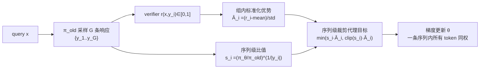

# GSPO（Qwen Team）：把重要性采样从 token 级提升到序列级的稳定 RL 算法

**📄 [Group Sequence Policy Optimization](https://arxiv.org/abs/2507.18071)**

2025-07 · 阿里巴巴 Qwen Team

**一句话**：把重要性采样的基本单元从 token 提升到整条序列——用长度归一化的整句似然比做裁剪、奖励与优化的统一单位，根治 [GRPO](/rlhf/grpo) 在长 CoT 与 MoE 上的累积噪声和不可逆崩溃；Qwen3 系列 RL 训练所用算法。

::: details 📖 论文原文 Abstract（英文）
This paper introduces **Group Sequence Policy Optimization (GSPO)**, our stable, efficient, and performant reinforcement learning algorithm for training large language models. Unlike previous algorithms that adopt token-level importance ratios, GSPO defines the importance ratio based on **sequence likelihood** and performs **sequence-level clipping, rewarding, and optimization**. We demonstrate that GSPO achieves superior training efficiency and performance compared to the GRPO algorithm, notably stabilizes Mixture-of-Experts (MoE) RL training, and has the potential for simplifying the design of RL infrastructure. These merits of GSPO have contributed to the remarkable improvements in the latest **Qwen3** models.
:::

**相关**：[GRPO](/rlhf/grpo) · [PPO](/rlhf/ppo) · [DAPO](/rlhf/dapo) · [Qwen3](/base-models/qwen) · [Agentic RL](/agent/agentic-rl/)


> 图源：Zheng et al., *Group Sequence Policy Optimization*（arXiv:2507.18071）Figure 1——冷启动自 Qwen3-30B-A3B-Base 的模型训练曲线，GSPO 训练效率显著高于 GRPO（用于学习注解，版权归原作者）。

## 动机与创新点：奖励是序列级的，优化单位也应该是序列级的

GSPO 的出发点是一个理论洁癖式的观察：**重要性采样要起到分布校正作用，前提是在同一行为分布上对多个样本求平均**。论文用标准的重要性采样恒等式点明这一前提——

$$\mathbb{E}_{z\sim\pi_{\text{tar}}}\left[f(z)\right] = \mathbb{E}_{z\sim\pi_{\text{beh}}}\left[\frac{\pi_{\text{tar}}(z)}{\pi_{\text{beh}}(z)}f(z)\right]$$

> Crucially, this relies on **averaging over multiple samples** ($N \gg 1$) from the behavior distribution $\pi_{\text{beh}}$ for the importance weight to effectively correct for the distributional mismatch.

而 [GRPO](/rlhf/grpo) 在每个 token 位置 $t$ 上使用比值 $w_{i,t}(\theta) = \pi_\theta(y_{i,t}\mid x,y_{i,<t})\,/\,\pi_{\theta_{\text{old}}}(y_{i,t}\mid x,y_{i,<t})$，但每个位置**只有一个样本** $y_{i,t}$——这个权重根本起不到校正 $\pi_{\theta_{\text{old}}}$ 与 $\pi_\theta$ 分布差异的作用，反而"introduces high-variance noise into the training gradients"。论文把 GRPO 的失稳直接定性为：

> The failure of the token-level importance weight points to a core principle: **the unit of optimization objective should match the unit of reward**. Since the reward is granted to the entire sequence, applying off-policy correction at the token level appears problematic.

这股噪声有三重放大效应：

1. **噪声随长度累积**。逐 token 的乘性噪声随响应变长越积越多，而裁剪机制不仅消除不了它，还因有偏截断进一步加剧问题。长 CoT 训练中模型会出现**不可逆崩溃**——论文明说一旦坍缩，"resuming training is unavailing, even when reverting to a previous checkpoint and meticulously tuning hyperparameters … extending generation length, or switching the RL queries"。
2. **粒度错配**。奖励 $r(x,y)\in[0,1]$ 是序列级的，优势 $\hat{A}_i$ 也是序列级的，优化与裁剪的单元却是 token 级——"奖励的单位"与"优化的单位"不一致。GSPO 的全部主张就是把二者对齐。
3. **MoE 的专家激活波动**。论文实测：48 层的 Qwen3-30B-A3B-Base 经过一步 RL 梯度更新后，对同一条 rollout 约 **10% 被激活的专家会改变**（expert-activation volatility）。新旧策略走的根本不是同一组专家，token 级比值因此剧烈波动。此前 Qwen 团队必须靠 **Routing Replay**——缓存 $\pi_{\theta_{\text{old}}}$ 的专家路由、计算 $\pi_\theta$ 时强制回放——才能让 GRPO 在 MoE 上收敛，代价是额外内存/通信开销且限制了模型用上真实路由的容量。

**关键创新**：

- **序列级重要性比值**：用长度归一化的整句似然比 $s_i(\theta)$ 替代逐 token 比值 $w_{i,t}$，它"reflects how far the response $y$ sampled from $\pi_{\theta_{\text{old}}}$ deviates from $\pi_\theta$"，天然与序列级奖励对齐。
- **序列级裁剪、奖励、优化三对齐**：裁剪、打分、梯度更新全部发生在序列级，一条序列要么整体保留、要么整体丢弃。
- **MoE 训练免补丁**：序列级比值对单 token 概率波动与专家路由抖动**免疫**，GSPO 训 MoE 不再需要 Routing Replay。
- **基础设施友好**：只依赖序列级似然，对训练/推理引擎间的精度差异更鲁棒，可直接用推理引擎返回的 logprob，省一次训练框架的重计算前向。
- **GSPO-token 变体**：用 stop-gradient 改写，数值上仍等于 $s_i$ 但允许给每个 token 配不同优势，为多轮对话 / [Agentic RL](/agent/agentic-rl/) 等需要 token 级 credit assignment 的场景留接口。

## 方法：序列级似然比 + 组内序列级裁剪代理目标

### 从 PPO/GRPO 到序列级目标

回顾基线。[PPO](/rlhf/ppo) 用逐 token 比值 $w_t(\theta)$ 与裁剪约束策略更新，但依赖一个与策略同规模的 value model，内存与可扩展性都受限。[GRPO](/rlhf/grpo) 去掉 value model、用组内多条响应的相对优势替代，目标为

$$\mathcal{J}_{\text{GRPO}}(\theta) = \mathbb{E}\left[\frac{1}{G}\sum_{i=1}^{G}\frac{1}{|y_i|}\sum_{t=1}^{|y_i|}\min\Big(w_{i,t}(\theta)\hat{A}_{i,t},\ \mathrm{clip}\big(w_{i,t}(\theta),1-\epsilon,1+\epsilon\big)\hat{A}_{i,t}\Big)\right]$$

其中一条序列内所有 token 共享同一优势 $\hat{A}_{i,t}=\hat{A}_i$，但每个 token 各自带一个 token 级比值 $w_{i,t}$。GSPO 的转折点正是：既然整条序列共享一个奖励、一个优势，比值也应该是序列级的。

### 序列级重要性比值 $s_i(\theta)$

GSPO 定义**序列级重要性比值**——对整条序列似然比做 $1/|y_i|$ 次方的长度归一化（等价于逐 token 对数比的算术平均再取指数）：

$$s_i(\theta) = \left(\frac{\pi_\theta(y_i\mid x)}{\pi_{\theta_{\text{old}}}(y_i\mid x)}\right)^{1/|y_i|} = \exp\!\left(\frac{1}{|y_i|}\sum_{t=1}^{|y_i|}\log\frac{\pi_\theta(y_{i,t}\mid x,y_{i,<t})}{\pi_{\theta_{\text{old}}}(y_{i,t}\mid x,y_{i,<t})}\right)$$

**为什么要长度归一化？** 论文给了两条理由：

> we adopt length normalization in $s_i(\theta)$ to reduce the variance and to control $s_i(\theta)$ within a unified numerical range. Otherwise, the likelihood changes of a few tokens can result in dramatic fluctuations of the sequence-level importance ratio, and the importance ratios of responses with different lengths will require varying clipping ranges.

一是把少数 token 的似然剧变压平、降方差；二是消除长短序列间比值量级的系统差异——否则同一裁剪范围 $\epsilon$ 对不同长度的序列含义完全不同。

> 举例：一条 500 token 与一条 50 token 的响应，若不归一化，整句似然比是 500 个 / 50 个对数比的连乘，长序列哪怕每个 token 只偏一点点，乘起来也会把比值推到极端，落进裁剪区；归一化后两者都被还原到"每 token 平均偏移"的同一量纲，$\epsilon$ 才有统一含义。

### 组内序列级裁剪代理目标

优势沿用 GRPO 的组内标准化 $\hat{A}_i = \dfrac{r(x,y_i) - \mathrm{mean}(\{r(x,y_j)\}_{j=1}^{G})}{\mathrm{std}(\{r(x,y_j)\}_{j=1}^{G})}$，目标函数则是组内**序列级**裁剪代理目标：

$$\mathcal{J}_{\text{GSPO}}(\theta) = \mathbb{E}_{x\sim\mathcal{D},\ \{y_i\}_{i=1}^{G}\sim\pi_{\theta_{\text{old}}}}\left[\frac{1}{G}\sum_{i=1}^{G}\min\Big(s_i(\theta)\hat{A}_i,\ \mathrm{clip}\big(s_i(\theta),1-\epsilon,1+\epsilon\big)\hat{A}_i\Big)\right]$$



裁剪、奖励、优化全部发生在序列级。从梯度看二者差异一目了然：

$$\nabla_\theta\mathcal{J}_{\text{GSPO}} = \mathbb{E}\left[\frac{1}{G}\sum_{i=1}^{G}s_i(\theta)\,\hat{A}_i\cdot\frac{1}{|y_i|}\sum_{t=1}^{|y_i|}\nabla_\theta\log\pi_\theta(y_{i,t}\mid x,y_{i,<t})\right]$$

GSPO 对一条序列内**所有 token 施加相同权重** $s_i(\theta)\hat{A}_i$，相当于"组内序列级 REINFORCE + 裁剪"；GRPO 则给每个 token 一个各异的噪声权重 $w_{i,t}\hat{A}_i$（落在 $(0,1+\epsilon]$ 或 $[1-\epsilon,+\infty)$）——论文指出"these unequal weights … are not negligible, and their impact can accumulate and lead to unpredictable consequences"，这正是二者稳定性差异的根源。

### 裁剪阈值量级与"反直觉"的裁剪比例

因为 $s_i$ 经几何平均后紧贴 1，GSPO 的裁剪范围与 GRPO **差两个数量级**：论文实验取 $\epsilon$ 为 **left = 3e-4、right = 4e-4**，而 GRPO 基线为 0.2 / 0.27。一个反直觉的观测是：GSPO 裁掉的 token 比例反而**高得多**——


> 图源：Zheng et al., *Group Sequence Policy Optimization*（arXiv:2507.18071）Figure 2——GSPO（0.15）vs GRPO（0.0013）RL 训练中平均被裁剪 token 比例（用于学习注解，版权归原作者）。

GSPO 约 **0.15**、GRPO 仅 **0.0013**，相差约两个数量级。按理裁得越多、用于梯度估计的 token 越少，却仍训得更快。论文把这解读为对 GRPO 的反证：

> this counter-intuitive finding … further indicates that GRPO's token-level gradient estimates are inherently noisy and inefficient for sample exploitation. In contrast, GSPO's sequence-level approach provides a more reliable and effective learning signal.

——GRPO 多保留的那些 token 级梯度大多是噪声，留着反而拖慢训练。

### GSPO-token：保留 token 级灵活性的变体

多轮对话、[Agentic RL](/agent/agentic-rl/) 等场景需要比序列级更细的优势调整。GSPO 给出 **GSPO-token** 变体，用 stop-gradient（PyTorch 的 `detach`）改写比值：

$$s_{i,t}(\theta) = \mathrm{sg}\big[s_i(\theta)\big]\cdot\frac{\pi_\theta(y_{i,t}\mid x,y_{i,<t})}{\mathrm{sg}\big[\pi_\theta(y_{i,t}\mid x,y_{i,<t})\big]}$$

由于 $\dfrac{\pi_\theta(y_{i,t})}{\mathrm{sg}[\pi_\theta(y_{i,t})]}$ 的**数值恒为 1**，$s_{i,t}(\theta)$ 在数值上仍等于 $s_i(\theta)$；当把一条序列里所有 token 的优势设成同一值 $\hat{A}_{i,t}=\hat{A}_i$ 时，GSPO-token 与 GSPO 在优化目标、裁剪条件、理论梯度上**完全一致**。区别只在于：GSPO-token 把优势写成 $\hat{A}_{i,t}$，从而"enjoys the higher flexibility of adjusting the advantages per token"——需要 token 级 credit assignment 时直接换上各异的 $\hat{A}_{i,t}$ 即可。

### 实现要点

```python
# GSPO 核心：log 域计算序列级比值
log_ratio = (logp_new - logp_old) * resp_mask          # [B, T] 逐 token 对数比
s = torch.exp(log_ratio.sum(-1) / resp_mask.sum(-1))   # [B] 长度归一化 + 指数

adv  = group_normalize(rewards)                         # 同 GRPO：(r - mean) / std
loss = -torch.min(s * adv,
                  s.clamp(1 - eps_low, 1 + eps_high) * adv).mean()
```

- **一切在 log 域进行**：先逐 token 求 $\log\pi_\theta - \log\pi_{\theta_{\text{old}}}$，按有效 token 数（response mask 后的长度，不含 prompt 和 padding）取平均再 `exp`，避免数值上溢/下溢。
- 序列级裁剪意味着一条序列要么整体保留、要么整体丢弃梯度，监控"被裁剪**序列**占比"而非 token 占比。
- 因为只依赖序列级似然，GSPO 对 rollout 引擎（vLLM/SGLang）与训练引擎（Megatron）之间的精度差异更鲁棒——论文明说"makes it possible to directly use the likelihoods returned by the inference engine for optimization, thereby avoiding the need for recomputation with the training engine"，在 partial rollout、多轮 RL、训推分离框架里尤其受益。
- MoE 上无需缓存/回放路由；这是 GSPO 相对 GRPO 最大的基础设施简化（详见下节实验）。

## 实验结果：冷启动 Qwen3-30B-A3B-Base 上全面超过 GRPO

### 评测设置

实验底座是一个**冷启动自 Qwen3-30B-A3B-Base** 的微调模型，报告训练奖励曲线与三项基准随训练算力的变化：**AIME'24**（average Pass@1 over 32 samplings）、**LiveCodeBench**（202410–202502，average Pass@1 over 8 samplings）、**CodeForces**（Elo Rating）。RL 训练中每批 rollout 切成四个 mini-batch 做梯度更新；GSPO 裁剪范围 3e-4 / 4e-4，GRPO 基线 0.2 / 0.27（论文称已"carefully tuned to ensure a fair comparison"）。

### Benchmark 表现（以原文为准）

如开头 Figure 1 所示，GSPO 在训练奖励与三项基准上**全程压过 GRPO（w/ Routing Replay）**，且"GSPO can deliver continuous performance improvement through increasing the training compute, regularly updating the query set, and extending the generation length"。论文未给最终绝对分表，曲线对比要点：

| 维度 | GRPO（w/ Routing Replay） | GSPO |
| --- | --- | --- |
| 训练奖励曲线 | 上升但更抖、同算力下更低 | 全程更高、更平稳 |
| AIME'24 / LiveCodeBench / CodeForces | 三项均被压制 | 同算力下三项均领先 |
| 平均被裁剪 token 比例 | ≈ 0.0013 | ≈ 0.15（高两个数量级，仍更高效） |
| MoE 收敛 | 必须 Routing Replay | 无需任何路由补丁 |

### MoE 训练：Routing Replay 的必要性与 GSPO 的免疫

论文专门验证 MoE 场景。下图显示：去掉 Routing Replay，GRPO 在 MoE 上的奖励**不升反降、训练发散**；只有缓存并回放专家路由，GRPO 才能正常收敛。


> 图源：Zheng et al., *Group Sequence Policy Optimization*（arXiv:2507.18071）Figure 3——Routing Replay 对 GRPO 训练 MoE 的正常收敛起关键作用（用于学习注解，版权归原作者）。

GSPO 则**根本不需要这套机制**。论文点明关键洞见：

> The key insight is that GSPO focuses only on the sequence likelihood (i.e., $\pi_\theta(y_i\mid x)$) and is not sensitive to the individual token likelihood … Since the MoE model always maintains its language modeling capability, the sequence likelihood will not fluctuate drastically.

> 举例：一步梯度更新后，某 token 在新策略下换了一组专家、该位置的 token 级比值 $w_{i,t}$ 可能从 0.3 跳到 3；但整条几百 token 的序列其语言建模能力不会突变，几何平均后的 $s_i$ 仍紧贴 1——专家抖动被"平均"掉了。于是 GSPO 直接常规计算 $s_i$ 就能稳定收敛，省掉 Routing Replay 的内存/通信开销，也不再限制 MoE 用满真实路由容量。

> 看榜须知：这些曲线均在同一冷启动底座、同一套 query 与工具配置下对照得到，是 GSPO 与 GRPO 的**受控对比**；跨论文、跨底座直接比绝对分意义有限，应聚焦"同等算力下 GSPO 全程占优 + MoE 免补丁"这一相对结论。论文同时披露 GSPO 已支撑最新 [Qwen3](/base-models/qwen) 系列（含大规模 MoE）的 RL 训练。

## 在 RLHF / 策略优化算法谱系里的位置

| 维度 | [PPO](/rlhf/ppo) | [GRPO](/rlhf/grpo) | GSPO |
| --- | --- | --- | --- |
| 优势来源 | 独立 value model（GAE） | 组内标准化（免 critic） | 组内标准化（沿用 GRPO） |
| 重要性比值 | token 级 $w_t$ | token 级 $w_{i,t}$ | **序列级 $s_i$**（长度归一化几何平均） |
| 裁剪单元 | 单 token | 单 token | **整条序列** |
| 裁剪阈值量级 | 0.1–0.2 | 0.2 / 0.27 | **3e-4 / 4e-4** |
| 噪声随序列长度 | 累积 | 累积放大、可致崩溃 | 被 $1/\lvert y_i\rvert$ 平均压制 |
| MoE 训练 | — | 需 Routing Replay | **直接收敛、无补丁** |
| 训推精度差异 | 敏感 | 敏感（逐 token 放大） | 容忍度高（仅需序列级似然） |

- **vs [GRPO](/rlhf/grpo)**：GSPO 是对 GRPO 最小但最本质的一处改动——只把"比值/裁剪的单元"从 token 换成序列，其余（组内采样、标准化优势、免 critic）全盘继承。代价是裁剪阈值要重调到 3e-4 量级；收益是长序列不再崩、MoE 不再需要 Routing Replay。可以理解为"GRPO 的稳定化重写"。
- **vs [PPO](/rlhf/ppo)**：二者都靠裁剪做信赖域约束，但 GSPO 与 GRPO 一样去掉了 value model，用组内相对优势替代 GAE；区别在 GSPO 把信赖域约束的对象提到序列级，与序列级奖励对齐。
- **vs [DAPO](/rlhf/dapo)**：DAPO 的一系列技巧（动态采样过滤全对/全错组、token-level loss、clip-higher、超长惩罚）大多作用在**采样与优势侧**，与 GSPO 改"比值单元"的方向**正交**，可叠加使用。
- **与 token 级 credit assignment 的张力**：纯序列级裁剪牺牲了 token 粒度的信用分配，这在多轮对话 / [Agentic RL](/agent/agentic-rl/) 里可能不够；GSPO-token 变体正是为此保留的接口——数值等价于 $s_i$、但允许逐 token 优势。
- **实践边界**：GSPO 的收益**随序列长度与模型稀疏度增长**。dense 小模型 + 短序列场景里 GRPO 的噪声问题本就不明显，换 GSPO 收益有限；它的主战场是长 CoT、大规模 MoE 的 RL 训练——这也是它能支撑 [Qwen3](/base-models/qwen) 系列的原因。
