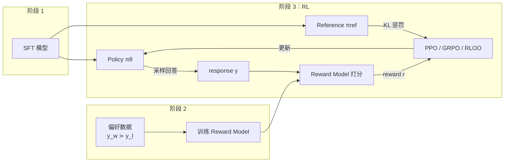

# RLHF / 强化学习总览

> **一句话**：用奖励信号（人类偏好或可验证规则）通过强化学习继续优化语言模型；PPO 是经典方案，GRPO 等变体在简化 critic 与降低开销。

::: warning 状态
🚧 本页为占位大纲，正文尚未撰写。
:::

## RLHF 经典三阶段流程

## 优化目标

$$
\max_{\pi_\theta} \; \mathbb{E}_{x \sim \mathbb{D},\, y \sim \pi_\theta(\cdot|x)} \left[ r(x, y) \right] - \beta \, \mathbb{D}_{\text{KL}}\!\left[ \pi_\theta(\cdot|x) \,\|\, \pi_{\text{ref}}(\cdot|x) \right]
$$

## 算法对比

| 算法 | Critic/Value | 优势估计 | 显存 | 代表使用方 |
| --- | --- | --- | --- | --- |
| [PPO](/rlhf/ppo) | 需要 | GAE | 高（4 模型） | InstructGPT |
| [GRPO](/rlhf/grpo) | 不需要 | 组内相对 | 中 | DeepSeek |
| [RLOO](/rlhf/rloo) | 不需要 | 留一法基线 | 中 | TODO |
| [REINFORCE++](/rlhf/reinforce-plus-plus) | 不需要 | 全局基线 | 中 | TODO |

## 子主题

- [Reward Model](/rlhf/reward-model)：奖励从哪里来
- [PPO](/rlhf/ppo) → [GRPO](/rlhf/grpo) → [RLOO](/rlhf/rloo) → [REINFORCE++](/rlhf/reinforce-plus-plus)：算法演化线

## TODO

- [ ] RLHF vs DPO 家族的选型
- [ ] RLVR（可验证奖励）的兴起与本版块的关系（未来扩展）
- [ ] 参考文献：InstructGPT、DeepSeekMath、DeepSeek-R1
