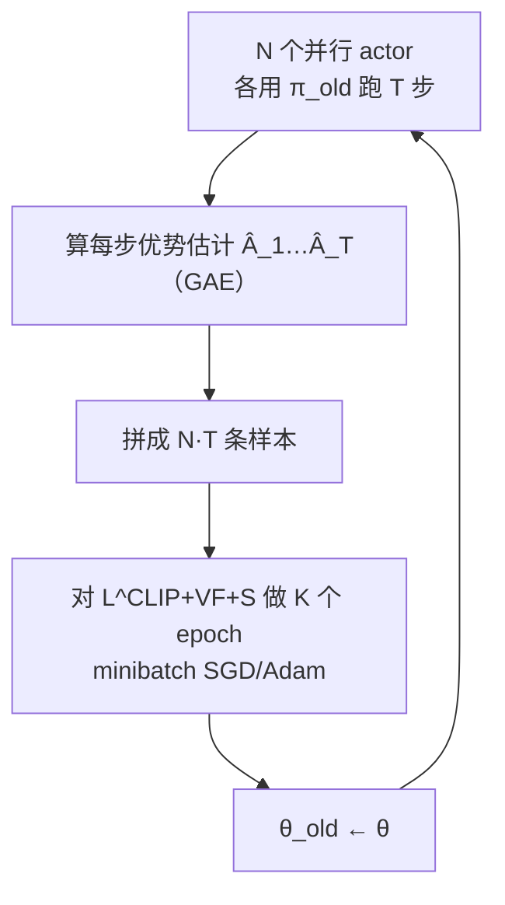

# PPO（OpenAI）：用裁剪代理目标做一阶信赖域的策略优化

**📄 [Proximal Policy Optimization Algorithms](https://arxiv.org/abs/1707.06347)**

2017-07 · OpenAI · [代码（OpenAI Baselines PPO2）](https://github.com/openai/baselines)

**一句话**：用一个「裁剪的重要性采样比值」把每步策略更新夹在旧策略附近，只靠一阶 SGD 就拿到 TRPO 的稳定性与数据效率；它后来成为 RLHF（InstructGPT 起）对齐大模型的默认策略优化算法。

::: details 📖 论文原文 Abstract（英文）
We propose a new family of policy gradient methods for reinforcement learning, which alternate between sampling data through interaction with the environment, and optimizing a "surrogate" objective function using stochastic gradient ascent. Whereas standard policy gradient methods perform one gradient update per data sample, we propose a novel objective function that enables multiple epochs of minibatch updates. The new methods, which we call **proximal policy optimization (PPO)**, have some of the benefits of trust region policy optimization (TRPO), but they are much simpler to implement, more general, and have better sample complexity (empirically). Our experiments test PPO on a collection of benchmark tasks, including simulated robotic locomotion and Atari game playing, and we show that PPO outperforms other online policy gradient methods, and overall strikes a favorable balance between sample complexity, simplicity, and wall-time.
:::

**相关**：[RLHF 总览](/rlhf/) · [Reward Model](/rlhf/reward-model) · [训练循环机制](/rlhf/training-loop) · [GRPO](/rlhf/grpo) · [RLOO](/rlhf/rloo) · [REINFORCE++](/rlhf/reinforce-plus-plus)


> 图源：Schulman et al., *Proximal Policy Optimization Algorithms*（arXiv:1707.06347）Figure 1——$L^{CLIP}$ 单个时间步随概率比 $r$ 的变化，正/负优势各裁一侧（用于学习注解，版权归原作者）。

## 动机与创新点：把「别走太远」塞进损失函数，一阶优化器即可实现信赖域

普通策略梯度（REINFORCE、vanilla PG）的核心问题是**步长不可控**：论文指出在同一批轨迹上多步优化 $L^{PG}=\hat{\mathbb{E}}_t[\log\pi_\theta(a_t|s_t)\hat A_t]$ "doing so is not well-justified, and empirically it often leads to destructively large policy updates"——策略一旦走得太远，旧数据的重要性权重严重失真，更新方向变得不可信，训练崩溃。

TRPO（Schulman et al., 2015）的解法是给代理目标外挂一个**二阶 KL 信赖域硬约束**——

$$\max_\theta\ \hat{\mathbb{E}}_t\Big[\frac{\pi_\theta(a_t|s_t)}{\pi_{\theta_{\text{old}}}(a_t|s_t)}\hat A_t\Big]\quad\text{s.t.}\quad \hat{\mathbb{E}}_t\big[\mathrm{KL}[\pi_{\theta_{\text{old}}}(\cdot|s_t),\pi_\theta(\cdot|s_t)]\big]\le\delta$$

——它稳定，但要算共轭梯度/Fisher 向量积，"is relatively complicated, and is not compatible with architectures that include noise (such as dropout) or parameter sharing"。PPO 的目标是 **"to attain the data efficiency and reliable performance of TRPO, while using only first-order optimization"**：不解约束优化，而是把「别偏离旧策略太远」直接写进损失函数本身，让普通 Adam 就能跑，并且能在一批数据上安全地做**多个 epoch** 的 minibatch 更新（这是 sample efficiency 的来源）。

**关键创新**：

- **裁剪代理目标 $L^{CLIP}$**：对概率比 $r_t(\theta)$ 做 $[1-\epsilon,1+\epsilon]$ 裁剪，再与未裁剪项取 min，构成对真实目标的**悲观下界**（pessimistic / lower bound）——只在「改动会让目标变好」时才忽略它、在「会让目标变坏」时才计入它。
- **一阶 + 可多 epoch 复用**：相比 TRPO 的二阶优化，PPO 只需对该目标做几轮 minibatch SGD，实现只比 vanilla PG 多几行代码，且兼容 dropout、参数共享、RNN。
- **自适应 KL 惩罚变体 $L^{KLPEN}$**：把 KL 当软惩罚加进目标、按目标 KL 自动调系数 $\beta$——作为对照基线（论文实测效果不如裁剪）。
- **与 GAE / actor-critic 无缝组合**：value 共享网络时把策略代理、value 误差、熵奖励合成单一目标联合优化。

这套「一阶、稳、可多 epoch 复用」的组合让 PPO 成为后来 **RLHF 的默认策略优化器**——[InstructGPT](https://arxiv.org/abs/2203.02155) 用它把奖励模型分数回灌进语言模型，下文「方法」一节给出 token 级实例化。

## 方法：从连续控制原版到 RLHF token 级实例

### 裁剪代理目标 $L^{CLIP}$：单侧封顶/封底的悲观下界

记概率比 $r_t(\theta)=\dfrac{\pi_\theta(a_t|s_t)}{\pi_{\theta_{\text{old}}}(a_t|s_t)}$，于是 $r_t(\theta_{\text{old}})=1$。TRPO 的代理目标是 $L^{CPI}(\theta)=\hat{\mathbb{E}}_t[r_t(\theta)\hat A_t]$（CPI 指 conservative policy iteration）。不加约束地最大化它会导致过大更新，于是 PPO 提出主目标：

$$L^{CLIP}(\theta)=\hat{\mathbb{E}}_t\Big[\min\big(r_t(\theta)\hat A_t,\ \mathrm{clip}(r_t(\theta),\,1-\epsilon,\,1+\epsilon)\,\hat A_t\big)\Big]$$

其中 $\epsilon$ 是超参，论文取 $\epsilon=0.2$。两项取 min 的设计意图，原文讲得很清楚：

> the final objective is a lower bound (i.e., a pessimistic bound) on the unclipped objective. With this scheme, we only ignore the change in probability ratio when it would make the objective improve, and we include it when it makes the objective worse.

对照开头的 Figure 1 看机制：

- $A_t>0$（这个动作好）：增大其概率，$r_t$ 涨到 $1+\epsilon$ 就**封顶**，再涨不贡献梯度——"好的别奖太多"；
- $A_t<0$（这个动作坏）：减小其概率，$r_t$ 跌到 $1-\epsilon$ 就**封底**——"坏的别罚太狠"。

> 举例（RLHF）：奖励模型给某条回答打了高分（$A_t>0$）。若不裁剪，模型会把这条回答里每个 token 的概率往死里拉高、迅速偏离参考策略变成复读机；裁剪让它「这一批最多把概率比抬到 1.2 倍」，逼模型多攒几批数据、小步慢走。

注意 $L^{CLIP}(\theta)=L^{CPI}(\theta)$ 在 $r=1$ 附近一阶相等，只有当 $\theta$ 走远了两者才分叉——这正是「在旧策略附近不干预、走远才拉住」的信赖域直觉。

### 自适应 KL 惩罚 $L^{KLPEN}$：作为对照的另一条路

PPO 还给了第二种实现——把 KL 当**软惩罚**而非裁剪：

$$L^{KLPEN}(\theta)=\hat{\mathbb{E}}_t\Big[\frac{\pi_\theta(a_t|s_t)}{\pi_{\theta_{\text{old}}}(a_t|s_t)}\hat A_t-\beta\,\mathrm{KL}[\pi_{\theta_{\text{old}}}(\cdot|s_t),\pi_\theta(\cdot|s_t)]\Big]$$

固定 $\beta$ 不好用（不同问题、甚至同一问题的不同阶段最优 $\beta$ 都不同），于是按**目标 KL $d_{\text{targ}}$** 每步自适应：每次更新后算 $d=\hat{\mathbb{E}}_t[\mathrm{KL}[\pi_{\theta_{\text{old}}},\pi_\theta]]$，

- 若 $d<d_{\text{targ}}/1.5$（走得太保守）→ $\beta\leftarrow\beta/2$；
- 若 $d>d_{\text{targ}}\times1.5$（走得太猛）→ $\beta\leftarrow\beta\times2$。

论文明说 1.5 与 2 是启发式、算法对它们不敏感，初值 $\beta$ 也不重要因为会迅速自调。作者实测 **"the KL penalty performed worse than the clipped surrogate objective"**，但保留它「because it's an important baseline」。这条线对 RLHF 读者尤其值得记——后面会看到，**InstructGPT 走的恰恰是「把 KL 放进 reward」的混合路线**，与这里「把 KL 放进 loss」数学上并不等价。

### 优势估计 GAE 与共享网络的联合目标

PPO 沿用截断版**广义优势估计（GAE，Schulman et al., 2015）**：跑长度 $T$ 的轨迹段（$T\ll$ episode 长度），用 critic $V(s_t)$ 配 TD 残差做指数加权：

$$\hat A_t=\delta_t+(\gamma\lambda)\delta_{t+1}+\cdots+(\gamma\lambda)^{T-t+1}\delta_{T-1},\qquad \delta_t=r_t+\gamma V(s_{t+1})-V(s_t)$$

$\lambda$ 在偏差—方差间插值：$\lambda=1$ 退化为蒙特卡洛回报（高方差低偏差），$\lambda=0$ 退化为单步 TD（低方差高偏差），常用 $\lambda=0.95$。

当策略与 value 共享网络参数时，必须把 value 误差并进目标；再加熵奖励鼓励探索，得到论文实际优化的合成目标（eq. 9）：

$$L_t^{CLIP+VF+S}(\theta)=\hat{\mathbb{E}}_t\big[L_t^{CLIP}(\theta)-c_1L_t^{VF}(\theta)+c_2S[\pi_\theta](s_t)\big]$$

其中 $L_t^{VF}=(V_\theta(s_t)-V_t^{\text{targ}})^2$ 是 value 平方误差，$S$ 是熵奖励，$c_1,c_2$ 为权重（Atari 配置取 $c_1=1,c_2=0.01$）。

### 完整算法：N 个 actor 并行采样 + K 个 epoch 复用

PPO 的主循环（论文 Algorithm 1，actor-critic 风格）：



> Each iteration, each of N (parallel) actors collect T timesteps of data. Then we construct the surrogate loss on these NT timesteps of data, and optimize it with minibatch SGD (or usually for better performance, Adam), for K epochs.

「一批数据做 K 个 epoch」正是 PPO 比 vanilla PG 省采样的关键——而裁剪正是让这种复用**安全**的前提（多 epoch 会让 $\pi_\theta$ 慢慢偏离 $\pi_{\theta_{\text{old}}}$，裁剪把偏离量按住）。MuJoCo 基准的标准配置：$T=2048$、$\gamma=0.99$、$\lambda=0.95$、$K=10$ epoch、minibatch 64、Adam $3\times10^{-4}$。

### RLHF token 级实例：把奖励模型分数回灌进语言模型

PPO 原版面向机器人/Atari；用于 **RLHF** 时把语言生成建成序列决策 MDP——状态 $s_t$ 是 prompt $x$ 加已生成的前 $t-1$ 个 token，动作 $a_t=y_t$ 是第 $t$ 个 token，策略 $\pi_\theta(a_t|s_t)$ 即语言模型在该位置的 token 分布，一条回答就是一条 trajectory。

**奖励构成**：奖励模型 $r_\phi$ 只在序列末端给一个标量分，但 KL 约束要落到每个 token。InstructGPT 的经典做法是把奖励写成逐 token 形式——中间 token 只有 KL 惩罚，末端额外加 RM 分：

$$r_t=-\beta\,\log\frac{\pi_\theta(y_t|s_t)}{\pi_{\text{ref}}(y_t|s_t)}+\underbrace{r_\phi(x,y)\cdot\mathbb{1}[t=T]}_{\text{仅末端 token}}$$

这就是上一节提到的「KL 进 reward」路线（per-token KL penalty）：它**影响优势估计**（KL 项进入 $\delta_t$ 与 $\hat A_t$），而不仅仅是改梯度——与 PPO 原论文 $L^{KLPEN}$「KL 进 loss」的写法数学上不等价，实践中前者在 RLHF 里更主流。

**Critic 损失**：value head 回归到 GAE 目标 $V_{\text{targ}}=\hat A_t+V_{\text{old}}(s_t)$，并常对 value 也做裁剪以稳定：

$$\mathcal{L}_{\text{value}}=\hat{\mathbb{E}}_t\Big[\max\big((V_\theta(s_t)-V_{\text{targ}})^2,\ (\mathrm{clip}(V_\theta,V_{\text{old}}\pm\epsilon_v)-V_{\text{targ}})^2\big)\Big]$$

**四个模型同时驻留**：**policy**（训练）、**critic**（训练）、**reference**（冻结，算 KL）、**reward model**（冻结，打分）。这是 PPO 在 RLHF 里显存开销大、工程复杂的根源，也是后续 [GRPO](/rlhf/grpo) / [RLOO](/rlhf/rloo) 砍掉 critic 的动机所在。


> 图源：Ouyang et al., *Training language models to follow instructions with human feedback (InstructGPT)*（arXiv:2203.02155）Figure 2——RLHF 三阶段，PPO 是第三阶段的策略优化器（用于学习注解，版权归原作者）。

### 工程实现与调参经验

```python
# PPO-for-RLHF 主循环（伪代码）
for iteration in range(N):
    # 1) Rollout：用 π_old 采样回答，并缓存 logprob、value、reward
    prompts = sample_prompts(batch)
    responses, old_logprobs, values = policy.generate(prompts)      # π_old
    ref_logprobs = ref_model.logprobs(prompts, responses)          # 冻结
    rm_scores   = reward_model(prompts, responses)                 # 冻结，末端分
    rewards = per_token_kl_penalty(old_logprobs, ref_logprobs, beta)
    rewards[:, -1] += rm_scores                                    # 末端加 RM 分
    # 2) 计算优势与回报
    adv, returns = gae(rewards, values, gamma, lam)
    adv = whiten(adv)                                              # advantage 归一化
    # 3) 在同一批数据上做多个 epoch 的 minibatch 更新
    for epoch in range(ppo_epochs):          # 通常 1~4（RLHF），原论文 K=10
        for mb in minibatches(...):
            ratio = exp(policy.logprobs(mb) - mb.old_logprobs)
            pg_loss = -min(ratio*mb.adv, clip(ratio,1-eps,1+eps)*mb.adv)
            v_loss  = value_clip_loss(critic(mb), mb.returns, mb.values)
            loss = pg_loss.mean() + c_v*v_loss - c_ent*entropy
            loss.backward(); optimizer.step()
```

关键工程与调参细节：

- **clip $\epsilon$**：常用 $0.2$（论文消融里 $\epsilon=0.2$ 也最优，见下表）；偏大更激进、偏小更保守。
- **$\gamma$、$\lambda$**：语言任务奖励集中在末端，$\gamma$ 常取 $1.0$（不折扣），$\lambda$ 取 $0.95$ 左右。
- **KL 系数 $\beta$**：RLHF 里最关键的稳定旋钮。太小则 reward hacking、模型跑飞；太大则学不动、退化回 SFT。常配合 **adaptive KL**（目标 KL 高于设定就增大 $\beta$，反之减小）。
- **重放 epoch 数**：同批数据更新 1~4 个 epoch（RLHF 实践，比原论文 K=10 保守）；越多越省采样但越易让 $\pi_\theta$ 偏离 $\pi_{\theta_{\text{old}}}$，clip 触发频繁。
- **归一化**：advantage whitening（减均值除标准差）几乎是必做；reward scaling/clipping 也常见。
- **崩溃征兆**：① **KL 爆炸**——$\pi_\theta$ 急速偏离 $\pi_{\text{ref}}$、输出乱码或重复，立即加大 $\beta$ 或降学习率；② **熵塌缩**——策略熵骤降、输出高度雷同、探索消失，多因学习率过大或 reward 过尖；③ **reward 与 KL 同时飙升**——典型 reward hacking，RM 被钻空子，需回看 RM 质量。
- **critic 预热**：开训前先让 critic 单独拟合几步 value，可减少早期优势估计噪声。
- **采样规模**：rollout batch 越大优势估计越稳，但生成是瓶颈，通常用 vLLM 等推理引擎加速采样阶段。

## 实验结果：代理目标消融 + MuJoCo/Atari 全面占优（以原文为准）

### 代理目标消融：裁剪 $\epsilon=0.2$ 最优

论文先在 7 个 MuJoCo 连续控制任务上比较各代理目标变体（各跑 100 万步、3 个种子，分数归一化到「随机策略=0，最佳=1」后对 21 次运行取平均）：

| 代理目标 | 平均归一化分 |
| --- | --- |
| 无裁剪无惩罚（vanilla $L^{CPI}$） | −0.39 |
| 裁剪 $\epsilon=0.1$ | 0.76 |
| **裁剪 $\epsilon=0.2$** | **0.82** |
| 裁剪 $\epsilon=0.3$ | 0.70 |
| 自适应 KL $d_{\text{targ}}=0.003$ | 0.68 |
| 自适应 KL $d_{\text{targ}}=0.01$ | 0.74 |
| 自适应 KL $d_{\text{targ}}=0.03$ | 0.71 |
| 固定 KL $\beta=0.3 / 1 / 3 / 10$ | 0.62 / 0.71 / 0.72 / 0.69 |

无裁剪无惩罚直接跑崩（half-cheetah 上比随机策略还差，拖成负分），验证了「步长不控会炸」；裁剪整体优于 KL 惩罚，$\epsilon=0.2$ 居中最稳。

### 连续控制与 Atari 对比

在 MuJoCo 上把 PPO（裁剪、$\epsilon=0.2$）与 A2C、A2C+Trust Region、CEM、vanilla PG（自适应步长）、TRPO 对比，**几乎所有环境 PPO（紫线）都最快、最高**：


> 图源：Schulman et al., *Proximal Policy Optimization Algorithms*（arXiv:1707.06347）Figure 3——MuJoCo 连续控制基准上 PPO 与多种基线的对比（用于学习注解，版权归原作者）。

在 **Atari（49 游戏）** 上与调好的 A2C、ACER 比，按两种口径数「赢了几个游戏」（3 次取均值）：

| 评分口径 | A2C | ACER | PPO | 平 |
| --- | --- | --- | --- | --- |
| 全程平均 episode reward（favors 快学习） | 1 | 18 | **30** | 0 |
| 末 100 episode 平均（favors 终性能） | 1 | **28** | 19 | 1 |

PPO 在「学得快」一档拿下 30/49 第一；ACER 在「最终性能」一档以 28 反超，但 PPO **实现简单得多**（论文结论原话：与 A2C 简洁度相当、却显著更稳）。作者还用 Roboschool 3D 人形机器人展示了 PPO 在高维连续控制（跑动、转向、被砸后爬起）上的可扩展性。

> 看榜须知：这些是 2017 年连续控制/Atari 的口径，与今天 RLHF 场景不可直接比；PPO 之于 RLHF 的「成绩」体现在 InstructGPT/ChatGPT 等下游对齐效果，而非本表数字。跨设置比绝对值意义有限。

## 在 RLHF / 策略优化谱系里的位置

PPO 是 RLHF 策略优化的**事实基线**，后续工作几乎都以「砍 critic / 改优势 / 改裁剪粒度」相对它定位：

| 维度 | PPO | [GRPO](/rlhf/grpo) / [RLOO](/rlhf/rloo) |
| --- | --- | --- |
| Critic | 需要（再训一个同规模 value 网络） | 不需要 |
| 同时驻留模型 | 4（policy / ref / RM / critic） | 3 |
| 优势估计 | GAE，token 级、有 value 基线 | 组内相对，序列级 |
| 每 prompt 采样数 | 1（可多，但非必需） | $G$ 个（组采样） |
| 显存与工程复杂度 | 高 | 中 |
| 稳定性 | 成熟可控，但调参敏感（KL/clip） | 实现简单，长序列下需额外修正 |

- **vs TRPO**：同样要「信赖域」，但 PPO 用一阶裁剪近似 TRPO 的二阶 KL 约束——牺牲一点理论严格性，换来实现简单、兼容 dropout/参数共享/RNN，这是它能在大模型上铺开的根本原因。
- **vs [GRPO](/rlhf/grpo) / [RLOO](/rlhf/rloo)**：两者共同动机是**干掉 critic**——PPO 第二个「同规模训练网络」是显存与不稳定的大头。GRPO 用同一 prompt 的一组采样的组内相对奖励当优势基线，RLOO 用留一法基线，都把 4 模型压到 3 模型。代价是优势变成序列级、噪声更大，长序列下要额外修正。
- **vs [DAPO](/rlhf/dapo) / [GSPO](/rlhf/gspo)**：在 PPO/GRPO 的裁剪框架上继续打补丁——DAPO 提出非对称裁剪（clip-higher）、动态采样等一组「让裁剪在长 CoT RL 下更稳」的工程改良；GSPO 把重要性比值从 token 级抬到**序列级**，缓解 token 级比值在超长序列上的方差与裁剪失配。
- **vs [REINFORCE++](/rlhf/reinforce-plus-plus)**：另一条「轻量化」路线——保留 PPO 的若干稳定技巧（KL 归一化、reward clip 等）但回归更简单的 REINFORCE 式更新，介于 vanilla PG 与完整 PPO 之间。
- 整体训练循环（rollout → 打分 → 优势 → 更新）与各算法的位置见 [训练循环机制](/rlhf/training-loop) 与 [RLHF 总览](/rlhf/)。
