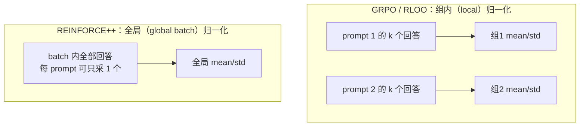

# REINFORCE++（OpenRLHF 团队）：用全局优势归一化稳住 critic-free 训练

**📄 [REINFORCE++: Stabilizing Critic-Free Policy Optimization with Global Normalization](https://arxiv.org/abs/2501.03262)**

2025-01 · OpenRLHF 团队（Jian Hu 等） · [代码](https://github.com/OpenRLHF/OpenRLHF)

**一句话**：critic-free 的 REINFORCE 加固版——保留 PPO 的 token 级 KL 惩罚与 clip，但把优势的归一化统计量从 GRPO 的「按 prompt 分组」改成**整个 global batch**，从而把"组内 std 偏差 + 小样本不稳 + 过拟合单 prompt"三宗罪一并消除，单 prompt 单采样也能训。

::: details 📖 论文原文 Abstract（英文）
Reinforcement Learning from Human Feedback (RLHF) plays a crucial role in aligning Large Language Models (LLMs). The dominant algorithm, Proximal Policy Optimization (PPO), employs a critic network to estimate advantages, which introduces significant computational and memory overhead. To address this, a family of critic-free algorithms (e.g., GRPO, RLOO) has emerged. However, these methods typically rely on *prompt-level (local)* advantage normalization, which suffers from inaccurate advantage estimation, a tendency to overfit, and, as we show, is a theoretically biased estimator. To solve these challenges, we introduce **REINFORCE++**, a critic-free framework centered on **Global Advantage Normalization**. By normalizing advantages across the entire global batch rather than small, prompt-specific groups, our method provides a more stable and theoretically sound *effectively unbiased* estimate (whose bias vanishes as batch size increases). We introduce two variants: **REINFORCE++**, a highly efficient and general algorithm ($k \geq 1$) for general-domain RLHF, and **REINFORCE++ w/ Baseline**, a robust group-sampling variant ($k > 1$) for complex reasoning tasks. Our empirical evaluation demonstrates that each variant shows superior stability and performance in its respective domain, outperforming existing methods and even PPO in complex agentic settings.
:::

**相关**：[RLHF 总览](/rlhf/) · [PPO](/rlhf/ppo) · [RLOO](/rlhf/rloo) · [GRPO](/rlhf/grpo) · [DAPO](/rlhf/dapo) · [GSPO](/rlhf/gspo)


> 图源：Hu et al., *REINFORCE++: Stabilizing Critic-Free Policy Optimization with Global Normalization*（arXiv:2501.03262）Figure 1——五种 RLHF 算法的结构对比，REINFORCE++ 去掉 critic、改用全局 batch 归一化（用于学习注解，版权归原作者）。

## 动机与创新点：critic-free 的真问题不是"要不要 critic"，而是"在哪里归一化基线"

PPO 用一张 value 网络估计优势，效果稳但**额外背一个和 policy 同量级的 critic**，显存与算力翻倍，"making training very expensive and limiting large model alignment in small-scale clusters"。为省掉它，[ReMax](/rlhf/)、[RLOO](/rlhf/rloo)、[GRPO](/rlhf/grpo) 这一支 critic-free 方法应运而生——它们都靠"同一个 prompt 采 $k$ 个回答、用组内统计量当基线"来替代 value 网络。

但 REINFORCE++ 指出，这条路把一个新问题塞了进来：**advantage estimation**。GRPO / RLOO 用的是 **prompt-level (local) normalization**——只拿"同一个 prompt 那一小撮回答"算 mean/std。论文把它的毛病归结为三条：

1. **理论上有偏（Theoretical Bias）**：GRPO 的优势 $A = \frac{r - \mathrm{mean}(\{r\})}{\mathrm{std}(\{r\}) + \epsilon}$，分子（去中心的 reward）与分母（组内 std）**不独立**——分母的取值本身和组里那几个 reward 相关，"introducing a systematic error in the advantage estimate"。论文在附录里给出形式化证明，这是本文的核心理论卖点。
2. **实践上不稳（Practical Instability）**：组大小 $k$ 通常只有 4 或 8，是小样本统计。一旦某个 prompt 的几个回答**奖励都差不多**（全对或全错），局部 $\mathrm{std}(\cdot)$ 趋近 0，优势被除爆，"causing the advantage to explode"——这正是 GRPO 需要 $\epsilon$ 平滑、否则训练发散的根源。
3. **过拟合单 prompt（Task Overfitting）**：策略被奖励为"比同一个 prompt 的其它样本更好"，而不是"在全局意义上更好"。结果是在容易造出多样回答的简单 prompt 上过拟合，却改善不了复杂 prompt——"rather than achieving a globally high reward, which harms generalization"。

REINFORCE++ 的回答是：**把归一化的统计量取自整个 global batch**。一个 batch 内、来自所有不同 prompt 的全部 response token 共享同一组 $\mu_{\text{batch}}, \sigma_{\text{batch}}$。样本量大一个量级以上（典型 batch ≥ 1024），mean/std "converge to stable constants"，于是估计**有效无偏**（偏差随 $N\to\infty$ 消失）、对离群点鲁棒；所有 prompt 用同一把缩放尺，也就不存在组级的不一致加权。



**关键创新**：

- **全局优势归一化（Global Advantage Normalization）**：核心一招。把 GRPO 的 per-prompt 局部归一化替换成 global batch 归一化，同时消除"理论偏差 + std 下溢爆炸 + 单 prompt 过拟合"三宗罪，且偏差随 batch 增大而减小——这是少数"加卡/加 batch 就更稳"的算法设计。
- **保留 PPO 的廉价稳定件、只砍最贵的 critic**：留下 PPO-clip（限制单步更新、容许 minibatch 复用）与 token 级 KL 惩罚（防漂离 $\pi_{\text{ref}}$），扔掉 value 网络。论文给出形式等价：REINFORCE++ 就是"GAE 取 $\gamma=1,\lambda=1$、用两步全局归一化替代 learned critic"的 PPO。
- **两个变体分工明确**：通用 RLHF（奖励来自 RM、prompt 多样）用 **REINFORCE++（$k=1$ 即可）**，最大化 prompt 多样性与效率；数学/代码/agent 等可验证奖励、需要 group sampling 的任务用 **REINFORCE++-baseline（$k>1$）**，先减组均值去位移、再全局缩放。
- **正确的 $k_2$ KL loss**：baseline 变体把 KL 用 $k_2$ 估计器写成独立 loss 项，避免 GRPO 用的 $k_3$ 估计器在反向 KL 上不稳的问题。

## 方法：全局优势归一化 + 两个变体

### 局部归一化的三宗罪：为什么 GRPO 的按组除 std 不好

GRPO 的优势计算（论文 Eq.3）是：

$$
A_{q,o^{(i)}} = \frac{r(o^{(i)}) - \mathrm{mean}\big(\{r(o^{(j)})\}_{j=1}^{k}\big)}{\mathrm{std}\big(\{r(o^{(j)})\}_{j=1}^{k}\big) + \epsilon}
$$

问题全在那个**分母**。它只统计"同一个 prompt 的 $k$ 个回答"，于是：分子分母不独立（偏差）、$k$ 太小（小样本噪声）、全组同奖励时 std→0（爆炸）、且优化目标退化成"组内排名"（过拟合）。RLOO 用留一均值当基线，避开了除 std（无难度偏差），但仍是 prompt 级局部统计、也仍需每 prompt 多采样。REINFORCE++ 的全部设计都是冲着"把这个分母换成全局统计"去的。

### REINFORCE++（$k=1$）：奖励塑形 → reward-to-go → 全局归一化 → PPO-clip

通用版为最大化效率与 prompt 多样性，**每个 prompt 只采 1 个回答**。四步：

**第一步：token 级奖励塑形**（与 PPO-RLHF 相同）。把序列末端的 RM 分数，叠上逐 token 的 $k_1$ 式 KL 惩罚：

$$
r_t = \mathbb{1}[t = T]\, r_\phi(x, y) - \beta\,\mathrm{KL}(t), \qquad \mathrm{KL}(t) = \log \frac{\pi_{\theta_{\text{old}}}(y_t \mid x, y_{<t})}{\pi_{\text{ref}}(y_t \mid x, y_{<t})}
$$

**第二步：reward-to-go 作为优势**。取 $\gamma=1$、不做 bootstrapping，token $t$ 的优势就是它之后的累计奖励（论文 Eq.4）：

$$
A_{q,o_t} = r_\phi(x, y) - \beta \sum_{i=t}^{T} \mathrm{KL}(i)
$$

**第三步：全局优势归一化**（核心，论文 Eq.5）。在整个 global batch $\mathcal{D}_{\text{batch}}$ 的所有 token 上统计均值与标准差：

$$
A^{\text{norm}}_{q,o_t} = \frac{A_{q,o_t} - \mathrm{mean}\big(A \mid A \in \mathcal{D}_{\text{batch}}\big)}{\mathrm{std}\big(A \mid A \in \mathcal{D}_{\text{batch}}\big) + \epsilon}
$$

论文原话："As the global batch size $\mathcal{D}_{\text{batch}}$ is typically large (e.g., 1024 or more), the mean and std converge to stable constants. It makes the gradient estimator *effectively less biased* (as $N\to\infty$) and robust to outliers."

**第四步：PPO-clip 代理目标**（没有 critic，沿用 PPO 的 Eq.1，只把 $A_t$ 换成 $A^{\text{norm}}$）：

$$
\mathcal{L}(\theta) = -\mathbb{E}_t \left[ \min\Big( \rho_t \hat{A}^{\text{norm}}_t,\ \mathrm{clip}(\rho_t,\, 1-\epsilon,\, 1+\epsilon)\, \hat{A}^{\text{norm}}_t \Big) \right], \qquad \rho_t = \frac{\pi_\theta(y_t \mid x, y_{<t})}{\pi_{\theta_{\text{old}}}(y_t \mid x, y_{<t})}
$$

> 举例：一个 batch 里同时有"写一首关于秋天的诗"和"解释相对论"两个 prompt，各采 1 个回答。GRPO 这时根本无法构造基线（$k=1$ 没有同组同伴）；REINFORCE++ 则把这两条（连同 batch 里其余上千条）的所有 token 优势放一起算 $\mu,\sigma$，难写的题和好写的题用同一把尺缩放——谁真的比"全局平均水平"好，就拿到正优势。

### REINFORCE++-baseline（$k>1$）：组均值去位移 + 全局缩放 + $k_2$ KL loss

数学推理、多步 agent 这类任务，奖励常是稀疏的 0/1 或 ±1，**每 prompt 多采样**有好处。但直接上通用版会出事：单采样 + 全局归一化无法消除 prompt 难度的位移——难题永远负优势、易题永远正优势，模型会学成一个"难度分类器"。baseline 变体用**两步**修这个问题：

**① 组均值去位移（reshaping）**：先减掉组均值，把不同奖励尺度（0/1 vs ±1）对齐成局部基线（论文 Eq.6）：

$$
A'_{q,o_t} = R_{q,o_t} - \mathrm{mean}_{\text{group}}(R_{q,o_t})
$$

这一步与 RLOO 同源、**无偏**，只负责"扣掉这道题本身有多难"。

**② 全局 batch 缩放（stability）**：再用全局统计做归一化（论文 Eq.7），**刻意不用** GRPO 的组内 std：

$$
A^{\text{norm}}_{q,o_t} = \frac{A'_{q,o_t} - \mathrm{mean}_{\text{batch}}(A')}{\mathrm{std}_{\text{batch}}(A') + \epsilon}
$$

**③ 独立的 $k_2$ KL loss**：baseline 变体不把 KL 塞进 reward，而是写成单独的正则项（论文 Eq.8），用 $k_2$ 估计器——"the $k_2$ estimator provides a stable, unbiased gradient for the Reverse KL divergence, unlike the $k_3$ estimator (used in GRPO), which is an unstable approximation"：

$$
\mathcal{L} = \mathcal{L}_{\text{PPO}}(A^{\text{norm}}) - \lambda \cdot \mathcal{J}_{k_2\text{ as loss}}(\theta), \qquad \mathcal{J}_{k_2\text{ as loss}}(\theta) = \mathbb{E}\Big[\tfrac{1}{2}\big(\log \tfrac{\pi_\theta}{\pi_{\text{ref}}}\big)^2\Big]
$$

> 两个变体的分工一句话：**通用 RLHF（RM 奖励、prompt 多样、单采样即可）用 REINFORCE++；可验证奖励的推理/agent 训练（0/1、±1、需要 group sampling）用 REINFORCE++-baseline。** 论文还给了经验：RLVR 任务里 baseline 版配 ±1 奖励最好，通用版配对称 ±1 奖励最好。

### 与 PPO 的关系：一句话等价

论文 §3.3 把 REINFORCE++-baseline 直接定位成"a simplified and more stable variant of PPO"——它**形式等价于**这样一个 PPO：(1) 去掉 critic 网络；(2) GAE 参数取 $\lambda=1,\gamma=1$；(3) 用两步全局 batch 归一化代替 learned value function 当基线。所以从 PPO 迁移成本极低：共享绝大部分代码路径，只是砍掉 critic 分支、把优势估计器换掉。

### 实现要点

```python
# REINFORCE++ 单步（通用版，每 prompt 采 1 个回答）
kl       = logp_old - logp_ref                     # [B, T] token 级 KL
reward_t = -beta * kl
reward_t[:, -1] += rm_score                        # 末 token 加序列奖励

A = reward_t.flip(-1).cumsum(-1).flip(-1)          # gamma=1 的 reward-to-go
A = (A - A[mask].mean()) / (A[mask].std() + 1e-8)  # 全局 batch 归一化

loss = ppo_clip_loss(logp_new, logp_old, A, eps)   # 无 critic 的 clip 目标
```

- **归一化范围是关键实现细节**：分布式训练下 $\mu_{\text{batch}}, \sigma_{\text{batch}}$ 必须在所有 DP rank 间 all-reduce 后统计（global batch 而非 per-GPU micro-batch），否则各卡尺度不一致，等价于引入随机学习率。
- mask 要正确：统计与 loss 都只覆盖 response token，不含 prompt 与 padding。
- 该算法由 OpenRLHF 作者提出，OpenRLHF 内置 `reinforce++` / `reinforce++-baseline` 两种优势估计器，verl 等框架也已支持；与 PPO 共享绝大部分代码路径，从 PPO 迁移成本很低。
- 显存驻留 3 个模型（policy / ref / RM；规则奖励场景只剩 2 个），与 GRPO 持平、低于 PPO。

## 实验结果：通用 RLHF 持平 GRPO 但更省 token，推理 / agent 全面胜出（以原文为准）

论文用 OpenRLHF 框架，按"通用 RLHF / 推理 / 多步 agent"三类场景分别验证两个变体。

### 通用 RLHF（Chat-Arena-Hard）：单采样持平 GRPO，但更省 token

策略起点 Llama-3-8B-SFT，配一个在 ~700K 人类偏好对上训的 Bradley-Terry RM，在 20,000 条多样 prompt 上训。通用版 REINFORCE++（$k=1$）对比其它 critic-free 方法：

| 算法 | Score | Length | Per-Token |
| --- | --- | --- | --- |
| **REINFORCE++（$k=1$）** | 46.7 | **832** | **0.0561** |
| GRPO（$k=4$） | **46.8** | 860 | 0.0544 |
| RLOO（$k=4$） | 44.6 | 866 | 0.0515 |
| ReMax（$k=1{+}1$） | 45.1 | **805** | 0.0560 |

单采样的 REINFORCE++ 与采 4 个的 GRPO **统计上打平（46.7 vs 46.8）**，但回答更短（832 vs 860）、单 token 价值更高（0.0561 最优）。结论：通用任务里 group sampling（$k>1$）**不必要、甚至可能更差**。


> 图源：Hu et al., *REINFORCE++*（arXiv:2501.03262）Figure 2——平滑后的训练奖励与 KL 散度对比，REINFORCE++（$k=1$）以显著更低的 KL 拿到强奖励，规避了 GRPO 的 reward-hacking（用于学习注解，版权归原作者）。

论文的解读：GRPO 的 reward 涨得快，但 KL 也快速膨胀，说明它在"**hacking** the reward model"；REINFORCE++ 的 reward 涨得稳、KL 小得多，体现全局归一化更高的"KL-to-reward"转换效率，避开了局部归一化常伴随的 length exploitation。

### 推理实验：小数据不过拟合、难任务更鲁棒、OOD 更强

**① 小数据集过拟合测试（AIME-24 训练 → AIME-25 测试）**：只用 30 道题训。

| Pass@N | AIME-24 训练 (N=1) | AIME-25 测试 (N=1) | AIME-25 测试 (N=16) |
| --- | --- | --- | --- |
| GRPO（local norm） | **95.0** | 0.0 | 0.4 |
| **REINFORCE++（global norm）** | 71.0 | **2.5** | **40.0** |

GRPO 把训练集刷到近乎满分（95.0）却在测试集**彻底崩盘**（0.0 Pass@1）——灾难性过拟合；REINFORCE++ 训练分更低（71.0）但泛化显著更好（测试 40.0 Pass@16）。


> 图源：Hu et al., *REINFORCE++*（arXiv:2501.03262）Figure 3——小 prompt 集上的训练曲线，左 GRPO 几步即过拟合、右 REINFORCE++ 学习更稳（用于学习注解，版权归原作者）。

**② 逻辑推理（K&K 谜题，难度随"人数"上升）**：GRPO 在简单题（2–3 人）尚有竞争力，到难的 OOD 任务（8 人）就崩；REINFORCE++ 更鲁棒，**在 ≥4 人的所有任务上都超过 GRPO，平均分 62.1 vs 55.7**。

**③ RL from Zero（Qwen2.5-Math-Base 从零训）**：

| Pass@N | AIME-24 (OOD, N=8) | AMC-23 (OOD, N=8) | MATH-500 (ID, N=1) |
| --- | --- | --- | --- |
| GRPO | 18.96 | 59.22 | **73.00** |
| **REINFORCE++** | **21.04** | **60.47** | 72.00 |

在更难的 OOD 数据集（AIME-24 / AMC-23）上 REINFORCE++ 更强，分布内 MATH-500 上持平。

### 多步 agent 工具使用：critic-free 反超全量 PPO

最硬核的场景——ZeroTIR 多步 agent 环境，Qwen2.5-Base-7B 学用 Python 工具解数学题，奖励稀疏、group sampling 与 reward reshaping 都关键。用 average@32 评测：

| 算法 | AIME 24 | AIME 25 | HMMT 2025 | HMMT 2024 | CMIMC | **Avg** |
| --- | --- | --- | --- | --- | --- | --- |
| GRPO（local norm） | **31.66** | 21.87 | 16.97 | 17.70 | 24.68 | 22.58 |
| PPO（critic-based） | 30.20 | 21.66 | 15.00 | 18.43 | 23.95 | 21.85 |
| **REINFORCE++-baseline（global norm）** | 30.83 | **27.18** | **17.91** | **18.95** | **25.62** | **24.10** |

REINFORCE++-baseline 拿到最高均分 **24.10**，**同时超过 GRPO（22.58）和带 critic 的 PPO（21.85）**——印证"理论稳健、无 critic"的方案在复杂 agentic 任务上可以反超重量级 PPO。

### 看榜须知

这些分数的口径（average@32 / Pass@N）、底座、奖励设置、test-time 配置各异，**跨系统直接比绝对值意义有限**；尤其要先确认对照的是**哪个变体**（通用版 $k=1$ vs baseline 版 $k>1$），二者行为差异很大。把上面的表当作"同一框架下、全局归一化 vs 局部归一化的受控对比"来读，比当排行榜更有价值。

## 在 RLHF 谱系里的位置

| 维度 | PPO | GRPO | RLOO | REINFORCE++ |
| --- | --- | --- | --- | --- |
| Critic | 需要 | 不需要 | 不需要 | 不需要 |
| 基线 / 归一化 | value 网络 | 组内 mean/std | 留一均值 | global batch 的 mean/std |
| 每 prompt 采样数 | 1 | $G$ | $k$ | 1 即可（baseline 版为 $G$） |
| 难度偏差（组 std） | — | 有 | 无 | 无 |
| clip / minibatch 复用 | 有 | 有 | 通常无 | 有 |
| token 级 KL | 在 reward 中 | 在 loss 中（独立项） | 在 reward 中 | reward 中（baseline 版用 $k_2$ loss） |
| 统计量样本数 | — | 组内 $G$ 个 | 组内 $k$ 个 | 全 batch（偏差随 batch 增大而减小） |

- **vs [GRPO](/rlhf/grpo)**：同为 critic-free，分歧只在"归一化在哪做"。GRPO 按 prompt 分组除 std——本文证明它**有偏**、且组内 std 下溢会爆、易过拟合单 prompt；REINFORCE++ 改成全局 batch 归一化，把这三点一并修掉。论文把 GRPO 的 reward 快涨+KL 飙升刻画为 reward hacking，对照看很直观。
- **vs [RLOO](/rlhf/rloo)**：RLOO 用留一均值当基线、不除 std（无难度偏差），但仍是**局部统计 + 每 prompt 多采样**。REINFORCE++-baseline 的第一步（减组均值）与 RLOO 同源、无偏，区别在第二步多加了一层全局缩放来提稳定性。
- **vs [DAPO](/rlhf/dapo) / [GSPO](/rlhf/gspo)**：REINFORCE++ 解决的是"优势在哪归一化"，与 DAPO 的 token 级损失归一化、Clip-Higher、动态采样**正交**，可组合使用；GSPO 走的是序列级重要性比值，是另一条改进线。
- **被后续工作复用 / 验证**：论文 §5.2 列出 LitePPO（把 REINFORCE++-baseline 与 token 级 loss 结合）、ScaleRL（16,000 GPU-hour 的大规模消融，结论"batch-level normalization 在计算效率与最终性能上都略优于 prompt-level"）、DLER（截断控长场景下全局归一化保持稳定、局部归一化掉点）等多个第三方系统独立采纳了全局优势归一化，佐证其稳定性与有效性。
- **引用注意**：arXiv:2501.03262 的标题与作者列表随版本变化明显——v1 单作者 Jian Hu、副标题 *A Simple and Efficient Approach for Aligning Large Language Models*；后续版本扩到四位作者并改题为 *Stabilizing Critic-Free Policy Optimization with Global Normalization*。对照他人实验时先确认其针对的**版本与变体**。
- 整体定位见 [RLHF / 强化学习总览](/rlhf/)。
