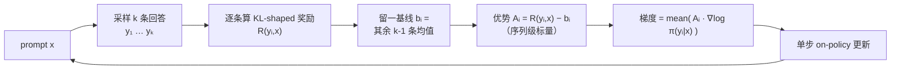

# RLOO（Cohere）：把 RLHF 拉回 REINFORCE，用留一基线丢掉 critic 与 clip

**📄 [Back to Basics: Revisiting REINFORCE Style Optimization for Learning from Human Feedback in LLMs](https://arxiv.org/abs/2402.14740)**

2024-02 · Cohere / Cohere For AI · ACL 2024

**一句话**：Cohere 把 RLHF 拉回最朴素的 REINFORCE——把**整条回答当作一个动作**、用同一 prompt 其余样本的均值做**留一基线**，丢掉 PPO 的 critic、GAE 与 clip，工程更简单却在偏好对齐上更强。留一估计量 RLOO 引自 Kool et al. 2019，本文系统性地把它引入 RLHF 并验证有效。

::: details 📖 论文原文 Abstract（英文）
AI alignment in the shape of Reinforcement Learning from Human Feedback (RLHF) is increasingly treated as a crucial ingredient for high performance large language models. **Proximal Policy Optimization (PPO)** has been positioned by recent literature as the canonical method for the RL part of RLHF. However, it involves both high computational cost and sensitive hyperparameter tuning. We posit that most of the motivational principles that led to the development of PPO are less of a practical concern in RLHF and advocate for a less computationally expensive method that preserves and even increases performance. We revisit the *formulation* of alignment from human preferences in the context of RL. Keeping simplicity as a guiding principle, we show that many components of PPO are unnecessary in an RLHF context and that far simpler **REINFORCE-style** optimization variants outperform both PPO and newly proposed "RL-free" methods such as DPO and RAFT. Our work suggests that careful adaptation to LLMs alignment characteristics enables benefiting from online RL optimization at low cost.
:::

**相关**：[PPO](/rlhf/ppo)（前置） · [GRPO](/rlhf/grpo)（对照） · [Reward Model](/rlhf/reward-model) · [DAPO](/rlhf/dapo) · [GSPO](/rlhf/gspo)


> 图源：Ahmadian et al., *Back to Basics: Revisiting REINFORCE Style Optimization for Learning from Human Feedback in LLMs*（arXiv:2402.14740）Figure 1——左：$\lambda$ 消融（降方差引入偏差反而更差）；右：去掉 clip / 比值不损性能（用于学习注解，版权归原作者）。

## 动机与创新点：PPO 是为经典 Deep-RL 设计的，RLHF 不需要那一整套

PPO 的全套机制——critic + GAE、比值裁剪、多 epoch 复用——是为经典 deep RL 设计的：随机初始化的策略、长 horizon、密集但噪声大的奖励。本文的核心论点是 **RLHF 根本不是那种场景**，于是发问：

> *can we avoid the computational and optimization complexity of PPO while preserving performance?*

作者把 PPO 拆开逐件审视，理由有三：

- **初始策略已经很好**。RLHF 的起点是 SFT 模型，"the initialization of the policy, in the form of a pre-trained and supervised fine-tuned (SFT) model, is far from a random parameterization"——概率质量已集中在少数 token 上，优化地形平坦，单步更新不至于灾难性偏移；PPO 那种"small, stable updates"的保守假设在这里是浪费。
- **奖励只在序列末端给一次**。[Reward Model](/rlhf/reward-model) 只对完整回答（`<EOS>`）打分，中间 token 没有真实奖励——"rewards are only attributed to *full generations*, with no true rewards for any intermediary tokens"。既然如此，把每个 token 建模成一个 action、再训一个与 policy 同尺寸的 critic 去 bootstrap 部分序列的 value，意义存疑。
- **prompt 即 episode 起点，单步 bandit 视角足够**。整条生成可以"reduced to a *bandit* problem"，初始状态由 prompt 决定、生成结束即到终止态。

于是退回最朴素的方案：把**整条回答 $y$ 当作一个 action**，用 REINFORCE 估计梯度，再用留一法（leave-one-out）免费拿到一个低方差基线。

**关键创新**（对应论文四点贡献）：

- **PPO is not the right tool for RLHF**：把 PPO 逐件拆解，证明最"基础"的 Vanilla Policy Gradient REINFORCE 在偏好对齐上一致优于 PPO（按数据集/底座不同，win-rate 高 3.2%–20.3%）。
- **RLOO 全面胜过关键基线**：在 REINFORCE 之上用多在线样本构造留一基线，一致优于 PPO、DPO、RAFT；且比 RAFT 更会利用样本、对奖励噪声更稳。
- **建模部分序列没必要**："Modeling partial completions is not necessary"——把整条生成当单一动作，性能不降反而显著加速学习、少载一份模型。
- **对噪声与 KL 强度更鲁棒**：配套给出语言流畅度、多样性、抗噪与 KL 敏感性的多维分析，RLOO 在高 KL 与注入噪声下都比 RAFT 稳。

## 方法：把整条回答当一个 action，用留一基线的 REINFORCE

### 从 RLHF 目标到 KL-shaped reward

经典 RLHF 三阶段：SFT → 训 [Reward Model](/rlhf/reward-model) → RL。奖励模型 $r_\phi$ 在偏好对 $\mathcal{D}=\{(x,y_+,y_-)\}$ 上按二分类训练，$y_+/y_-$ 为更/不被偏好的回答。RL 阶段的目标是在不偏离参考策略太远的前提下最大化奖励：

$$\max_\theta\; \mathbb{E}_{x\sim\mathcal{D},\,y\sim\pi_\theta(\cdot|x)}\big[r_\phi(x,y) - \beta\, D_{\text{KL}}\big(\pi_\theta(\cdot|x)\,\|\,\pi_{\text{ref}}(\cdot|x)\big)\big]$$

等价于最大化一个把 KL 罚并进去的 **KL-shaped reward**：

$$R(x,y) = r_\phi(x,y) - \beta\log\frac{\pi_\theta(y|x)}{\pi_{\text{ref}}(y|x)}$$

$\beta$ 控制与初始策略 $\pi_{\text{ref}}$ 的距离——KL 罚至关重要，"penalty-free optimization of $r_\phi$ leads to degradation in the coherence of the model"（无约束优化会让模型钻奖励模型的空子、语言坍塌）。下面所有方法共用这个 $R(x,y)$，差别只在**怎么把它变成梯度**。

### PPO 的四件套，以及为什么 RLHF 用不上

PPO 把生成的**每个 token 当作一个 action**、每个部分序列当作 state，只有 `<EOS>` token 拿到奖励模型的分、其余 token 只有 KL 分量：$R(x,y)=\sum_{t=1}^{T} R_t(x,y_t)$。它再用 GAE 估计 token 级优势 $\hat{A}_\lambda(y_t,s_t)$，并套一个 clip 的目标：

$$\min\!\Big(f(y_t|s_t)\hat{A}_\lambda,\; \text{clip}^{1+\epsilon}_{1-\epsilon}\!\big(f(y_t|s_t)\big)\hat{A}_\lambda\Big),\quad f(y_t|s_t)=\frac{\pi_\theta(y_t|s_t)}{\pi_{\text{old}}(y_t|s_t)}$$

作者逐件论证这些组件在 RLHF 里是冗余的，并用开头的 **Figure 1** 给出经验证据：

- **GAE 的 $\lambda$（偏差-方差权衡）**：GAE 用 bootstrap 降方差，代价是引入偏差。Figure 1 左图把 $\lambda$ 从 1.0 调到 0，奖励**单调变差**——"reducing variance at the cost of bias in an RLHF setting needlessly introduces bias"。$\lambda=1$ 即 vanilla PG（无偏、用整条轨迹回报）表现最好。
- **clip / 重要性比值**：Figure 1 右图依次关掉 clip、再去掉比值 $\frac{\pi_\theta}{\pi_{\text{old}}}$，曲线几乎不动甚至略升。作者实测"the loss is actually clipped on average < 5% of the time per batch"——RLHF 训练本就接近 on-policy、策略每步只缓慢变化，clip 几乎从不触发，自然可省。
- **critic（学习的 value 网络）**：要多载一份与 policy 同尺寸的模型、还要交错训练，是 PPO 算力成本的大头；而在只有末端奖励的 bandit 设定下，对部分序列估 value 本就粗糙。

> 举例：把"写一段摘要"想成在电脑前一口气敲完一段话再交给评审打分。PPO 像是给每个字都派一个裁判预估"这半句能拿几分"（critic + GAE），还规定"每个字相对上一版不能改太多"（clip）；可真实评分只在交稿那一刻才有——这些中途裁判和限速器既费算力又帮不上忙。

### REINFORCE：把整条序列当 single action

既然 $r(x,y)$ 只在序列末端给一次，"it is more appropriate and efficient to model the entire generation as a single action with the initial state determined by the prompt"。从纯 RL 看，环境是确定性的（吐出 token 后上下文确定地更新），整个问题塌缩成一个 **bandit**：只有 prompt 决定的初始态和生成结束的终止态。于是直接对整条序列回报做 REINFORCE：

$$\mathbb{E}_{x\sim\mathcal{D},\,y\sim\pi_\theta(\cdot|x)}\big[R(y,x)\,\nabla_\theta\log\pi_\theta(y|x)\big]$$

为降方差又保持无偏，减去一个与 $y_i$ **独立**的基线 $b$：$\mathbb{E}[(R(y,x)-b)\nabla_\theta\log\pi_\theta(y|x)]$。Williams 1992 的经典选择是全程奖励的滑动平均 $b_{\text{MA}}=\frac{1}{S}\sum_s R(x^s,y^s)$——简单、便宜，但它是个跨步全局量，对当前样本的拟合并不紧。

### RLOO：用"其余样本均值"做留一基线

RLOO 的洞见是：同一个 prompt 反正要多采样几条，那就**让每个样本用其余样本的均值当基线**——"The rewards for each sample can serve all other samples as a baseline"，再把各样本的梯度估计取平均，得到一个方差更小的多样本蒙特卡洛估计。对每个 prompt $x$ 采样 $k$ 个回答 $y_1,\dots,y_k$：

$$\frac{1}{k}\sum_{i=1}^{k}\Big[R(y_i,x) - \underbrace{\frac{1}{k-1}\sum_{j\neq i} R(y_j,x)}_{\text{留一基线 }b_i}\Big]\nabla_\theta\log\pi_\theta(y_i|x),\qquad y_1,\dots,y_k\overset{i.i.d}{\sim}\pi_\theta(\cdot|x)$$



性质：

- **无偏**：$b_i$ 与 $y_i$ 独立，$\mathbb{E}[b_i\nabla_\theta\log\pi_\theta(y_i|x)]=0$，不改变梯度期望；
- **方差缩减**：$b_i$ 是 $\mathbb{E}[R]$ 的蒙特卡洛估计，$k$ 越大越准。相比 $b_{\text{MA}}$，留一基线"created on-the-fly for each sample and at each training step"，对当前 prompt 贴得更紧，代价是采样开销随 $k$ 线性增长；
- **序列级 credit assignment**：整条回答共享一个标量优势，不做 token 级分配（与 GRPO 相同，与 PPO+GAE 不同）；实现成 token 级时即把同一优势广播到每个 response token；
- **on-policy 单步**：每个 batch 采样后只更新一次，没有重要性比值 $\rho_t$，也就不需要 clip。

> 举例：$k=4$ 时，同一道题采出四份答案、奖励为 $[2,5,3,6]$。第 2 份的基线是其余三份均值 $(2+3+6)/3=3.67$，优势 $=5-3.67=+1.33$（往这个方向推）；第 1 份基线 $(5+3+6)/3=4.67$，优势 $=2-4.67=-2.67$（往反方向压）。好答案被加强、差答案被抑制，且基线天然随这道题的难度自适应。

### 与 GRPO 的精确关系

一个常被忽视的恒等式，把 GRPO 的"组均值（含自身）基线"与 RLOO 的留一基线连起来：

$$r_i - \frac{1}{k}\sum_{j=1}^{k} r_j \;=\; \frac{k-1}{k}\Big( r_i - \frac{1}{k-1}\sum_{j\neq i} r_j \Big)$$

两者只差一个常数缩放 $\frac{k-1}{k}$，可被学习率吸收。所以 **GRPO 与 RLOO 的实质差异不在均值怎么算**，而在于：[GRPO](/rlhf/grpo) 还要除以组内 std（引入偏差与难度加权——奖励方差小的过易/过难 prompt 优势被放大），并套 PPO 式 clip 做多步 off-policy 更新；RLOO 保持无偏估计 + 单步 on-policy，是两者中理论上更"干净"的那个。

### KL 约束与实现

KL 约束的处理与 PPO-RLHF 相同：把 $-\beta\log\frac{\pi_\theta(y|x)}{\pi_{\text{ref}}(y|x)}$ 并入 $R$（或作独立 loss 项），防策略漂离 $\pi_{\text{ref}}$。整体实现极薄：

```python
# RLOO：每个 prompt 采 k 个回答
ys      = policy.generate(x, n=k)
rewards = reward_fn(x, ys) - beta * kl_to_ref(ys)        # [k]，KL 并入奖励

baseline = (rewards.sum() - rewards) / (k - 1)           # 留一均值，向量化
adv      = rewards - baseline                            # 无偏优势

logp = policy.logp(ys).sum(dim=-1)                       # 整条序列 log prob
loss = -(adv.detach() * logp).mean()
```

- 留一基线可向量化为 `(sum - r_i) / (k-1)`，无需双重循环。
- 优势是序列级标量，乘的是**整条回答的 $\log\pi_\theta$ 之和**；token 级实现时把同一优势广播到每个 response token（注意 mask 掉 prompt 与 padding）。
- on-policy 意味着 rollout 与更新交替、经验不复用。若工程上想复用 minibatch 多更新几步，就得补回重要性比值与 clip——那基本就走回 [GRPO](/rlhf/grpo) 了。
- 现成实现：HF TRL 提供 `RLOOTrainer`，OpenRLHF、verl 等框架也内置了 RLOO 优势估计器。

## 实验结果：REINFORCE 系一致优于 PPO 与 RL-free 方法

### 评测设置

- **数据集**：TL;DR Summarize（116k 指令 / 93k 偏好对）与 Anthropic Helpful & Harmless（112k 偏好对）；**底座** Pythia-6.9B 与 Llama-7B；上下文 512，RM 与 policy 都用对应 SFT checkpoint 初始化。
- **指标**：用 GPT-4 作人类代理（Alpacafarm 框架）评 **win-rate**——TL;DR 对参照 SFG 补全、HH 对偏好补全；同时用训练 RM 报测试集平均奖励衡量"内在优化质量"，并配 perplexity、长度、n-gram 多样性等"对齐税"代理指标。

### Benchmark 表现（以原文为准）

测试集 win-rate（Table 1，取测试奖励最高的 checkpoint）：

| 方法 | TL;DR | HH (Pythia) | HH (Llama) |
| --- | --- | --- | --- |
| **RLOO (k=4)** | **77.9** | 43.7 | **64.1** |
| RAFT (k=4) | 73.2 | 42.1 | 63.3 |
| **RLOO (k=2)** | 74.2 | **47.6** | 62.2 |
| RAFT (k=2) | 72.1 | 37.7 | 58.4 |
| REINFORCE w/ baseline | 70.7 | 37.9 | 55.3 |
| Vanilla PG | 70.4 | 36.4 | 52.3 |
| PPO | 67.6 | 29.2 | 32.0 |
| DPO | 66.6 | 39.0 | 61.9 |

- **REINFORCE 系全面压 PPO**：连最朴素的 Vanilla PG 都"consistently outperforms PPO by 3.2% to 20.3% in terms of win-rate"；RLOO (k=4) 比 PPO 高 **10.3 / 14.5 / 32.1**（三个设定）。
- **建模部分序列没必要**：REINFORCE w/ baseline 与 Vanilla PG 在 TL;DR（70.7 vs 70.4）、HH-Pythia（37.9 vs 36.4）基本持平、HH-Llama 还反超（55.3 vs 52.3）——把整条生成当单一动作不丢性能，却少载一份模型、明显加速学习。


> 图源：Ahmadian et al., *Back to Basics*（arXiv:2402.14740）Figure 2——测试奖励训练曲线：RLOO 一致领先、Vanilla PG 一致优于 PPO（用于学习注解，版权归原作者）。

### 采样效率与对齐税

RLOO 把全部 $k$ 个样本都用进梯度（含"负优势样本往哪儿压"的信息），而 RAFT 只拿排名第一的样本做 SFT、其余丢弃——"RAFT does not make full use of all samples"。结果是同等采样预算下 RLOO 一致胜 RAFT，甚至 **RLOO (k=2) 追平或超过 RAFT (k=4)**（半个预算打平人家）。


> 图源：Ahmadian et al., *Back to Basics*（arXiv:2402.14740）Figure 3——同预算下 RLOO 的采样效率优于 RAFT（用于学习注解，版权归原作者）。

对齐税方面（Table 2，HH-Llama）：DPO 倾向过度啰嗦（平均 104 token），PPO 则偏短（16 token）；RLOO / RAFT / REINFORCE w/ baseline 的 perplexity 都显著低于 PPO 与 Vanilla PG，多样性也维持得更好。REINFORCE w/ baseline 相比 Vanilla PG"results in 27% less variance"，在追求低风险输出的安全场景尤其可取。

### 对 KL 与噪声的鲁棒性

RAFT 只优化 top-1 样本，所以**排序一旦不准就受伤**。作者从两个角度压测：调高 KL 罚 $\beta$、以及往 RM logits 注入噪声。结论是"RAFT is more sensitive to higher KL regularization"——$\beta\in\{0.25,0.5,1.0\}$ 时，RAFT 不仅奖励优化更差，还**离参考策略漂得更远**；只有在低正则 $\beta=0.1$ 下两者 KL 距离相当，而 RLOO 仍拿更高奖励。


> 图源：Ahmadian et al., *Back to Basics*（arXiv:2402.14740）Figure 5——对 KL 强度的敏感性：RAFT 比 RLOO 更易随高 KL 退化、偏离参考策略（用于学习注解，版权归原作者）。

> 看榜须知：这些 win-rate 由 GPT-4 代评、口径/底座/上下文/采样设置各异，跨方法直接比绝对值意义有限，当作"同一套实验内 REINFORCE 系 vs PPO/RL-free 的相对强弱"参照即可。

## 在 critic-free RLHF 谱系里的位置

RLOO 是 **critic-free 策略梯度家族**里理论上最"干净"的一支。横向对照：

| 维度 | PPO | GRPO | RLOO |
| --- | --- | --- | --- |
| Critic | 需要（同尺寸模型） | 不需要 | 不需要 |
| 基线 | value 网络 | 组均值（含自身），再除以组内 std | 留一均值 |
| 优势无偏性 | 取决于 value 质量 | std 缩放有偏 | 无偏 |
| credit assignment | token 级（GAE） | 序列级广播 | 序列级 |
| clip / off-policy 复用 | 有 | 有 | 通常无（on-policy 单步） |
| 每 prompt 采样数 | 1 | $G$ | $k$（论文用 2/4） |
| 驻留模型数 | 4（policy/ref/RM/critic） | 3 | 3 |

- **vs [PPO](/rlhf/ppo)**：RLOO 砍掉 critic、GAE、clip，把"防走崩"的复杂度全换成"靠 KL 约束 + 单步 on-policy"。本文的实验是后来"RLHF 不一定要 PPO"这一认知转向的关键证据之一。
- **vs [GRPO](/rlhf/grpo)**：二者均值基线只差常数缩放（见上文恒等式），但 GRPO 多了 std 归一化（有偏、隐含难度加权）与 PPO 式 clip（容许 minibatch off-policy 复用）。RLOO 更无偏、更简单；GRPO 更适配大规模高吞吐的 off-policy 训练。
- **vs RAFT / DPO**：RAFT 只学 top-1 样本、丢弃梯度信息且对排序噪声敏感；DPO 干脆跳过 RL 与 RM。本文实测 REINFORCE 系一致优于这两类"RL-free / 准 RL-free"方法，主张"careful adaptation 后在线 RL 仍值得做、且能做得很便宜"。

**调参与实践经验**：

- **$k$ 的选择**：论文用 $k=2/4$。$k$ 越大基线方差越小、单步梯度越稳，但采样成本线性增长；$k=2$ 即可显著优于单样本 REINFORCE（带 EMA 基线），性价比拐点通常在 4 附近。
- **KL 系数 $\beta$** 是最重要的稳定旋钮：RLOO 没有 clip 兜底，策略偏移完全靠 KL 项约束，$\beta$ 过小会先于 PPO 出现 reward hacking。
- **奖励方差监控**：全组奖励相同的 prompt 优势为 0、无梯度（与 GRPO 同样的问题），可借鉴 [DAPO](/rlhf/dapo) 的动态采样把它们过滤掉。
- **适用判断**：奖励来自 RM 的经典对齐场景、希望最小化工程复杂度时，RLOO 是 critic-free 家族里最简洁的选择；长 CoT 推理 + 大规模 off-policy 训练场景，社区实践更多落在 GRPO / [DAPO](/rlhf/dapo) / [GSPO](/rlhf/gspo) 一系，因为它们容许 minibatch 复用与更激进的吞吐优化。
