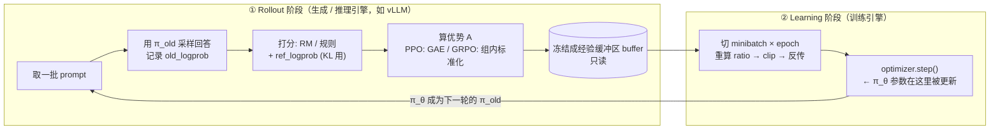
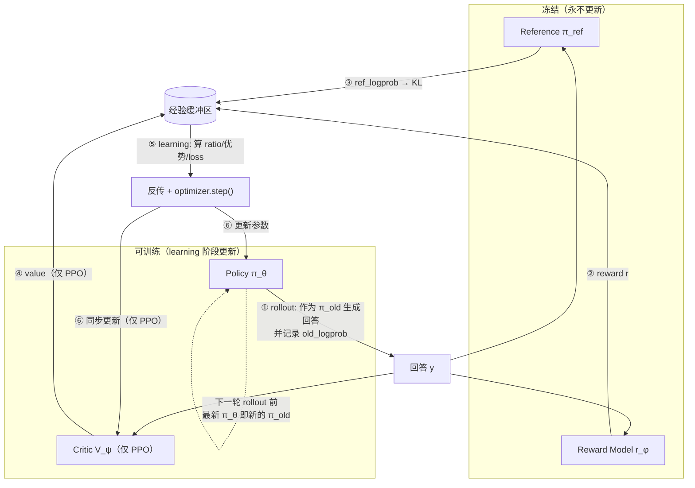

# 训练循环：一个 batch 里 policy 到底怎么更新

> **一句话**：PPO、GRPO 这些算法的**目标函数**各不相同，但它们的**训练循环骨架几乎一模一样**——每一轮（iteration）都分成 **rollout（生成采样）** 和 **learning（参数更新）** 两个阶段：rollout 阶段把一批数据连同奖励、优势一起算好、"冻结"成一个只读的经验缓冲区；learning 阶段再在这批冻结数据上做若干次 minibatch 梯度更新。搞懂这套数据流，PPO/GRPO 的代码就不再是黑箱。
> 前置阅读：[RLHF 总览](/rlhf/)、[PPO](/rlhf/ppo)、[GRPO](/rlhf/grpo)、[符号约定](/guide/notation)

本页不重复 [PPO](/rlhf/ppo)、[GRPO](/rlhf/grpo) 的损失函数推导，而是把视角切到**工程实现**：一个 batch 在内存里怎么流动、哪些量被缓存、$\pi_\theta$ 的参数究竟在哪一行代码被改。PPO 和 GRPO 共用同一套骨架，只在"优势怎么算""KL 放哪"两处不同——把骨架讲清楚，两个算法就都通了。

## 一、一轮 iteration 的两阶段骨架

强化学习训练 LLM，每一轮都在重复同一件事：**先用当前模型造一批"经验"，再用这批经验改模型**。这两件事用的是不同的引擎、甚至常常在不同的显卡分组上跑：



关键认知：**rollout 阶段不更新参数，learning 阶段不重新采样**。一批数据采一次、用一阵（更新多次），然后丢弃，进入下一轮。

## 二、到底有几个模型？PPO 4 个、GRPO 3 个

RLHF 训练显存吃紧，一大半原因是**同时要驻留好几个模型**。先把名册列清楚——这也是"PPO 4 模型、GRPO 3 模型"这个常见说法的由来。

**PPO 的 4 个模型：**

1. **Policy（策略 $\pi_\theta$）**——正在训练的主角，最终要的就是它。**可训练**。
2. **Critic（价值网络 $V_\psi$）**——和 policy 同规模的另一个网络，预测每个状态的期望回报，给优势估计当 baseline。**可训练**。
3. **Reference（参考模型 $\pi_{\text{ref}}$）**——SFT 后的快照，**冻结**，只用来算 KL 惩罚，防止 policy 跑偏。
4. **Reward Model（奖励模型 $r_\phi$）**——单独训好的打分器，**冻结**，给回答打分。

**GRPO 的 3 个模型：去掉 critic。** GRPO 的核心洞察就是"用同一 prompt 一组回答的 reward 均值当 baseline"，从而**彻底删掉 critic** —— 只剩 policy（可训练）、reference（冻结）、reward（冻结，或干脆用规则可验证奖励，连 RM 都省了）。这就是它比 PPO 省显存、好实现的根本原因。

> **注意：$\pi_{\theta_{\text{old}}}$ 不算"第 5 个 / 第 4 个模型"。** 代码里的 `old_logprob` 来自 $\pi_{\theta_{\text{old}}}$——它只是"本轮 rollout 那一刻 policy 的快照"，实现上**不单独存一份权重**，而是采样时把它算出的 logprob 缓存下来即可。所以数模型个数时不计入它。

### 谁可训练、何时用、何时更新（总表）

| 模型 | PPO | GRPO | 可训练？ | rollout 阶段 | learning 阶段 | 何时更新 |
| --- | :-: | :-: | --- | --- | --- | --- |
| **Policy** $\pi_\theta$ | ✅ | ✅ | ✅ 训练 | 生成回答（作为 $\pi_{\theta_{\text{old}}}$）| 每 minibatch 重算 logprob | **每次 `optimizer.step()`**（learning 阶段，一轮内多次） |
| **Critic** $V_\psi$ | ✅ | ❌ | ✅ 训练 | 算各状态 value（存进 buffer）| 算 value loss | **每次 `optimizer.step()`**（与 policy 同步更新） |
| **Reference** $\pi_{\text{ref}}$ | ✅ | ✅ | ❌ 冻结 | 算 `ref_logprob`（KL 用）| GRPO 算 KL 正则 | **永不更新**（全程冻结） |
| **Reward Model** $r_\phi$ | ✅ | ✅/可省 | ❌ 冻结 | 给回答打分 | 不参与 | **RL 阶段永不更新**（在上一独立阶段训好） |

一句话总结更新时机：**只有 policy（和 PPO 的 critic）会被更新，且都发生在 learning 阶段的 `optimizer.step()`；reference 与 reward model 在整个 RL 过程中始终冻结。**

### 它们在一轮里怎么协作



协作顺序就是上一节的两阶段：**rollout** 阶段让 policy（以 $\pi_{\theta_{\text{old}}}$ 身份）发出回答，reward model、reference、（PPO 的）critic 分别在旁边给出 reward、ref_logprob、value，一起灌进经验缓冲区；**learning** 阶段只有 policy 和 critic 吃这份缓冲区做梯度更新，reference 和 reward model 始终旁观、不动。

### 关于 $\pi_\theta$ / $\pi_{\theta_{\text{old}}}$ / $\pi_{\text{ref}}$ 的最后澄清

这三个名字都和"policy 这一支"有关，最容易混，单独厘清：

| 记号 | 是谁 | 参数会变吗 |
| --- | --- | --- |
| $\pi_\theta$ | 当前 policy（learning 阶段每个 minibatch 重新前向算 logprob） | **会**，每次 `optimizer.step()` 后就变 |
| $\pi_{\theta_{\text{old}}}$ | 本轮 rollout 那一刻 policy 的快照（提供 `old_logprob`，是重要性比的分母） | 本轮内冻结；**下一轮 rollout 时刷新**为最新 $\pi_\theta$ |
| $\pi_{\text{ref}}$ | 独立常驻的冻结模型（SFT 快照，算 KL） | **永不更新** |

记住一句：**$\pi_{\theta_{\text{old}}}$ 随每轮 rollout 追上 $\pi_\theta$，而 $\pi_{\text{ref}}$ 从头到尾纹丝不动**——这就是"为什么 ratio 会逐渐偏离 1，而 KL 始终拿同一个 ref 当锚"的原因。

## 三、Rollout 阶段：一个 batch 的生命周期

rollout 阶段把"原始 prompt"加工成"可以拿来算梯度的经验"。逐步看：

1. **取一批 prompt**。PPO 每个 prompt 采 1 条回答即可；GRPO 每个 prompt 采 **一组 $G$ 条**（典型 8~64）。
2. **用 $\pi_{\theta_{\text{old}}}$ 自回归生成回答** token 序列。
3. **同时记录每个生成 token 的 `old_logprob`** $=\log \pi_{\theta_{\text{old}}}(y_t \mid x, y_{<t})$。这是之后算重要性比的分母，采样这一刻就定死。
4. **打分**：用 [Reward Model](/rlhf/reward-model) 或规则可验证奖励，给每条回答一个标量 reward（通常挂在末端 token）。
5. **算 `ref_logprob`**：用 $\pi_{\text{ref}}$ 前向一遍，得到参考分布的 logprob，供 KL 使用。
6. **算优势 $\hat{A}$**——这是 PPO 与 GRPO 的第一个分叉：
   - **PPO**：用 critic 的 value $V(s_t)$ 配 GAE，得到 **token 级**优势。
   - **GRPO**：用组内标准化 $\hat{A}_i=\dfrac{r_i-\text{mean}}{\text{std}}$，得到 **序列级**标量，再广播到该回答的每个 token。
7. **打包成经验缓冲区 `buffer`**：每个 token 一条记录，存 `(token, old_logprob, ref_logprob, advantage[, value, return])`。

> **这一步之后，`buffer` 在整个 learning 阶段是只读、冻结的。** 优势 $\hat{A}$ 在这里**算一次就不再变**——后面无论更新多少个 epoch，用的都是这同一份优势。记住这点，下一节就不会困惑。

## 四、Learning 阶段：参数到底在哪一行被改

这是全页的核心。拿到 `buffer` 后，把它**打乱、切成 minibatch**，做 `ppo_epochs` 轮：

```python
# PPO / GRPO 共用的更新骨架（伪代码）
for epoch in range(ppo_epochs):              # 同一批数据重复利用 K 轮（典型 1~4）
    for mb in shuffle_and_split(buffer):     # 切成若干 minibatch
        # —— 唯一一次"当前 policy"的前向：每个 minibatch 都重算 ——
        cur_logprob = policy.logprob(mb.tokens)            # log π_θ(当前)

        # —— 重要性比：分子是当前 π_θ，分母是缓存的 old ——
        ratio = exp(cur_logprob - mb.old_logprob)          # ρ_t

        # —— 优势是缓存的常数，不随 θ 变；当 detached 处理 ——
        surrogate = min(ratio * mb.adv,
                        clip(ratio, 1-eps, 1+eps) * mb.adv)
        loss = -surrogate.mean()
        loss += value_coef * value_loss(mb)                # 仅 PPO：critic 回归
        loss += beta * kl(cur_logprob, mb.ref_logprob)     # 仅 GRPO：显式 KL 正则

        loss.backward()
        optimizer.step()          # ★ π_θ 的参数就在这一行被更新 ★
        optimizer.zero_grad()
```

把最关键的几件事说透：

- **真正改 $\theta$ 的，是 `optimizer.step()`。** 一个 iteration 内它会被调用 **（minibatch 数 × epoch 数）次**——也就是说，一批数据采一次、却驱动了很多次参数更新，这正是 PPO/GRPO 比朴素策略梯度"省采样"的来源。
- **梯度只从 `ratio` 里的 `cur_logprob` 流回 $\theta$。** `mb.adv`、`mb.old_logprob`、`mb.ref_logprob` 都是缓存好的常数（advantage 通常显式 `detach`），它们**不参与求导**，只是把"该往哪个方向、用多大力气"乘进去。
- **每个 minibatch 都要重新前向 $\pi_\theta$ 一次**算 `cur_logprob`——因为 $\theta$ 在上一次 `step()` 已经变了。这是 learning 阶段的主要算力开销。

## 五、为什么需要 ratio：on-policy、off-policy 与"安全地多吃几口"

很多人卡在"为什么要除以 old、搞一个 ratio"。原因全在**想重复利用同一批数据**：

- **严格 on-policy**：采一批 → 只更新一次 → 数据扔掉。安全，但采样（生成）极贵，太浪费。
- **PPO/GRPO 的诉求**：一批数据**多更新几次**（多 epoch、多 minibatch）。但从第二次更新起，$\theta$ 已经变了，而这批数据是 $\pi_{\theta_{\text{old}}}$ 采的、不再匹配当前 $\pi_\theta$ —— 这就成了 **off-policy**，直接用会有偏。
- **重要性采样比 $\rho_t=\dfrac{\pi_\theta(y_t\mid\cdot)}{\pi_{\theta_{\text{old}}}(y_t\mid\cdot)}$ 来校正这个偏差**；**clip 把 $\rho_t$ 夹在 $[1-\epsilon, 1+\epsilon]$**，限制 $\theta$ 别偏离采样分布太远——偏太远时旧数据的权重会严重失真，更新方向不可信，训练就崩了。

一个直接推论：**如果 `ppo_epochs=1` 且每个 prompt 只过一个 minibatch，那么第一次更新时 $\pi_\theta=\pi_{\theta_{\text{old}}}$，$\rho_t\equiv 1$，clip 永不触发，整个目标退化成普通策略梯度。** 这就是为什么推理 RL（GRPO 路线）常用 **1 个 epoch**——接近 on-policy，最稳，代价是采样利用率低。

## 六、一个具体数值小例子（GRPO 一组）

抽象公式不如一组数字直观。设某 prompt 采 $G=4$ 条回答，可验证奖励为 $r=[1,1,0,0]$（两对两错）：

- 组均值 $\text{mean}=0.5$，标准差 $\text{std}=0.5$；
- 组内标准化优势 $\hat{A}=\dfrac{r-0.5}{0.5}=[+1,+1,-1,-1]$；
- 这是**序列级**标量，广播到各自回答的每个 token。

learning 阶段会发生什么：

- 回答 1、2（$\hat{A}=+1>0$）：整条回答的每个 token 概率被**推高**（`ratio` 想往上走，封顶 $1+\epsilon$）；
- 回答 3、4（$\hat{A}=-1<0$）：整条回答的每个 token 概率被**压低**（封底 $1-\epsilon$）。

直觉就是：**"同一道题里，比组内平均好的答案整条被推上去，比平均差的整条被压下去。"** 而如果一组**全对或全错**，$\text{std}=0$、$\hat{A}$ 全为 0 → 该 prompt 贡献**零梯度**（白采样一组）——这正是 [DAPO](/rlhf/dapo) 要"动态过滤全对/全错样本"的原因。

## 七、PPO 与 GRPO 在这套骨架里只差两处

把前面拆的都拢起来，两个算法在**同一套两阶段骨架**下，实质差异只有两点：

| 环节 | PPO | GRPO |
| --- | --- | --- |
| **优势怎么算** | critic + GAE，**token 级** | 组内标准化，**序列级**广播到 token |
| **KL 放哪** | 塞进 per-token reward（影响优势估计） | 显式 loss 正则项（k3 估计器） |
| 每 prompt 采样数 | 1 | $G$（一组） |
| 缓冲区要不要存 value | 要（critic 用） | 不要 |
| 驻留模型数 | 4（policy/ref/RM/critic） | 3（无 critic） |

其余环节——rollout/learning 两阶段、`old_logprob` 缓存、`ratio`+clip、minibatch×epoch、`optimizer.step()`——**完全一样**。[DAPO](/rlhf/dapo)、[GSPO](/rlhf/gspo)、[RLOO](/rlhf/rloo)、[REINFORCE++](/rlhf/reinforce-plus-plus) 也都在这套骨架内，只改"优势怎么算""归一化怎么做""ratio 在 token 级还是序列级"这几个旋钮。

## 八、常见困惑速答

- **更新阶段 RM 还跑吗？** 不跑。reward 在 rollout 阶段就算好缓存进 `buffer` 了。
- **ref 模型更新阶段跑吗？** GRPO 的 KL-in-loss 需要 `ref_logprob`，可在 rollout 缓存、也可在更新时重算；但 $\pi_{\text{ref}}$ 本身**永远冻结**，从不被更新。
- **advantage 会随 epoch 变吗？** 不会。rollout 算一次就冻结，整个 learning 阶段都是这份。
- **`old_logprob` 会变吗？** 不会。采样时记下就固定；变的只有当前 $\pi_\theta$ 重算出的 `cur_logprob`。
- **一个 iteration 更新几次参数？** （minibatch 数 × epoch 数）次 `optimizer.step()`。
- **"batch" 到底指什么？** 要区分两个：**rollout batch**（这一轮采多少 prompt）和 **minibatch**（每次梯度更新喂多少条）。前者决定优势估计的稳定性与采样吞吐，后者决定单步显存。两者别混。

## 参考与延伸

- 目标函数细节：[PPO](/rlhf/ppo)（GAE、per-token KL）、[GRPO](/rlhf/grpo)（组内标准化、k3 KL）
- 这套骨架上的各种修正：[DAPO](/rlhf/dapo)（动态采样、token 级归一化）、[GSPO](/rlhf/gspo)（序列级重要性比）、[RLOO](/rlhf/rloo) / [REINFORCE++](/rlhf/reinforce-plus-plus)（更简单的基线）
- 采样与训练分离的工程实现：[训练系统](/training-systems/)、[推理框架](/inference/frameworks)（rollout 阶段常用 vLLM/SGLang 加速）
- 符号体系：[符号约定](/guide/notation)
