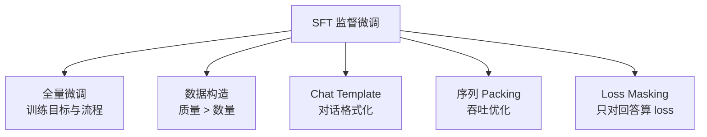

# SFT 监督微调总览

> **一句话**：用高质量的「指令-回答」数据对预训练模型做有监督微调，让它从"续写器"变成"对话助手"。

::: warning 状态
🚧 本页为占位大纲，正文尚未撰写。
:::

## 版块地图

## 核心目标函数

$$
\mathcal{L}_{\text{SFT}}(\theta) = -\mathbb{E}_{(x, y) \sim \mathbb{D}} \left[ \sum_{t=1}^{|y|} \log \pi_\theta(y_t \mid x, y_{<t}) \right]
$$

## 子主题

| 页面 | 内容 |
| --- | --- |
| [全量微调](/sft/full-finetuning) | 标准 SFT 流程、超参、与继续预训练的区别 |
| [数据构造](/sft/data-construction) | 数据来源、质量过滤、配比、合成数据 |
| [Chat Template](/sft/chat-template) | 对话模板、special token、多轮拼接 |
| [序列 Packing](/sft/packing) | 多样本拼接、attention 隔离、吞吐收益 |
| [Loss Masking](/sft/loss-masking) | 哪些 token 算 loss、多轮对话的 mask 策略 |

## TODO

- [ ] SFT 在后训练 pipeline 中的位置（与 DPO/RLHF 的衔接）
- [ ] 常见 failure mode：灾难性遗忘、过拟合模板、重复
- [ ] 参考文献：InstructGPT、FLAN、LIMA
