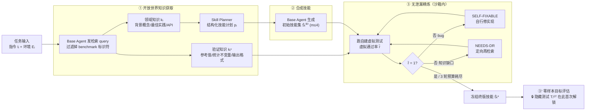

# OpenSkill（Lehigh/UIC 等）：开放世界里的 LLM Agent 自演化

**📄 [OpenSkill: Open-World Self-Evolution for LLM Agents](https://arxiv.org/abs/2606.06741)**

2026-06 · Lehigh / UIC / UBC·Vector / Salesforce AI / MGH·Harvard · [代码](https://github.com/OpenLAIR/OpenSkill)

**一句话**：当一个 agent 部署后手上只有任务提示、没有现成技能 / 成功轨迹 / 奖励 / verifier 时，OpenSkill 让它从开放世界（文档、代码仓库、网页）自己抓取「领域知识 + 验证锚点」，合成出**可跨模型迁移**的技能，并用自建虚拟测试在没有标准答案的前提下自我精炼。

::: details 📖 论文原文 Abstract（英文）
Self-evolving agents requires adaptation after deployment, but existing approaches assume a usable learning loop, such as curated skills, successful trajectories, or verifier signals. Real open-world deployments may provide none of these, offering only a task prompt. In this work, we study *open-world self-evolution*, where an agent must build both its skills and its own verification signals from scratch, using open-world resources but no target-task supervision. We propose **OpenSkill**, a framework that bootstraps this loop: it acquires grounded knowledge and verification anchors from documentation, repositories, and the web, synthesizes them into transferable skills, and refines those skills against self-built virtual tasks grounded in the anchors rather than in target answers. The open world thus supplies both the knowledge to be learned and a supervision-independent practice environment, with target-task supervision reserved for final evaluation. Across three benchmarks and two target agents, OpenSkill attains the best automated pass rate while satisfying the no-supervision constraint. Analysis shows its skills transfer across models without model-specific adaptation, and its self-built verifier aligns with ground-truth outcomes despite never accessing them.
:::

**相关**：[AutoSkill 总览](/skills/autoskill/) · [SkillOS](/skills/autoskill/skillos) · [SkillOpt](/skills/autoskill/skillopt) · [SkillOps](/skills/autoskill/skillops) · [Deep Research 总览](/agent/deep-research/)

> 图源：Yan et al., *OpenSkill: Open-World Self-Evolution for LLM Agents*（arXiv:2606.06741）Figure 1——四种自演化范式，只有 OpenSkill 三个属性全绿（用于学习注解，版权归原作者）。

## 动机与创新点：自演化需要的监督，开放世界里一样都没有

[AutoSkill 总览](/skills/autoskill/) 里反复出现的三段式是「从轨迹析出 → 验证/筛选 → 入库/复用」。无论是 Voyager 的自我验证、还是 SkillOS 的策展式 RL，背后都隐含一套**学习基础设施**：要么有 curated 的技能/示例，要么有成功轨迹可归纳，要么有一个能给对错信号的 verifier（哪怕是环境返回的 reward）。论文把它收成一句中心问题——

> *Can an LLM agent self-evolve in the open world?*

作者指出现有方法在两处都依赖闭世界假设。**Limitation 1（技能构造）**：技能要么人写、要么从模型参数知识 $\mathcal{K}_\theta$ 里掏、要么从成功轨迹蒸馏，这些来源"costly, bounded by prior knowledge, or unavailable before successful task attempts"——对需要最新 API、项目特定约定、冷门领域规则的任务尤其不够用。**Limitation 2（验证构造）**：现有 self-improvement loop 靠 task-level feedback / self-feedback / verifier output 来改行为，"works in curated benchmarks, but open-world deployment may expose no reliable feedback during learning"。

OpenSkill 把约束推到极致：运行时只有**原始任务提示**与开放世界资源，没有初始技能、没有 demonstration、没有 reward、没有 verifier。直接拿目标任务答案来监督是不行的——评测的隐藏测试集本就不该被 agent 看到；让 agent 反过来"猜"隐藏测试，又会沦为对评测的过拟合（reverse-engineering hidden supervision）。它的破局思路是**把"验证"从目标答案上解耦**，改为锚定开放世界里那些独立可查、与具体答案无关的客观事实。

**关键创新**：

- **定义 open-world self-evolution 这一新设定**：从仅有的任务提示出发，agent 必须**同时**自建技能与自建验证信号，且全程不碰目标任务监督——把"自演化"的门槛从"有反馈的练习场"降到"只有题面"。
- **开放世界知识获取（不只取知识，还取验证锚点）**：检索 $\mathcal{K}$ 同时产出领域知识 $k_i$ 与**验证知识 $k_i^v$**（reference values / 数据集统计不变量 / 交叉验证流程 / 期望输出格式），后者是无答案验证的支点。
- **无泄漏技能精炼（leakage barrier）**：用 $k_i^v$ 自建 pytest 形式的**虚拟测试套件**，以**虚拟通过率** $\tilde r$ 作质量代理迭代打磨；并有 Gap-vs-Bug 诊断分类器，区分"实现 bug（自修）"还是"知识缺口（再检索）"。
- **技能是模型无关的可迁移产物**：技能被刻意做成显式、可读、与权重解耦的 artifact，因此**一个模型造、另一个模型用**，无需重训或适配。
- **三 benchmark / 两 agent 全面最优**：在满足 no-supervision 约束下取得最佳自动化通过率，自建 verifier 还与从未接触的 ground-truth 显著对齐。

## 方法：acquire → synthesize → refine 三阶段，目标监督只在最后进入

### 问题设定：什么叫"supervision-free"

考虑 $n$ 个目标任务 $\{(\mathcal{I}_i, \mathcal{E}_i)\}_{i=1}^n$，$\mathcal{I}_i$ 是自然语言指令、$\mathcal{E}_i$ 是执行环境，agent $\pi_\theta$ 在环境里执行得到终态 $x_i = \pi_\theta(\mathcal{I}_i, \mathcal{E}_i)$，每个任务配一套隐藏的真值测试 $\mathcal{T}_i^{\text{GT}} \in \{0,1\}$。自演化有两条路：改权重 $\theta$（微调 / RL），或**给上下文挂外部知识 artifact**。OpenSkill 选后者，因为它"computationally cheap, transferable across models, and inspectable"，而改权重"expensive, model-specific, and opaque"。于是技能被形式化为一个技能集 $\mathcal{S}_i = \{s_{i,1}, \dots, s_{i,m}\}$，在不改 $\theta$ 的前提下调制行为 $x_i = \pi_\theta(\mathcal{I}_i, \mathcal{S}_i, \mathcal{E}_i)$。

关键是把"监督"定义清楚：agent 只观测到 $(\mathcal{I}_i, \mathcal{E}_i)$，而 $\mathcal{T}_i^{\text{GT}}$、参考解、人类反馈全是隐藏的。

> Observing the input $(\mathcal{I}_i, \mathcal{E}_i)$ is not supervision: we reserve the term *supervision* for dependence on the hidden signal $\mathcal{T}_i^{\text{GT}}$.

一个构造过程 $f$ 被称为 **supervision-free**，当且仅当它"既不在构造时观测 $\mathcal{T}_i^{\text{GT}}$，也不去逆向工程它来造精炼用的虚拟测试"。最朴素的技能集只能从可观测输入构造：

$$\hat{\mathcal{S}}_i = f(\mathcal{I}_i, \mathcal{E}_i) \tag{1}$$

但光有题面通常不足以造出好技能，于是允许 agent 与开放世界交互、取开放世界知识 $\mathcal{K}$（公开文档、代码仓库、论文、教程，皆不泄露目标监督），构造问题扩成：

$$\hat{\mathcal{S}}_i = f(\mathcal{I}_i, \mathcal{E}_i, \mathcal{K}) \tag{2}$$

其中 $f$ 就是 OpenSkill 流水线。整条管线分三阶段，前两阶段在"无目标监督"下完成，隐藏测试集**只在最后一步评估时才解锁**：

> 图源：Yan et al., *OpenSkill*（arXiv:2606.06741）Figure 2——框架总览，注意贯穿底部的"leakage barrier：target supervision cannot enter evolution"（用于学习注解，版权归原作者）。

### ① 开放世界知识获取：连"怎么验证"的锚点一起取回来

先前方法（如 Anthropic 的 Skill Creator）"construct skills entirely from the LLM's parametric knowledge $\mathcal{K}_\theta$"——只会模型已知的东西，对最新 API、项目约定、冷门规则就抓瞎。OpenSkill 改为主动查开放世界：给定 $(\mathcal{I}_i, \mathcal{E}_i)$，先用开放世界检索函数 $\mathcal{D}$ 取回任务相关知识 $k_i = \mathcal{D}(\mathcal{I}_i, \mathcal{K})$（背景概念、最佳实践、API 文档、来源引用），再由 Skill Planner 据 $(\mathcal{I}_i, \mathcal{E}_i, k_i)$ 合成一份结构化**技能计划 $p_i$**，规定技能架构、关键步骤、领域规则。

真正的关键是它**额外**取一份**验证知识**：

$$k_i^v = \mathcal{D}^v(\mathcal{I}_i, \mathcal{K}), \quad k_i^v \subset \mathcal{K}$$

$k_i^v$ 提供"independently verifiable anchors for later quality assessment"，具体形式包括官方文档里的**参考数值**、知名数据集的**统计不变量（statistical invariants）**、领域标准里的**交叉验证流程**、库函数文档规定的**期望输出格式**。它将在第②/③阶段为虚拟测试的生成"打地基"。

> 举例：要给"分析某公开数据集"的任务造技能，$k_i$ 可能是该数据集的字段说明与常用 pandas 操作；$k_i^v$ 则是"该数据集**已知有 X 行**""某指标**取值范围在 [0,1]**""某库函数**文档规定返回 DataFrame**"——这些都独立于"本题正确答案是多少"，却能约束一个正确解必须满足的客观性质。

为防答案泄漏，$\mathcal{D}$ 与 $\mathcal{D}^v$ 发出的所有 query 都"filtered to exclude the benchmark name and any identifiers that could lead to $\mathcal{T}_i^{\text{GT}}$"，并在附录 F 单独审计这道信息隔离。

### ② 合成技能：拆成 1–4 个模型无关的结构化技能

base agent $\pi_\theta$ 据 $(\mathcal{I}_i, \mathcal{E}_i, p_i, k_i)$ 生成初始技能集 $\hat{\mathcal{S}}_i^{(0)} = \{\hat{s}_{i,1}^{(0)}, \dots, \hat{s}_{i,m}^{(0)}\}$，其规模 $m$（$1 \le m \le 4$）由第①阶段的技能计划 $p_i$ 钉死，且**所有 $m$ 个技能在同一个 agent session 里联合精炼**。技能被刻意做成**与具体模型无关**的显式 artifact——这正是后面跨模型迁移成立的前提：因为 $\hat{\mathcal{S}}_i^*$ 是可移植的产物，"skills built with one model can be deployed on another"。

### ③ 无泄漏技能精炼：用自建虚拟测试当"无答案的练习场"

技能要在没有真值反馈下被打磨。OpenSkill 据第①阶段的验证知识 $k_i^v$ 自建一套**虚拟测试套件**：

$$\tilde{\mathcal{T}}_i = g(\mathcal{I}_i, \mathcal{E}_i, k_i^v) \tag{3}$$

$\tilde{\mathcal{T}}_i$ 充当隐藏 $\mathcal{T}_i^{\text{GT}}$ 的代理。每条虚拟测试 $\tilde t_{i,k} \in \{0,1\}$ 是"a deterministic assertion anchored to independently verifiable facts rather than guessing what the ground-truth tests might check"——比如核验某公开数据集已知行数、某标准指标的期望取值范围、某库函数的文档化输出格式。生成器 $g$ 被实现为一个**隔离的 verifier LLM 会话**，它要么按任务规则独立重算出期望值、要么直接从检索锚点取值，最终吐出一份**确定性的 pytest 断言脚本**。这就同时满足两个看似矛盾的要求：既避免逆向工程隐藏监督（agent 拿不到也不去猜标准答案），又能给出有意义的质量信号（断言来自客观事实）。

精炼最多迭代 $J$ 轮（取 $J=3$）。第 $j$ 轮把当前技能集 $\hat{\mathcal{S}}_i^{(j)}$ 在沙箱里执行、对 $\tilde{\mathcal{T}}_i$ 评测，得**虚拟通过率**：

$$\tilde{r}^{(j)} = \frac{1}{|\tilde{\mathcal{T}}_i|} \sum_{k=1}^{K} \tilde{t}_{i,k}\big(\pi_\theta(\mathcal{I}_i, \hat{\mathcal{S}}_i^{(j)}, \mathcal{E}_i)\big) \tag{4}$$

**诊断驱动的精炼**：当 $\tilde r^{(j)} < 1$，流水线产出一份结构化失败诊断 $\mathcal{F}^{(j)}$（逐断言结果、根因分析、修订建议），据此精炼：

$$\hat{\mathcal{S}}_i^{(j+1)} = \pi_\theta(\hat{\mathcal{S}}_i^{(j)}, \mathcal{F}^{(j)} \mid \mathcal{I}_i, \mathcal{E}_i, p_i, k_i) \tag{5}$$

诊断里有个**Gap-vs-Bug 分类器**（由一个 LLM 判定）：

- 若是**实现 bug**（标 SELF-FIXABLE）：agent 直接自行改技能实现；
- 若是**知识缺口**（标 NEEDS-DR）：触发定向再检索 $k_i^{(\text{gap})} = \mathcal{D}(\mathcal{F}^{(j)}, \mathcal{K})$，把补到的知识注入精炼上下文。

循环在 $\tilde r^{(j)} = 1$ 或耗尽 $J=3$ 轮预算时终止（另有 stall/budget 早停）。这里有个微妙边界：$\tilde r$ 只有在与隐藏 $\mathcal{T}_i^{\text{GT}}$ 对齐时才是可靠代理，否则精炼会奖励"过拟合虚拟测试"的技能——这一点作者把它当成实证问题，在 RQ2 专门量化（见下）。

### ③' 零样本目标评估：技能交给"另一个"模型跑

精炼后的终版技能集 $\hat{\mathcal{S}}_i^*$（loop 终止时的最后一版，是**原地编辑**而非 best-of-N 快照）被部署到目标 agent $\pi_{\theta'}$，零样本执行目标任务，由隐藏真值测试 $\mathcal{T}_i^{\text{GT}} \in \{0,1\}$ 判通过：

$$\text{PassRate} = \frac{1}{n} \sum_{i=1}^{n} \mathcal{T}_i^{\text{GT}}\big(\pi_{\theta'}(\mathcal{I}_i, \hat{\mathcal{S}}_i^*, \mathcal{E}_i)\big) \tag{6}$$

注意目标 agent $\pi_{\theta'}$ **不必**是构造 agent $\pi_\theta$——因为 $\hat{\mathcal{S}}_i^*$ 是可移植 artifact，一个模型造、另一个模型用，而隐藏的 $\mathcal{T}_i^{\text{GT}}$ 只在这最后一步进入。

## 实验结果：三 benchmark / 两 agent 全面最优，且能跨模型迁移

### 评测设置与基线

- **三个 benchmark**：**SkillsBench**（主基准，11 个任务域、技能质量是瓶颈：Software / Office / Science / Media / Cybersecurity / Finance / Robotics / Energy / Manufacturing / Health / Math）、**SocialMaze**（社会推理）、**ScienceWorld**（交互式科学实验，两类任务）。全程按开放世界协议跑，真值测试在构造期隐藏、只在最终评估查阅。
- **两个目标 agent**（来自不同模型家族）：Opus 4.6（Claude Code）与 GPT 5.2（Codex）；流水线端到端跑，技能用同一模型构造并部署。
- **七个闭世界自动化基线**：No Skill、Self-Gen、CoT、Skill Creator（Anthropic）、AutoSkill、Memento、SkillNet（仅 ScienceWorld）。Human 作为参照上界、不参与"最佳自动化方法"评比。

### SkillsBench 主结果（以原文为准）

| 方法 | Opus 4.6 总体 | Δ vs No Skill | GPT 5.2 总体 | Δ vs No Skill |
| --- | --- | --- | --- | --- |
| No Skill | 25.5 | — | 25.0 | — |
| Self-Gen | 23.9 | −1.6 | 32.2 | +7.2 |
| CoT | 23.9 | −1.6 | 33.3（次优） | +8.3 |
| Skill Creator | 34.7（次优） | +9.2 | 29.2 | +4.2 |
| AutoSkill | 24.7 | −0.8 | 11.2 | −13.8 |
| Memento | 30.1 | +4.6 | 15.6 | −9.4 |
| **OpenSkill** | **43.6** | **+18.1** | **42.1** | **+17.1** |
| *Human（上界）* | *44.5* | *+19.0* | *44.8* | *+19.8* |

- OpenSkill 在两个 agent 上都拿**最佳自动化通过率**，比最强闭世界基线高 **+8.9 / +8.8 个点**，离 Human 上界仅差 1–3 点。
- 它也是唯一在两个 agent 上都稳健的：单 pass 法（Self-Gen、CoT）在 GPT 5.2 上有用、在 Opus 4.6 上反而拖后腿；迭代法（AutoSkill、Memento）则在 GPT 5.2 上崩盘（AutoSkill 24.7%→11.2%、Memento 30.1%→15.6%，双双跌破 25.0% 的 no-skill 地板）。
- **逐域**：Opus 上 8/11 域最优或并列最优、GPT 上 7/11；知识密集域涨幅最大（Opus 的 Health 69.6%、Software 59.9%；GPT 的 Energy 80.0%、Cybersecurity 52.5%，**双双超过 Human**）。Manufacturing 则对所有自动化方法都塌成 0.0%——这是单靠开放世界获取解决不了的硬骨头。

### 跨 benchmark 一致领先

| 方法 | SocialMaze (Opus / GPT) | ScienceWorld (Opus / GPT) |
| --- | --- | --- |
| 最强基线 | 81.6 / 69.8 | 88.7 / 83.1 |
| **OpenSkill** | **82.7 / 70.7** | **90.0 / 85.3** |

在 SocialMaze 与 ScienceWorld 上 OpenSkill 仍是四列全胜，较最强基线再 **+0.9 ~ +2.2 个点**，GPT 5.2 上增益更明显。

### RQ1：技能跨模型迁移，无需任何适配

把 Opus 4.6 生成的技能库**原样**部署到四个更弱的目标模型（Haiku 4.5、Qwen 3 Coder、DeepSeek V3、Mistral Large 3），在 SkillsBench 上评测：

> 图源：Yan et al., *OpenSkill*（arXiv:2606.06741）Figure 3——Opus 4.6 技能迁移到其他模型的 SkillsBench 平均 reward（用于学习注解，版权归原作者）。

OpenSkill 技能在全部四个目标模型上都拿最高 reward，相对 no-skill 基线提升 **5.5%–14.8 个点**，且"without any model-specific adaptation：the same skill files produced by Opus 4.6 are used as-is"。对照之下 AutoSkill 比 no-skill 还差，说明它的技能"tightly coupled to the originating model and fail to generalize"。作者据此给出 RQ1 结论：

> OpenSkill encodes task-relevant knowledge in a model-agnostic form, so the same skill files transfer effectively across models—without any model-specific adaptation—even to substantially weaker ones.

### RQ2：从未见真值的自建 verifier，竟与真值显著对齐

衡量虚拟 verifier 质量的两条轴——与真值结果的**对齐度**、对真值测试意图的**覆盖度**（$N=84$ 的代理判定 × 真值奖励交叉表）：

| | Reward > 0 | Reward = 0 | 合计 |
| --- | --- | --- | --- |
| Proxy Pass | 39.29% | 29.76% | 69.05% |
| Proxy Fail | 9.52% | 21.43% | 30.95% |

- **对齐**：虚拟 verifier 精确率 **56.9%**、召回率 **80.5%**、总体一致率 **60.7%**；与真值的关联统计显著（Fisher 精确检验 OR=2.97, $p=0.035$；point-biserial $r=0.242$, $p=0.027$）——它"provides a meaningful quality signal despite operating without access to ground-truth tests"。
- **覆盖**：随机抽 15 个任务做语义匹配，虚拟 verifier 覆盖了 **88.9% 的真值测试意图（135 个里命中 120 个）**；未覆盖的 11.1% 集中在两类——针对评测基础设施的**反作弊元校验**，以及需要领域专家才能判的**深层语义质量**（如分类体系一致性、词形还原正确性）。同时它平均每个任务生成的测试函数数是真值套件的 **3.4 倍中位数**、多出约 **15.3 条断言**（多为输出格式、类型有效性、领域边界的防御性检查）。

> 结论（RQ2）：The virtual verifier uses no ground-truth tests, yet its proxy tests cover most human-authored test intents and track the true outcomes closely enough to gate skill generation on their own.

### RQ3：消融——开放世界检索与虚拟 verifier 各有贡献且互补

> 图源：Yan et al., *OpenSkill*（arXiv:2606.06741）Figure 4——SocialMaze 上的两项消融：(a) 精炼迭代次数、(b) 组件贡献（用于学习注解，版权归原作者）。

- **迭代次数**：在 $\{1,3,5,10\}$ 里，3 轮（82.7%，即默认配置）达峰，5 轮 79.9%、10 轮 78.0% 逐步退化——"excessive refinement introduces overfitting to virtual test feedback"，这也印证了 $J=3$ 的预算选择。
- **组件贡献**：纯参数知识基线 74.5%；单独加**虚拟 verifier(VV)** 到 80.8%、单独加**开放世界检索(DR)** 到 80.6%，二者各 +6 点上下；全开 82.7%（共 +8.2 点）。两组件"largely complementary"，组合最优但边际增益略有重叠（它们纠的错部分相交）。

> 看榜须知：以上分数的口径、目标 agent、test-time 配置各异，跨系统比绝对值意义有限，当作"开放世界免监督设定下的能力量级参照"即可；具体数字以原文为准。

## 在 AutoSkill 谱系里的位置：差在「获取」

放回 [AutoSkill](/skills/autoskill/) 的版图，几条路线分工不同——多数都假设"技能或其原料已在手上"，工作集中在筛、调、管；OpenSkill 把问题前移到了**源头**：当一个 agent 连 curated 技能、成功轨迹、verifier 信号都没有时，如何从开放世界**凭空获取**出可用知识与验证依据。

| 路线 | 重心 | 一句话 |
| --- | --- | --- |
| [SkillOS](/skills/autoskill/skillos) | 策展（curation） | 用 RL 决定哪些技能值得留、怎么组织检索 |
| [SkillOpt](/skills/autoskill/skillopt) | 优化（optimization） | 把技能当可优化对象（乃至等价于权重）去调 |
| [SkillOps](/skills/autoskill/skillops) | 运维（ops） | 技能库的工程化：版本、去重、监控、热插拔 |
| **OpenSkill** | **获取（acquisition）** | **从开放世界自动取到知识 + 验证锚点，再合成技能** |

论文自己用一张能力对比表（Table 4）把这层差异钉死：四个能力维度——**OW retr.**（超出参数/经验记忆，去开放世界取知识）、**Refine**（迭代精炼技能）、**SF verif.**（supervision-free 的验证信号，无目标任务反馈）、**Artifact**（产出显式、可跨模型迁移的技能）——在 No Skill / Self-Gen / CoT / Skill Creator / AutoSkill / Memento 里，没有任何一个能同时点满；只有 **OpenSkill 四项全勾**。Self-Gen/CoT 只有 Artifact，Skill Creator/AutoSkill/Memento 多了 Refine 但都缺 OW retr. 与 SF verif.。

几条横向关系值得工程师留意：

- **vs SkillOS / SkillOpt / SkillOps**：它们大体假设"技能或原料已在手上"，分别做筛选、调优、运维；OpenSkill 解决的是它们的**上游前置问题**——原料从哪来、又如何在没有 verifier 时被验证。三者的策展/优化/运维能力与 OpenSkill 的获取能力是**互补叠加**关系，而非替代。
- **vs Skill Creator / AutoSkill（同为"造技能"）**：Skill Creator 只从模型参数知识造技能（不 grounded 于开放世界），AutoSkill 的技能与原模型强耦合、迁不动（RQ1 里甚至跌破 no-skill）；OpenSkill 把开放世界获取当成技能内容的主来源，并坚持技能是显式、可迁移的 artifact。
- **vs [Deep Research](/agent/deep-research/)**：两者是近亲，都靠主动检索式信息获取。区别在于 Deep Research 的检索产物最终落成一份**报告**，而 OpenSkill 的检索产物要被固化成**可执行、可迁移、可自验证的技能**，并额外检索出"怎么验证"的锚点——这正是它相对纯检索增强（RAG / 深研）的独特之处：把 open-world retrieval 当作"合成持久可复用技能 + grounding 自验证信号"的基底，而非"回答单个 query"。

作者也坦陈边界：开放世界来源可能噪声大、过时、自相矛盾，需要 provenance 追踪与来源校验；虚拟任务若太易会高估技能质量、若从隐藏答案派生又会重新引入监督泄漏；且开放世界研究相比闭世界技能生成会抬高成本与时延。
