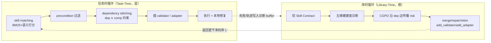

# SkillOps（Emory/UIUC）：把 agent 技能库当作可自维护的软件生态来运维

**📄 [SkillOps: Managing LLM Agent Skill Libraries as Self-Maintaining Software Ecosystems](https://arxiv.org/abs/2605.13716)**

2026-05 · Emory University / UIUC（Xinyuan Song, Hongji Pu, Liang Zhao）· [代码](https://github.com/Hik289/SkillOps)

**一句话**：SkillOps 把 agent 的技能库当成一套会"长 bug、会腐化"的软件系统——技能随增删改、复用、打补丁、依赖漂移而沉淀出 **skill technical debt（技能技术债）**——于是用带类型的 Skill Contract 把每个技能写成可静态检查的契约、用分层生态图 HSEG 把整库组织成可分析的图，再以"任务时规划 + 库时维护"双循环持续诊断健康度并自动修复。它给技能生命周期补上了一个长期缺位的"运维 / SRE"视角。

::: details 📖 论文原文 Abstract（英文）
LLM agents increasingly rely on skill libraries for multi-step tasks, yet these libraries can accumulate persistent defects as skills are added, reused, patched, and linked to changing dependencies. We call this failure mode **skill technical debt**: library-level defects that may not break a single skill locally but can harm future retrieval, composition, and execution. Existing skill-based agents mainly focus on task-time retrieval, planning, and repair, while library-time maintenance remains underexplored. We propose **SkillOps**, a method-agnostic plug-in framework for maintaining skill libraries. SkillOps represents each skill as a typed **Skill Contract** $(P, O, A, V, F)$, organizes skills with a **Hierarchical Skill Ecosystem Graph (HSEG)**, and diagnoses library health across utility, compatibility, risk, and validation dimensions. Given a raw skill library, SkillOps produces a maintained library that can be used by existing retrieval or planning agents without changing their internal code. On ALFWorld, SkillOps achieves 79.5% task success as a standalone agent, outperforming the strongest baseline by +8.8 percentage points with no additional task-time LLM calls. As a plug-in layer, it improves retrieval-heavy baselines by +0.68–+2.90 percentage points. The current rule-based maintenance implementation uses nearly zero library-time LLM calls or tokens, showing that skill-library maintenance can be added as a low-overhead architectural layer. Code is publicly available at https://github.com/Hik289/SkillOps.git.
:::

**相关**：[AutoSkill 总览](/skills/autoskill/) · [SkillOS](/skills/autoskill/skillos) · [SkillOpt](/skills/autoskill/skillopt)

> 图源：Song, Pu, Zhao, *SkillOps: Managing LLM Agent Skill Libraries as Self-Maintaining Software Ecosystems*（arXiv:2605.13716）Figure 1——HSEG 两层结构与任务时/库时双循环（用于学习注解，版权归原作者）。

## 动机与创新点：技能库会累积"技术债"，需要一层库时运维

[AutoSkill 总览](/skills/autoskill/) 讨论的是技能怎么被"生产"出来——agent 从轨迹里自动析出、验证、入库、复用。但生产只是开始：一个长期运行的 agent，其技能库会像任何活的代码仓库一样不断被增删改。SkillOps 关心的正是这之后的问题——**库本身会随时间腐化，谁来运维它？**

软件工程里有个朴素观察：代码不会因为写完就静止，它会随需求变更、依赖升级、补丁叠加而积累"技术债"。SkillOps 把这套直觉原样搬到技能库上。论文借用 Cunningham（1992）与 Sculley et al.（2015）对软件 / ML 系统技术债的定义，提出 **skill technical debt**——

> persistent defects in a skill library, such as redundancy, missing validation, interface drift, or stale implementations, that may not break a single skill locally but can reduce future retrieval, composition, and execution reliability.

关键词是 **persistence（持续性）**：任务时修复（task-time repair）只能救活当前这一个失败 episode，"while the underlying library defect remains and can cause future failures when the skill is reused"——底层的库级缺陷还在，下次复用这个技能时照样翻车。典型表现包括：大量低价值技能膨胀检索池、把"对的技能"挤出召回；近重复（near-duplicate）技能彼此竞争、降低检索精度；技能间接口类型不匹配、组合时悄悄断链；运行时已损坏（empirical failure 高）的技能仍留在库里；技能缺少验证器、错误产物无人拦截、沿依赖链向下游传播。

作者指出现有工作几乎都聚焦**任务时**：怎么检索到对的技能、怎么把检索到的技能拼成可执行计划、怎么在执行时校验并修复输出——"these methods are important, but they do not directly solve the library-time problem"。它们都默认"库是健康的"，而这个假设随库变大越来越站不住。SkillOps 把"技术债下的技能库维护"建模成一个**插件问题**：在下游 agent 用库之前先跑一层库管理——诊断持续缺陷、施加带类型的修复、返回干净的库，且**下游检索 / 规划 agent 的内部代码一行都不用改**。

**关键创新**：

- **typed Skill Contract**：把每个技能写成可机读、可静态检查的五元组契约 $(P,O,A,V,F)$，相关性 / 可用性 / 可组合性 / 本地可验证性都能直接从契约结构上判断，**不必真的把技能跑一遍**。
- **HSEG 分层生态图**：用"图的图"组织整库——外层用四类带类型边连技能、内层每个技能本身又是一张契约图；把"诊断库健康度"变成"在图上跑分析"，区别于纯启发式清理。
- **任务时 / 库时双循环**：任务时把 HSEG 当可执行规划结构（匹配→拼接→插桩→自修复），库时把执行轨迹转成持久的库更新（诊断→传播风险→施加带类型修复动作）。
- **method-agnostic 插件接口**：$L' = \text{run\_maintenance}(L)$ 是一个纯库变换，可直接挂到 BM25 / 稠密 / 混合检索、LLM 规划器、图规划器、自修复 agent 之上。
- **几乎零库时 LLM 成本**：维护靠可观测的规则信号而非 LLM 判断，任务时不增加任何额外 LLM 调用——把库治理做成可以"半夜跑"的离线运维任务。

## 方法：Skill Contract + HSEG + 任务时 / 库时双循环

### 核心抽象：Skill Contract 五元组与分层生态图 HSEG

**typed Skill Contract。** SkillOps 把每个技能 $s \in \mathcal{S}$ 写成一个五元组——"models each skill as an executable contract rather than only a name or text description"：

$$s = (P, O, A, V, F)$$

- **P（Precondition）**：调用前必须满足的前置条件；
- **O（Operation）**：可执行的操作过程本身；
- **A（Artifact）**：技能产出的**带类型**产物；
- **V（Validator）**：对产物 $A$ 的正确性检查；当 $V=\varnothing$ 时即一个"验证缺口（validation gap）"——"the skill has no local correctness check"；
- **F（Failure modes）**：已知失败模式集合。

**Hierarchical Skill Ecosystem Graph（HSEG）。** 一个技能库是二元组 $\mathcal{L} = (\mathcal{S}, \mathcal{R})$，$\mathcal{R}$ 是技能之间的带类型有向关系。SkillOps 用两层图：

- **外层 Graph-of-Graphs（库级拓扑）**，四类边：
  - 依赖 $s_i \xrightarrow{\text{dep}} s_j$：$s_i$ 的产物能满足 $s_j$ 的部分前置，$A_{s_i} \subseteq P_{s_j}$；
  - 兼容 $s_i \xrightarrow{\text{comp}} s_j$：$s_i$ 的输出类型与 $s_j$ 要求的输入类型相容；
  - 冗余 $s_i \xrightarrow{\text{red}} s_j$：两技能暴露等价接口，$P_{s_i} \equiv P_{s_j}$ 且 $A_{s_i} \equiv A_{s_j}$；
  - 替代 $s_i \xrightarrow{\text{alt}} s_j$：同目标不同实现，$\text{goal}(s_i)=\text{goal}(s_j)$ 但 $O_{s_i} \neq O_{s_j}$。
- **内层 Skill Graph**：每个技能本身又是一张在 $(P,O,A,V,F)$ 五个组件上的契约图。

> 举例：技能「网页抓取器」产出一个 `RawHTML` 产物，技能「正文抽取器」的前置正好需要 `RawHTML`——这就是一条 dep 边；如果抓取器实际吐的是 `bytes` 而抽取器要 `str`，dep 边在，但 comp 边缺，于是组合在"看起来能接"的地方运行时断链。HSEG 把这种"单边依赖图运行时才发现的错配"在规划阶段就显式标出来。

把库表示成图之后，"诊断库健康度"就变成了"在图上跑分析"——这是 SkillOps 区别于纯启发式清理的关键。整体两个循环交替驱动：

### 任务时循环：Graph-of-Graphs 规划器（匹配 → 拼接 → 插桩 → 自修复）

给定任务 $\tau$ 与库 $\mathcal{L}=(\mathcal{S},\mathcal{R})$，任务时循环把 HSEG 当一个可执行的规划结构，分四阶段：

**Stage 1 — 技能匹配。** 先用词法 + 语义混合相关性给每个技能打分：

$$r(s, \tau) = \lambda\, r_{\text{BM25}}(s, \tau) + (1-\lambda)\, r_{\text{sem}}(s, \tau) \tag{1}$$

再只留下"高分**且**前置被当前状态满足"的候选：$C = \{s \in \mathcal{S} : r(s,\tau) \ge \theta\}$。这一步"prevents the planner from selecting skills that are textually relevant but not executable"——挡住"文本上相关、实际跑不动"的技能。

**Stage 2 — 依赖拼接。** 在候选集 $C$ 上搜计划，且**同时**强制依赖与兼容约束：一个从 $s_i$ 到 $s_j$ 的转移，只有当 $s_i \xrightarrow{\text{dep}} s_j$ **且** $s_i \xrightarrow{\text{comp}} s_j$ 时才允许：

$$\pi^\star = \arg\max_{\pi=(s_1,\dots,s_T)} \sum_{t=1}^{T} r(s_t, \tau), \quad s_t \xrightarrow{\text{dep}} s_{t+1},\; s_t \xrightarrow{\text{comp}} s_{t+1} \tag{2}$$

作者强调"dependency alone is not enough"：只有产物类型也匹配下一技能的期望输入，转移才被接受——避开"单边依赖图只能在运行时才发现"的接口错配。

**Stage 3 — 插桩（validator / adapter）。** 若候选计划里有个非终端技能 $V_s=\varnothing$，就把它的出边标为"不可验证"并尽量插一个 validator 节点；若有 dep 边却没有 comp 边，就插一个 adapter 节点：

$$s_i \xrightarrow{\text{dep}} s_j,\quad s_i \not\xrightarrow{\text{comp}} s_j \;\Longrightarrow\; s_i \to a_{ij} \to s_j \tag{3}$$

且 adapter $a_{ij}$ 只在"其输出类型满足下游前置"时才被接受：$\text{type}(A_{a_{ij}}) \subseteq \text{type}(P_{s_j})$。"adapters are not free-form patches; they are graph nodes inserted to restore a broken type constraint"——adapter 不是随手打的补丁，而是为修复一个被破坏的类型约束而插入的图节点。

**Stage 4 — 本地修复。** 执行时若技能 $s_k$ 失败而剩余计划仍可救，规划器尝试用一个 $\xrightarrow{\text{alt}}$ 邻居替换 $s_k$，或带着观测到的错误轨迹重新调 $\text{repair}(s_k)$；若彻底救不回，就把这次失败记进**库时诊断 buffer**，留给后续维护。

### 库时循环：五维健康度诊断 + CGPD 风险传播

**五维健康度诊断。** 每个技能 $s$ 沿五个维度各打一个 $[0,1]$ 分，每维对应一类常见技能技术债：

- **Utility $U(s)$**：近期任务调用中"成功用到 $s$"的比例——抓低价值、膨胀检索池的技能；
- **Redundancy $R(s)$**：$s$ 所在最大 $\xrightarrow{\text{red}}$ 簇的归一化规模——抓近重复、降检索精度的技能；
- **Compatibility $C(s)$**：与 $s$ 相连的依赖边中"同时也是兼容边"的比例——抓产物与期望输入间的接口错配；
- **Failure-Risk $F(s)$**：$s$ 的经验失败率——抓运行时已损坏、需修复的技能；
- **Validation-Gap $G(s)$**：即 $\mathbf{1}[V_s=\varnothing]$——抓缺验证器、可能让无效产物向下游扩散的技能。

全库健康度是各维度的加权平均（论文用均匀权重 $w_U=w_R=w_C=w_F=w_G$）：

$$H(\mathcal{L}) = \frac{1}{|\mathcal{S}|}\sum_{s \in \mathcal{S}} \Big( w_U U(s) + w_R(1-R(s)) + w_C C(s) + w_F(1-F(s)) + w_G(1-G(s)) \Big) \tag{4}$$

这五维"cover skill degradation across use frequency, clone growth, interface consistency, execution reliability, and validation coverage"——把库的腐化在使用频率、克隆增殖、接口一致性、执行可靠性、验证覆盖五个面上量化。库时循环只在健康度下降超过阈值 $\Theta_{\text{maint}}$ 时才触发维护，避免无谓地折腾库。

**CGPD：沿依赖边传播风险。** 标准诊断是把每个技能**独立**评估；CGPD（ContractGraph-Propagated Diagnosis）是一个进阶组件，让风险沿 $\xrightarrow{\text{dep}}$ 边传播，从而能"在结构本身没问题、但继承了上游高风险的技能上**抢先插验证器**"。设 $R^{(t)}(s)$ 为技能 $s$ 在第 $t$ 轮的传播风险、$R_{\text{loc}}(s)$ 为由五维健康度算出的本地风险、$\text{Parents}(s)$ 为有依赖边指向 $s$ 的上游技能：

$$R^{(t+1)}(s) = (1-\alpha)R_{\text{loc}}(s) + \alpha \max_{s' \in \text{Parents}(s)} R^{(t)}(s') \tag{5}$$

$\alpha \in (0,1)$ 控制上游风险传过来多少。作者指出这个迭代"converges to a unique fixed point by Banach's contraction mapping theorem"——由 Banach 不动点定理收敛到唯一不动点。这样**上游技能高风险会"传染"下游**，系统得以在故障真正发生前抢先给受影响的技能补验证器。

> 举例：一条 dep 链「PDF 解析器 → 表格抽取器 → 数值汇总器」，若上游 PDF 解析器经验失败率高，CGPD 会把这份风险沿链传给下游汇总器——即便汇总器自身从没失败过，系统也会先给它插一个 validator，免得上游的脏产物悄悄流到最后一步。

### 维护动作与"几乎零 LLM"的插件接口

诊断完成后，库时循环执行一组**带类型的维护动作** $\mathcal{M}$（见 Algorithm 2：先合并冗余、再修高风险、退低价值、补验证器、插 adapter）：

- `merge(s_i, s_j)`：合并由 red 边相连的冗余对；
- `repair(s)`：用执行反馈重写操作 $O_s$；
- `retire(s)`：退役过时或长期失败的技能及其所有关联边；
- `add_validator(s)`：当 $V_s=\varnothing$ 时补一个验证器；
- `add_adapter(s_i, s_j)`：当 $s_i$ 被 $s_j$ 需要但接口不直接兼容时，插一个类型转换 shim；
- `instantiate(s, arg)`：在任务时给参数化技能绑定具体参数值。

**插件接口。** SkillOps 不假设特定的下游规划器或检索器，而是把一个原始库变换成维护后的库：$L' = \text{run\_maintenance}(L)$。这里 $f: L \mapsto L'$ 是一个**纯库变换**——"it diagnoses and repairs the skill library, but does not require access to the downstream agent's internal retrieval, planning, or execution logic"。下游代码保持不变，因此 SkillOps 能直接挂到 BM25 检索、稠密检索、混合检索、LLM 规划器、图规划器或自修复 agent 上。

**为什么"几乎零额外 LLM 调用"是卖点。** 很多"让 agent 自我反思 / 自我诊断"的方案，本质是在任务执行链路里再塞一轮甚至多轮 LLM 调用——延迟和 token 成本都直接转嫁到每一次任务上。SkillOps 刻意避开这条路：它的诊断**靠可观测信号而非 LLM 判断**——utility 日志、body-hash 碰撞（查近重复）、缺失的 validator、failure 日志、类型不匹配——这些都是规则可读的结构化信号。因此**任务时执行不增加任何额外 LLM 调用**，而规则版的库时维护循环本身 LLM 成本也"nearly zero"。这等于把技能库治理从"每任务在线开销"挪成"周期性离线开销"——一个可以半夜跑的运维任务，而非任务链路上的负担。

## 实验结果：ALFWorld 上 79.5%，抗退化且零额外开销

### 评测设置

- **基准**：[ALFWorld](https://arxiv.org/abs/2010.03768)（纯文本家务操作，多步、有结构化动作序列），从 ALFRED PDDL 数据集衍生。
- **技能库**：用 229 个精选 SkillsBench 技能构库；库规模 ≤229 时全是真技能，更大规模则保留全部真技能 + 注入**合成退化变体**凑数，覆盖六种常见技术债（冗余克隆、过时克隆、缺验证器、缺产物、错接口、过度专化）。九个库规模 $|\mathcal{L}| \in \{200, 250, 500, \dots, 2000\}$，采用**非嵌套构造**（不让小库是大库的严格子集），避免把规模效应做成"一个库是另一个超集"的假象。
- **指标**：Task Success Rate（SR），按 ALFWorld 离线 `high_pddl` 严格顺序子目标判分——agent 产出的高层动作序列须与标注 ground-truth 完全一致。三个独立 library seed（42/7/123）、每 seed 185 个任务实例，报 Wilson 95% 置信区间。
- **底座**：所有方法统一用 **GPT-4o-mini**、同库、同 gold-argument 假设；baseline 均为作者自实现的受控复现（GoS / GraSP 投稿时未放代码，故为 clean reproduction）。

### Benchmark 表现（H1 主对比）

> 图源：Song, Pu, Zhao, *SkillOps*（arXiv:2605.13716）Figure 6——H1 主对比，200 技能库 3 seeds 的任务成功率（用于学习注解，版权归原作者）。

**作为独立 agent（200 技能库，3 seeds，SR mean±std）**：

| 方法 | SR | 类型 |
| --- | --- | --- |
| **SkillOps_Full（ours）** | **79.5%** ±0.00 | typed-contract + HSEG 规划 |
| LLM_Skill_Planner | 70.6% ±0.31 | LLM 语义排序选技能 |
| GoS_Style | 61.1% ±0.94 | 单依赖边图规划 |
| Hybrid_Retrieval | 58.2% ±0.83 | BM25 + 嵌入混合检索 |
| SkillWeaver | 50.3% ±1.43 | 任务时自校验 / honing |
| ReAct | 12.8% ±1.90 | 全库塞进 flat prompt |

SkillOps 以 **79.5%** 居首、且三 seed 标准差为 0，超最强 baseline LLM_Skill_Planner **+8.9pp**。论文摘要写的是 **+8.8pp**、正文 / 表格给的精确值是 **+8.9pp**（$79.5-70.6$）——两处略有出入，此处如实保留，以论文为准。作者解释优势来源：SkillOps 不只检索语义相关的技能，还查前置、绑任务参数、只走兼容转移拼接，"reduces failures caused by skills that look relevant in text but cannot be safely composed in execution"。

**作为插件层（200 技能库，下游代码不变，$\Delta = \text{SR}_{+\text{SkillOps}} - \text{SR}_{\text{NoMaint}}$）**：

| 下游基线 | 图结构? | $\Delta$（pp） |
| --- | --- | --- |
| Hybrid Retrieval | 否 | **+2.90** |
| SkillWeaver | 否 | +2.46 |
| Dense Only | 否 | +1.12 |
| BM25 Only | 否 | +1.00 |
| GoS Style | 是 | +0.80 |
| LLM Skill Planner | 否 | +0.50 |
| ReAct | 否 | +0.00 |

增益最大的是检索型 agent——"maintaining the library makes the retrieved candidate pool cleaner"，维护过的库让 top-k 候选更干净、不易选到冗余 / 过时 / 接口不兼容的技能；而 LLM 规划 / 图规划基线本身已有些任务时过滤能力，增益偏小。这印证了 SkillOps 是 **method-agnostic 的可叠加层**，不要求换掉现有检索 / 规划方法。

### 抗退化与消融

> 图源：Song, Pu, Zhao, *SkillOps*（arXiv:2605.13716）Figure 4——噪声分级下的库规模敏感性，SkillOps 抗退化而检索型基线退化（用于学习注解，版权归原作者）。

**库规模敏感性（H2，盲设、无 gold argument）**：库从 200 增到 2000、退化密度从 15% 升到 90%，模拟一个无人维护、不断累积技术债的技能生态。SkillOps 全程稳定（78.9%–80.5%），在最大规模 **2000 技能时 80.5% SR，领先次优基线 +31.1pp**。任务时型基线则对噪声候选池越来越敏感——检索越来越多地翻出冗余克隆、坏验证器、类型错配的技能。SkillOps 靠 HSEG 类型契约过滤无效转移、靠库时维护在检索前就移走退化技能，规避了这种失败模式。

**消融（H3，SR@200 技能）**：

| 消融 | 去掉的组件 | SR@200 |
| --- | --- | --- |
| SkillOps_Full | 完整 HSEG + 双循环 | **79.5%** |
| NoCGPD | 去 CGPD 风险传播 | 79.0% |
| NoRetire | 去低价值退役 | 73.2% |
| NoInternalGraph | 去内层契约图 $(P,O,A,V,F)$ | 72.2% |
| NoMerge | 去冗余合并 | 71.9% |
| NoLibrary | 去整个库时维护 | 71.9% |
| NoExternalGraph | 去外层 graph-of-graphs 边 | 64.6% |
| NoRepair | 去 repair 动作 | 55.9% |
| NoValidator | 去 add_validator | 38.0% |
| NoTask | 去整个任务时循环 | 15.7% |
| NoAdapter | 去 add_adapter | 13.2% |

去掉任务时循环掉得最狠（79.5→15.7），证明"匹配 + 类型拼接 + validator/adapter 插桩 + 本地修复"是可执行规划的核心；`add_adapter`、`add_validator`、`repair` 是最关键的三个维护动作（去掉分别掉到 13.2 / 38.0 / 55.9）；`merge`、`retire`、CGPD 影响较小但可见。值得注意的是**当前设置下 CGPD 并不提升任务成功率**（79.5→79.0）——作者在 Limitations 里坦言，因为"validator fields are not yet consumed during plan-time skill selection"，验证器字段还没被规划时的选技能逻辑消费，CGPD 抢先插的验证器暂时变现不出来。

### 维护成本

规则版库时维护"uses nearly zero LLM calls at all scales"；维护动作数随库规模线性增长（约从 N=200 时每周期 30 个动作，升到 N=2000 时约 1815 个），但**全是规则动作、不烧 LLM token**，且这点离线开销会被随后大量下游任务摊薄。任务时一侧，把原始库换成维护后的库后 token "usually neutral or beneficial"——35 个 baseline×规模格子里 24 个下降、4 个几乎不变、仅 7 个上升，最大降幅 −3.95%（Dense_Only @ lib=1000），主因是 merge/retire/repair 在检索前就裁掉了冗余 / 退化候选、让下游 prompt 更干净。

> 看榜须知：这些数都来自论文、单一 GPT-4o-mini 底座、且库一半是**合成退化**而非真实长程 agent 日志，ALFWorld 也是纯文本家务这一类受控任务；作者在 Limitations 里明确这点，并指出规则版维护"can miss semantic redundancy or complex skill conflicts that require deeper reasoning"。把这些 SR 当作"受控压力测试下，库时维护能不能扛住技术债"的量级参照即可，别直接外推到任意真实部署。

## 在 AutoSkill 技能生命周期谱系里的位置

把同一族工作摆在一起，差异在于它们各自盯着技能生命周期的哪一段：

- **OpenSkill：开放世界获取**——解决"技能从哪来"，在开放环境里持续发现 / 习得新能力；
- **[SkillOpt](/skills/autoskill/skillopt)：优化**——解决"单个技能怎么更好"，对已有技能做参数 / 实现层面的打磨；
- **[SkillOS](/skills/autoskill/skillos)：策展**——解决"库怎么组织、怎么调度"，偏运行时的编排与策展；
- **SkillOps：运维**——解决"库怎么不腐化"，把整库当软件生态做**库时**持续诊断与修复。

一个有用的对照是软件团队：OpenSkill 像"招新功能需求"，SkillOpt 像"重构某个模块"，SkillOS 像"产品 / 架构编排"，而 SkillOps 就是那个**跑 CI、看监控、修线上、还技术债的 SRE**。四者互补——能获取、能优化、能编排，但只要库在长期演化，就总需要有人做运维。

与 SkillOS 还有一处可对照的"分工边界"：SkillOS 的策展偏**任务时**——在每次调度时挑 / 排技能；SkillOps 把维护明确推迟到与任务解耦的**库时**批处理，因此它能宣称"任务时零额外 LLM 调用"。这也呼应论文的核心主张——技能库应当被当作"managed software assets rather than static retrieval pools"（被管理的软件资产，而非静态检索池）。而消融里 NoExternalGraph 掉到 64.6%、说明只有 SkillOps 这种**显式建模技能间 dep/comp/red/alt 关系**的图结构，才能在库变大变脏时把抗退化能力撑住——这正是它相对纯检索 / 单依赖边图（如 GoS_Style）的结构性增量。
