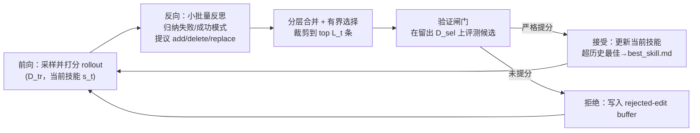

# SkillOpt（微软）：把技能文档当冻结 agent 的可训练「权重」来优化

**📄 [SkillOpt: Executive Strategy for Self-Evolving Agent Skills](https://arxiv.org/abs/2605.23904)**

2026-05 · Microsoft / 上海交大 / 同济 / 复旦（一作 Yifan Yang，通讯 Xue Yang、Chong Luo） · [代码](https://aka.ms/SkillOpt)

**一句话**：SkillOpt 把一份「技能文档」当作冻结 agent 的**外部可训练状态**——由一个独立的优化器模型读取打分后的 rollout，对技能文档做有界（bounded）的增/删/改编辑，并且只有当编辑严格提升了留出验证分时才被接受，从而把权重空间优化的那套纪律（学习率、择优、回退、动量）原样搬到自然语言技能上，且上线后**不增加任何推理时模型调用**。

::: details 📖 论文原文 Abstract（英文）
Agent skills today are hand-crafted, generated one-shot, or evolved through loosely controlled self-revision—none of which behaves like a deep-learning optimizer for the skill, and none of which reliably improves over its starting point under feedback. We argue the skill should instead be *trained* as the external state of a frozen agent, with the same discipline that makes weight-space optimization reproducible. **SkillOpt** is, to our knowledge, the first systematic *controllable* text-space optimizer for agent skills: a separate optimizer model turns scored rollouts into bounded add/delete/replace edits on a single skill document, and an edit is accepted only when it strictly improves a held-out validation score. A textual learning-rate budget, rejected-edit buffer, and epoch-wise slow/meta update make skill training stable while adding zero inference-time model calls at deployment. Across six benchmarks, seven target models, and three execution harnesses (direct chat, Codex, Claude Code), SkillOpt is best or tied on **all 52 evaluated (model, benchmark, harness) cells** and beats every per-cell competitor among human, one-shot LLM, Trace2Skill, TextGrad, GEPA, and EvoSkill skills. On GPT–5.5 it lifts the average no-skill accuracy by **+23.5** points in direct chat, by +24.8 inside the Codex agentic loop, and by +19.1 inside Claude Code. Transfer experiments further show that optimized skill artifacts retain value when moved across model scales, between Codex and Claude Code execution environments, and to a nearby math benchmark without further optimization.
:::

**相关**：[AutoSkill 总览](/skills/autoskill/) · [SkillOS](/skills/autoskill/skillos) · [Skill vs RAG/微调](/skills/vs-rag-finetune) · [Agentic RL](/agent/agentic-rl/)

> 图源：Yang et al., *SkillOpt: Executive Strategy for Self-Evolving Agent Skills*（arXiv:2605.23904）Figure 1——SkillOpt 总览与「文本空间优化 ↔ 权重空间优化」类比表（用于学习注解，版权归原作者）。

## 动机与创新点：技能不该被"随意自改写"，而该被"按优化器纪律训练"

论文的出发点是对当前技能（agent skill）三种来源的批评：**人工手写**、**LLM 一次性生成（one-shot）**、以及**松散自改写的演化（loosely controlled self-revision）**。它指出这三者都有同一个根本缺陷——

> none of which behaves like a deep-learning optimizer for the skill, and none of which reliably improves over its starting point under feedback.

也就是说，没有一个像深度学习优化器那样对待技能，因而**都不能保证在反馈下相对初始版本可靠地变好**：手写/一次性技能在换了目标域或 harness 时很脆（"brittle under a target domain or harness"），而自由自改写又容易产生"大语义跳变、不稳定更新"。

作者把问题重述为：**如果"被适配的对象"是 agent 的执行流程（procedure），那么技能文档本身就应当是可训练的（the skill document itself should be trainable）**。于是提出核心主张——把技能编辑当作一个**可控的领域自适应（controllable domain-adaptation）过程**：以技能文档为外部状态、以一个额外的前沿模型为优化器、对"取证 / 步幅 / 验证 / 更新方向"施加训练式控制。这正是 [AutoSkill](/skills/autoskill/) 那一类自迭代方法（Voyager 靠自我验证入库、Hermes 靠定期反思改写 SKILL.md）所缺的——闸门虽在，但改写步幅、改写是否真的让整体变好，缺乏权重优化那样可复现的约束。

作者明确点出这套"深度学习类比是操作性的、而非装饰性的（operational rather than decorative）"，并给出一一对应（见上方 Figure 1 右表）：

| 权重空间优化 | SkillOpt 的文本空间对应 |
| --- | --- |
| 参数（parameter） | 技能文档 |
| 梯度方向（gradient direction） | 轨迹导出的编辑方向 |
| 学习率（learning rate） | 编辑预算 $L_t$ |
| 验证检查（validation check） | 留出选择闸门 |
| 稳定训练设置（batch/动量等） | rollout/反思批量、调度、闸门、慢更新 |

**关键创新**：

- **首个系统化、可控的技能文本空间优化器**（first systematic *controllable* text-space optimizer for agent skills，论文原话）：目标模型保持**冻结**，被优化的只有**一份技能文档**，部署时**零额外推理调用**。
- **有界文本更新 + 文本学习率 $L_t$**：每步最多施加 $L_t$ 条编辑、按预期效用排序后裁剪，支持 constant/linear/cosine/autonomous 调度——这是它与"ad hoc 自由重写"的本质区别。
- **留出验证择优闸门**：每个候选技能在独立 selection split 上评测，**只有严格提升验证分才被接受**，把"自我编辑"变成有纪律的 propose-and-test。
- **拒绝编辑缓冲（rejected-edit buffer）**：把被拒的编辑及其掉分当作 epoch 内负反馈喂回后续反思，避免重复犯错——相当于在文本空间里保留了"优化历史"。
- **epoch 级慢速 / 元更新（slow/meta update）**：跨 epoch 的"动量"，把长程稳定规律写入受保护区，并维护一份**永不部署的 meta skill** 总结编辑模式。
- **harness 无关**：同一套优化接口适配 direct chat / Codex / Claude Code，产出物是一份 300–2,000 token 的 `best_skill.md`，可离线训练、跨模型/跨 harness 复用。

## 方法：打分 rollout → 有界文本编辑 → 验证择优接受

整条流水线是一个"前向取证 → 反向反思 → 有界更新 → 验证闸门"的循环，外加跨 epoch 的慢更新，结构与一次标准的优化器迭代严格对齐：

下面把上图嵌入论文原图——它把"数据三划分、K 路并行反思、批级合并、验证闸门、拒绝缓冲、epoch 慢更新"画在一张图里，可对照阅读：

> 图源：Yang et al., *SkillOpt: Executive Strategy for Self-Evolving Agent Skills*（arXiv:2605.23904）Figure 2——SkillOpt 完整流水线（用于学习注解，版权归原作者）。

### 问题设定：技能即冻结 agent 的外部状态

技能 $s$ 是一段在执行前插入 agent 上下文的**自然语言策略**——direct-chat 下前置到 system/developer 指令里，工具型 harness 下变成"持久过程性记忆"。记 $M$ 为被适配但**保持冻结**的目标模型，对 harness $h$、任务 $x$、技能 $s$，一次执行产出轨迹 $\tau$ 与标量分 $r$：

$$(\tau(s), r(s)) = h(M, x, s), \qquad r(s) \in [0, 1].$$

给定训练 / 选择 / 测试三划分 $D_{\text{tr}}, D_{\text{sel}}, D_{\text{test}}$：用 $D_{\text{tr}}$ 生成一组候选技能 $\mathcal{C}(D_{\text{tr}})$，在 $D_{\text{sel}}$ 上选最好，再在 $D_{\text{test}}$ 上**只用于最终汇报**：

$$s^{\star}_{\text{sel}} = \arg\max_{s \in \mathcal{C}(D_{\text{tr}})} \frac{1}{|D_{\text{sel}}|} \sum_{x \in D_{\text{sel}}} r(s), \qquad \text{Test}(s^{\star}_{\text{sel}}) = \frac{1}{|D_{\text{test}}|} \sum_{x \in D_{\text{test}}} r(s^{\star}_{\text{sel}}).$$

"训练集供经验、选择集做更新闸门、测试集只用于最终汇报"——三集严格不相交（`split_seed = 42`），所以报告的是**泛化分而非验证集拟合分**。优化器状态里维护：当前技能、经验证闸门保护的最佳技能、技能哈希缓存、epoch 内的拒绝缓冲、可选的慢/元更新状态；最终只导出 `best_skill.md`。

### 前向（Forward Pass）：rollout 取证

每个优化步，目标模型带**当前技能**从 $D_{\text{tr}}$ 跑一个 rollout batch。harness 记录任务元数据、消息、工具调用、观察、命令输出、最终答案、verifier 反馈，以及 benchmark 特定上下文（如电子表格预览、文档引用、精简执行轨迹）。这一批就是"取证单元（evidence unit）"。批量大小就是"控制噪声"的旋钮：

> small batches update quickly but noisily, while larger batches expose more recurring patterns before the skill changes.

实现还支持**累积（accumulation）**——把多个 rollout batch 一起反思后再做一次更新，从而把"执行吞吐"与"更新频率"解耦（类比梯度累积）。默认 rollout batch size = 40/步。

### 反向（Backward Pass）：小批量反思 + 分层合并

优化器模型把轨迹转成技能编辑，承袭"轨迹驱动反思 + prompt 演化"那条线（TextGrad/GEPA）。关键做法是**先把失败与成功分开，各自切成反思 minibatch**（默认 size 8）。为什么不逐条轨迹打补丁？因为——

> single trajectories often produce anecdotal fixes, while minibatches expose reusable procedural errors: the agent consistently searches the wrong source, writes an answer in the wrong format, or fails to verify a tool result.

于是**失败 minibatch 提议缺失/纠错规则，成功 minibatch 保留已奏效行为**，每次反思返回结构化的 add/delete/replace（或 rewrite 模式下的一小撮重写建议）。

> 举例：若某 minibatch 里多条 SpreadsheetBench 轨迹都"没先看工作簿结构就动手"，反思会归纳出一条 add 规则"先检查工作簿的 sheet/列结构再写公式"，而不是针对某一题打补丁。

随后**分层合并（hierarchical merging）**：先把失败驱动、成功驱动的编辑各自归并，再合并、**以纠错优先**，并在此步过滤掉重复、矛盾、样本特定的建议，才交给后续的有界选择。

### 有界文本更新：文本学习率 $L_t$ 是整套机制的"步幅闸"

学习率的文本对应物是**编辑预算 $L_t$**——第 $t$ 步最多施加的编辑条数。合并后优化器按**预期效用**给编辑池排序，并**裁剪到 top $L_t$ 条**（"ranks the merged edit pool by expected utility and clips it to the top $L_t$ edits"）。这正是它与 ad hoc 重写的分水岭：

> Unbounded rewrites can erase useful rules, introduce incompatible instructions, or overfit to a local failure; bounded updates preserve continuity while still allowing the skill to acquire new procedures.

支持 constant / linear / cosine / autonomous 四种调度，**默认 cosine：从较大编辑数起步、衰减到更小的整合步**（论文默认 $L_t=4$、cosine 衰减、floor $L_t=2$）。编辑有两种模式：**patch 模式**做 append/insert/replace/delete 等局部操作；**rewrite 模式**用选中的建议条件一次整文重写。一个安全细节是——**步级编辑不能覆盖受保护的慢更新域（slow-update field）**，从而把"快的局部改动"与"慢的 epoch 级整合"物理隔开。

### 验证闸门 + 拒绝缓冲：把"自我编辑"变成 propose-and-test

每个候选技能都用**同一个冻结模型 + 同一 harness** 在 $D_{\text{sel}}$ 上评测。规则原文：

> If it improves over the current selection score, it becomes the new current skill; if it also exceeds the best score so far, it becomes `best_skill.md`. Otherwise it is rejected.

形式化地，设 $S(\cdot)$ 为留出验证分，候选 $s'$ 仅当 $S(s') > S(s_{\text{cur}})$（严格大于，平手即拒）时被接受——这与"只有降低验证损失才更新"的优化器纪律同构。作者强调这道闸门至关重要，因为"看似合理的文本诊断仍可能真的伤害目标模型（plausible textual diagnoses can still hurt the actual target model）"。

被拒的编辑也没浪费：优化器维护一个 **epoch 内的拒绝缓冲**，记录观察到的失败模式、以及被拒步里"试过哪些编辑、造成多大掉分"。同 epoch 后续的反思调用会拿到这个缓冲，于是优化器能**避免重复犯同样的错、专注未解决的失败**——"gives the loop negative feedback during training without adding inference-time cost"。

### epoch 级慢速 / 元更新：跨 epoch 的"动量"

快更新只看当前 batch；**慢/元更新从相邻 epoch 学习**。每个 epoch 末，SkillOpt 在同一批训练样本上分别用"上一 epoch 的技能"和"当前 epoch 的技能"重跑，把样本分成四类：**改进 / 回退 / 持续失败 / 稳定成功**。优化器据此写一段简洁的"纵向指引（longitudinal guidance）"进受保护的慢更新域，而且**这个候选仍要过验证闸门**——所以慢更新既能沉淀耐久的领域经验，又保住同一道安全检查。

此外有一份**纯优化器侧、永不随模型部署的 meta skill**，专门总结"哪些编辑模式有用、哪些被拒、哪些失败跨 epoch 持续"，作为前缀注入未来的反思/合并/排序提示。作者称其价值在于"关注点分离"：部署的技能保持紧凑可移植，而训练端能享有一份更丰富的编辑过程记录。论文给出的默认配置（节选）：4 个 epoch、rollout batch 40、反思 minibatch 8（16 个 analyst worker 并行、merge batch 8）、$L_t=4$ cosine 衰减、慢更新每 epoch 采样 20 个任务、teacher 反思每 minibatch 最多 3 轮、patch 编辑模式、师生默认 medium reasoning effort。

## 实验结果：52 个评测单元全部最佳或并列最佳

### 评测设置：6 benchmark × 7 模型 × 3 harness

论文把 SkillOpt 当"冻结 agent 的文本空间优化器"评测，刻意选了多样的任务面：

- **6 个 benchmark**：SearchQA、SpreadsheetBench（真实 `openpyxl/pandas` 运行、默认 `mode=multi`、最多 30 轮）、OfficeQA（多轮工具循环、最多 24 次工具调用）、DocVQA、LiveMathematicianBench（表中简称 LiveMath）、ALFWorld（具身决策、每 episode 最多 50 步）；
- **7 个目标模型**：GPT-5.5、GPT-5.4、GPT-5.4-mini、GPT-5.4-nano、GPT-5.2、Qwen3.5-4B、Qwen3.6-35B-A3B——从前沿到小模型全谱；
- **3 个 harness**：direct chat（单次 system-prompt 调用）、Codex、Claude Code。

所有数据集跑确定性 train/selection/test 划分（`split_seed=42`），selection split **只用于接受/拒绝候选编辑**，汇报分全在不相交的 test split 上算。

### Benchmark 表现（以原文为准）

下表摘 **GPT-5.5 在 direct chat 下的主结果**（No skill → SkillOpt），可见六个 benchmark 一致大幅提升，平均 **+23.5** 分：

| Benchmark | No skill | SkillOpt | Δ |
| --- | --- | --- | --- |
| SearchQA | 77.7 | **87.3** | +9.6 |
| SpreadsheetBench | 41.8 | **80.7** | +38.9 |
| OfficeQA | 33.1 | **72.1** | +39.0 |
| DocVQA | 78.8 | **91.2** | +12.4 |
| LiveMath | 37.6 | **66.9** | +29.3 |
| ALFWorld | 83.6 | **95.5** | +11.9 |

全局结论（数字均来自论文）：

- **52 个 (model, benchmark, harness) 评测单元上全部最佳或并列最佳**，并在逐单元对比中胜过 human、one-shot LLM、Trace2Skill、TextGrad、GEPA、EvoSkill 等所有技能来源；相对"逐单元挑最优方法"的 per-cell 最强基线，平均还要再高 **+5.4** 分。
- **跨 harness**：在 GPT-5.5 上，相对无技能基线，direct chat **+23.5**、Codex 内 **+24.8**、Claude Code 内 **+19.1**；在 Codex/Claude Code 内分别比 EvoSkill 高 **+14.0 / +3.2** 分。
- **学到的工件很小**：`best_skill.md` 约 **300–2,000 token**，六个 benchmark 各自只需 **1–4 条被接受的编辑**就能取得显著提升；记录的是**过程性规则**（如"先检查工作簿结构"）而非样本特定指令，因而可迁移。
- **迁移性**：在 GPT-5.4 上训出的 SpreadsheetBench 技能能改进所有更小的 GPT 变体；Codex 上训的电子表格技能迁到 Claude Code **+59.7** 分；OlympiadBench 技能迁到 Omni-MATH 仍正增益——印证"一次优化、审计、导出，可跨模型/harness/任务复用而不动权重"。

消融（Table 3，SearchQA/SpreadsheetBench/LiveMath 三项）也支撑了三个设计的必要性：去掉有界学习率（"without lr"）三项分别从 87.1/77.5/61.3 掉到 84.6/75.7/57.3——**有界文本学习胜过不受控重写**；去掉拒绝缓冲掉到 85.5/72.9/58.9；同时去掉 meta+慢更新时 SpreadsheetBench 从 77.5 暴跌到 55.0，说明慢/元更新对长程整合尤为关键。

> 看榜须知：这些分数的口径、时点、harness 配置、test-time 设置各不相同，**跨系统直接比绝对值意义有限**；同一行内 No skill→SkillOpt 的"相对增量"才是这篇要传达的信号——把它当作"在冻结目标模型上、纯靠文本优化能榨出多少增益"的量级参照即可。

## 在"文本空间优化 / 技能演化"谱系里的位置

SkillOpt 属于"文本空间优化"这一大家族，但定位与邻居都不同（横向对比是本站相对 arXiv 的核心增值）：

- **vs TextGrad / GEPA（prompt 优化）**：它们优化的是 prompt / 系统设计 / 完整配置，能直接利用执行反馈，但**主要面向 prompt 而非可复用的领域适配工件**，缺少把改动当作持久工件、并逐步用留出数据做闸门的迭代约束。SkillOpt 优化的是一份**持久技能文档**，可被训练、验证、导出、跨模型复用，且每一步都过严格的验证闸门。论文里 GEPA/TextGrad 都被列为逐单元基线、被 SkillOpt 全面超过。
- **vs EvoSkill（技能演化）**：以 GPT-5.5 + Codex 的 SpreadsheetBench 为例，EvoSkill 相对无技能基线 +40.0（27.5→67.5），**SkillOpt 在其之上再 +17.5（67.5→85.0）**，差距归因于 SkillOpt 的有界文本学习与拒绝编辑记忆。
- **vs Trace2Skill（轨迹蒸馏）**：它从轨迹挖掘经验但**不做验证**；SkillOpt 让所有编辑都过留出性能闸门，防止有害提议累积。
- 一句话归纳差异：同样是在不动权重的前提下改"文本"，SkillOpt 把**有界步幅 + 验证择优 + 拒绝记忆 + 跨 epoch 慢更新**四件事一起做齐，这正是它对标"优化器纪律"的地方。文本空间优化的更广脉络（ProTeGi / OPRO / DSPy 等）见 [AutoSkill 总览](/skills/autoskill/)。

### 与 SkillOS（策展）、SkillOps（运维）的分工

把技能体系拆成三层来看更清楚，SkillOpt 只负责其中"训练"这一环：

- **SkillOpt（优化）**：在反馈下把一份技能文档**优化得更好**——对应本文的打分→编辑→验证闭环。
- **[SkillOS](/skills/autoskill/skillos)（策展）**：技能的组织、检索、版本与组合，决定"什么时候召回哪份技能"。
- **SkillOps（运维）**：技能上线后的部署、监控、回滚与生命周期管理。

SkillOpt 产出的 `best_skill.md` 正是交给 SkillOS 策展、由 SkillOps 运维的那份工件；三者合起来才构成"生产—组织—运营"的完整技能闭环。其与微调、RAG 等参数化能力注入路线的权衡，见 [Skill vs RAG/微调](/skills/vs-rag-finetune)；与"训练 agent 而非编辑文本"的路线对照，见 [Agentic RL](/agent/agentic-rl/)。
