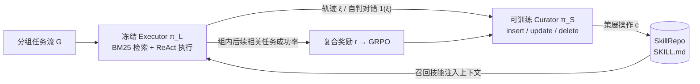

# SkillOS（Google/UIUC）：把"技能策展"训练成一个 RL 策略

**📄 [SkillOS: Learning Skill Curation for Self-Evolving Agents](https://arxiv.org/abs/2605.06614)**

2026-05 · University of Illinois Urbana-Champaign / Google Cloud AI Research / MIT

**一句话**：SkillOS 把"会不会用技能"和"该往技能库里写什么"拆成两个角色——冻结一个负责检索与执行的 executor，单独用 RL 训练一个 curator，去学一套对外部技能库（SkillRepo）做增删改的"策展"策略，让技能随交互流不断演化、并沉淀出更高层的"元技能"。

::: details 📖 论文原文 Abstract（英文）
LLM-based agents are increasingly deployed to handle streaming tasks, yet they often remain one-off problem solvers that fail to learn from past interactions. Reusable skills distilled from experience provide a natural substrate for self-evolution, where high-quality **skill curation** serves as the key bottleneck. Existing approaches either rely on manual skill curation, prescribe heuristic skill operations, or train for short-horizon skill adaptation, but still struggle to learn complex long-term curation policies from indirect and delayed feedback. We propose **SkillOS**, an experience-driven RL training recipe for learning skill curation in self-evolving agents. SkillOS pairs a frozen *agent executor* that retrieves and applies skills with a trainable *skill curator* that updates an external **SkillRepo** from accumulated experience. To provide learning signals for curation, we train on **grouped task streams** based on skill-relevant task dependencies, where earlier trajectories update the SkillRepo, and later related tasks evaluate these updates. We further design **composite rewards** to better attribute downstream executor feedback to curation decisions. Across multi-turn agentic tasks and single-turn reasoning tasks, SkillOS consistently outperforms memory-free and strong memory-based baselines in both effectiveness and efficiency, with the learned skill curator generalizing across different executor backbones and task domains. Further analyses show that the learned curator produces more targeted skill use, while the evolving SkillRepo develops richer internal structure and higher-level meta-skills over time.
:::

**相关**：[AutoSkill 总览](/skills/autoskill/) · [SkillOpt](/skills/autoskill/skillopt) · [SkillOps](/skills/autoskill/skillops) · [OpenSkill](/skills/autoskill/openskill) · [Agent Skills 体系](/skills/) · [Agentic RL](/agent/agentic-rl/)

> 图源：Ouyang et al., *SkillOS: Learning Skill Curation for Self-Evolving Agents*（arXiv:2605.06614）Figure 1——左图流式策展闭环、右图 Markdown 技能格式（用于学习注解，版权归原作者）。

## 动机与创新点：search ≠ research 之于技能——"会产生技能"不难，难在"策展"

当下大多数 LLM agent 在面对流式到来的任务时，仍然是**一次性求解器（one-off problem solver）**：每个任务从零开始推理，解完即弃，无法把上一题踩过的坑沉淀给下一题。论文开篇即点明，自演化（self-evolution）的天然载体是**过程性记忆（procedural memory）里可复用的技能**，而一个技能型自演化 agent 的标准闭环是——"为每个新任务选相关技能 → 用它们引导执行 → 据结果轨迹更新技能集合"。这条闭环里真正的瓶颈不在"能不能产生技能"，而在**高质量的技能策展（skill curation）**：决定何时新增（insert）、何时改写（update）、何时删除（delete），以及让整个库随时间保持精炼而非膨胀。

已有方案在这件事上各有短板，论文逐一点名：

- **人工策展**（如 Anthropic 的 skills 仓库）——"demand huge human expertise and cannot scale to the diversity of tasks that agents may encounter"，靠人写不可扩展；
- **启发式 / prompt 规则**——"rely on fixed rules and lack downstream performance feedback"，写死规则、不吃下游反馈，无法适配 executor 的真实需要；
- **只针对短时程的 RL**——近期工作要么只训"怎么*用*技能"，要么只在很短的任务流里优化技能操作，"This limits the density of learning signals available for curating highly reusable skills and mastering complex management operations such as skill update and deletion"。

它们共同的困难是——策展的回报是**间接且延迟的（indirect and delayed）**：你现在往库里写的一条技能，价值要等到后续某个相关任务被它救下来才体现。这种长时程、稀疏、延迟的信用分配，恰恰是启发式与短时程训练学不动的，也正是 SkillOS 用 RL 想啃下的核心。论文把技能策展**重新形式化为一个"长时程、以 executor 表现为依据（executor-grounded）的学习问题"**。

**关键创新**：

- **executor / curator 解耦**：冻结一个负责检索+执行的 executor，只训一个 curator——保证学到的是**与 executor 无关的策展策略**，而非被某个底座的偏好绑死；curator 通过函数调用对外部 SkillRepo 做 `insert/update/delete`。
- **分组任务流（grouped task streams）**：训练实例不是孤立任务，而是"一组相关任务顺序求解"——组内靠前经验析出的技能，**由后续相关任务能否被它解出来检验**，把延迟回报变成可优化信号。
- **复合奖励（composite reward）**：把稀疏的"任务成功"拆成任务结果 + 函数调用有效性 + 内容质量 + 压缩四路加权，"turn delayed and indirect supervision into learning signals for skill curation"。
- **技能=Markdown（SKILL.md）**：技能停留在**外部可审计的纯文本**，天然支持版本管理与人工审计；训练后会演化出结构更丰富、编码"元技能"的文件。

## 方法：冻结 executor + GRPO 训 curator + 分组任务流上的复合奖励

SkillOS 是一个**经验驱动的 RL 训练配方**，把系统拆成两个解耦的策略，在流式（streaming）测试设定下运作：一串任务 $\mathcal{D}=\{x_1,\dots,x_T\}$ 随时间到来，agent 必须先解当前任务、再看到后续任务，每个任务产出执行轨迹 $\xi_t=\{o_1,a_1,\dots,o_n,a_n\}$。

### 双角色解耦：冻结 executor $\pi_{\mathcal{L}}$ + 可训练 curator $\pi_{\mathcal{S}}$

系统维护一个外部技能库 $\mathcal{S}_t=\{s^1_t,\dots,s^{N_t}_t\}$，每条技能是一个 **SKILL.md** 文件，两部分：(i) **YAML frontmatter** 给出技能名与"何时该用"的自然语言描述（这部分进检索索引），(ii) **Markdown 正文**承载可执行知识、工作流、约束与启发式。两个策略分工：

- **冻结的 executor $\pi_{\mathcal{L}}$**：给定任务 $x_t$，先用 **BM25** 从库里检索相关子集 $\tilde{\mathcal{S}}_t\subseteq\mathcal{S}_t$，再以"任务 + 环境观测 + 召回技能"为条件采样动作 $a\sim\pi_{\mathcal{L}}(\cdot\mid x_t, o_t, \tilde{\mathcal{S}}_t)$。它**不参与训练**——这保证学到的策展能力是模型无关的。
- **可训练的 curator $\pi_{\mathcal{S}}$**：executor 解完任务后，curator 观察轨迹 $\xi_t$、自判对错信号 $\mathbb{1}_{\xi_t}$、被召回的技能 $\tilde{\mathcal{S}}_t$，然后生成一串结构化策展操作 $c_t=(u^1_t,\dots,u^{M_t}_t)\sim\pi_{\mathcal{S}}(\cdot\mid\xi_t,\mathbb{1}_{\xi_t},\tilde{\mathcal{S}}_t)$，每个操作 $u^m_t$ 是 `insert_skill` / `update_skill` / `delete_skill` 之一，以**函数调用**形式落到库上：$\mathcal{S}_{t+1}=\textsc{ApplyOps}(\mathcal{S}_t, c_t)$。更新后的库供 executor 在后续任务上用，形成闭环。

闭环的关键在于：**早期轨迹更新 SkillRepo，后续相关任务用来评估这次更新到底有没有用**——这把"策展质量"翻译成了可优化的奖励信号。

> 举例：第 1 题"把杯子放进冰箱"失败了，curator 据轨迹 `insert` 一条「检查物体当前位置再规划路径」的技能；第 5 题"把两个鸡蛋放进厨房"是同组相关任务，若它召回并用上这条技能而成功，这次 insert 的延迟回报就被兑现成正奖励反传给 curator。

### 分组任务流：把策展奠基在"长期效用"上

SkillOS 不在孤立任务上训练。它先用 **Gemini-2.5-Pro** 给每个任务 $x_i$ 标注一组技能相关属性 $Z_i=\{z^1_i,\dots,z^{|Z_i|}_i\}$（如数学推理里的 "algebra"、"Fourier transformation" 等主题/常见陷阱标签），把它们当"任务相关性与潜在技能依赖"的代理；再据属性相似度把数据集划分成 $M$ 个任务组 $\mathcal{D}=\{G_1,\dots,G_M\}$，"all instances within the same group exhibit non-trivial dependency in terms of required skills"。**每组训练时 SkillRepo 从空库起步**，curator 在每个任务后更新它，让早期经验析出的技能能被后续相关任务检验——论文强调这与"只关注短时程迁移"的前作不同，分组形式"exposes the curator to longer skill-evolution trajectories and provides denser feedback for learning complex curation operations"。

### 复合奖励：把"策展好不好"拆成四路信号

单一的"任务成功"信号太稀疏。SkillOS 的奖励是四路加权组合（Eq. 1）：

$$r = \underbrace{r^{\text{task}}}_{\text{任务结果}} + \lambda_f \underbrace{r^{\text{fc}}}_{\text{函数调用有效}} + \lambda_u \underbrace{r^{\text{cnt}}}_{\text{内容质量}} + \lambda_c \underbrace{r^{\text{comp}}}_{\text{压缩}}$$

- **任务结果 $r^{\text{task}}$**——组内**第一题用空库**、不计，奖励取**剩余任务的平均成功率** $r^{\text{task}}=\frac{1}{|G|-1}\sum_{i=2}^{|G|}\mathbb{1}(\xi_i)$，给出 executor-grounded 的下游表现信号；
- **函数调用有效性 $r^{\text{fc}}$**——策展操作里合法执行成功的比例 $r^{\text{fc}}=\frac{1}{|G|}\sum_i\text{Valid}(c_i)$；
- **内容质量 $r^{\text{cnt}}$**——用 **LLM-as-Judge（Qwen3-32B）** 给技能写得好不好打分 $r^{\text{cnt}}=\frac{1}{|G|}\sum_i\text{Judge}(c_i)$；
- **压缩项 $r^{\text{comp}}$**——$r^{\text{comp}}=\frac{1}{|G|}\sum_i\big(1-|\mathcal{S}_i|/|\chi_i|\big)$（$|\mathcal{S}_i|$ 是更新后库的 token 长度、$|\chi_i|$ 是 curator 输入上下文长度），**鼓励蒸馏可复用技能而非逐字搬轨迹**、抑制库膨胀。

权重取 $\lambda_f=1.0,\ \lambda_u=0.1,\ \lambda_c=0.05$（消融见下，去掉内容质量或压缩都掉点）。

> 举例：curator 若把整段原始执行轨迹原封不动塞进一条技能，$|\mathcal{S}_i|$ 暴涨、$r^{\text{comp}}$ 立刻变小扣分——逼它提炼成简短可复用的步骤，而不是当复读机。

### RL 训练循环：GRPO + 分组优势

curator 用 **GRPO（Grouped Reward Policy Optimization）** 优化、executor 全程冻结。训练循环（Algorithm 1）：每步采一个任务组、库置空，组内逐任务跑 `BM25 检索 → executor 执行 → curator 采样策展 → ApplyOps 更新库`，组末算复合奖励、用 GRPO 更新 $\pi_{\mathcal{S}}$。对每组做 $N$ 次独立 rollout（不同 rollout 因前序策展不同而演化出不同库历史），优势用组内均值作基线：

$$A^n = r^n - \frac{1}{N}\sum_{n'=1}^{N} r^{n'}$$

再套裁剪代理目标，并把优势**均匀赋给该 rollout 全部策展 token**、**丢掉 KL 项以鼓励探索**：

$$\mathcal{L}=\mathbb{E}_n\Big[\min\big(\rho^n A^n,\ \mathrm{clip}(\rho^n, 1-\epsilon, 1+\epsilon)A^n\big)\Big],\quad \rho^n = \frac{\pi_{\mathcal{S}}(c^n\mid\chi)}{\pi_{\theta_{\text{old}}}(c^n\mid\chi)}$$

实现：curator 与训练用 executor 均基于 **Qwen3-8B**，learning rate $1\times10^{-6}$、batch size 32、group size 8，用 **verl** 框架在 **16 张 H100** 上训练（ALFWorld 约 3 天、推理任务 2.5 天、WebShop 5 天）。agentic 任务用 **ReAct**、推理任务用 **CoT**；任务对错信号 $\mathbb{1}_{\xi}$ 由 LLM-as-judge 配冻结 executor 给出。

> 图源：Ouyang et al., *SkillOS*（arXiv:2605.06614）Figure 2——训练流水线与 curator 策略的演化轨迹（用于学习注解，版权归原作者）。

### 技能如何演化：从盲目堆积到提炼"元技能"

论文的定性分析（§5）给出两个有意思的现象：

- **策展行为随训练迁移**：早期 `insert` 压倒性主导（约 80%），"primarily focused on populating the skill repository with new knowledge"；随训练推进 `update` 越来越频繁、`insert` 稳步下降——curator 从"扩张"转向"精炼已有技能"；`delete` 始终占比小但略增，体现压缩奖励在起作用。"the dominant form of adaptation is to revise and consolidate previously acquired skills"。

> 图源：Ouyang et al., *SkillOS*（arXiv:2605.06614）Figure 4——curator 策展行为随训练演化：insert 主导 → update 巩固（用于学习注解，版权归原作者）。

- **技能库结构升级**：(a) 单条技能里**涌现新的 Markdown 小节**——早期多是泛泛的 guidance/tips（让技能更啰嗦却没多大用），后期转向 failure-handling、条件分支这类"何时偏离默认工作流"的可执行结构；(b) **元技能（meta-skill）涌现**——早期库被狭窄的任务专用技能主导，后期演化出覆盖"状态验证（>50%）、系统性搜索、失败恢复、备选方案、策略调整"的多样元策略，"shifting it from isolated task-local procedures toward more compositional cross-task control knowledge"。

> 图源：Ouyang et al., *SkillOS*（arXiv:2605.06614）Figure 5——RL 训练下技能内部结构与元策略的涌现（用于学习注解，版权归原作者）。

## 实验结果：一致优于 memory-free 与强 memory-based 基线，且更省步数

覆盖**多轮 agentic 任务**（ALFWorld 家务、WebShop 购物模拟）与**单轮推理任务**（AIME24/25、GPQA-Diamond，训练数据从 DeepMath-103k 采样 3.3 万条）。效果维度看成功率/准确率，效率维度看每任务执行步数 / 每题 token 数。基线含：无记忆（No Memory）、强 memory 方法 **ReasoningBank** 与 **MemP**；以及内部变体——未 RL 训练的 **SkillOS-base**、直接用 **Gemini-2.5-Pro 当 curator** 的 **SkillOS-gemini**。

### ALFWorld：三种冻结 executor 上的成功率与步数

curator 统一用 Qwen3-8B，换不同冻结 executor 看泛化（数字为平均成功率 SR↑ / 平均步数 Steps↓，以原文 Table 1 为准）：

| executor / 方法 | curator | Avg SR↑ | Steps↓ |
| --- | --- | --- | --- |
| **Qwen3-8B**：No Memory | — | 47.9 | 21.1 |
| ReasoningBank | Qwen3-8B | 55.7 | 20.1 |
| MemP | Qwen3-8B | 49.7 | 21.0 |
| SkillOS-base（未训） | Qwen3-8B | 53.1 | 20.4 |
| SkillOS-gemini | Gemini-2.5-Pro | 55.7 | 20.8 |
| **SkillOS** | **Qwen3-8B** | **61.2** | **18.9** |
| **Gemini-2.5-Pro**：No Memory | — | 66.4 | 17.7 |
| SkillOS-base（未训） | Qwen3-8B | 70.7 | 16.3 |
| SkillOS-gemini | Gemini-2.5-Pro | 79.3 | 14.9 |
| **SkillOS** | **Qwen3-8B** | **80.2** | **14.8** |

- **效果**：Qwen3-8B executor 上 SkillOS 61.2，高于最强基线 ReasoningBank 的 55.7，同时把步数从 ~20 降到 18.9（约 10% 效率提升、并非靠更长轨迹换性能）。
- **跨 executor 泛化**：curator 只用 Qwen3-8B 训练，却能把 **Gemini-2.5-Pro executor** 的 ALFWorld 平均成功率从 66.4 提到 **80.2**——印证学到的是与 executor 无关的策展策略。
- **小 curator 反超 frontier curator**：RL 训出的 8B curator（SkillOS）优于直接拿 Gemini-2.5-Pro 当 curator 的 SkillOS-gemini。论文点破一个"curator-executor 错配"：更强的推理能力不等于更会策展，"frontier-generated skills may be misaligned with the executor's capacity or usage patterns"——targeted RL training 比 raw model scale 更要紧。

### WebShop + 推理任务

| executor / 方法 | WebShop Score↑ | WebShop Steps↓ | Reasoning Avg Acc↑ |
| --- | --- | --- | --- |
| **Qwen3-8B**：No Memory | 33.3 | 20.3 | 69.6 |
| MemP | 35.7 | 21.3 | 69.1 |
| **SkillOS** | **40.6** | **19.4** | **73.8** |
| **Qwen3-32B**：No Memory | 41.5 | 17.0 | 74.0 |
| **SkillOS**（curator 8B） | **49.2** | **15.9** | **79.7** |
| **Gemini-2.5-Pro**：No Memory | 48.6 | 19.5 | 81.8 |
| **SkillOS**（curator 8B） | **56.0** | 18.3 | **88.6** |

WebShop 上 SkillOS 以更少环境交互拿到更高分；推理任务三数据集（AIME24/25、GPQA）平均准确率也一致领先同 executor 基线。**但论文坦诚：agentic 任务的增益普遍大于推理任务**——agentic 任务天然暴露动作排序、探索策略、恢复行为等"过程性规律"，可被反复组合复用；推理任务的可复用知识更抽象（分解启发式、约束构造、验证模式），不是直接可搬的动作序列，故增益偏小。

### 消融与技能利用归因

**奖励 / 分组消融（ALFWorld，Qwen3-8B 同时当 curator+executor，Table 3）**：

| 设置 | Avg SR↑ | Steps↓ |
| --- | --- | --- |
| **SkillOS-GRPO（完整）** | **61.2** | **18.9** |
| w/o $r^{\text{cnt}}$（去内容质量） | 58.6 | 20.1 |
| w/o $r^{\text{comp}}$（去压缩） | 60.0 | 19.3 |
| w/o grouping（随机任务序） | 57.3 | 20.6 |

去掉内容质量奖励掉得最多（61.2→58.6），印证流水线式系统里"中间监督"对引导技能更新的重要性；去压缩掉得小但一致；**最大降幅来自打散分组（→57.3）**——这恰恰反证了"在分组任务流上、用下游影响来学策展"是 SkillOS 的命门。

**技能利用归因（Fig 6）**：相对未训练的 SkillOS-base，训练后 SkillOS 在**全部**评测样本上都会调用技能（skill usage rate 87.9→100.0）、成功用技能的比例更高（53.6→61.2）、被实际用到的技能覆盖更广（72.9→88.6），同时**每题用的技能数反而下降**（约 2.21→1.95）——"gains come from more precise skill selection rather than more skill context"，是更准而非更多。

> 看榜须知：以上数字口径、executor 配置、test-time 设置各异，**跨方法直接比绝对值意义有限**，当作"同期 8B-curator 自演化技能策展能力的量级参照"即可；完整表格以 arXiv:2605.06614 原文为准。

## 在 AutoSkill 谱系里的位置

放进 [AutoSkill](/skills/autoskill/) 的谱系里看，SkillOS 给出的是**"策展即被学习的 RL 策略"**这一独特切面，与几条相邻路线的差异一句话即可点出：

- 对 [SkillOpt（技能即权重优化）](/skills/autoskill/skillopt)：SkillOpt 走"优化"视角，把能力下沉进参数；SkillOS 坚持技能停留在**外部可审计的文本**，只学如何管理它——底座（executor）反而是冻结的。
- 对 [SkillOps（技能库工程化运维）](/skills/autoskill/skillops)：SkillOps 是"运维"视角，关注库的工程化治理与生命周期；SkillOS 是把"增删改"这套运维动作**端到端用 RL 学出来**，而非靠人定流程。
- 对 [OpenSkill（开放世界自演化）](/skills/autoskill/openskill)：OpenSkill 偏"开放世界获取"，强调在无界环境里不断发现新技能；SkillOS 的焦点不在获取广度，而在**策展质量与长期效用的信用分配**——它甚至把奖励显式拆出"压缩项"来抑制库膨胀。
- 对 [Trace2Skill](/skills/autoskill/trace2skill)：Trace2Skill 关注"从轨迹里抽出技能"这一步；SkillOS 的复合奖励里特意加压缩项 $r^{\text{comp}}$ 来惩罚"逐字搬轨迹"，正是要避免抽取退化成复读机。

相比 [AutoSkill 总览](/skills/autoskill/) 里 Voyager 的"自我验证才入库"和 Hermes 的"定期反思 + write approval"等**启发式闸门**，SkillOS 的贡献在于把这道闸门从人工规则升级为**用延迟回报训练出来的策略**——而且它和本库 [Agentic RL](/agent/agentic-rl/) 一脉相承地用 GRPO，把"技能管理"也纳入了可强化学习的范畴。论文同时承认其边界：增益高度依赖任务的"过程性可复用度"，在抽象推理任务上明显小于 agentic 任务，且 curator 与 executor 之间存在"错配"风险（强 curator 未必配得好弱 executor）。
