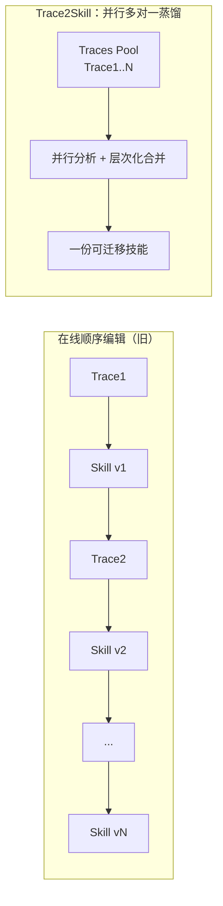
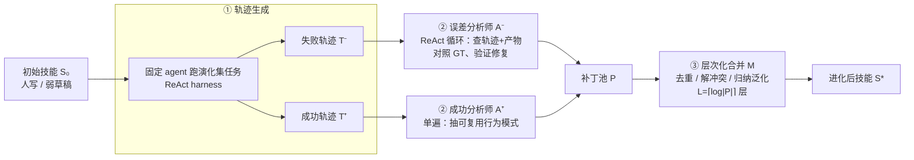

# Trace2Skill（阿里 Qwen）：把一批轨迹并行蒸馏成一份可迁移技能

**📄 [Trace2Skill: Distill Trajectory-Local Lessons into Transferable Agent Skills](https://arxiv.org/abs/2603.25158)**

2026-06 · 阿里 Qwen 大模型应用团队（与 ETH Zürich / 苏黎世大学 / 北大 / 浙大合作） · [代码](https://github.com/Qwen-Applications/Trace2Skill)

**一句话**：把一大批执行轨迹**并行**分析、**多对一**地归纳合并成**一份可迁移技能**（而不是"轨迹一条条到、顺序在线编辑技能库"）；既能加深人写技能、也能从弱草稿创建技能，技能可跨模型规模 / 家族 / OOD 迁移，部署时无需参数更新、也无需测试期检索。

::: details 📖 论文原文 Abstract（英文）
Large Language Model (LLM) agents increasingly rely on domain-specific skills, yet manually authoring such skills does not scale, and skills generated purely from parametric knowledge often miss critical operational pitfalls. We introduce **Trace2Skill**, a framework that consolidates broad execution trajectories in parallel into a unified skill directory through inductive reasoning over agent experience. Trace2Skill supports both *deepening* existing human-authored skills and *creating* useful skills from weak LLM-generated drafts. Experiments demonstrate the effectiveness of Trace2Skill across diverse domains, including office workflows, math reasoning, and vision QA. Importantly, the evolved skills are not merely memorized artifacts of the trajectories used to create them: they often transfer across model scales, across model families, and to out-of-distribution settings. For example, skills evolved from Qwen3.5-35B trajectories improve a Qwen3.5-122B agent by up to 57.65 percentage points on WikiTableQuestions. Further analyses show that Trace2Skill outperforms sequential skill editing and ReasoningBank-style retrieval memories, compresses recurring failures and workarounds into standard operating procedures (SoPs), and yields portable skills that can be reused without parameter updates or test-time retrieval.
:::

**相关**：[AutoSkill 总览](/skills/autoskill/) · [OpenSkill](/skills/autoskill/openskill) · [SkillOpt](/skills/autoskill/skillopt) · [Skill vs RAG/微调](/skills/vs-rag-finetune)

> 图源：Ni et al.（阿里 Qwen）, *Trace2Skill: Distill Trajectory-Local Lessons into Transferable Agent Skills*（arXiv:2603.25158）Figure 1——左"顺序在线编辑"、右"并行蒸馏成一份技能"（用于学习注解，版权归原作者）。

## 动机与创新点：search ≠ memorize，把"在线顺序编辑"换成"并行多对一蒸馏"

agent 越来越依赖 **skill**——"编码任务流程、领域知识、操作守则的可复用文档"（*reusable documents that encode task procedures, domain knowledge, and operational guidelines*）。随着 agent 进入文件/工具型工作流，瓶颈"不再只是模型能力，还在于为每个领域创建并维护高质量技能"。但两条现成路线都不够好：

- **人工写技能**覆盖不均、不可靠地跨模型迁移——论文 Table 1 里官方 `xlsx` 技能能把 122B 的 Vrf 从 27.67 拉到 48.33，却**反而把 35B 从 19.00 拖到 9.67**："the official `xlsx` skill improves a 122B spreadsheet agent while hurting a 35B agent on the same benchmark."
- **纯参数知识生成技能**很脆——草稿往往缺少真实执行才暴露的失败模式、绕坑手法和操作细节（*lack the concrete failure modes, workarounds, and operational details exposed by actual execution traces*），Parametric 基本贴着 No Skill。

于是近期系统转向"用 agent 经验在线演化技能/记忆"。但多数做法是**轨迹一条条到来、顺序地编辑技能库**（Figure 1 左）：这会把可复用知识**碎片化**地散在一大堆记忆/技能里，且**后写的技能依赖先前更新的顺序**，使结果对到达次序敏感。Trace2Skill 的出发点正是人类专家的另一种工作方式——

> Human experts usually work differently: they inspect broad traces, abstract recurring patterns, and write compact procedures that are reusable across cases.

即**先看一大批轨迹、归纳出反复出现的规律、再写成跨案例可复用的紧凑流程**。把这件事建模成"在 agent 经验上做归纳推理（*inductive reasoning over agent experience*）"，就得到 Trace2Skill 的"多对一蒸馏"。

**关键创新**：

- **并行多对一蒸馏，而非在线顺序编辑**：整池轨迹一起分析、层次化合并，结果**不依赖轨迹到达次序**，还顺手解决"知识碎片化"——把零散补丁收敛成一份紧凑技能。
- **"加深 + 创建"双模式**：`Skill Deepening` 从人写技能出发、`Skill Creation` 从 LLM 弱草稿出发，覆盖"有没有人写技能"两种起点。
- **刻意非对称的双分析师**：误差分析师 $\mathcal{A}^-$ 走 ReAct 循环、能查产物、对照 ground truth、**验证修复**；成功分析师 $\mathcal{A}^+$ 单遍提模式——保证失败补丁扎根于"已验证的失败机制"而非读日志的猜测。
- **归纳泛化抽 SoP**：多条独立补丁里反复出现的修改＝系统性任务规律，被固化成标准作业流程（SoP）写进 `SKILL.md`，一次性怪癖路由到按需 `references/`。
- **产物可移植**：蒸馏出的技能推理时**直接加载、无需检索、无需改权重**；作者模型 ≠ 用户模型，天然支持"小模型写、大模型用"的跨规模迁移。

## 方法：轨迹生成 → 并行打补丁 → 层次化合并

> 图源：Ni et al.（阿里 Qwen）, *Trace2Skill*（arXiv:2603.25158）Figure 2——三阶段流水线总览：rollout → 并行提补丁（A⁺/A⁻）→ 合并成 Evolved Skill（用于学习注解，版权归原作者）。

### 形式化：在不动权重的前提下"进化"一份技能目录

一个技能是人类可读的目录 $\mathcal{S}=(M,\mathcal{R})$：根文件 `SKILL.md`（$M$，存"广泛适用的过程性知识"）+ 辅助 `references/`、脚本、资产（$\mathcal{R}$，存"确定性工具或低频细节"）。令 $\pi_\theta$ 是推理时使用技能 $\mathcal{S}$ 的**固定** agent，$\mathcal{P}(\mathcal{S};\pi_\theta,\mathcal{D})$ 为其在任务集 $\mathcal{D}$ 上的通过率。技能进化 = 用"演化集" $\mathcal{D}_{\text{evolve}}$ 的轨迹构造一份新技能，使其在**不相交的测试集** $\mathcal{D}_{\text{test}}$ 上更好，且**不更新 $\theta$**：

$$\mathcal{S}^*=\mathcal{E}(\mathcal{S}_0,\mathcal{D}_{\text{evolve}};\pi_\theta),\qquad \mathcal{P}(\mathcal{S}^*;\pi_\theta,\mathcal{D}_{\text{test}})>\mathcal{P}(\mathcal{S}_0;\pi_\theta,\mathcal{D}_{\text{test}}).$$

$\mathcal{S}_0$ 有两种初始化，对应两种使用模式：**Skill Deepening** 从人写技能出发、**Skill Creation** 从 LLM 参数知识生成的弱草稿出发。注意这里只动"技能这份文档"，模型权重始终冻结——这正是它能"小模型写、大模型用"的根因。

### 阶段一：轨迹生成（ReAct rollout，按对错二分）

ReAct harness 下，固定 agent 用 $\mathcal{S}_0$ 跑每个演化集任务，得到一条轨迹 $\tau_i$——含 query、推理/工具调用历史、最终输出、以及一个**二值正误结果**（*a binary correctness outcome*）。整个语料 $\mathcal{T}$ 按对错切成失败集 $\mathcal{T}^-$ 与成功集 $\mathcal{T}^+$。关键是这步**天然并行**："Trajectory generation is parallel across evolving-set problems, so the trace corpus can be collected independently before patch proposal."——轨迹之间互不依赖，可一次性铺开采集。

> 举例：在 SpreadsheetBench 上，agent 写了个 `MEDIAN(IF(...))` 数组公式但 `recalc.py` 返回 None、最终答案对不上——这条进 $\mathcal{T}^-$；另一条成功跨两张表匹配了行——进 $\mathcal{T}^+$。

### 阶段二：并行打补丁（误差/成功双分析师，刻意非对称）

一组分析师子 agent **各自独立**地从单条轨迹提一个补丁：失败轨迹送误差分析师 $\mathcal{A}^-$、成功轨迹送成功分析师 $\mathcal{A}^+$，汇成补丁池 $\mathcal{P}=\mathcal{P}^-\cup\mathcal{P}^+$。两类分析师**刻意非对称**（*intentionally asymmetric*）：

- **成功分析师 $\mathcal{A}^+$**：单遍（single-pass）识别"可复用的行为模式"，比如 Figure 2 里那条"成功轨迹 → 加新模式补丁"——把 ID 列转 `str`、数值列先转 `float`、跨表行匹配以防静默类型不匹配。
- **误差分析师 $\mathcal{A}^-$**：走 **ReAct 循环**，能**查看轨迹与产物、对照 ground truth、验证候选修复**。"Failures that cannot be causally explained are excluded, ensuring $\mathcal{P}^-$ is grounded in verified failure mechanisms rather than log-only guesses."——无法因果解释的失败补丁直接剔除，确保 $\mathcal{P}^-$ 扎根于"已验证的失败机制"而非只读日志的猜测。

> 举例（Figure 2）：失败轨迹"数组公式在 LibreOffice 里静默失效"→ $\mathcal{A}^-$ 验证后产出补丁"用 Python 预算好、再把结果当字面量写回"；另一条"`recalc.py` 处理不了 excel 数组公式"→ 加深既有规则"用公式而非硬编码值 + 警告别自动套 `.strip`"。

### 阶段三：层次化合并（去重 + 解冲突 + 归纳泛化）

把补丁池**层次化**合并成一条连贯更新 $p^*$，共 $L=\lceil\log_{B_{\text{merge}}}|\mathcal{P}|\rceil$ 层、每层最多合 $B_{\text{merge}}$ 个：

$$p^{(\ell+1)}=\mathcal{M}\!\left(\pi_\theta,\ \mathcal{S}_0,\ \{p^{(\ell)}_1,\dots,p^{(\ell)}_{B_{\text{merge}}}\}\right),\qquad \ell=0,\dots,L-1.$$

合并算子 $\mathcal{M}$ "去重、解冲突、保留不重叠洞见"（*deduplicates, resolves conflicts, and preserves non-overlapping insights*）。最妙的是**归纳泛化**：

> Because each patch comes from one trajectory, recurring edits across independent patches are evidence of systematic task properties rather than one-off fixes.

既然每个补丁只来自一条轨迹，那么**多个独立补丁里反复出现的修改**就是系统性任务规律（而非一次性修补），于是 $\mathcal{M}$ 被指示"优先采纳高频模式、丢弃特异编辑"，产出一份**替代 $\mathcal{S}_0$ 的紧凑技能，推理时直接用、无需检索**。

工程上：$\pi_\theta$ **自己同时充当**轨迹生成器 / 分析师 / 合并算子，"so no external evolution/teacher model is required"——**不需要外部 teacher**。$p^*$ 最终翻成 **diff 式编辑**并加确定性护栏——拒绝改不存在的文件、搁置行号区间冲突、校验更新后技能格式合法。

### 两种使用模式 + 三种补丁变体

- **使用模式**：`Skill Deepening`（从人写技能加深）/ `Skill Creation`（从参数草稿创建），覆盖"有没有专家技能"两种现实起点。
- **补丁变体**：**+Error**（只用失败轨迹）、**+Success**（只用成功轨迹）、**+Combined**（全用）。后文实验反复出现的结论是：**+Error 是最稳的迁移信号**，**+Combined 常给最大平均增益**。

## 实验结果：跨规模/家族/OOD 都能迁移（数字以原文为准）

### 实验设置（数据 / 底座 / 100% 自演化）

主实验在 **SpreadsheetBench-Verified**（用命令行工具操作 `xlsx`，400 样本切 **200 演化 + 200 held-out**，外加全量 SpreadsheetBench 的 **Soft**（问题通过率）/ **Hard**（任务通过率）），并测 **OOD 迁移**到 **WikiTableQuestions / HiTab**（转成表格 QA 格式）。技能用户为 **Qwen3.5-122B-A10B** 与 **Qwen3.5-35B-A3B**，**全程 100% 自演化**（同一模型既生成轨迹、又打补丁、又改技能），三随机种子取均值。主指标 **Avg = (ID 均值 + OOD 均值) / 2**，等权奖励"既会做题、又能泛化"的技能。

### Benchmark 表现

**主表（Table 1，节选；evolved 行为相对基线的增量 Δ，正＝提升）**：

| 条件 | 作者→用户 | SpreadsheetBench-Vrf | WikiTQ (OOD) | HiTab (OOD) | Avg |
| --- | --- | --- | --- | --- | --- |
| No Skill | — / 122B | 27.67 | 21.50 | 14.42 | 18.19 |
| Human-Written | — / 122B | 48.33 | 74.68 | 41.31 | 26.93 |
| Human-Written | — / **35B** | **9.67**（↓ 自 19.00） | 9.02 | 5.30 | — |
| Deepening **+Combined** | 122B→122B | **+21.50** | +4.56 | +2.97 | **+9.65** |
| Creation **+Error** | **35B→122B** | +22.83 | **+57.65** | −1.70 | +6.79 |
| Deepening **+Combined** | 35B→35B | +20.00 | +42.20 | +36.46 | **+14.04** |

- **小模型作者写的技能也能泛化到大模型**：用 **Qwen3.5-35B** 轨迹蒸馏的技能（Creation +Error），让 **122B** 用户在 **WikiTableQuestions 上提升 57.65 个百分点**——即摘要里那句最亮眼的例子。
- **35B Deepening +Combined 拿下最佳绝对 Avg**，印证"skills authored by a small LLM can also generalize"。
- 跨分析师看：**+Error 与 +Success 都对表格任务有帮助，+Combined 通常给最大 Avg 增益**。

> 图源：Ni et al.（阿里 Qwen）, *Trace2Skill*（arXiv:2603.25158）Figure 3——跨家族泛化：自蒸馏 + 复用 Qwen3.5 技能都涨（用于学习注解，版权归原作者）。

- **跨模型家族（Figure 3）**：Gemma-4-31B-it 与 GPT-5.5-high 既能从**自己**的轨迹自我改进（GPT-5.5 自蒸馏 Deepen +Error 把 No-Skill 的 32.5 推到 **83.5**），也能受益于 **Qwen3.5 写的**技能——证明跨家族泛化。
- **不止表格**：数学推理（DAPO 训练 / held-out + OOD AIME 2026）上技能改善而非过拟合源分布，**+Error 是最稳信号**；DocVQA（50 条演化、5299 条测试，Table 3）上**全部进化技能都优于 No-Skill，+Combined 最强**；进一步扩展到 Anthropic 官方 `pdf`/`pptx`/`docx` 技能——PDF 在 VAREX 上 76.9%→85.3%、PPTX 在 TSBench OOD 上 72.5%→88.8%、DOCX 在 OfficeBench 上 79.7%→87.5%。

### 三个"为什么有效"的对照分析

作者在同一轨迹池、同一 harness 下，把三个核心设计各自对照其"自然替代方案"：

**① 并行合并 > 顺序编辑（Table 4）。** 并行不仅质量更好，还快得多——"parallel produces the skill in about 3 min, compared with 15 min for Seq-$B$=4 and 60 min for Seq-$B$=1"：

| 方法 | 122B Vrf | 122B Soft | 122B Hard | 耗时 |
| --- | --- | --- | --- | --- |
| Seq-$B$=4 | 59.00 | 40.63 | 20.63 | ~15 min |
| Seq-$B$=1 | 61.83 | 44.40 | 25.40 | ~60 min |
| **Parallel（本文）** | **65.83** | **46.60** | **27.43** | **~3 min** |

**② 一份蒸馏技能 > 检索式记忆（Table 5）。** 对照 ReasoningBank 式情节检索（存成功/失败教训、用 Qwen3-Embedding-8B 取 top-1），+Combined 持续更优——122B 上 Vrf **69.83 vs 56.00**，35B 上 **29.67 vs 20.50**。把轨迹证据**固化进一份紧凑技能**胜过测试期检索零散记忆（且 OOD 上检索压根不适用，因为 WikiTQ/HiTab 的 query 语义离 SpreadsheetBench 太远）。

**③ agentic 误差分析 > 单次 LLM 读日志（Figure 4）。** 能查看产物、查 ground truth、验证修复的交互式 $\mathcal{A}^-$，补丁质量高于只读执行日志的 **+Error LLM**——122B Deepening 的 Avg 为 **36.2 vs 28.0**，多数设置下 agentic 更高。

**学到的是 SoP 而非一次性小技巧。** 122B Deepening +Combined 的 **323 个补丁**里，**四条 SoP 主导**（各被 16%~55% 的补丁引用）：写公式后重算并读回、提交前校验目标单元格、按"防腐顺序"删行、列类型转换；任务特异的怪癖被路由到按需 `references/` 文件，保持 `SKILL.md` 聚焦通用流程。

> 图源：Ni et al.（阿里 Qwen）, *Trace2Skill*（arXiv:2603.25158）Figure 5——贪心逐补丁选择触顶于全量聚合之下（用于学习注解，版权归原作者）。

**补丁价值是组合性的（Figure 5）。** 贪心 top-1 选补丁会很快触顶、停在全量聚合之下：两个机制——*patch-irrelevant regression*（某补丁修了 A 又弄坏 B，净准确率停滞）+ *semantic overlap*（反复出现的错误催生大量"指向同一行为"的补丁，新补丁多是重述、边际增益小）。所以补丁价值是组合性的、**整体合并比贪心局部选择更可靠**；贝叶斯优化选子集（Table 6）虽能再涨一点但计算昂贵，仅在"目标分布与验证预算已知"时才值得。

> **看榜须知**：这些分数的口径（Vrf/Soft/Hard、ANLS/Acc）、底座、作者/用户模型组合、test-time 设置各异，**跨设置直接比绝对值意义有限**；本页表格只取原文节选用作"同一框架内各变体/对照"的量级参照，完整数字与标准差见原论文 Table 1–12。

## 在 AutoSkill 谱系里的位置

放回 [AutoSkill](/skills/autoskill/) 的五类划分，Trace2Skill 属于**经验到 Skill（从轨迹提炼）**这一支，和 EvolveR、SAGE、Skill-Pro、[OpenSkill](/skills/autoskill/openskill) 同列。它的差异化在两点：

- **演化机制是"并行多对一蒸馏"而非"在线顺序编辑"**——直接针对本章[设计要点](/skills/autoskill/#设计要点与边界)里"粒度与去重""演化的是哪一环"两条痛点：用层次化合并 + 归纳泛化把碎片化补丁收敛成一份去顺序依赖的紧凑技能，并在 Table 4 上同时拿到"更好 + 快 20 倍"。
- **"创建 + 加深"双模式**覆盖"有没有人写技能"两种起点，且作者 = 用户可不同模型，天然支持小模型写、大模型用的跨规模迁移；这与 [SkillOpt](/skills/autoskill/skillopt)"把技能正文当权重逐字改"的文本空间优化互补——Trace2Skill 关注"从一批轨迹归纳出**该写什么**"，SkillOpt 关注"单条技能**怎么逐版改好**"。

横向对比几条相邻路线：

- **vs [OpenSkill](/skills/autoskill/openskill)**：OpenSkill 解决"开放世界里连轨迹/验证信号都没有时如何**获取**"；Trace2Skill 则假设手上**有成功/失败轨迹**（带二值正误），重心在"如何把这些轨迹局部教训**合并**成可迁移技能"。两者是"先拿到轨迹"与"再把轨迹榨干"的接力关系。
- **vs ReasoningBank 式记忆**：同样从执行经验里提教训，但 ReasoningBank 保留一个**测试期检索的外部记忆**，Trace2Skill 把观察**归纳压缩进一份静态技能目录**、推理时整份加载——论文 Table 5 直接对照证明前者在表格任务上更优，且在 OOD 上检索根本不适用。
- **vs 顺序在线编辑（Seq skill editing）**：这是被它替换的旧范式（Figure 1 左），痛点是碎片化 + 顺序依赖；Trace2Skill 用一次性多对一合并消解两者。
- **vs 并发系统（XSkill / EvoSkill / SkillGen）**：论文附录还在同模型同基准下与这三套并发"从经验演化技能"的系统做了正面对比，Trace2Skill 仍显优势；它把自己定位成一个更窄但更干净的问题——"能否把广泛执行证据压成一份**跨模型、跨任务分布都还有用**的可移植 SoP"。

一句话定位：在"从轨迹炼 skill"这条线上，Trace2Skill 把焦点从"在线、顺序、可检索"挪到"**离线、并行、可移植**"，并用跨规模/跨家族/OOD 的迁移实验论证了"作者模型可以比用户模型小"。整体背景与五类划分见 [AutoSkill 总览](/skills/autoskill/)。
